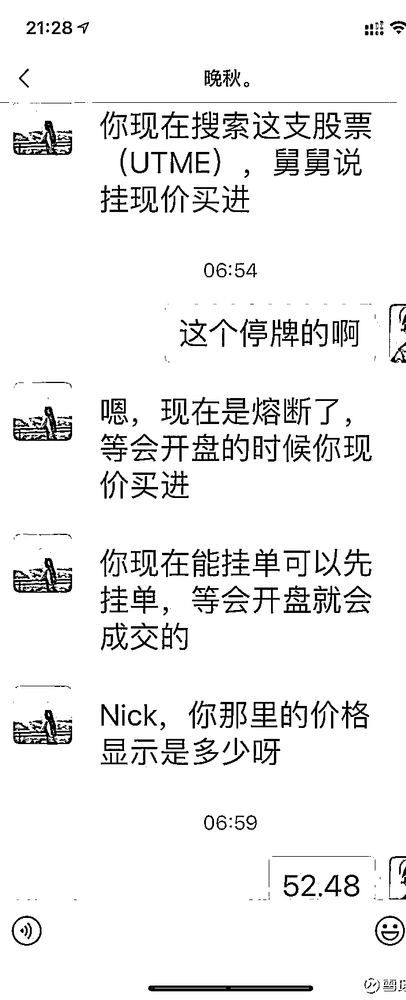

# 隐秘的杀猪盘！美女富二代、资本大佬舅舅轮番上阵，神秘代码一夜暴跌 75%！听亲历者讲述这背后的故事

> 原文：[`mp.weixin.qq.com/s?__biz=MzIyMDYwMTk0Mw==&mid=2247516132&idx=1&sn=bfde422be11584f21dcb9d6017a137d6&chksm=97cb74dca0bcfdca0c822b31a115b8e15f552bbe34918a9bcf7aca7341cda844c5db49ce7eac&scene=27#wechat_redirect`](http://mp.weixin.qq.com/s?__biz=MzIyMDYwMTk0Mw==&mid=2247516132&idx=1&sn=bfde422be11584f21dcb9d6017a137d6&chksm=97cb74dca0bcfdca0c822b31a115b8e15f552bbe34918a9bcf7aca7341cda844c5db49ce7eac&scene=27#wechat_redirect)

或许你听过一天三只牛股的“金牌理财顾问”，见过拉群收费的“资深荐股大师”...但年轻貌美的美女富二代，亲自策划的 1v1 美股巨型杀猪盘你肯定很难见到...

但这种暗流涌动在今年屡屡出现：4 月 12 日，美股中概股天睿祥盘中突发异动，股价从 97.92 美元/股直接暴跌 79%至 18 美元/股；

6 月 17 日，同样美股中概股，联代科技盘中暴跌 73%，且当日走势和 4 月份的天瑞祥几乎一模一样...

这些股票还有一定的相似之处：市值偏小、被美国资本市场边缘化但某段时间股价走势良好...是巧合还是被操纵？

昨日，有着 13w 粉丝的雪球用户@梁剑 发文揭露了在美国资本市场杀猪盘是如何运作的，也正是机缘巧合下让他有机会见证了在美股是如何“杀猪”的，以下内容为球友@梁剑自述。

01

偶遇“20 岁白富美”

我假意上钩

两个月前<h-char unicode="ff0c"><h-inner>，</h-inner></h-char>我在雪球上曾经说过<h-char unicode="ff0c"><h-inner>，</h-inner></h-char>FB 上遇到一个骗子要求加微信<h-char unicode="3002"><h-inner>。</h-inner></h-char>类似事情以前都直接忽略掉了<h-char unicode="ff0c"><h-inner>，</h-inner></h-char>但这次突发好奇心<h-char unicode="ff0c"><h-inner>，</h-inner></h-char>想看看骗子到底想干什么<h-char unicode="3002"><h-inner>。</h-inner></h-char>故意装傻<h-char unicode="ff0c"><h-inner>，</h-inner></h-char>从上帝视角<h-char unicode="ff0c"><h-inner>，</h-inner></h-char>观察骗子非常投入的表演<h-char unicode="ff0c"><h-inner>，</h-inner></h-char>一直是我的一个嗜好<h-char unicode="3002"><h-inner>。</h-inner></h-char>

为什么我一看就知道对方是骗子呢<h-char unicode="ff1f">？</h-char>好友里看不到几个正常关系的人<h-char unicode="ff0c"><h-inner>，</h-inner></h-char>都是男性<h-char unicode="ff1b">；</h-char>资料明显上拼凑的<h-char unicode="ff1b">；</h-char>上来就主动给你发美女自拍照...

骗子人设<h-char unicode="ff1a">：</h-char>20 多岁<h-char unicode="ff1b">、</h-char>白富美<h-char unicode="ff1b">、</h-char>在上海打理家族企业<h-char unicode="ff1b">；</h-char>经常出入各种高档场所<h-char unicode="ff0c"><h-inner>，</h-inner></h-char>购买奢侈品<h-char unicode="ff08"><h-inner>（</h-inner></h-char>时不时发照片<h-char unicode="ff09"><h-inner>）</h-inner></h-char><h-char unicode="3002" prev="bd-close bd-end"><h-inner>。</h-inner></h-char>

我的人设<h-char unicode="ff1a">：</h-char>中年大叔<h-char unicode="ff1b">；</h-char>创业成功<h-char unicode="ff0c"><h-inner>，</h-inner></h-char>将企业出售<h-char unicode="ff0c"><h-inner>，</h-inner></h-char>世界周游打球<h-char unicode="3001"><h-inner>、</h-inner></h-char>滑雪<h-char unicode="3001"><h-inner>、</h-inner></h-char>游艇<h-char unicode="ff1b">；</h-char>各地购置大量房产后<h-char unicode="ff0c"><h-inner>，</h-inner></h-char>仍然有巨额现金存放在银行<h-char unicode="ff08"><h-inner>（</h-inner></h-char>微信聊天<h-char unicode="ff0c"><h-inner>，</h-inner></h-char>骗子会旁敲侧击<h-char unicode="ff0c"><h-inner>，</h-inner></h-char>而我也故意侧漏这些信息<h-char unicode="ff09"><h-inner>）</h-inner></h-char><h-char unicode="3002" prev="bd-close bd-end"><h-inner>。</h-inner></h-char>

骗子应该有多人分工<h-char unicode="ff0c"><h-inner>，</h-inner></h-char>有的专门负责取得联系加上微信<h-char unicode="ff0c"><h-inner>，</h-inner></h-char>有的专门负责聊天套信息<h-char unicode="3002"><h-inner>，但</h-inner></h-char>骗子并没有将我的 FB<h-char unicode="3001"><h-inner>、</h-inner></h-char>微信以及雪球这些身份对得上<h-char unicode="3002"><h-inner>。</h-inner></h-char>

骗子以为遇到一条大鱼后<h-char unicode="ff0c"><h-inner>，</h-inner></h-char>每天早上都主动嘘寒问暖<h-char unicode="ff0c"><h-inner>，</h-inner></h-char>而且不停的找话题和你聊<h-char unicode="ff0c"><h-inner>，</h-inner></h-char>从天文地理历史到国际政治<h-char unicode="3002"><h-inner>。</h-inner></h-char>我本来就只是想看看骗子的骗术是啥<h-char unicode="ff0c"><h-inner>，</h-inner></h-char>没想到骗子比我还有耐心<h-char unicode="ff0c"><h-inner>，</h-inner></h-char>就是不出招<h-char unicode="3002"><h-inner>。</h-inner></h-char>

估计他们有一个筛选系统<h-char unicode="ff0c"><h-inner>，</h-inner></h-char>先尽可能收集我的各种信息<h-char unicode="ff0c"><h-inner>，</h-inner></h-char>比如真实姓名<h-char unicode="3001"><h-inner>、</h-inner></h-char>住址<h-char unicode="3001"><h-inner>、</h-inner></h-char>手机号码<h-char unicode="3001"><h-inner>、</h-inner></h-char>兴趣爱好<h-char unicode="3001"><h-inner>、</h-inner></h-char>对网络的熟悉程度<h-char unicode="3001"><h-inner>、</h-inner></h-char>警惕性等等<h-char unicode="ff0c"><h-inner>，</h-inner></h-char>然后再根据这些资料<h-char unicode="ff0c"><h-inner>，</h-inner></h-char>来制订一款最适合我的骗局<h-char unicode="3002"><h-inner>。</h-inner></h-char>估计如果我再装得傻一点<h-char unicode="ff0c"><h-inner>，</h-inner></h-char>骗子就会让我手机上下载一个理财 App 之类的<h-char unicode="ff0c"><h-inner>，</h-inner></h-char>将钱转进去<h-char unicode="ff0c"><h-inner>，</h-inner></h-char>然后就转不出来了<h-char unicode="3002"><h-inner>。</h-inner></h-char>

<h-char unicode="3002"></h-char><h-char unicode="3002"></h-char>

02

新的角色出现

白富美背后“资本大佬”舅舅出场

几周后<h-char unicode="ff0c"><h-inner>，</h-inner></h-char>骗子老没话找话<h-char unicode="ff0c"><h-inner>，</h-inner></h-char>我实在厌烦<h-char unicode="ff0c"><h-inner>，</h-inner></h-char>干脆主动抛出诱饵<h-char unicode="3002"><h-inner>。</h-inner></h-char>就说自己去年炒股<h-char unicode="ff0c"><h-inner>，</h-inner></h-char>亏了很多钱<h-char unicode="ff0c"><h-inner>，</h-inner></h-char>还在买了个 188888 的微信 VIP 群让专家指导<h-char unicode="ff0c"><h-inner>，</h-inner></h-char>被骗了<h-char unicode="ff0c"><h-inner>，</h-inner></h-char>所以现在大笔现金<h-char unicode="ff0c"><h-inner>，</h-inner></h-char>放在银行<h-char unicode="ff0c"><h-inner>，</h-inner></h-char>不知道干啥好<h-char unicode="ff0c"><h-inner>，</h-inner></h-char>发愁。

果然，骗子看到机会来了<h-char unicode="ff01">！</h-char>因为骗子之前的人设是个 20 出头的白富美<h-char unicode="ff0c"><h-inner>，</h-inner></h-char>总不能说自己也是<h-char unicode="201c">“</h-char>专家<h-char unicode="201d">”</h-char>吧<h-char unicode="ff0c"><h-inner>，</h-inner></h-char>于是顺势推出了一个<h-char unicode="201c">“</h-char>舅舅<h-char unicode="201d">”</h-char><h-char unicode="3002"><h-inner>。</h-inner></h-char>

<h-char unicode="201c">这位“</h-char>舅舅<h-char unicode="201d">”</h-char>是资本市场的操盘大佬<h-char unicode="ff0c"><h-inner>，</h-inner></h-char>深藏不露<h-char unicode="ff0c"><h-inner>，据说</h-inner></h-char>每年都有一两倍的回报<h-char unicode="3002"><h-inner>。白富美表示，</h-inner></h-char>下次<h-char unicode="201c">“</h-char>舅舅<h-char unicode="201d">”</h-char>要操哪个盘的时候<h-char unicode="ff0c"><h-inner>，</h-inner></h-char>会和我说一声<h-char unicode="ff0c"><h-inner>，</h-inner></h-char>让我也沾点光<h-char unicode="3002"><h-inner>。</h-inner></h-char>

在这个过程中骗子仍然很有耐心<h-char unicode="ff0c"><h-inner>，</h-inner></h-char>此后一步步布局过程中<h-char unicode="ff0c"><h-inner>，</h-inner></h-char>除了继续嘘寒问暖<h-char unicode="ff0c"><h-inner>，</h-inner></h-char>穿插着<h-char unicode="201c">“</h-char>舅舅<h-char unicode="201d">”</h-char>去和一帮资本大佬聚会<h-char unicode="ff0c"><h-inner>，</h-inner></h-char>商谈下一个操盘标的等事宜<h-char unicode="3002"><h-inner>。</h-inner></h-char>

在此过程中表示份额有限<h-char unicode="ff0c"><h-inner>，</h-inner></h-char>资本大佬们为了抢份额<h-char unicode="ff0c"><h-inner>，</h-inner></h-char>发生了口角...

03

“杀猪”节奏加快

白富美抛出神秘代码

后来骗子多次提及要计划操盘了<h-char unicode="ff0c"><h-inner>，</h-inner></h-char>都特别强调份额难得<h-char unicode="ff0c"><h-inner>，</h-inner></h-char>只能分我很少一点<h-char unicode="3002"><h-inner>。</h-inner></h-char>刚开始是 100 万美元<h-char unicode="ff0c"><h-inner>，</h-inner></h-char>后来说熟了点<h-char unicode="ff0c"><h-inner>，</h-inner></h-char>给到 200 万<h-char unicode="ff0c"><h-inner>，</h-inner></h-char>再后来说<h-char unicode="ff0c"><h-inner>，</h-inner></h-char>300 万也行<h-char unicode="3002"><h-inner>。</h-inner></h-char>为什么刻意这样呢<h-char unicode="ff1f">？</h-char>难道股票还是她家限量发行的<h-char unicode="ff1f">？</h-char>其实是搞饥渴营销<h-char unicode="ff0c"><h-inner>，</h-inner></h-char>让你尽量可能多的买。

两周前有一天<h-char unicode="ff0c"><h-inner>，</h-inner></h-char>骗子和我说<h-char unicode="ff0c"><h-inner>，</h-inner></h-char><h-char unicode="201c">“</h-char>舅舅<h-char unicode="201d">”</h-char>要行动了<h-char unicode="ff0c"><h-inner>，</h-inner></h-char>让我开盘前就在线等消息<h-char unicode="3002"><h-inner>。</h-inner></h-char>然后等半天<h-char unicode="ff0c"><h-inner>，</h-inner></h-char>又说<h-char unicode="201c">“</h-char>舅舅<h-char unicode="201d">”</h-char>觉得时机不合适<h-char unicode="ff0c"><h-inner>，</h-inner></h-char>临时取消了<h-char unicode="3002"><h-inner>。</h-inner></h-char>我估计是继续吊胃口<h-char unicode="3002"><h-inner>。</h-inner></h-char>

昨晚美股开盘后<h-char unicode="ff0c"><h-inner>，</h-inner></h-char>骗子就让我赶紧买入 $联代科技(UTME)$  <h-char unicode="ff0c"><h-inner>，</h-inner></h-char>说<h-char unicode="201c">“</h-char>舅舅<h-char unicode="201d">”</h-char>会将股价拉到 200 美元<h-char unicode="ff0c"><h-inner>，</h-inner></h-char>让我直接挂市价单买入<h-char unicode="ff0c"><h-inner>，</h-inner></h-char>而且份额可以给我多一点<h-char unicode="3002"><h-inner>。</h-inner></h-char>

我一看<h-char unicode="ff0c"><h-inner>，好家伙...</h-inner></h-char>当时这个我从来没听过的股票<h-char unicode="ff0c"><h-inner>，</h-inner></h-char>都跌到 52.48 熔断了<h-char unicode="3002"><h-inner>。</h-inner></h-char>熔断结束后<h-char unicode="ff0c"><h-inner>，</h-inner></h-char>股价涨到 60 多<h-char unicode="ff0c"><h-inner>，</h-inner></h-char>我就骗骗子说<h-char unicode="ff0c"><h-inner>，</h-inner></h-char>60 出头买了 5 万股<h-char unicode="3002"><h-inner>。</h-inner></h-char>骗子就不停地找我要持仓截图<h-char unicode="3002"><h-inner>。</h-inner></h-char>

然后我找了个自己都不太相信的理由 <h-char unicode="ff0c"><h-inner>，</h-inner></h-char>骗子生气了<h-char unicode="3002"><h-inner>。</h-inner></h-char>后来暴跌后<h-char unicode="ff0c"><h-inner>，</h-inner></h-char>我不停追问所谓的<h-char unicode="201c">“</h-char>舅舅<h-char unicode="201d">”</h-char>拉升呢<h-char unicode="ff1f">？</h-char>最后被骗子拉黑了.......

04

神秘代码一夜暴跌 75%

球友支招：反向操作，做空它！

梁剑表示，在自己假装买了这只股票之后<h-char unicode="ff0c"><h-inner>，很快股价</h-inner></h-char>就开始狂泻<h-char unicode="ff0c"><h-inner>，</h-inner></h-char>连续跌到熔断<h-char unicode="ff0c"><h-inner>，</h-inner></h-char>最低跌破 15 美元<h-char unicode="3002"><h-inner>！感受一下：</h-inner></h-char>

<h-char unicode="3002"><h-inner>无独有偶的是，另一位</h-inner></h-char><h-char unicode="3002"><h-inner>球友@茶色先生</h-inner></h-char> <h-char unicode="3002"><h-inner>也经历了几乎一样的事：一个月前 facebook 加我，然后互加了微信，时不时发张照片过来。我开始没在意，偶尔有一天聊到股票时警觉起来，下载了她发过来照片的原图，发现日期什么的都是半年多前的，就基本确定是杀猪盘了。</h-inner></h-char>

<h-char unicode="3002"><h-inner>就在周四也是让我买入 UTME, 我也是找了各种借口说买入不成功...</h-inner></h-char>

有球友表示，当你识破是杀猪盘后，最狠的方法就是做空一手，等暴跌后截图给骗子看...不过梁剑文末最后也提到当时买的时候<h-char unicode="ff0c">，也有</h-char>想过做空一手的<h-char unicode="ff0c">，</h-char>从骗子那里赚一顿饭钱<h-char unicode="ff0c">，</h-char>成就感满满<h-char unicode="3002">。</h-char>可就在下单的瞬间<h-char unicode="ff0c">，比较</h-char>担心这操作涉嫌违规<h-char unicode="ff0c">，</h-char>虽然金额很小<h-char unicode="ff0c">，</h-char>但毕竟勿以恶小而为之<h-char unicode="3002">。</h-char>

同时总结了自己的几点猜测<h-char unicode="ff1a">：</h-char>

1、骗子为什么执着要我的持仓截图呢<h-char unicode="ff1f">？</h-char>估计是作为工作成果的证明<h-char unicode="ff0c">，</h-char>向后面的老板领取奖金<h-char unicode="ff1b">；</h-char>

2、骗子们提前网罗了很多韭菜<h-char unicode="ff0c">，</h-char>集中在这一天让大家买入该股票<h-char unicode="ff1b">；</h-char>

3、骗子受顾于其他人<h-char unicode="ff0c">，</h-char>忽悠韭菜去接盘<h-char unicode="ff1b">；</h-char>

4、谁雇佣这些骗子呢<h-char unicode="ff1f">？</h-char>或者说<h-char unicode="ff0c">，</h-char>谁在通过卖出这个股票来赚钱<h-char unicode="3001">、</h-char>套现呢<h-char unicode="ff1f">？</h-char>不知道<h-char unicode="ff0c">，</h-char>或许是已经提前埋伏好的传说的庄家<h-char unicode="ff0c">，</h-char>也或许是其他的利益相关方<h-char unicode="ff1b">；</h-char>

5、这种杀猪盘与 $联代科技(UTME)$  大股东或者管理层是否有关呢<h-char unicode="ff1f">？</h-char>目前没有证据<h-char unicode="ff0c">，</h-char>不知道<h-char unicode="3002">。</h-char>

从 4 月到 6 月，整整两个月的时间，@梁剑表示，虽然浪费了一些时间与骗子周旋<h-char unicode="ff0c"><h-inner>，</h-inner></h-char>但是对这种暴涨暴跌的小盘股<h-char unicode="ff08"><h-inner>（</h-inner></h-char>其中不少是中概股<h-char unicode="ff09"><h-inner>）</h-inner></h-char><h-char unicode="ff0c" prev="bd-close bd-end"><h-inner>，</h-inner></h-char>有了更多的认识<h-char unicode="3002"><h-inner>，同时更是</h-inner></h-char>希望各球友们也擦亮眼睛<h-char unicode="3002"><h-inner>：</h-inner></h-char>

***“你世代平民***<h-char unicode="ff0c"><h-inner>***，***</h-inner></h-char>***姿色中下***<h-char unicode="ff0c"><h-inner>***，***</h-inner></h-char>***既非皇亲国戚***<h-char unicode="ff0c"><h-inner>***，***</h-inner></h-char>***亦无貌若潘安***

***哪里会有什么赚大钱的机会***<h-char unicode="ff0c"><h-inner>***，***</h-inner></h-char>***白送到你面前的呢***<h-char unicode="ff1f">***？”***</h-char>

<h-char unicode="ff1f"><h-char unicode="ff1f">来源：雪球网</h-char><h-char unicode="ff1f"></h-char></h-char>

← 向右滑动与灰产圈互动交流 →

