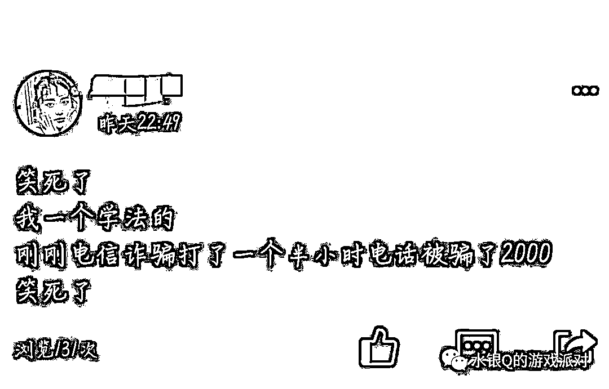
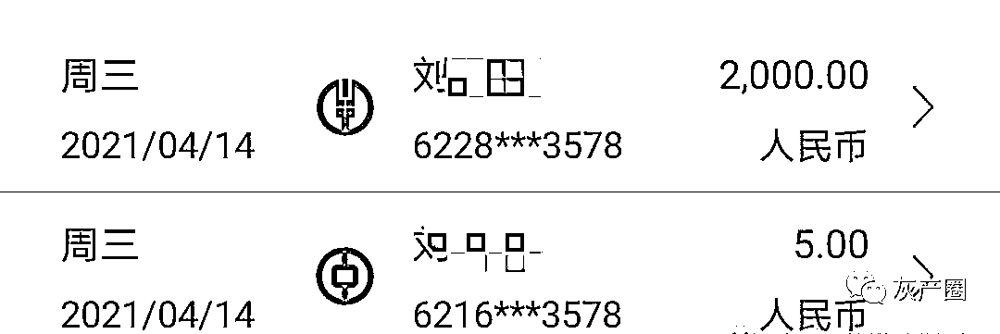
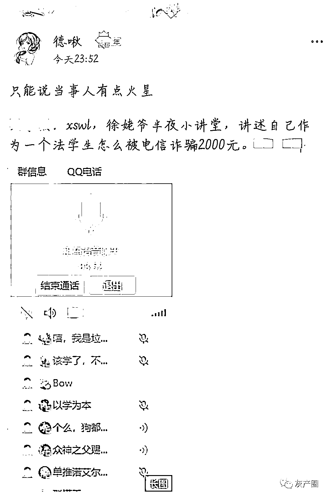
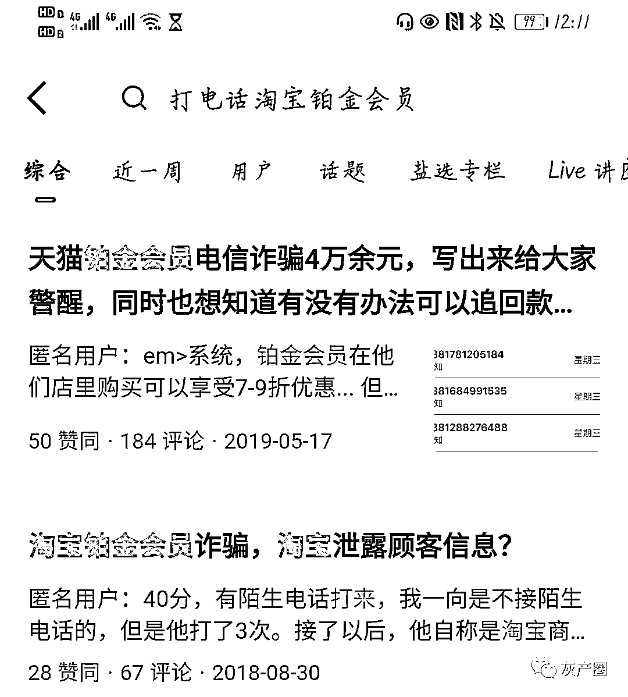
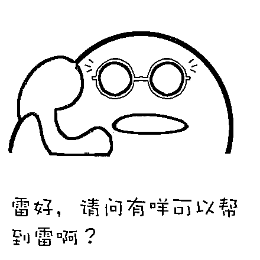
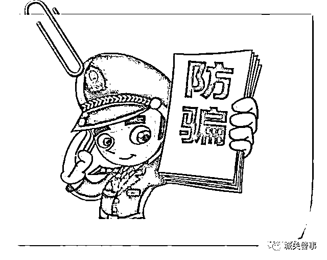

# 笑死，我一个学法的，刚刚被骗了 2000.....

> 原文：[`mp.weixin.qq.com/s?__biz=MzIyMDYwMTk0Mw==&mid=2247516132&idx=2&sn=edbbd86eca182e4c547efb3f54e9aa74&chksm=97cb74dca0bcfdcac8671acda0290b5db4e3fef2662f30522542f33214827af073980c422a24&scene=27#wechat_redirect`](http://mp.weixin.qq.com/s?__biz=MzIyMDYwMTk0Mw==&mid=2247516132&idx=2&sn=edbbd86eca182e4c547efb3f54e9aa74&chksm=97cb74dca0bcfdcac8671acda0290b5db4e3fef2662f30522542f33214827af073980c422a24&scene=27#wechat_redirect)

2021 年 4 月 14 日晚 11 时，水银在 QQ 空间看到了这样一条动态： 

这是我的一位高中同学，由于被骗金额不小，我们在群里进行追问，他（徐姥爷）这才讲述了事件的前因后果。

淘宝，铂金会员，每月五百……只是听到这里水银的记忆中已经有了模糊的印象，再上知乎一搜，果然出现了相关骗局，而最早竟能追溯到 2018 年，也就是三年前。

那么为什么三年前的骗局至今仍有人上当，而且还是一位高材生，我们就得先看一下诈骗过程了。

根据徐姥爷的回忆，骗子首先询问了一笔他购买过的面膜淘宝订单，由于能给出确切的信息，徐姥爷就继续听了下去。然后，骗子声称误操作为他开通了店铺的铂金会员，会每个月自动扣款，询问是否需要取消。

和大多数人一样，徐姥爷没有多想就说取消。骗子便又抛出了下一个问题：可以连线银行直接帮你办理或是自己去银行取消。

这里可以说是抓住了人们怕麻烦的心理，而且早解决总归心里踏实。到这里徐姥爷大约是信了八九分，就跟着操作下去了。

接下来就是常见的试探你的账户信息看有多少钱可以骗，然后假借转账验证进行诈骗，很多诈骗都是这个路子。

**警方表示：近期此类冒充客服以取消铂金会员为由诈骗钱财的案例集中爆发。**

无独有偶。近日，一市民因轻信骗子冒充的天猫客服帮助其取消铂金会员业务被诈骗 16 万余元。

当天下午，小张在家中接到一个自称是天猫商城客服的电话，说因他们自己错误操作，使小张开通了铂金会员，需要因此另外支付 500 元会费，希望小张这边将铂金会员取消，说会帮小张转接银行客服办理。

然后对方那头换了一个号码打给小张，自称是农业银行的客服人员，需要小张这边配合取消铂金会员，说小张这边需要转接银联，银联那边需要小张名下的金融账户信息。

然后小张就告诉对方自己的银行卡信息还有存款情况，对方还让小张给对方转账，目的是为了与银联建立联系，验证小张的账户，消除小张的铂金会员协议。

小张一开始给对提供的账户转了 4 元，但是没有成功。

紧接着，对方称说没有成功是因为小张名下还存在其他银行账户，这时候又换了一个人跟小张讲话，对方自称是银行的主任，其称需要再核实一下小张名下的银行账户，让小张把农行里面剩余的 4300 元转给对方，身份核验之后就把钱转会给小张，小张就把钱转过去了。

对方称，因小张有多个银行账户，这些账户包括贷款账户也需要验证，但是他这边是农业银行的客服，只能通过小张的农业银行转给他。

小张就把自己**京东金融的白条、金条、还有招商银行的闪电贷还有美团的贷款**钱都转到了自己的农行卡上，还下载了一个叫**分期乐的贷款**软件，从里面贷了款，转账到农行卡上然后**转给对方**。

等到小张能转的钱已经都转给对方后，对方以小张的账户恢复进度只有 50%不到，需要到 100%才能把钱全部返还为由要求小张继续转账。

小张又继续转了两笔钱之后，对方称进度到达 80%，现在系统需要维护，等到第二天早上 8 时便将钱返给小张。

等到 8 时已过，对方还未返还，小张这才意识到自己被骗并报警。

现在这样一看，自然是疑点重重，完全经不起推敲，那么到底是哪里出了差错？

**心理。**

开始就能准确的报出你的信息，加上诚恳的对话，看似专业的指导，又是打着为你省钱的旗号，相信不少人难以直接挂断，万一真的扣钱呢？

但是又不愿意仔细思考，下意识的跟着骗子的话就做了，直到“转账成功”才有所反应，又有什么用呢？

大数据时代，信息早已不值钱。莫说是一个淘宝订单，手机里多少软件都在监听着你的一举一动，随时准备为你推送相关内容。若是因为陌生人的寥寥数语就自乱阵脚盲目相信，只能说十分可惜。

**公安机关提醒您**

1、任何需要将钱转入“安全账户”的情况都涉嫌诈骗，不可相信。

2、任何电商交易平台以及银行、证券、基金等金融，发现问题时均不会要求被害人在其他社交软件上操作，更不会要求被害人通过提供银行卡号等方式进行退、赔款。

3、涉及金钱交易时，请通过官方客服电话进行确认。

4、对方一旦让你进行转账等涉及个人资金无故流出操作时，一律不予理会。

来源：水银 Q 的游戏派对、南京建邺公安微警务、反诈骗先锋

← 向右滑动与灰产圈互动交流 →

