# 科普大 V"不让中国人吃海鲜"背后…

> 原文：[`mp.weixin.qq.com/s?__biz=MzIyMDYwMTk0Mw==&mid=2247516132&idx=4&sn=b664369957fc671c02c283b4dc3d7972&chksm=97cb74dca0bcfdca7a709ab48a7ea3206dd718fbfbace9a697261e91b7fae22a413607fbb7b8&scene=27#wechat_redirect`](http://mp.weixin.qq.com/s?__biz=MzIyMDYwMTk0Mw==&mid=2247516132&idx=4&sn=b664369957fc671c02c283b4dc3d7972&chksm=97cb74dca0bcfdca7a709ab48a7ea3206dd718fbfbace9a697261e91b7fae22a413607fbb7b8&scene=27#wechat_redirect)

一群科普大 V 扎堆发表“中国人对海鲜贪得无厌”的奇怪言论，没想到竟意外引发科普圈“大地震”。

18 日晚，科普博主@赛雷话金 称自己也曾收到过一家“公益组织”发出的合作意向，邀请他制作关于“中国海洋保护”主题的科普短视频。但进一步查询后，他发现这个组织实则是个境外 NGO 组织，创始人和顾问表面是研究中国的专家，实则多年干的都是抹黑、污蔑中国环境事业的勾当，其中甚至还出现了被斥为“千古罪人”、末代港督彭定康的身影。

由此他表示，此类境外 NGO 组织花巨资找大把国内媒体宣传所谓“环保”，以科普海洋渔业为名，实则不怀好意地传播一些“未来吃不上鱼”的恐怖信息，让蛋白质摄入量远低于发达国家的中国人不要吃海鲜。

视频中，他还直接挂出了博主@EyeOpener 疑似收钱做科普视频，并点出另一科普大 V@回形针 PaperClip 的两名编辑，分别存在任职于美国军方机构、在境外社媒发布大量反华言论等问题。

19 日凌晨被点名的两方先后回应。@EyeOpener 先承认自己发布的相关视频的确是与@赛雷话金 爆出的 NGO 组织合作产生，但事先并不知晓该组织背后的动机，已删除合作视频并终止后续合作。

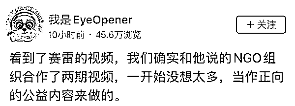

道歉声明节选

@回形针 PaperClip 随后也发布致歉声明，称涉事的两位员工均已离职，未来将邀请主流媒体资深专家担任内容主编一职，负责把关内容导向，在对全体员工进行媒体专业培训之前暂时停更。

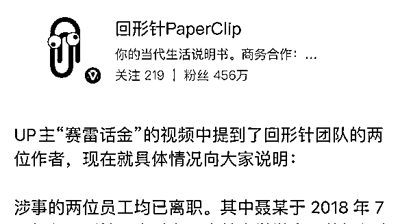

道歉声明节选

今天（19 日）中午，钧正平工作室·解放军新闻传播中心融媒体@钧正平 发表短评，“警惕打着环保、科普旗号的阴谋与恶意”。

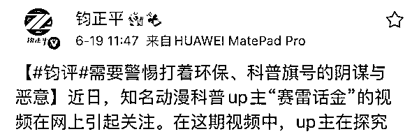

节选

要想把这个瓜吃明白了，得先来说说前阵子一堆大 V 博主突然扎堆呼吁中国人不要吃海鲜，以免耗尽世界鱼类资源的“怪事”。

前有美籍旅游大 V@谷岳 说中国人对海鲜“贪得无厌”；

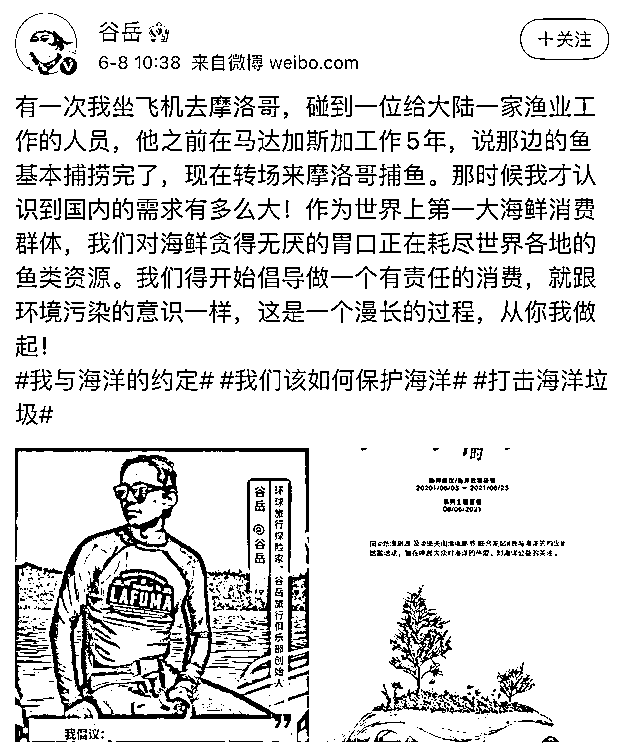

后有三橙传媒的@陈一佳 叫中国人“一起少吃一口鱼”。

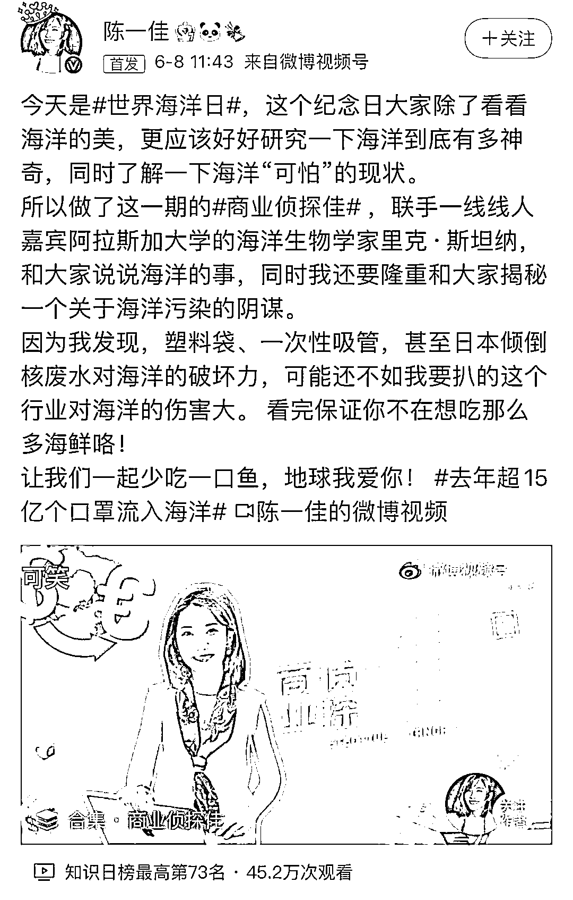

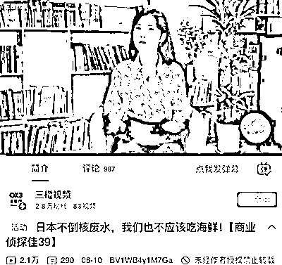

然而无一例外的是，这俩人私下里都没少晒吃海鲜的照片，而且对美国等其他国家吃海鲜的行为不予置评，甚至还大夸特夸。

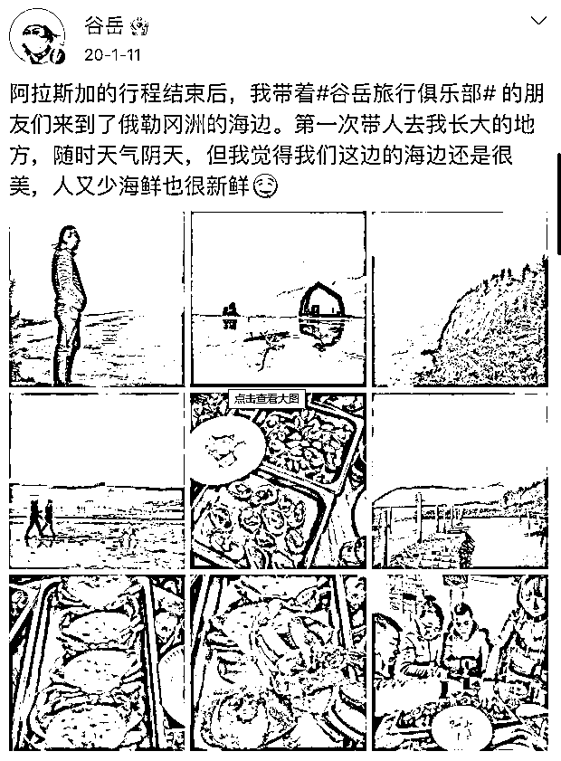

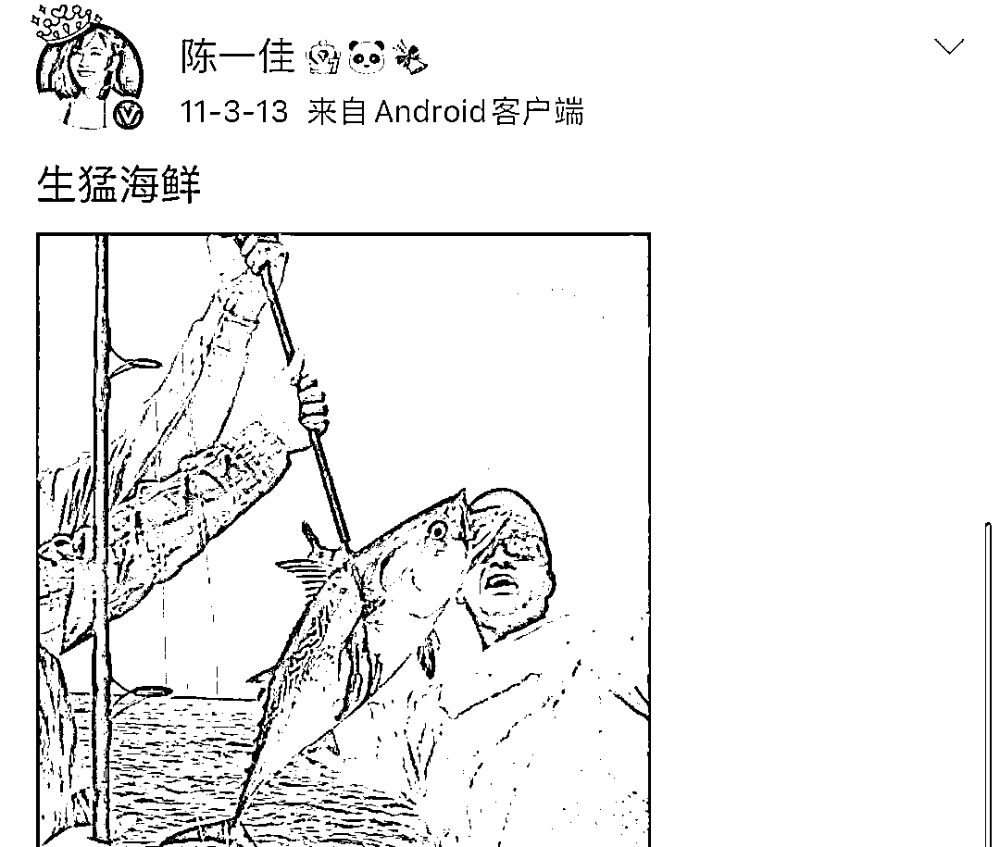

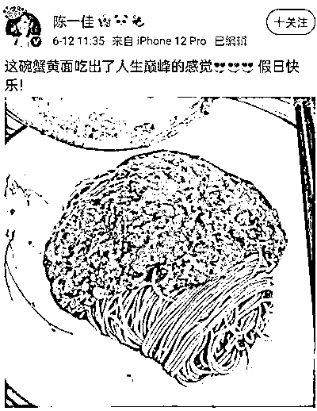

就在前几天陈一佳还刚刚吃了碗蟹黄面，不过这条博文已经搜索不到

两人的“双标”被众多网友激烈抨击，“合着是美国人可以吃，中国人不能吃呗。”

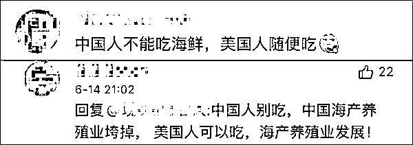

还有一些网友质疑涉事博主是收受资助才做出这样所谓的科普视频，6 月 14 日@三橙星球 发布声明对此否认，称相关视频由三橙传媒独立制作，没有和其他方进行商业合作，没有收取其他费用，网传内容为虚假消息。

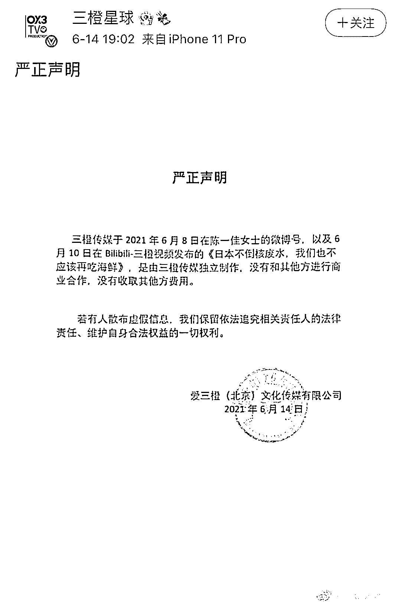

@陈一佳 也转发该声明，表示相关视频是独立制作，与任何机构和网络言论无关，纯属个人兴趣研究，所有数据和事实出处皆有核实。并且这则视频针对的只是全球捕鱼业，从未评论中国消费者。

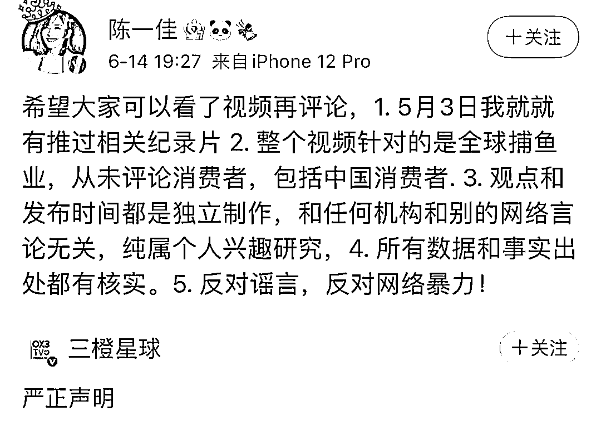

但无独有偶，就在同一时间，此前刚刚以“用一张图推理具体位置”而走红的科普博主@EyeOpener ，也在微信上发布了两则有着类似观点的科普视频，担忧道“未来我们还吃得上鱼吗？”

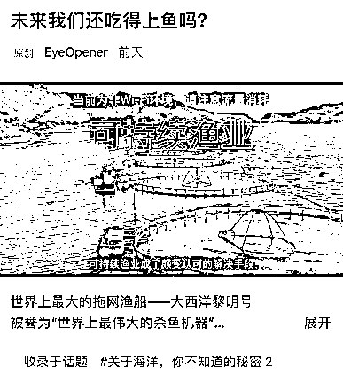

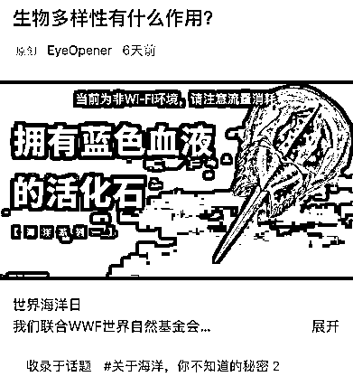

一时间突然这么多科普博主扎堆喊话叫中国人不要吃海鲜，这到底怎么回事？科普博主@赛雷话金 （另一个账号名为@赛雷三分钟）随即甩出的一张邮件截图，激起千层浪。

13 日，@赛雷三分钟 爆料称近日里这些嚷着让“中国人不要吃海鲜”的科普博主们，很可能是收了境外 NGO 组织的钱，以环保之名行不轨之事，忽悠中国人不要吃海鲜。他也曾收到过相关合作邀请，但认为有些钱不该赚于是没有搭理。

根据他公布的邮件截图来看，对方要求合作的视频，主题正与“中国海洋保护”相关，并且邮件正文还对预期视频内容列出了非常详尽的要求，其中就有包括“中国和全球面临的渔业资源危机、过度捕捞”等话题。

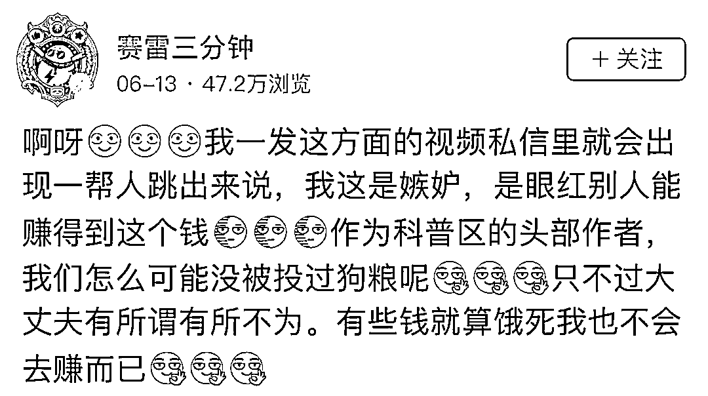

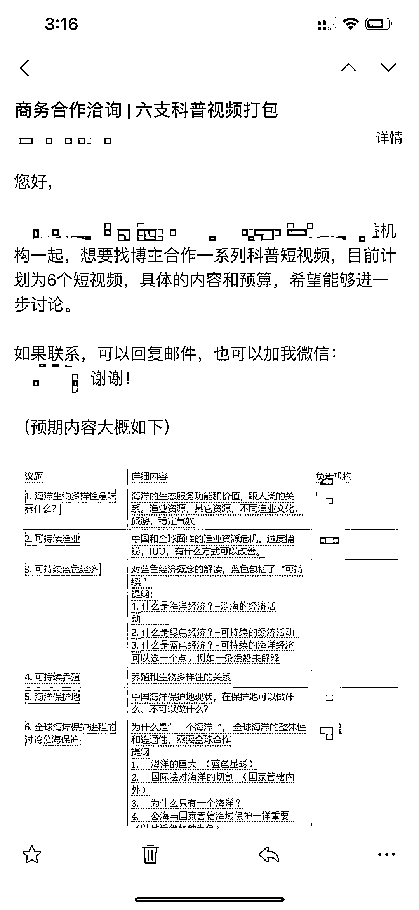

被有些网民质疑 P 图后，@赛雷话金 18 日晚发布了一则视频，抹去了这则邮件截图的马赛克，详细介绍了此事的前因后果，以及他扒皮该 NGO 组织的全过程。

@赛雷话金 表示，自己当时收到的邮件是来自一个“中外对话北京项目组（China Dialogue）”的公益组织，合作活动则是由中外对话组织、世界自然基金会、创绿研究院联合发起的。

一开始他也以为这就是一个公益科普活动，但仔细一查却发现这事可没那么简单。

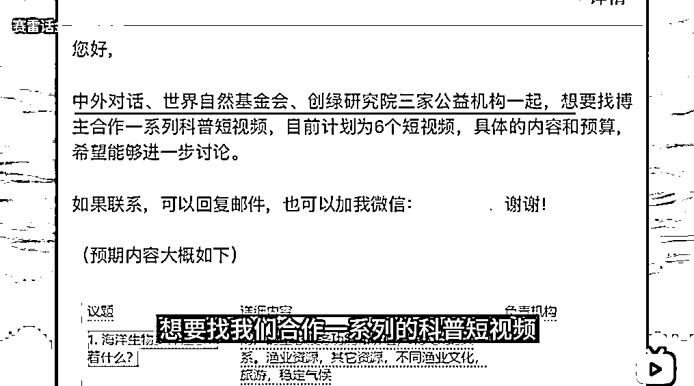

虽然该组织在国内的官网是“一片祥和”，但进一步查询后，@赛雷话金 发现这个“中外对话组织”实则是个境外 NGO 组织，使用的是英国慈善注册号。而组织创始人和顾问们表面是研究中国的专家，实则多年干的都是抹黑、污蔑中国环境事业的勾当。

“中外对话组织”的创始人叫伊莎贝尔·希尔顿，曾在英国《泰晤士报》和《独立报》任职，并作为《卫报》的专栏作家撰写关于中国环境问题的文章长达 23 年。她在社交媒体上发布的内容也显示其是一名严重反华人士，鼓吹支持“港独”“疆独”等分裂中国的恶毒行径。

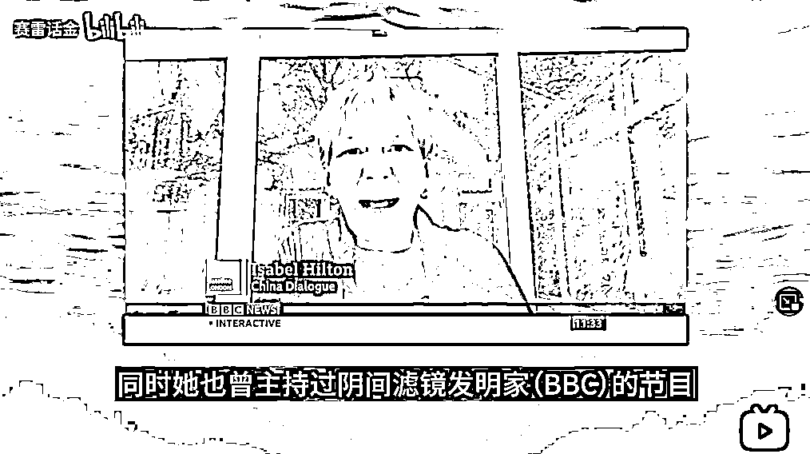

复旦大学网络空间国际治理研究基地主任、观察者网专栏作者沈逸教授还就此补充道，希尔顿从“开放民主网”做编辑起家，而“开放民主网”的资金来源，包括开放社会基金，“CIA 白手套”美国国家民主基金会以及福特基金会。

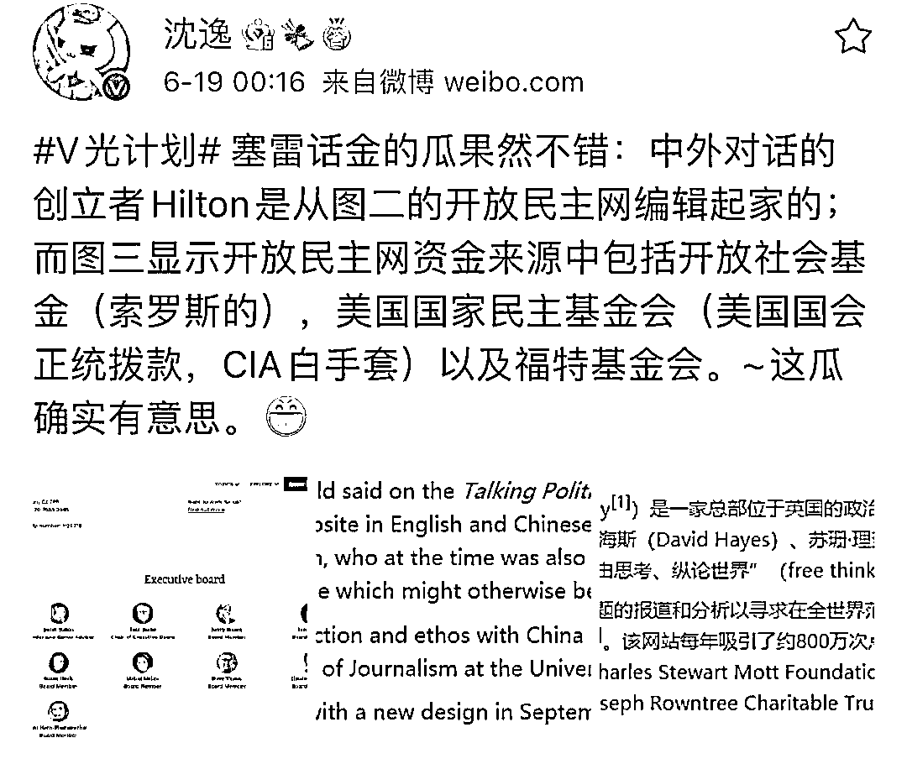

而该组织的顾问团中，不仅有出版了多部书籍诋毁中国环境事业的澳大利亚国立大学中国历史学名誉教师马克·埃尔文，甚至还出现了被斥为“千古罪人”，末代港督彭定康的身影。

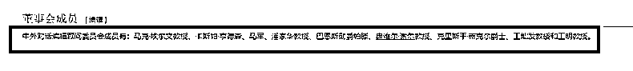

“这么一群人凑活在一起能是盼着中国好？显然不是。”@赛雷话金 认为，“中外对话组织”花巨资找大把国内媒体宣传所谓“环保”，以科普海洋渔业为名，实则不怀好意地传播一些“未来吃不上鱼”的恐怖信息，让蛋白质摄入量远低于发达国家的中国人不要吃海鲜，“他们认为我们中国人没有资格和他们一样过上好日子，想方设法要把我们忽悠瘸。”

视频中，@赛雷话金 还直接挂出了上文曾提及的博主@EyeOpener ，以此抨击一些科普博主没有底线接推广“恰饭”。19 日，知名科普博主@飞碟说 也发博称曾经收到过@赛雷话金 曝光的那类推广邮件，欣慰自己当时即便是差点和同事动手仍坚守住了底线。

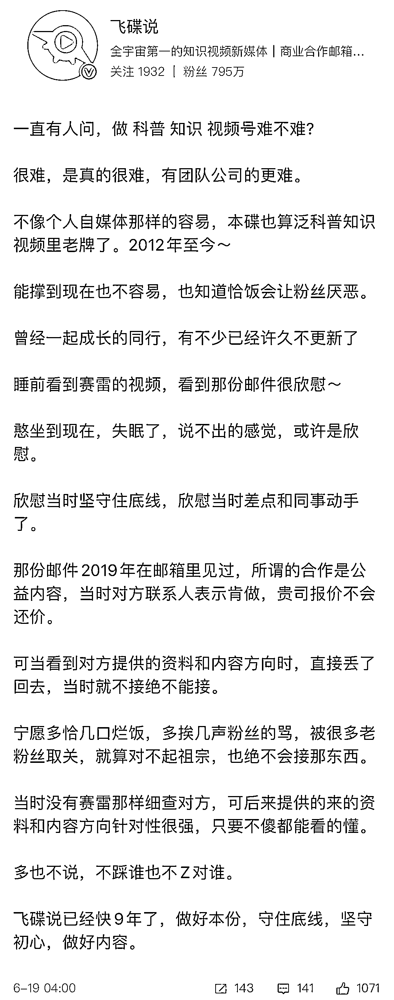

同时@飞碟说 也直言，所谓的境外公益组织发来的合作邮件，他们提出的制作的内容核心都会将世界环保问题最终导向指责中国环保问题，敬告同行。

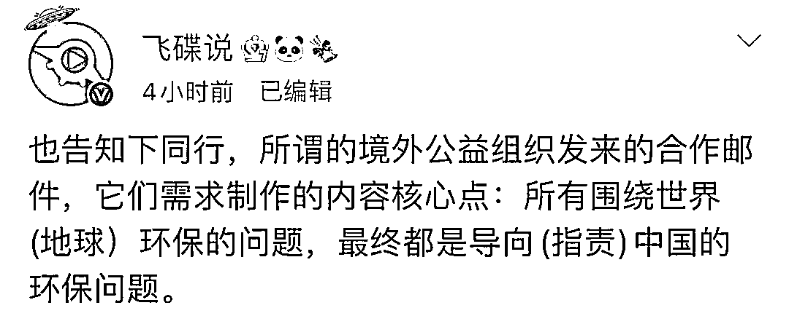

被点名后，@EyeOpener 19 日凌晨发声道歉，承认自己发布的相关视频的确是与@赛雷话金 爆出的“中外对话组织”合作产生，但事先并不知晓该组织背后的动机，已删除合作视频并终止后续合作。

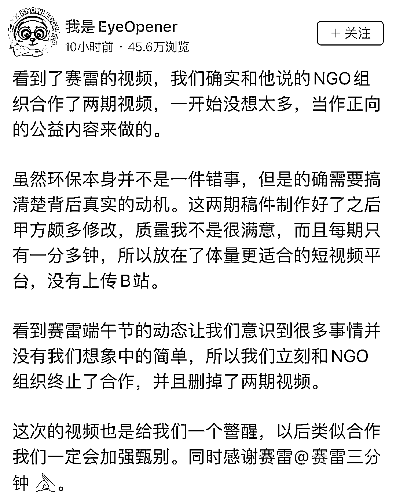

这回大 V 们嚷嚷着“不让中国人吃海鲜”，很容易让人联想起知名科普大 V@回形针 PaperClip 去年的“中国人吃肉蛋奶毁了巴西雨林”论调。

果然，@赛雷话金 这次又发现了新的问题：@回形针 PaperClip 的前任文稿编辑聂统宇，从他的境外社交媒体介绍上看，他现在供职于美国陆军研究实验室。美国陆军研究实验室与德特里克堡实验室是兄弟单位，后者更与日本 731 部队私底下有着肮脏交易。

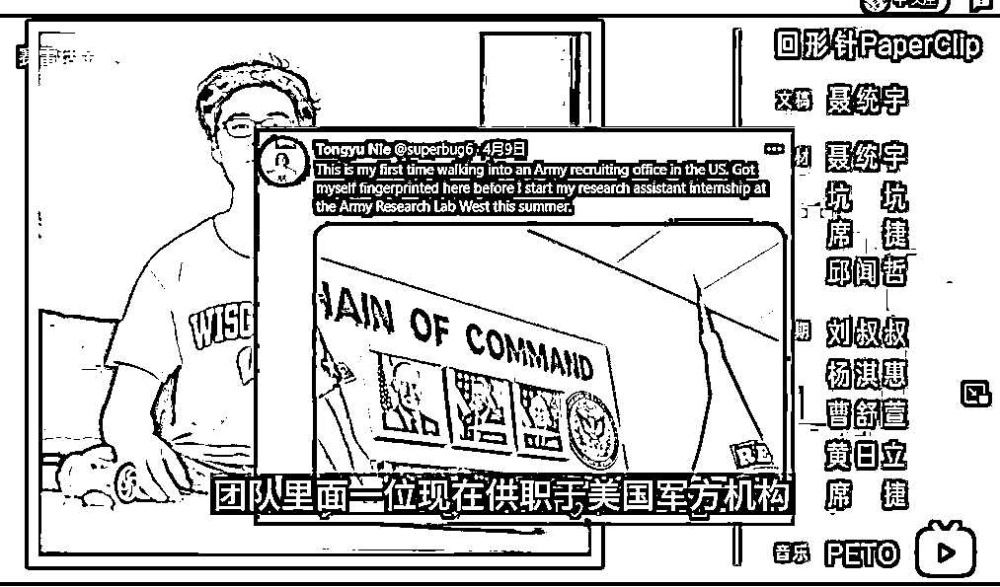

而@回形针 PaperClip 的现任文稿编辑季文仪，则多次在推特等境外社媒上发布大量反华言论。

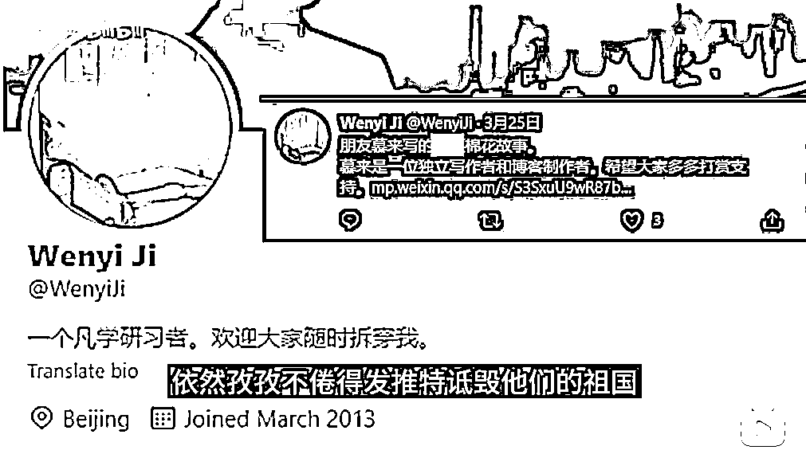

对此，@回形针 PaperClip 也在 19 日凌晨发布致歉声明，回应称@赛雷话金 视频提及的两位员工均已离职。其中聂某于 2018 年 7 月加入回形针，当时为国内某大学学生，曾担任内容实习生一职，已于 2019 年 7 月离职。季某于 2020 年 5 月加入回形针，曾担任内容作者一职，已于 2021 年 5 月离职。两人任职期间都在境外个人社交媒体上发表了践踏民族感情、突破道德底线的言论，对他们的言论失察是公司的严重失职。

@回形针 PaperClip 发布决定称，未来将邀请主流媒体资深专家担任内容主编一职，负责把关内容导向。同时，团队全体成员进行认真反思，公司将对回形针全体员工进行媒体专业培训，加强思想教育和管理。在团队改造与培训完毕前，主动停更所有内容。

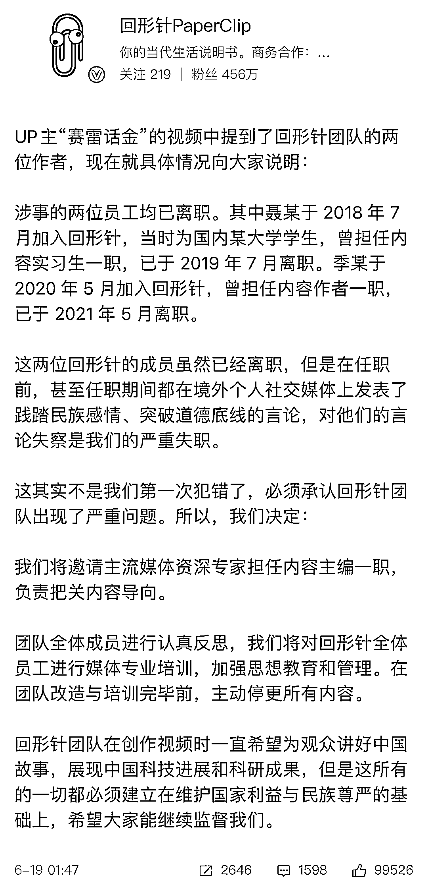

目前，@回形针 PaperClip 的 B 站账户被标注了“该用户存在较大争议，请谨慎甄别其内容”。

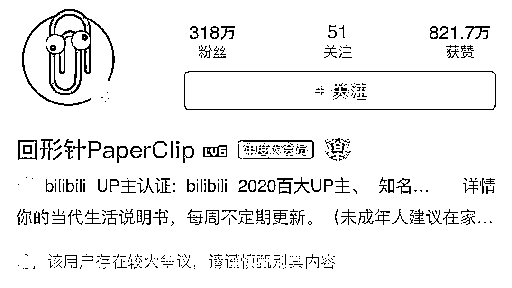

对此事，今天中午钧正平工作室·解放军新闻传播中心融媒体@钧正平 发表短评，提醒网友警惕打着环保、科普旗号的阴谋与恶意。“互联网上从来就不是风平浪静的，类似的阴谋和恶意还有很多很多。‘没有网络安全就没有国家安全’。说不定与你互动的‘好友’就是某些境外情报机构的间谍，一定要小心防范。每一位中国网民、每一个中国互联网企业都应该睁大双眼并肩负起责任，坚决维护国家的网络安全。”

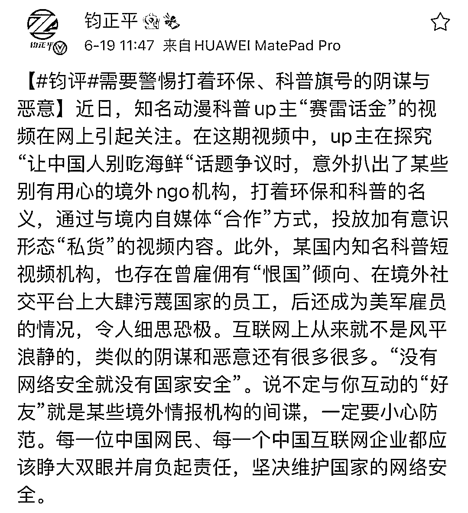

来源：观察者网

← 向右滑动与灰产圈互动交流 →

