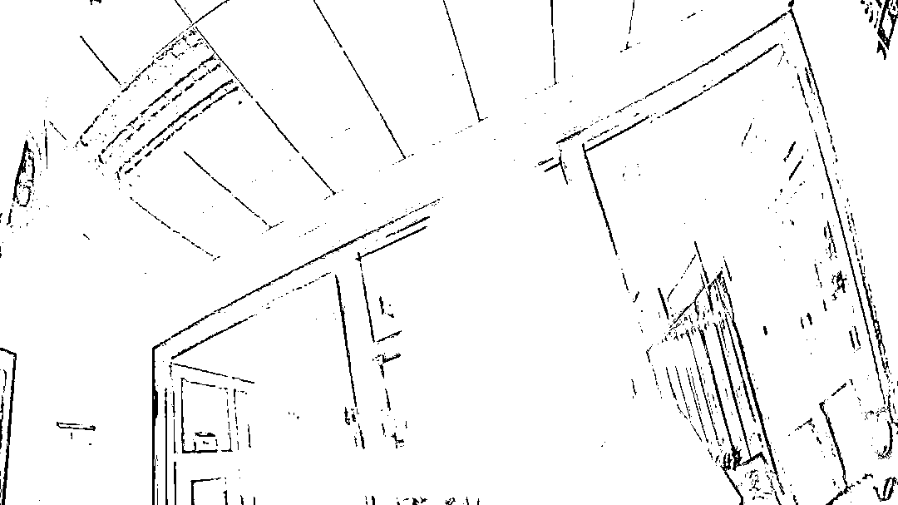
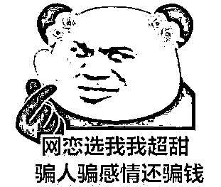
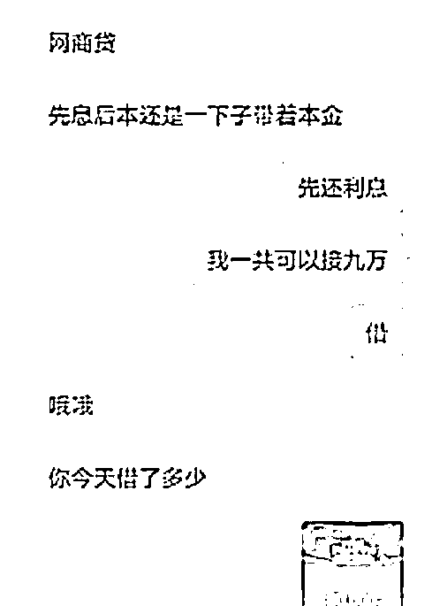
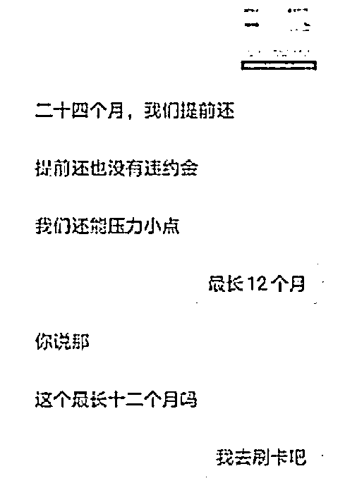
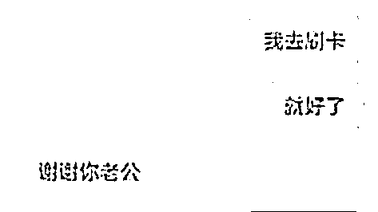
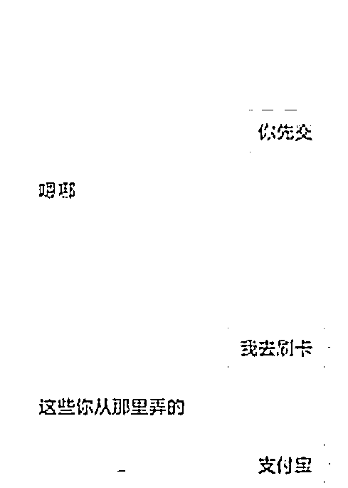
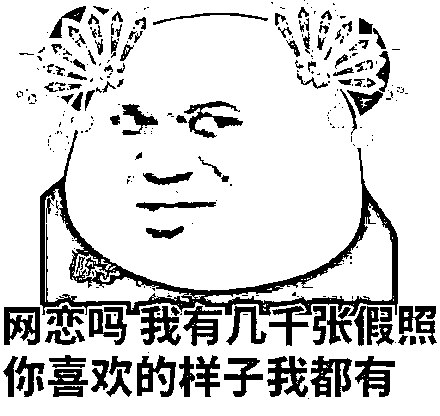
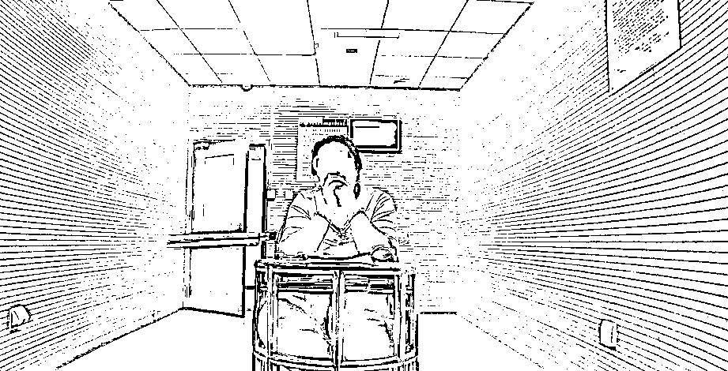

# 富二代“雯雯” 骗走老王 21 万！

> 原文：[`mp.weixin.qq.com/s?__biz=MzIyMDYwMTk0Mw==&mid=2247516132&idx=5&sn=0d0762548e4ec202f5fad0af3122266b&chksm=97cb74dca0bcfdca47742e4ab6a2fafafd938cf1396fba4cf816dd692872e15c64fead6aa9cc&scene=27#wechat_redirect`](http://mp.weixin.qq.com/s?__biz=MzIyMDYwMTk0Mw==&mid=2247516132&idx=5&sn=0d0762548e4ec202f5fad0af3122266b&chksm=97cb74dca0bcfdca47742e4ab6a2fafafd938cf1396fba4cf816dd692872e15c64fead6aa9cc&scene=27#wechat_redirect)

近日，王先生（化名）到苏州常熟东张派出所报案，称自己被一个女子以借款为由骗走**21 万余元**。 

去年 8 月，王先生在游戏中认识了一个女孩“雯雯”，一来二去两人互加了微信。

“雯雯”称自己在银行上班，家里是做生意的，家庭优渥，照片上的“雯雯”可爱动人。再加上“雯雯”展现出的大方、独立的性格，让王先生对这位富家女的身份深信不疑。

而此时的王先生却不知，一场骗局正在悄然上演...

“雯雯”先后以**培训课交学费、前男友索要分手费、给妈妈买手机、基金亏钱需要补仓**等理由多次向王先生借钱共计**21 万余元**。

而当王先生提出想要奔现时，却被对方拒绝了，随着转账笔数越来越多，对方终于同意见面。

可王先生见到现实中的“雯雯”后，一下子傻眼了。眼前的这个女人和她网上建立的人设天壤之别，所谓的自拍照其实都是网上的图片。

回到家后的王先生越想越气，来到派出所报案。接报后，民警很快将嫌疑人贾某（化名）在山东抓获。

到案后，贾某如实供述了自己的真实身份信息，无业、有两段婚姻和三个孩子，与被害人聊天交友过程中**将自己打造成白富美，取得被害人信任后以各种理由诱骗对方转账。**而骗来的钱早就被用来还债、去高档饭店消费、买衣服等挥霍光了。

目前，贾某已被苏州公安局采取刑事强制措施，案件正在进一步侦办中。

**友情提醒**

**你在计划未来，****Ta 在算计余额**

不要被恋爱迷失理智 

一旦对方找各种借口要求

**借钱、转账、投资等**

**须谨慎，谨慎，再谨慎**

来源：江苏网警

← 向右滑动与灰产圈互动交流 →

