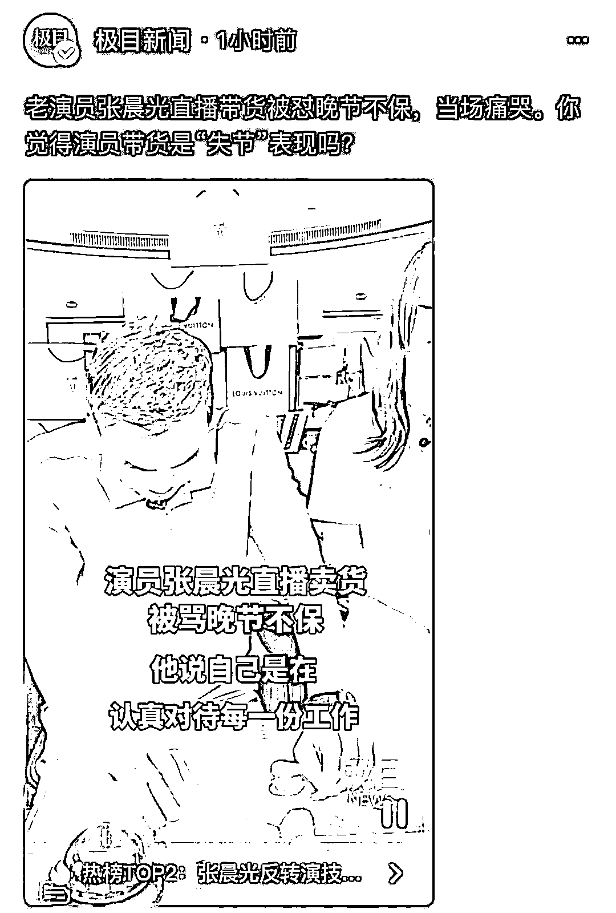
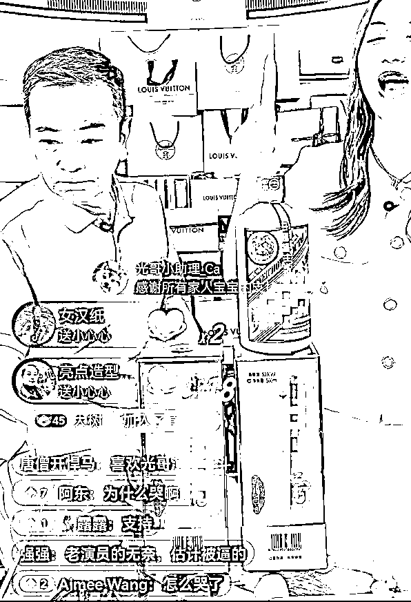
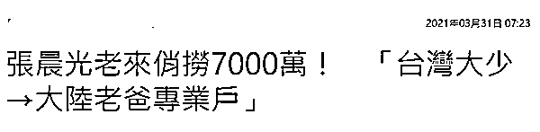
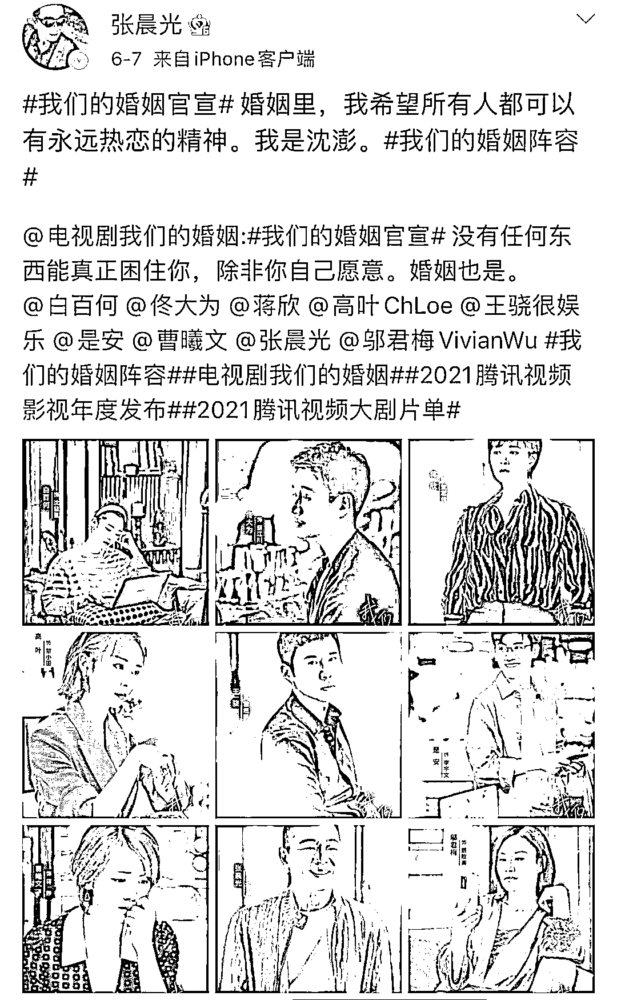
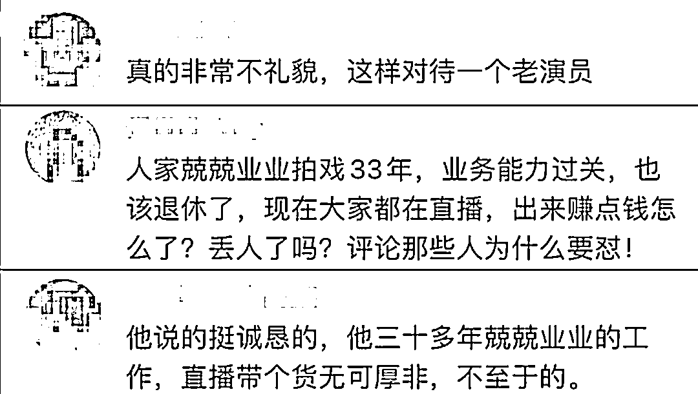
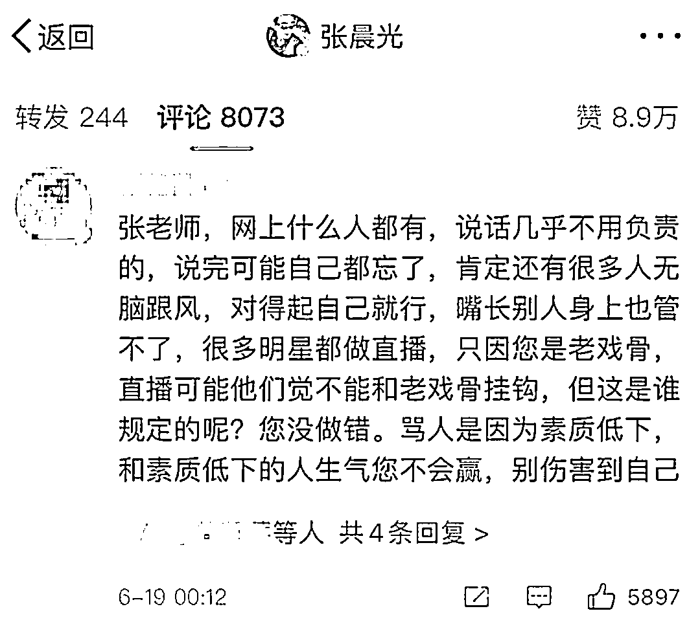
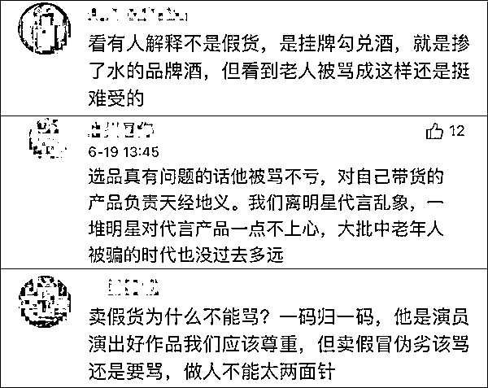

# 65 岁老戏骨直播带货，被当众骂哭，停下吧！键盘侠！

> 原文：[`mp.weixin.qq.com/s?__biz=MzIyMDYwMTk0Mw==&mid=2247516203&idx=2&sn=25710e135409ec9e65941964069cef1d&chksm=97cb4b13a0bcc20518b7035582f160bbc3126969b8e208b1433b1587cf9d35b77ab5b5750e8c&scene=27#wechat_redirect`](http://mp.weixin.qq.com/s?__biz=MzIyMDYwMTk0Mw==&mid=2247516203&idx=2&sn=25710e135409ec9e65941964069cef1d&chksm=97cb4b13a0bcc20518b7035582f160bbc3126969b8e208b1433b1587cf9d35b77ab5b5750e8c&scene=27#wechat_redirect)

明星直播带货已经成为一种非常常见的事，但最近有位老戏骨试水时却被弹幕骂哭了。 

18 日下午，64 岁老戏骨张晨光在直播介绍一款酒品的时候，被弹幕网友质疑其不好好拍戏却来卖货，是演员“失节”。看见这些留言，张晨光从不知所措到崩溃痛哭，称自己从业三十几年来一直兢兢业业，对被骂“晚节不保”感到伤心。

对此，很多网友留言安慰张晨光，称无论是演戏还是直播带货，都是凭自己工作在赚钱，演员带货不是“失节”表现。不过也有人指出，张晨光被指“晚节不保”是因为他疑似在售卖贴牌白酒。截至发稿前，张晨光还未就售假争议做出回应。

今年 64 岁的中国台湾著名演员张晨光今年因大陆电视剧《流金岁月》再获关注后，也随大流开通了短视频账号，时常上传小视频与粉丝互动，目前在平台拥有近 200 万粉丝，增加的曝光度还让他获得不少广告厂商的青睐。

据湖北日报极目新闻报道，18 日下午张晨光又开启了短视频新体验——直播带货，从下午 3 点一直直播到近凌晨 12 点，但这回的体验感不太好。

直播过程中，张晨光本就对带货的工作不太熟悉，话也说得不多。而这时评论区还不断有人留言，质疑他作为演员不好好拍戏却直播带货，更有人直指他是“晚节不保”。 

几句话看得张晨光失去了笑容，变得更加沉默，眼圈也开始泛红，频频回头避开镜头，产品介绍则主要由一旁的主持人在完成。

但类似的评论仍然在不断出现，最终张晨光还是情绪失控，忍不住对着镜头哭了出来。

他一边擦眼泪一边跟网友鞠躬道歉，称听到自己被说“晚节不保”时很伤心，“一路走过来三十几年，我在我的演艺事业上兢兢业业，我把每个角色都给扮演好。到这个直播间里，也是想把自己的另一个才能表现出来……”话说到一半他就哽咽到说不出话来了。

[`v.qq.com/iframe/preview.html?width=500&height=375&auto=0&vid=i3253h2sx4a`](https://v.qq.com/iframe/preview.html?width=500&height=375&auto=0&vid=i3253h2sx4a)

据悉，张晨光从 1983 年出道至今，早年凭借《京城四少》《一剪梅》《情义无价》《杨乃武与小白菜》而成为最早被大陆观众熟悉的台剧男演员。后来还凭《京城四少》和《日正当中》拿下了两个金钟奖“视帝”。

2005 年后，张晨光的演艺事业重心转移至大陆，涉猎军旅片、抗战片、古装片等剧种，而他的荧幕形象也逐渐从“台湾大少”转为“老板专业户”和“国民父亲”。

今年 65 岁的中国台湾著名演员张晨光，今年因大陆电视剧《流金岁月》再获关注后，开通了短视频账号，目前在平台拥有近 200 万粉丝。

据台媒今年 3 月报道，开通短视频账号后，张晨光今年第一季度接下的广告已经进账 7000 万新台币（约合人民币 1625.4 万元），被调侃是“老来俏”。

如他所言，张晨光从 1983 年出道至今，为观众们献上了无数优秀的电视作品，早年凭借《京城四少》《一剪梅》《情义无价》《杨乃武与小白菜》而成为最早被大陆观众熟悉的台剧男演员。

不论是“绝世渣男”还是“深情公子”，对他都不在话下，后来还凭《京城四少》和《日正当中》拿下了两个金钟“视帝”。

《京城四少》剧照，右一为张晨光

就最近而言，张晨光也一直在拍摄大陆电视剧，因此对被网友指责不好好拍戏而感到委屈也可以理解。

老戏骨空闲之余再做做直播工作，结果却被网友怼哭，张晨光的这段直播视频也登上了热搜，让不少网友感到心酸，指责刷这弹幕的人非常没礼貌，不懂得尊重。

很多网友留言安慰张晨光，称无论是演戏还是直播带货，都是凭自己工作在赚钱，劝他不要太过在意网友不友善的评论，做好自己的工作就行了。

不过也有人指出，张晨光被指“晚节不保”是因为他疑似在直播间售卖贴牌白酒。不过截至发稿前，张晨光还未就售假争议做出回应。

**演员出来直播带货，**

**你怎么看呢？** 

来源：长沙晚报，新闻晨报，观察者网

← 向右滑动与灰产圈互动交流 →

