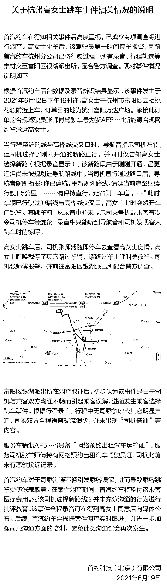

# 女乘客跳车摔骨折，称司机改路线、企图搭讪……网约车公司回应：误会……

> 原文：[`mp.weixin.qq.com/s?__biz=MzIyMDYwMTk0Mw==&mid=2247516203&idx=3&sn=52be7df8313ea2f3f06309a85e14f1bf&chksm=97cb4b13a0bcc20578c3c2ed6fdcd6a9cdabfd62ff2507cc99d6c43f23ee7677d8909790b5be&scene=27#wechat_redirect`](http://mp.weixin.qq.com/s?__biz=MzIyMDYwMTk0Mw==&mid=2247516203&idx=3&sn=52be7df8313ea2f3f06309a85e14f1bf&chksm=97cb4b13a0bcc20578c3c2ed6fdcd6a9cdabfd62ff2507cc99d6c43f23ee7677d8909790b5be&scene=27#wechat_redirect)

6 月 18 日，据浙江电视台“小强热线”栏目报道，杭州的高女士通过首汽约车平台打车去富阳途中，发现司机两次更改路线，还企图搭讪，出于害怕选择跳车，导致左臂骨折。此事引发众人关注。

6 月 19 日，@首汽约车 发布情况说明称，经派出所调查取证，初步认为是由于司乘双方沟通不畅引起乘客误解，进而发生乘客选择跳车事件。根据录音，并未出现“司机搭讪”等内容。 

[`v.qq.com/iframe/preview.html?width=500&height=375&auto=0&vid=s3253d9e8ug`](https://v.qq.com/iframe/preview.html?width=500&height=375&auto=0&vid=s3253d9e8ug)

据报道，6 月 12 日，高女士通过首汽约车平台打了一辆车从杭州到富阳，全程 8 公里。高女士说，上车后，司机企图跟她搭讪，她没有搭理。随后，她发现司机不按导航走，两次更改路线。

高女士说自己越想越怕，就跳了车，当时在地上滚了好几圈，导致左臂骨折。她还表示，自己找网约车公司要说法，对方却让她去做精神检查。

6 月 19 日，首约科技（北京）有限公司官方微博@首汽约车 就此事发布情况说明。

@首汽约车 称，行程中，导航曾提示司机左转，但司机选择了一条刚刚开通的新路直行，并同时仅告知高女士选择了新路。这条路由于新开通，所以并未规划进导航路线。

当司机直行通过路口后，导航提醒偏航并重新规划路线，此时高女士突然开门跳车。跳车前录音未显示司乘双方发生争执，或乘客有责令司机停车等迹象。

高女士跳车后，司机停车查看其伤情。高女士呼唤截停其它路过车辆，并请车主呼叫急救车。司机报警，并前往富阳区银湖派出所配合警方调查。

经派出所调查取证，初步认为是由于司乘双方沟通不畅引起乘客误解，进而发生乘客选择跳车事件。根据行程录音，行程中司乘并无争吵或其它明显声响，全程语言交流很少，并未出现“司机搭讪”等内容。

**以下为情况说明全文：**

来源：光明网、北青-北京头条、@小强热线-浙江科教、@首汽约车

← 向右滑动与灰产圈互动交流 →

