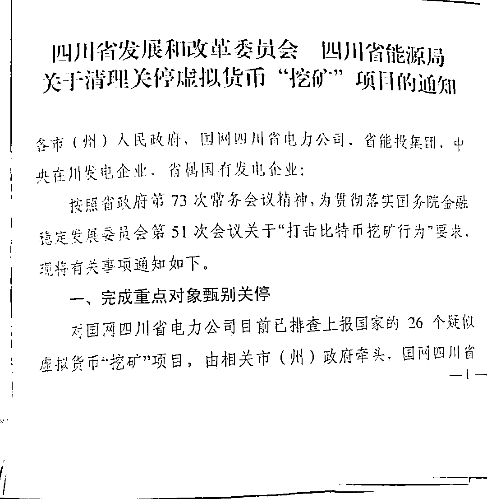

# 国内挖矿或遭全面关闭：有人仍在观望，有人准备出海！

> 原文：[`mp.weixin.qq.com/s?__biz=MzIyMDYwMTk0Mw==&mid=2247516203&idx=5&sn=604dd435dc6b62277116337690ef3e62&chksm=97cb4b13a0bcc205e1314376b7fefd811b039da5ac4644fb34c9ac71291f4156a8bac63eafe3&scene=27#wechat_redirect`](http://mp.weixin.qq.com/s?__biz=MzIyMDYwMTk0Mw==&mid=2247516203&idx=5&sn=604dd435dc6b62277116337690ef3e62&chksm=97cb4b13a0bcc205e1314376b7fefd811b039da5ac4644fb34c9ac71291f4156a8bac63eafe3&scene=27#wechat_redirect)

当“水电挖矿大省”四川也举起“清退大旗”，虚拟货币挖矿或将真正退出中国。

据澎湃新闻 6 月 18 日报道，四川省有关部门近日下发通知，要求发电企业自查自纠，立即停止向虚拟货币“挖矿”项目供电，不折不扣落实国家清理要求。通知还要求，各市(州)政府立即开展拉网式排查，对排查发现的虚拟货币“挖矿”项目务必立即关停。各地严禁以各类名义批复虚拟货币“挖矿”项目。 

 虽然此前已有内蒙古、青海等地开始关闭虚拟货币挖矿项目，但是由于相对于这些运用火电挖矿的省份，四川挖矿使用的是相对更加清洁的水电，而且利用水电挖矿也能解决当地水电消纳问题，因此，四川当地矿工们一度还心存“幻想”。

 四川清退政策的出台，一方面表明了国内清退虚拟货币挖矿的决心，另一方面也打破了矿工“最后的幻想”。

 “中国清退是正本清源，初衷也许主要是考虑碳排放，但这样做的效果也许比预想的更好，不论是电力资源，还是经济资源、科技资源、社会环境资源都避免了无谓的浪费。”北京大学光华管理学院副教授王志诚对澎湃新闻记者表示。

**清退之因：从违背碳排放到防控金融风险******

****虚拟货币挖矿的退出最早在内蒙古开始，主因之一为火电的能耗问题。****

 ****2 月 25 日，为完成内蒙古自治区“十四五”能耗双控目标任务，内蒙古自治区发展和改革委员会发布《关于确保完成“十四五”能耗双控目标任务若干保障措施（征求意见稿）》，提出将全面清理关停虚拟货币挖矿项目，2021 年 4 月底前全部退出，此外严禁新建虚拟货币挖矿项目。****

 ****受此影响，内蒙古的矿机开始往水电充足的四川、云南，以及火电充足的新疆等地迁徙。尤其是水电最为充裕的四川，此前曾有四川的矿场主对澎湃新闻记者透露，一天能接到内蒙古的矿工 10 个电话问还有没有负荷。****

 ****也由此，虚拟货币挖矿的能耗问题引起热议。中国社科院、清华大学学者 4 月 6 日在《自然通讯》（Nature Communications）刊发的论文又将该话题推向一波高潮。论文称，如果没有适当的干预措施和可行的政策，密集的比特币挖矿将可能破坏中国的减排努力。****

****论文作者之一、清华大学地球系统科学系教授关大博在接受澎湃新闻记者采访中表示，从宏观社会经济的角度考虑，比特币行业对现有金融体系和社会进程的推进作用有限。他强调，像比特币或其他的金融产品，甚至未来所有的新兴行业，一定要有减碳化、低碳化甚至零碳化的绿色属性。**** 

 ****4 月 27 日，北京市经济和信息化局发布通知，要求对北京市数据中心承载业务中涉及比特币等加密货币挖矿的相关情况进行梳理。北京经信局曾回复澎湃新闻称，该通知主要从数据中心承载的业务类型和能耗角度进行梳理摸排，为该局正常开展的业务工作。****

 ****5 月 18 日，内蒙古发改委宣布设立虚拟货币“挖矿”企业举报平台，一位接近内蒙古发改委人士此前对澎湃新闻记者透露，目前内蒙古虚拟货币挖矿项目清退情况成效显著，有利于真正的数据中心在内蒙古落地，有利于碳达峰、碳中和政策顺利实施。****

 ****就在三天后，国务院金融稳定发展委员会 5 月 21 日召开会议要求，要坚决防控金融风险，打击比特币挖矿和交易行为，坚决防范个体风险向社会领域传递。这也意味着，关闭虚拟货币挖矿项目政策从地方层面上升到了中央层面。****

 ****自此，各省市纷纷响应，虚拟货币挖矿产业正式开始清退。****

 ****5 月 25 日，内蒙古发改委发布《关于坚决打击惩戒虚拟货币“挖矿”行为八项措施（征求意见稿）》（下称《意见稿》），根据八类对象分别提出不同的打击惩戒策略。****

 ****曾有业内人士指出，如果在合规情况下，虚拟货币挖矿在国内会首选两个地方：第一是四川，因为弃水消纳园区在能源上的支持，可以消耗输送不出去的电力。第二是新疆准东经济技术开发区，因为当地是地表的煤炭，用不掉也是巨大的能源浪费。****

 ****但 6 月 9 日，网传新疆昌吉回族自治州发展和改革委员会发布了《关于立即对虚拟货币“挖矿”行为企业进行停产整顿的通知》，要求新疆准东国家经济技术开发区管委会立即责令虚拟货币“挖矿”企业于该日 14 点之前全部停产整顿。****

 ****当日，青海省工信厅也下发了《关于全面关停虚拟货币“挖矿”项目的通知》。****

 ****6 月 11 日，澎湃新闻从一位矿工处获悉，其在云南托管矿机的矿场于当日上午关停，在新疆托管矿机的矿场也于当日关闭。与此同时，当日网上流传一份名为《云南省能源局关于进一步加强比特币挖矿企业用电管理的通知》，通知要求于 6 月底尽快完成比特币挖矿企业用电清理整顿工作。****

 ****面对密集出台的虚拟货币挖矿产业政策，四川似乎成为矿工眼中，虚拟货币挖矿产业的“最后希望”。****

 ****在 6 月 2 日，为摸底四川虚拟货币“挖矿”相关情况，国家能源局四川监管办公室已召开小范围调研座谈会，进行关停虚拟货币“挖矿”对今年四川弃水电量的影响分析。****

 ****如今，备受瞩目的四川也开始清退之路，虚拟货币矿工、矿场主将面临“无电可挖”的情景。****

******未来：转移海外？******************

********“在全球碳中和转型的背景下，国内大面积关停和清退比特币挖矿企业，最直接的就是对比特币算力的影响，但总体的影响不是很大。”欧科云链研究院高级研究员王海峰对澎湃新闻记者表示，“因为比特币的节点是分布在全球范围内的，局部矿场的关停，会使得全球其他范围内新的节点不断涌入，长期来看对比特币的算力不会产生重大影响。”********

******王志诚认为，中国关停了集中“挖矿”，并不是所有的挖矿都被停止，比特币的挖矿本来就是应该利用真正闲置的设备来实现，才能更零散，也就更分散化，没有了这些集中化的算力，体系更具有分布式，一定程度是更加安全了。******

 ******王志诚指出，中国在能源资源方面本来就属于人均偏低，即使存在一些小范围的集中化挖矿也应该是在那些能源资源人均占有比较高的国家。比特币的出块时间本来就是固定的，大幅发展的挖矿算力有点水涨船高的节奏，本来就是内部竞争的问题。******

 ******“所以我觉得行业的发展只是短期有些影响，调整过来后该怎么运转还会继续其应有的机制。”他说。******

 ******力研咨询公司创始人、区块链和加密数字资产行业研究者谷燕西也对澎湃新闻记者表示，在中国禁止后，矿工们可以迁移到允许挖矿的地区继续进行挖矿，只不过需要面临在不熟悉的商业环境中开展业务的挑战。******

 ******“先观望一下，现在没地方挖了，到月底看，要是国内做不了，就找渠道出海，找一些大公司合作。”一位矿机在云南、新疆的矿工对澎湃新闻记者说，“希望只是一阵风，过了风头政策能宽松点，毕竟每年那么多弃水弃电，不用也是白白浪费。”******

******他表示，预计出海去一些周边亚洲国家，欧美地区不打算去，因为是“忽悠人”，“电价也不便宜”。******

 ******另一位四川的矿场主也在考虑出海，但他表示“首选美国”。******

 ******据美国 CNBC6 月 18 日报道，美国迈阿密市市长 Francis Suarez 表示，迈阿密的大门向中国的比特币矿工敞开。******

 ******Francis Suarez 告诉 CNBC，他本人没有接到任何来自中国矿工的电话，但希望通过推动该市几乎无限的廉价的核能供应来接纳这些散居在外的矿工。******

******来源：澎湃新闻，利箭在行动******

************

******← 向右滑动与灰产圈互动交流 →******

************