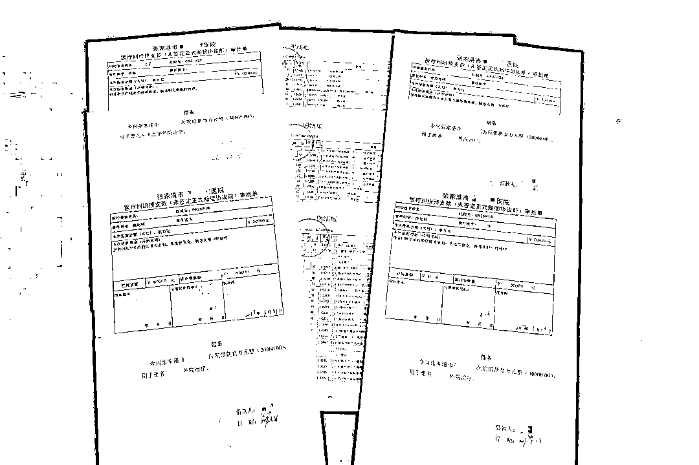

# 赌瘾难戒，他想用投资款翻本......

> 原文：[`mp.weixin.qq.com/s?__biz=MzIyMDYwMTk0Mw==&mid=2247516203&idx=6&sn=9551171990970a1ddd7dab697c666001&chksm=97cb4b13a0bcc205fbe7b8b717be4cff8b7f85278ff254653f2ec9fe41aca844904ad2a35ea2&scene=27#wechat_redirect`](http://mp.weixin.qq.com/s?__biz=MzIyMDYwMTk0Mw==&mid=2247516203&idx=6&sn=9551171990970a1ddd7dab697c666001&chksm=97cb4b13a0bcc205fbe7b8b717be4cff8b7f85278ff254653f2ec9fe41aca844904ad2a35ea2&scene=27#wechat_redirect)

他曾是一名治病救人的医生，也是医院重点培养的骨干人才，却因深陷赌博漩涡无法自拔，改变了人生的走向。为满足与日俱增的赌瘾，他虚构在医院投资医疗器械等项目，以投资有分红等名义，一年间骗取 17 人共计 1000 余万元。 

王军伪造的《医疗纠纷借款审批单》

及虚构的明细清单 

今年 4 月，经**江苏省张家港市检察院**提起公诉，被告人王军（化名）被法院以诈骗罪判处有期徒刑十四年，并处罚金 50 万元，并撤销曾因犯挪用公款罪判处的缓刑，决定执行有期徒刑十四年六个月，并处罚金 50 万元，责令退赔尚未追缴的赃款 1065.52 万元。

　　“怡情的小赌”，让他逐渐失控　

王军在 2001 年大学毕业后，顺利通过卫生局的统一招考，被分配到张家港市一家公立医院工作。刻苦上进的他很受领导赏识，获得了不少锻炼和进修的机会。2011 年，王军被医院任命为医务科副主任，主持工作，全权负责医院的医疗事故纠纷调处等工作。

2013 年末，王军在解决一起医疗纠纷时，因被患者家属辱骂双方起了争执，下班后他便约了朋友喝酒消愁。酒过三巡，在朋友的提议下，他们一起去“棋牌室”寻开心。尝试着玩了几局，王军赢了些钱，心情也顺畅了许多，他感觉这“小赌怡情”的滋味真是不错，便继续下注。但输多赢少让他兜里的钱逐渐见底，兴致正盛的王军当场向人借钱。

次日归家时，王军已身负几万元的高利贷债务。不敢让家人知道，自己又承担不了每天的高额计息，加上对赌博刺激感的留恋，他一次次地走上赌桌，想要翻本把钱赢回来。可钱越输越多，高利贷也越借越多。半年间，他欠下了 300 多万元赌债。

图片来源于网络，与正文无关

王军的妻子对丈夫在外打牌不顾家颇有微词，当听到丈夫向自己哭诉已欠下巨额高利贷被人追讨时，她虽气恼却也将家中房产变卖用于还债，并督促丈夫不能再沾染赌博。

东山再起受阻，他盯上医院的公款

在家人的帮助下，王军偿还了高利贷债务，余下的赌债则自己慢慢攒钱归还。经历了这一遭，真心后怕的他将精力都放在了工作上，不仅在医院认真钻研业务提升自我，还在 2015 年时与朋友合伙经营了一家月子中心。2016 年初，工作表现出色的王军被委派至当地乡镇一家医院兼任副院长，协助该院创建二级乙等医院。

此外，月子中心也开始有盈利。但没过多久，月子中心的合伙人因私人原因突然撤资，致月子中心无法维持正常运营。王军四处奔波，却依旧回天乏力，他身上背负的债务又开始变多了。

2016 年底的一天，王军在医院上班时，整理了一些积压已久的医疗纠纷资料。他发现一直以来医院都未对他处理的医疗纠纷进行实质核查，正急需用钱的他忍不住蠢蠢欲动起来。

图片来源于网络，与正文无关 

思虑一番后，他利用自己可以向单位预支公款的职务便利，在医院的系统里找到一些住院病人的基本资料，以他们在医院治疗期间发生了医疗纠纷需预支款项用于外出治疗为名，采用伪造《医疗纠纷借款审批单》及冒充领导签名的方式，先后多次从医院挪用公款 132 万元，用于归还个人赌债及对月子中心的投资运营等。

然而，纸终究包不住火。2017 年，医院财务科发现有一名病患已好转出院，未产生医疗纠纷，也不存在转院治疗，却办理了医疗纠纷预支款的手续，经过进一步查询后，又发现了存在同样问题的几名病患，院方便找来王军进行核对。

一直担心自己虚报冒领的事情曝光，王军听闻医院开始彻查，为求内心解脱，他主动向领导坦白，后在院方的陪同下投案自首。

案发后，王家父母举全家之力四处筹款，将他挪用的公款还上。2018 年底，王军因自首、归还全部公款并取得谅解，被法院判处有期徒刑二年六个月，缓刑三年。

赌瘾难戒，他骗人投资来填坑

从一名受人尊敬的医院领导干部沦为身败名裂的阶下囚，王军懊恼至极，但欠下的债总是要还的，他不得不振作起来。虽然原本就职的医院已将王军开除，但事发前他在兼任当地乡镇医院副院长时，有成功为该院创建二级乙等医院的经验，凭着这一技之长，他很快在当地另外三家医院找到了兼职。

巨额的外债、每天疲惫不堪的忙碌以及妻子的抱怨，让王军愈发烦躁郁闷，他常常彻夜难眠。为了不影响家人休息，他搬到书房，睡不着时就打开电脑，在虚拟的网络世界里让情绪得以放松。

即使身边人时刻提醒告诫他不要再赌博，可夜深人静时，看到电脑页面上跳出的赌博网站链接，想到当初在赌桌上赢钱的快感，王军还是忍不住点了进去。

网络赌博可比出门打牌便捷和隐蔽多了，虽然网站账户上的金额一次又一次归零，但王军依旧对这种释放压力忘却烦恼的愉悦感欲罢不能。当输光了手头仅有的一点零花钱后，他便想办法弄钱。因之前的负债，借钱这条路已走不通，王军开始挖空心思寻找着其他路子。想到一次在为医院创建工作奔走的间隙，自己偶然听到同事们议论着做医疗器械投资的话题，心里便有了计划。

2019 年初开始，王军利用自己之前的身份和人脉关系，虚构自己在张家港市多家医疗机构做采购医疗器械和耗材的生意，用电脑合成的假订单、项目分红协议书，骗取身边朋友、同事的信任，以投资有分红等为由吸引他们拿钱参与投资。

当一笔笔投资款到手后，王军要么直接打入赌博网站用作翻本的筹码，要么拆东墙补西墙地兑现“分红款”以方便继续行骗。一年时间，他就将骗来的超千万元钱款全部投到网络赌博中输光。

图片来源于网络，与正文无关 

2020 年初，越来越多的窟窿无法补上，王军意识到这已远远超过了自己的偿还能力，他便用各种谎言搪塞和拖延着投资者，甚至以疫情为借口躲在外地长期不归。迟迟拿不到收益的多名被害人开始有所警觉，向一些医疗机构咨询后才发现王军所谓的投资项目根本不存在。

2020 年 8 月，因多次联系王军讨要说法未果，几名累计投资已超百万元的投资者向公安机关报了警。接到民警打来的核实电话，自知罪责难逃的王军主动承认了自己诈骗的事实。（陈迪  高雄伟）

来源：检察日报

← 向右滑动与灰产圈互动交流 →

