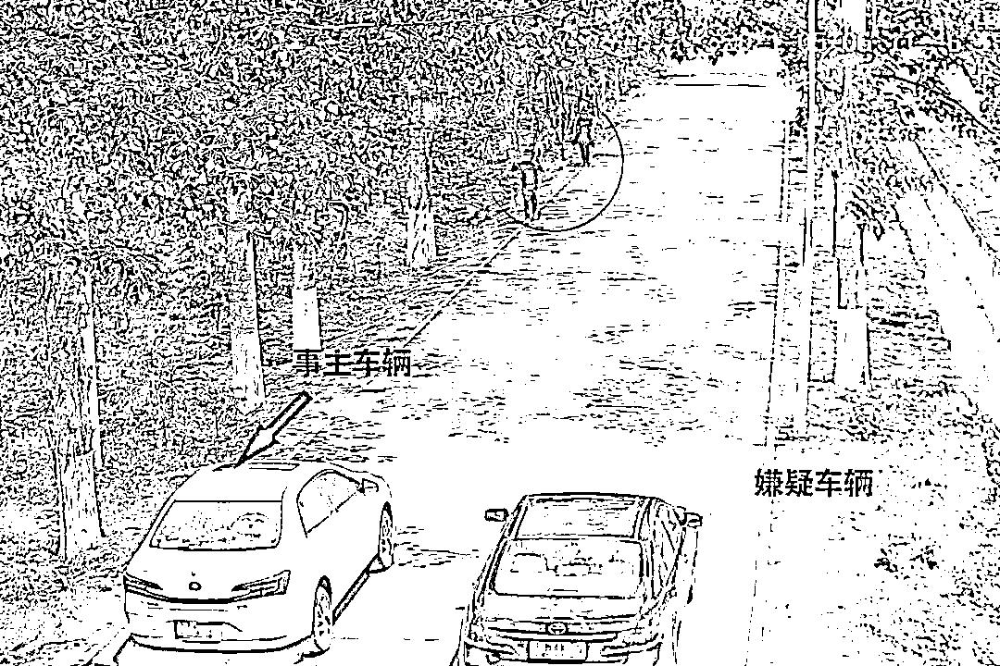
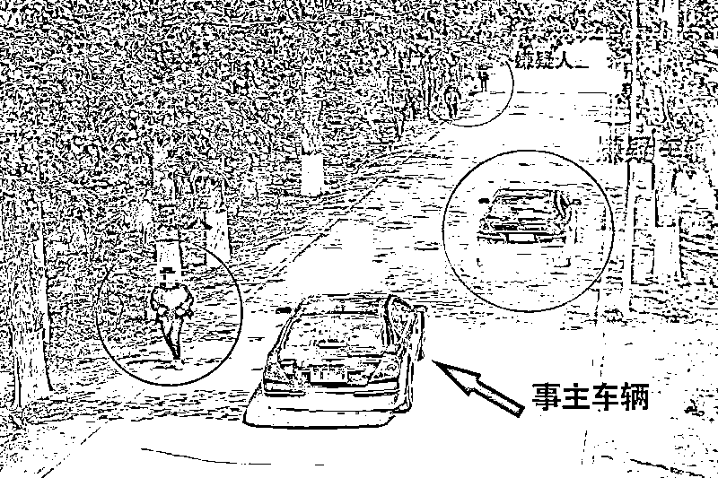
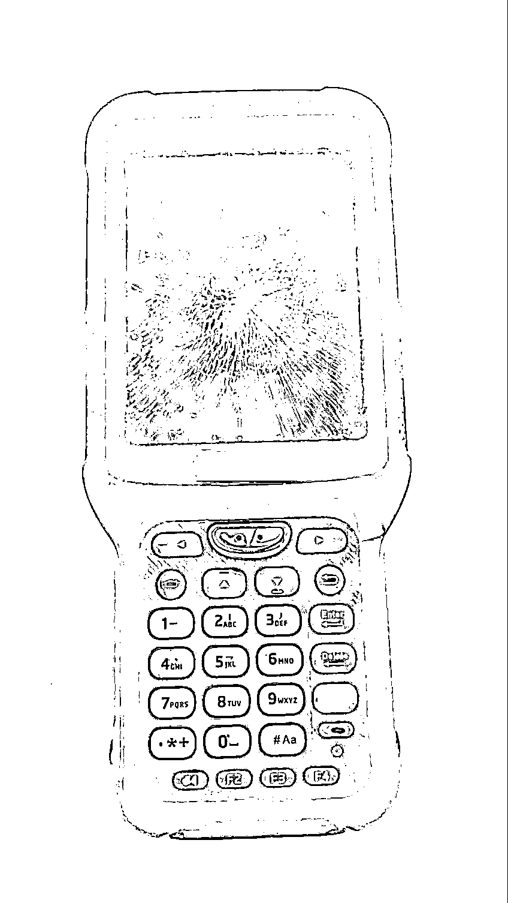
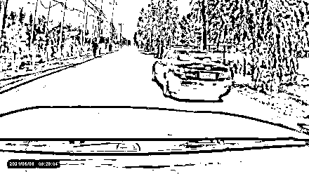
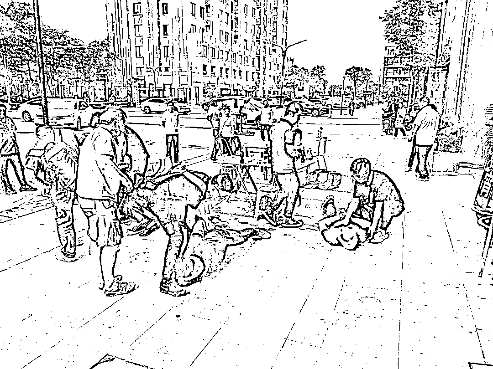

# 最新诈骗手法，北上广多人被骗，所有车主请转发！

> 原文：[`mp.weixin.qq.com/s?__biz=MzIyMDYwMTk0Mw==&mid=2247516203&idx=7&sn=e1424013b81b8b990e686b23b8d31677&chksm=97cb4b13a0bcc205b34ab8924c2d6b63625d2080fab3a5f2bff3691c7fb44951e81957d3e1dc&scene=27#wechat_redirect`](http://mp.weixin.qq.com/s?__biz=MzIyMDYwMTk0Mw==&mid=2247516203&idx=7&sn=e1424013b81b8b990e686b23b8d31677&chksm=97cb4b13a0bcc205b34ab8924c2d6b63625d2080fab3a5f2bff3691c7fb44951e81957d3e1dc&scene=27#wechat_redirect)

**导读**

通州公安分局 6 月 10 日发布消息，警方通过缜密侦查，成功打掉一在本市流窜作案的“碰瓷”团伙，刑事拘留 4 人，初步核实案件 60 余起，涉案金额 10 万余元。

**多名车主遭遇同一情况**

**刚要超车，一名晨练者倒地**

****

****前边有辆车一直压着速度，我准备超车的时候，碰倒了一个晨练跑步的。他也不要求去医院检查，只让我赔他手里摔坏的机器，我这是不是遇上‘碰瓷’的了……”5 月 8 日 9 时许，通州公安分局张家湾派出所辖区居民赵先生向民警反映情况，怀疑自己被他人“碰瓷”。接报后，民警立即开展调查取证工作。****

********

****让民警感到意外的是，这边事主赵先生的笔录还没做完，又接到了另一位事主毛先生的报警，同样是怀疑自己被“碰瓷”。****

****毛先生所反映的情况和赵先生如出一辙，也是在上班途中，驾车行驶到一较为狭窄道路时，被一辆黑色轿车在前方压慢速度。当毛先生准备超车时，路边出现 3 名晨练跑步人员，随后一名跑步人员倒地。****

********

****毛先生下车询问情况时，对方表示身体没事，不需要去医院，但是手里拿着的扫码仪被摔坏得赔偿。**** 

********

****锁定嫌疑人****

****北京警方展开三地追击****

********

******根据两位事主反映的情况，民警分析他们很可能遇到了“碰瓷”团伙，随后立即对事发路段的监控视频进行调阅。经反复查看监控视频，同时结合两位事主提供的相关证据，民警查明这是一个由四名嫌疑人组成的“碰瓷”团伙。该团伙成员作案时分工明确、手法娴熟，很有可能不是第一次作案。******

******民警迅速锁定了该团伙四名成员的身份信息，并掌握该团伙自五月初至今，在海淀、朝阳、丰台、昌平等多区以同样手段制造“碰瓷”，向事主索要赔偿的犯罪线索。******

************

******经进一步工作，民警获悉该团伙成员已离开北京前往广东和上海。5 月 25 日，通州公安分局刑侦支队立即抽调警力会同张家湾派出所民警组成抓捕组分别前往广东、上海两地。****** 

******5 月 27 日下午，上海抓捕组在奉贤区某小区底商一餐馆前将犯罪嫌疑人黄某荣（男、28 岁）、袁某（男、26 岁）、黄某钓（男、28 岁）抓获。经现场审讯，嫌疑人如实供述了在北京多地制造“碰瓷”的犯罪行为，并称之所以来到上海，是准备在上海寻找目标伺机作案。但没想到的是，刚踩完点还没来得及作案，就被通州警方抓获。******

************

******在得到上海抓捕组顺利收网的消息后，广东抓捕组民警随即在一网吧内将嫌疑人曹某（男，26 岁）控制。至此，这一流窜多地进行“碰瓷”的团伙被通州警方一举端掉。5 月 28 日，四名嫌疑人因涉嫌敲诈勒索罪被通州警方依法刑事拘留。目前，四名嫌疑人及作案车辆已被民警全部押解回京，相关案件正在进一步工作中。******

******驾驶过程中，一定要严守交规******

******注意观察周边情况******

******一旦发生交通事故，及时报警******

******依法进行处理******

******别给犯罪分子可乘之机******

********转发******** 

********支持严惩碰瓷团伙********

************

******来源：北京交通广播，反诈骗先锋******

************

******← 向右滑动与灰产圈互动交流 →******

************