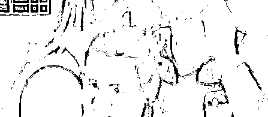
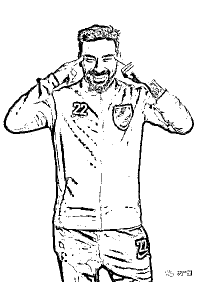
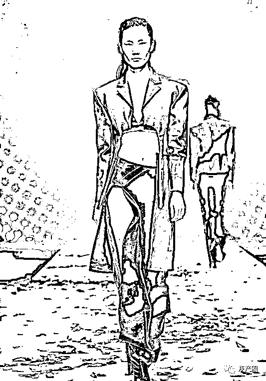
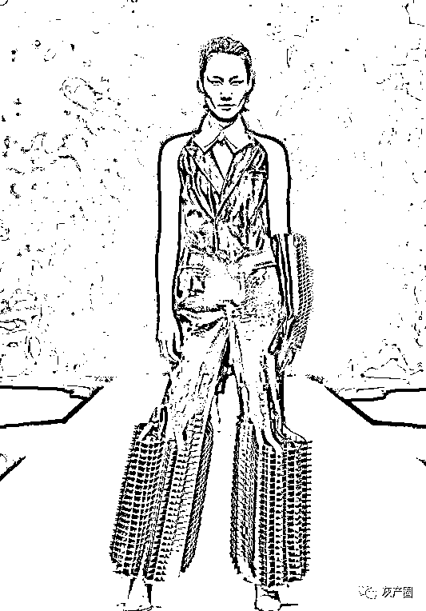
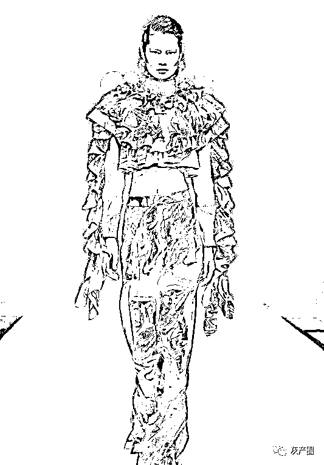
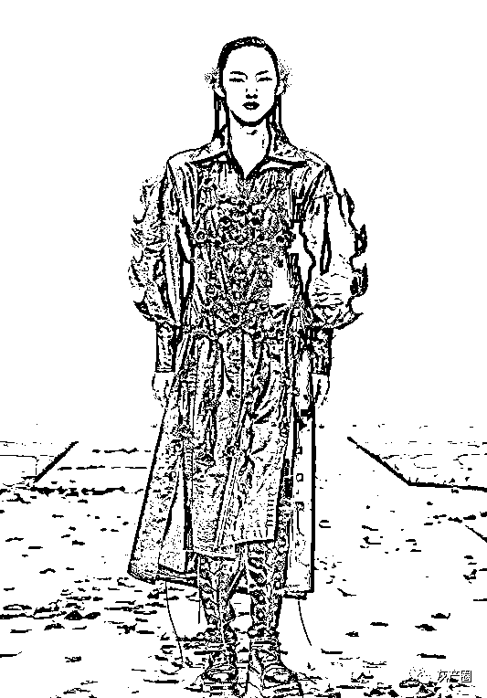
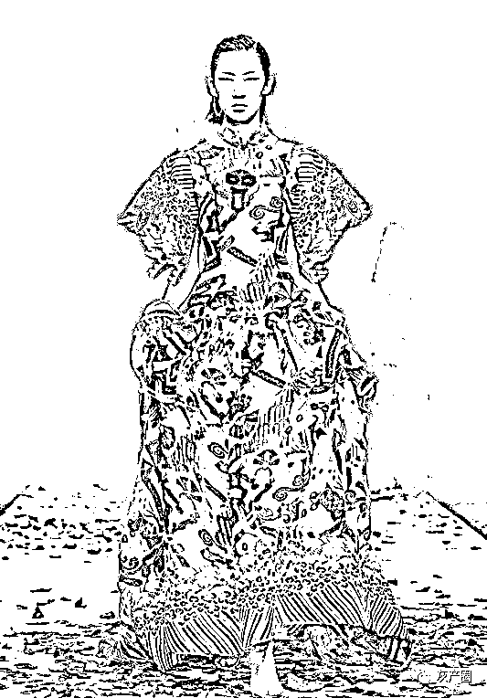
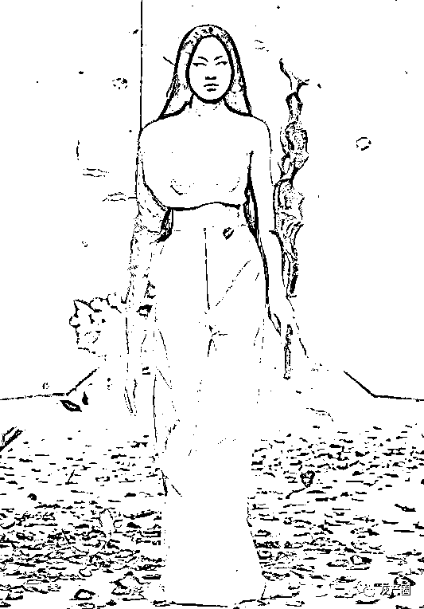
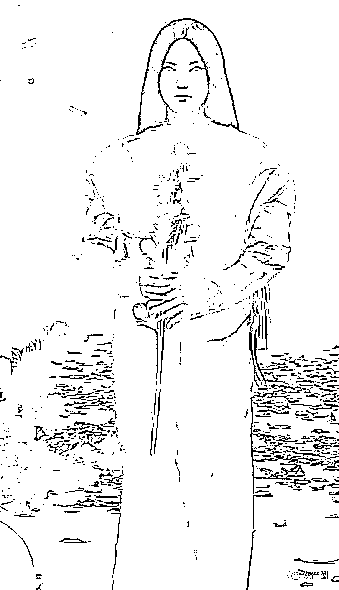
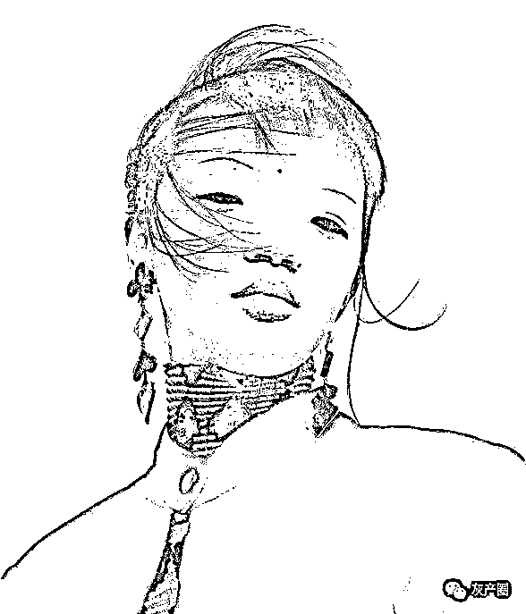

# 清华美院毕设这几个模特的妆容被网友骂了，这眯眯眼是在“自取其辱”？

> 原文：[`mp.weixin.qq.com/s?__biz=MzIyMDYwMTk0Mw==&mid=2247516260&idx=1&sn=8f9b9a170942e7d54145473d25a2e475&chksm=97cb4b5ca0bcc24a7f03e7ce205b4578285fe1aef5adde5c14ffc41a4e5b823693ae391755d5&scene=27#wechat_redirect`](http://mp.weixin.qq.com/s?__biz=MzIyMDYwMTk0Mw==&mid=2247516260&idx=1&sn=8f9b9a170942e7d54145473d25a2e475&chksm=97cb4b5ca0bcc24a7f03e7ce205b4578285fe1aef5adde5c14ffc41a4e5b823693ae391755d5&scene=27#wechat_redirect)

6 月 8 日，国际排联针对塞尔维亚自由人杜尔德维奇开出罚单，处罚其在赛场上对于亚洲人的种族歧视动作。
“拉眼角”被认为是欧美对亚洲人群的歧视动作，体育赛场上，该动作也是屡禁不止。近日，“眯眯眼”的刻板形象再度惹恼了一众中国网友，不过这一次的“肇事方”既不是西方的政客媒体，也不是西方的名人企业，而是国内的高校——清华大学美术学院…… 与中国人审美角度不同，西方人眼中，高颧骨，塌鼻梁，宽山根，小眼睛才是东方人应有的长相，欧美时尚界将吕燕、高其蓁、Tsunaina 这样的东方人捧红，用种族歧视观点代替真正的审美标准此事引发网络热议后，6 月 16 日下午，观察者网就此事多次致电清华大学和清华大学美术学院外宣部门，均无人应答。

* * *

迷惘的绵羊：不是说中国人或者亚裔不能长这样，但我好歹也活了这么些年了，这样眼睛的真没见过几个，也难为一次能找到这么多眼睛长这样的 

Alexia 阿勒遐：咱也不扣帽子，就只是单纯觉得，好难看啊！！！！！！

我叫孙火旺：会不会有人说：国人玻璃心了，要包容多元文化和审美，不能用大众审美要求艺术… 坐等

来源：微博那些事儿

← 向右滑动与灰产圈互动交流 →

