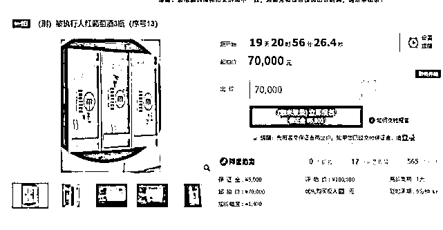

# 史上最贵游戏卡？起拍价 80 元，半小时超 8500 万！

> 原文：[`mp.weixin.qq.com/s?__biz=MzIyMDYwMTk0Mw==&mid=2247516260&idx=2&sn=e57b55447e6251acf7b6ef10f628bf81&chksm=97cb4b5ca0bcc24a6b17e6231951e183b771d21b8a01dcb112134f71289d539aef117352f81e&scene=27#wechat_redirect`](http://mp.weixin.qq.com/s?__biz=MzIyMDYwMTk0Mw==&mid=2247516260&idx=2&sn=e57b55447e6251acf7b6ef10f628bf81&chksm=97cb4b5ca0bcc24a6b17e6231951e183b771d21b8a01dcb112134f71289d539aef117352f81e&scene=27#wechat_redirect)

6 月 21 日 16 时，记者从某司法拍卖中心发现，一张 20 周年纪念版 " 青眼白龙 " 游戏王纯金卡牌进入法拍流程正式开拍，法院送拍标价 80 元起，开拍 30 分钟当前价已超 8500 万元，竞拍记录超 2100 次。此前有 18000 人报名，超 178 万人围观。

**开场十分钟价格破百万 随后一片混乱**

6 月 21 日下午 16:00，“青眼白龙”游戏卡在阿里拍卖准时开拍，在开局的前 7 分钟里，卡片的拍卖价格虽然飞速变化，但涨幅还属正常，并没有超过 20 万市价。观察拍卖的竞价记录也可以发现，参与拍卖的人里，都在卡着金额出价，真正想购买这张卡片的人，应该大多在前 7 分钟里进行过出价。 

 

例如竞买号“FEPLL”这位用户，在前 7 分钟里就进行过多次出价，但每次都是正常竞价加价。而 7 分钟之后，“青眼白龙”游戏卡价格超过 20 万后，“FEPLL”就没有再进行过出价。

7 分钟的前奏一过，卡片的拍卖价格就开始急速飙升，竞买号“N3734”的用户进行了本次拍卖的第一次大额加价，一下将卡片价格提升 8 万到了 30 万的价格。

30 万的价格一上，这场拍卖就进入了溢价拍卖的情况中，到了第 8 分钟时，竞买号“N3734”的用户又出手了！这次他将价格一下子拔高到了 50 万。同样的，在即将到 10 分钟时，“N7374”又来了一波狠的，直接将 64 万的拍卖价格拔高到了 100 万……

可以说拍卖价格十分钟破百万这位“N3734”用户功不可没。此后“青眼白龙”游戏卡的拍卖就变成了纯输数字环节，接下来的 23 分钟里，一路从 100 万飚到 8732 万，竞拍号“Y8745”的用户成为了最高出价者，随后法院亲自下场终结了这场闹剧，给出了“拍品与实际竞拍价格严重不符，可能存在恶意炒作与竞价行为”的理由。

据悉，这款 11 克 24K 金的 " 青眼白龙 " 原版真品卡牌限量发售 500 套，每张卡牌上刻有单独编号，当时含税总价为 21.6 万日元，约合人民币 1.2 万元，参与拍卖的这张 " 青眼白龙 " 编号 152，尚未确定真伪。 

据资深玩家分析，正常情况下这件 " 青眼白龙 " 卡牌的全套包括本体、证书、其他，现在价值 400 万日元以上，约合人民币 25 万元，因此市场价打底 20 万元人民币。但上面这件物品缺少了非常关键的证书，真伪需自行判断。

据了解，拍品标注着【刑】字，本次司法拍卖由安徽省滁州市中级人民法院发起，拍卖公告里明确 " 本次拍卖标的物均为刑事案件扣押财产，系二手产品 "。

涉及该案的拍品还不止这一件，公告中附有清单。有欧米茄手表，有上万元的红酒，除了这张游戏卡牌，还有一件让玩家们流口水的拍品—— 3 个镀金镶钻 PS4 手柄。

据钱江晚报消息，它们的主人是一个 95 年出生的年轻人，利用计算机系统 BUG，制造了当地一件惊天贪污案，案涉资金将近 7000 万元。

网上没有关于该案更多的信息，不过这些拍品在宅圈引起轰动。此外，这位被执行人被收缴的镀金镶钻的游戏手柄，两台限定 PS4 主机、多台 Switch 主机、外星人电脑，以及大量索尼和苹果的电子产品也参与拍卖。

8732 万的“青眼白龙”游戏卡最后的结局肯定是流拍的，但哄抬价格的网友们所要承受的损失可能并不止 100 元保证金这么简单。

拍卖品流拍只没收保证金，那是正常拍卖情况。面对拍卖恶意抬价的行为，《中国民事诉讼法》规定：“对于司法网拍中恶意抬价，扰乱司法拍卖秩序的买受人，人民法院可以对其罚款、拘留，构成犯罪的，依法追究刑事责任。”

在过往的拍卖中，也出现过恶意抬价被罚款并拘留的案例，本次参与“青眼白龙”游戏卡竞拍的人数极多，且大部分都是拍着玩的情况属实少见。目前网络上有猜测可能会点出几个典型抬价人员进行罚款拘留惩罚以儆效尤，但也有从事资产处置的网友表示，这次《游戏王》“青眼白龙”卡片拍卖走的是刑法拍卖，且拍卖品估价极低，大概率只会没收保证金，然后流拍重新估价，提高保证金门槛进行再拍卖。

 

不管结果怎样，这次“青眼白龙”游戏卡的拍卖肯定会成为以后抬价拍卖的典型案例，如果有拘留和大金额罚款惩罚，也算是给乱抬价的人上了惨痛的一课。

来源：灰产圈综合潇湘晨报，手游矩阵等

← 向右滑动与灰产圈互动交流 →

