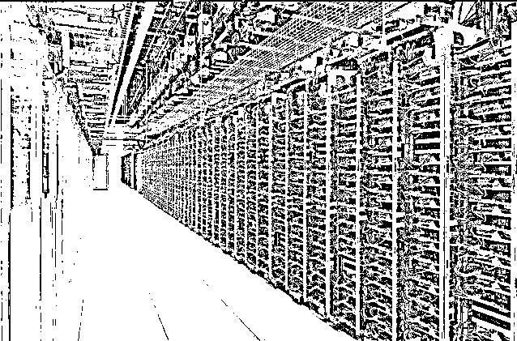

# 历史性的一天！比特币矿场集体断电，所有矿场被关？

> 原文：[`mp.weixin.qq.com/s?__biz=MzIyMDYwMTk0Mw==&mid=2247516260&idx=3&sn=bb052415dc4c8f38dc3eaf905bde75c2&chksm=97cb4b5ca0bcc24a7ae682db62991486d445979664ea21c7dd6a97a543e607f1efdca5e09f8c&scene=27#wechat_redirect`](http://mp.weixin.qq.com/s?__biz=MzIyMDYwMTk0Mw==&mid=2247516260&idx=3&sn=bb052415dc4c8f38dc3eaf905bde75c2&chksm=97cb4b5ca0bcc24a7ae682db62991486d445979664ea21c7dd6a97a543e607f1efdca5e09f8c&scene=27#wechat_redirect)

币圈迎来历史性的一天。

不仅被拔了网线，直接把电都给你断了！

**四川清退加密货币挖矿**

**矿场集体断电，所有矿场被关闭**

据悉，因为政策原因，中国，乃至全球最重要的比特币矿机聚集地四川将迎来大面积矿机关机。据推算，关机的负荷大概在 800 万千万。随着内蒙古、新疆之后，以清洁能源水电为主的四川也没能成为中国比特币挖矿的最后的堡垒。

一份《四川省发展和改革委员会、四川省能源局关于清理关停虚拟货币“挖矿”项目的通知》的文件显示，对于虚拟货币“挖矿”，在川相关电力企业需要在 6 月 20 日前完成甄别清理关停工作。

文件显示，各市（州）人民政府，国网四川省电力公司、省能投集团，中央在川发电企业、省属国有发电企业，应按照省政府第 73 次常务会议精神，为贯彻落实国务院金融稳定发展委员会第 51 次会议关于“打击比特币挖矿行为”要求，现将有关事项通知如下：

1、完成重点对象甄别关停，省电力公司已上报 26 个疑似“挖矿”项目，于 6 月 20 日前完成甄别清理关停；

2、开展发电企业自查自纠，立即停止向虚拟货币挖矿项目供电；

3、做好全面清理排查，各市（州）政府立即开展拉网式排查，发现疑似项目立即关停，6 月 25 日前完成；

4、切实履行主体责任，务必保质保量完成清理关停任务。

由于水电资源丰富，每到丰水期，四川都有大量的水电被放弃，对此，四川省政府办公厅曾在 2019 年 8 月印发《四川省水电消纳产业示范区建设实施方案》，确定将在甘孜、攀枝花、雅安、乐山、凉山、阿坝等 6 个市州分别开展水电消纳产业示范区试点。2020 年，四川陆续批准两批水电消纳示范企业，名单中曾覆盖多家以大数据科技为名义的矿场企业。

19 日晚，一个小视频开始在朋友圈传播，内容为矿工正在切断比特币矿机的电源，一排排跳动的绿光逐一熄灭。现场有很多人说：Bye，See you。

[`mp.weixin.qq.com/mp/readtemplate?t=pages/video_player_tmpl&action=mpvideo&auto=0&vid=wxv_1922543663717384193`](https://mp.weixin.qq.com/mp/readtemplate?t=pages/video_player_tmpl&action=mpvideo&auto=0&vid=wxv_1922543663717384193)

有矿工 A 表示，“一个时代结束，bye bye！清风虽细难吹我，明月何尝不照人。寒冰不能断流水，枯木也会再逢春。” 

也有矿工 B 发文称“去年这个时间左右，刚处于国内解封期，圈里第一个大会就是四川成都丰水期矿业大会，今天时过境迁，当时的矿业繁荣融入到了今夜璀璨星河，后来行业从业者也应该铭记这里曾经的辉煌～。”

更从业者 C 称，“四川 800 万负荷，今晚 0 点，集体关闭，区块链历史上，矿工最惨烈和最壮观的一幕要发生，这里究竟有多深远的影响，未来才会知道。”

从业者 D：“今天，可以正式宣告一个时代的终结。”

当然最开心的是，显卡终于可以降价了。 

**比特币全网算力隔夜骤降**

据报道，四川是国内乃至世界最大的比特币矿工聚集地，大约有 800 万的负荷正用于加密货币挖矿。

btc.com 数据显示，当前比特币全网平均算力 126.83EH/s，相比历史最高点 197.61EH/s（5 月 13 日）已经跌去近 36%。同时，Huobi Pool、Binance、AntPool 及 Poolin 等具有中国背景的比特币矿池算力急剧下降，近 24 小时算力下降幅度分别是 36.64%、25.58%、22.17%、8.05%。

**多地此前已经出手**

5 月 21 日，国务院金融稳定发展委员会（以下简称金融委）召开第五十一次会议，研究部署下一阶段金融领域重点工作。会议由中共中央政治局委员、国务院副总理、金融委主任刘鹤主持，金融委成员单位有关负责同志参加会议。

此次会议有两点令人印象深刻：

一是打击比特币挖矿和交易行为，坚决防范个体风险向社会领域传递。

二是要维护股、债、汇市场平稳运行，严厉打击证券违法行为，严惩金融违法犯罪活动。

5 月下旬，内蒙古、四川等地相继召开虚拟货币挖矿有关情况座谈会，强化相关行为的打击力度。

5 月 25 日，内蒙古自治区发展和改革委员会发布《关于坚决打击惩戒虚拟货币“挖矿”行为八项措施（征求意见稿）》。

6 月 9 日，青海省工业和信息化厅发布《关于全面关停虚拟货币“挖矿”项目的通知》，要求开展清理整顿。严禁各地区立项、批复各类虚拟货币“挖矿”项目，对现有的各类虚拟货币“挖矿”项目全面关停。同时，坚决查处纠正以大数据、超算中心等名义立项但从事虚拟货币“挖矿”的项目主体。

6 月 12 日，云南省能源局办公室人士确认，根据通知要求及时组织各用电部门开展联合检查，在今年 6 月底完成比特币挖矿企业用电清理整顿，严肃查处比特币挖矿企业依托发电企业、未经许可私搭私接用电、逃废国家输配电费、基金以及附加牟利的违法行为，一经发现，立即中止供电；严肃查处发电企业未经许可，利用所发电量私自向比特币挖矿企业供电谋取不正当利益的违法行为；严肃查处比特币挖矿企业用电安全隐患，一经发现，立即责令关停整改。

来源：中国基金报，利箭在出击

← 向右滑动与灰产圈互动交流 →

