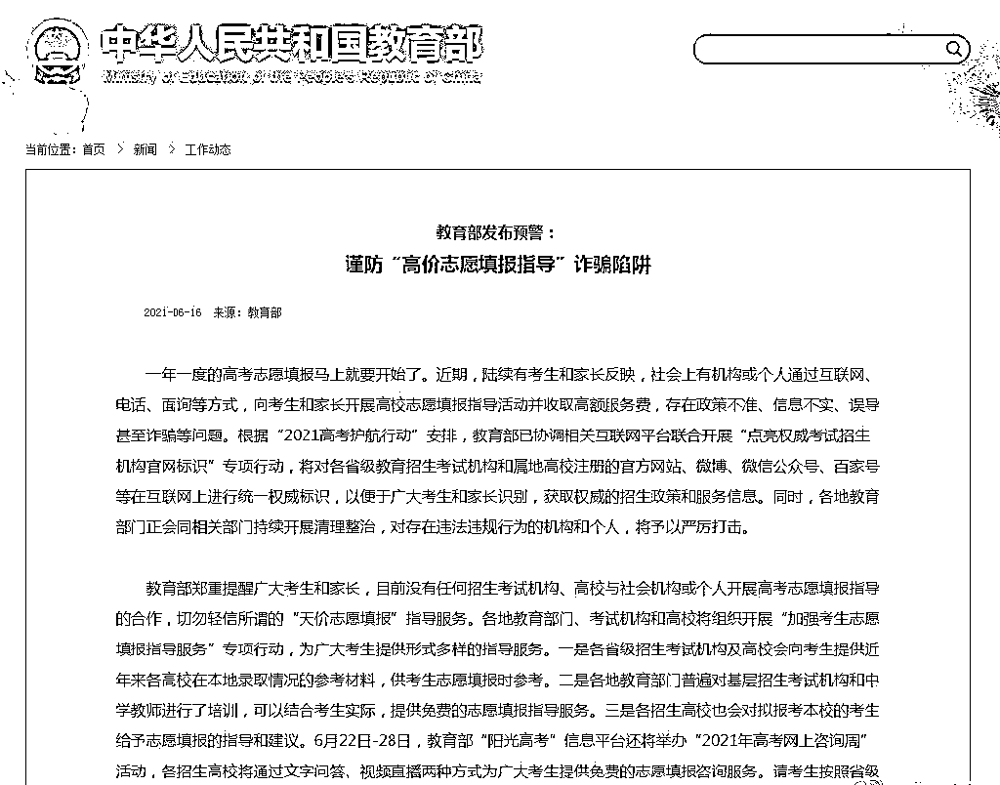

# 高考成绩提前查？

> 原文：[`mp.weixin.qq.com/s?__biz=MzIyMDYwMTk0Mw==&mid=2247516260&idx=4&sn=b02d7e5ec08e850071a8a1844c15d95d&chksm=97cb4b5ca0bcc24a20c20c7a440294b2052b65e9a9df7d5d4d42f1b17c519e3d13b2a76c36e4&scene=27#wechat_redirect`](http://mp.weixin.qq.com/s?__biz=MzIyMDYwMTk0Mw==&mid=2247516260&idx=4&sn=b02d7e5ec08e850071a8a1844c15d95d&chksm=97cb4b5ca0bcc24a20c20c7a440294b2052b65e9a9df7d5d4d42f1b17c519e3d13b2a76c36e4&scene=27#wechat_redirect)

花钱可改高考成绩？先人一步，可以提前查分？甚至交钱就能上知名高校？

收到以上这些消息，哪个高考生、家长不心动！然而，只想说：宝儿，清醒点啊！

每年高考前后，教育部、公安部等都会提醒考生及家长谨防被骗，但是每年依然会有一些考生及家长中招，这不仅会给家庭造成财产损失，甚至还可能让孩子没大学上。

高考是人生大事儿，提醒的话说千万遍也不嫌多。今天就给大家总结了**关于招生录取一些常见的骗局**，大家一定要提高警惕。

1

**查分阶段**
**可花钱更改高考成绩？骗局！**高考后，有骗子声称自己认识能通过“技术手段”进入高招办系统的“黑客”，可以帮助考生修改高考成绩，以此向家长索要高价“服务费”。**▍案例**2019 年 9 月，张先生的儿子张某是一名美术专业的高三学生，曾在黄埔区新龙镇某美术培训机构进行培训，并于 2019 年 3 月参加了广州某高校的美术专业高考招考，但成绩却没过线。正当全家人着急之际，该培训机构美术老师彭某通过微信联系上了张先生，表示能够通过“内部关系”修改其儿子的美术专业高考成绩，但需要支付“协调费”26 万元。张先生在查看彭某通过微信发来的成功案例以及修改分数的截图后，通过网上支付向彭某转账了 26 万元“协调费”。但直至高考全部科目结束，张先生却一直未见系统上的分数有任何改变，再联系彭某时，发现彭某已从培训机构辞职且手机关机失联。

提醒

自称可修改高考分数的网络帖子纯属骗局。所谓的黑客入侵修改分数在技术上也行不通。因为高考网上阅卷并非在互联网上，而是采用内网阅卷，根本不存在外部黑客入侵的可能。考生成绩发布前都做了原始数据存档和数据异地备份，通过网络公布后，考试院会对网上信息进行监控匹配，网站均设立严密的防黑客病毒攻击系统。**提前查分、查录取情况？骗局！**此类骗局中，骗子利用考生家长“熬”不住的焦躁情绪作案，价格不贵，因此上当的人不在少数。具体操作手法为，高考结束后，骗子会通过伪基站群发短信，称可查询高考成绩，并附有一个网址链接。不少考生家长收到此类信息后，便会迫不及待点开网址链接，然后手机便会被偷偷植入盗取网银的木马软件。还有的骗子会直接开价，要求考生家长支付 500 元至 1000 元的价格查询分数。****▍**案例**高考刚结束，考生小王就着急知道自己的成绩。小王联系了一名在朋友圈发查分广告的陌生人。在支付给对方 200 元的定金后，对方就主动给小王发微信称，已经查到分数，需要他先支付剩下的钱款 300 元。谁知转完钱对方就再无音讯了，给他发消息却显示“对方拒收”。小王这才知道自己是被骗了。

提醒

考生及家长查分时应认准教育部门指定的查询方式及查分网址，不要轻易点击手机短信里来历不明的链接或者轻信对方能通过“某种手段”提前查到分数。

**2**

****志愿填报阶段******近期，陆续有考生和家长反映，社会上有机构或个人通过互联网、电话、面询等方式，向考生和家长开展高校志愿填报指导活动并收取高额服务费，存在政策不准、信息不实、误导甚至诈骗等问题。********教育部 16 日在官网郑重提醒广大考生和家长，目前没有任何招生考试机构、高校与社会机构或个人开展高考志愿填报指导的合作，切勿轻信所谓的“天价志愿填报”指导服务。**

**3**

****录取阶段**** ****交钱就能上好学校？骗局！******此类骗局常常出现在高考志愿录取结束后，具体操作手法为，骗子对考生家长谎称可以通过花钱“打点”让考生获得“内部指标”“计划外指标”等入学名额，以此骗取考生家长钱财。********▍**案例******2019 年 6 月 17 日，九龙坡区华岩派出所接到一女子杨某报警，称自己得到中国矿业大学一招考老师黄某消息，虽然差六十分，但通过内部指标缴纳二十万元即可入学。杨某考虑到自己孩子的前途，便缴纳了三万元定金，后来听说中国矿业大学的录取通知书都已发放完毕了，她打电话给官方一查，才发现自己被骗。**

**提醒**

**正规的招生录取不会产生任何附加费用，凡是需要收取保证金、录取费、指标费的“招生指标”，一律不能相信。**********可领取“高考补助金”？骗局！******骗子利用一些考生家中经济困难，上大学需要通过助学金交齐学费的情况，冒充高校工作人员、教育部门工作人员，或者直接谎称手上有项目，可以为考生申请大学助学金；又或者说因为考生高考成绩优秀，学校要发放奖学金，然后以各种借口让家长提供个人信息、去 ATM 机操作或者直接要求家长先交保证金等。************▍**案例******2019 年高考结束后，考生小李的家长接到陌生号码发来的短信：“你好!我是××教育局，恭喜你的孩子获得高考奖学金 5000 元。麻烦你提供银行账户及身份证，直接转你银行账户。”好在，这位考生家长没有相信对方，而是选择向公安机关举报。**

**提醒**

**当接到自称高校、教育、财政等工作人员的电话、信息，要发放“国家助学金”“返还义务教育费”“助学扶助款”时，考生及家长一定要主动与当地教育部门或学校联系求证。**

**4**

****假期阶段************机票退改签****？骗局！**** **暑期是高考后的旅游出行高峰，考生家长一旦收到“飞机故障、行程延误或取消，需要拨打退票电话进行改签或退票”时，就要小心了，这很可能是诈骗分子设下的“圈套”，一旦按照短信中的联系方式退改签，就很可能被骗输入“验证码”，将自己卡内的钱转给骗子。************▍**案例******2018 年长沙一大学生小夏原计划 7 月 21 日乘飞机到海南三亚旅游，但 7 月 16 日，她收到一条短信，称航班取消，可改签或退票，于是她拨打了短信里“400”开头的“客服热线”。****电话接通后，“客服人员”称改签需要交 20 元手续费，还须提供身份证号、银行卡号，确认后补偿金会转入这张银行卡。几分钟后，“客服人员”来电称已经为其申请办理改签，但需要手机验证码，小夏马上提供了验证码。****之后小夏再未收到新的信息，“客服电话”也再无人接听，此时她查询银行卡，发现卡上的 7600 元现金已经不翼而飞。**

**提醒**

**接到航空公司短信或电话称航班已取消时，万万不要拨打短信上提供的电话，应登录航空公司官网或拨打官方客服电话查询。**********暑期兼职？骗局！******高考结束后，不少考生会选择在暑期进行兼职勤工俭学，但不少骗子就会抓住时机通过“交保证金”或“刷单兼职”来骗取钱财。************▍**案例******2019 年 6 月 6 日，学生小张和朋友想找一份暑假兼职工作。他们在一个校园生活兼职平台里发现有图书管理员的兼职岗位，便填写了应聘信息。第二天，一个自称是“王主管”的人打来电话，通知他们去面试。当天下午，小张和朋友来到面试地点，“王主管”接待了他们，经“面试”，与两人分别签订了兼职协议，“王主管”还让两人交了 600 元押金，并声称，近期就会通知他们上班时间，上班后如数退还押金。****一个月后，小张不仅没有接到上班通知，打电话也联系不上“王主管”，这时才知道自己被骗。**

**提醒**

**正规的招聘是不会以任何名义收取“保证金”“体检费”“服装费”的；而“刷单兼职”则十有八九都是骗局，诈骗分子一开始往往给一些报酬，待事主深信不疑后，诱骗其不断刷单，不再返还本金和报酬。**

* * *

**高考骗局虽然五花八门，但万变不离其宗，最终目的都是一个“钱”字，考生和家长一定要提高警惕，不要轻易将考生及家人的信息泄露给他人，注意识别招生骗子的诈骗伎俩，一旦遇到诈骗，保存好相关证据，及时报警。** 

**来源： 微信珊瑚安全**

****

**← 向右滑动与灰产圈互动交流 →**

****