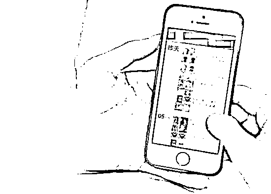

# 微商上家被骗 1700 万元，大量客户受牵连！

> 原文：[`mp.weixin.qq.com/s?__biz=MzIyMDYwMTk0Mw==&mid=2247516260&idx=5&sn=27b29a956f83e058f2dea98c6837381e&chksm=97cb4b5ca0bcc24a55fc0ed77c29171776d328b6477828e92121c2fc19309a3ab6a9526debda&scene=27#wechat_redirect`](http://mp.weixin.qq.com/s?__biz=MzIyMDYwMTk0Mw==&mid=2247516260&idx=5&sn=27b29a956f83e058f2dea98c6837381e&chksm=97cb4b5ca0bcc24a55fc0ed77c29171776d328b6477828e92121c2fc19309a3ab6a9526debda&scene=27#wechat_redirect)

一年前添加的微商

虽然没有见过面

但交易 N 次都合作愉快

彼此已是信任满满

可是，阜沙 W 女士最后踩雷

损失近 **27.5 万元 **

**平台购物与私下交易的区别**

**平台购物**是指在某宝、某东等网络购物平台下单购买后，资金转入网购平台而非商家自身。如商家不能正常发货，客户可申请退款；如货物质量存在差异，客户可申请退货退款。过程中如与商家协商未果，客户还可以申请平台客服介入，总之，有成熟的制度保护和约束。

**私下交易**是指客户和商家直接借助社交软件交易。2019 年 1 月 1 日，《中华人民共和国电子商务法》正式实施，微商纳入电商经营者范畴。但私下交易存在两种潜在的风险：**1.商家收款不发货，或者货不对版；2.客户购买并收到货物后不付款。这种缺乏平台约束的购物方式使消费者维权难上加难。**

为什么鹏哥提倡尽量走网购平台？

因为“信任”缺乏平台约束

安全性没有保障

虽守法微商的确存在

但是风险不可控

**比如卖家遭遇诈骗的狗血剧情**

**认识一年多，多次购买**

**Fraud OF 2021**

*   2020 年 3 月 7 日，通过朋友推荐，W 女士微信添加了某宝商家，年内多次购买商品，且货物验收后均为正品，随后开启长期购买的良好“合作”。

**主动促销优惠**

**Fraud OF 2021**

*   2021 年 5 月 31 日，对方主动询问是否需要购买手表（劳力士绿水鬼和白熊猫），并且报了相对较低的价格。W 女士心动了，随即向对方转账 13 笔，共计**27.4978 万元**，并约定第二天发货。

**收款后拖延不发货**

**Fraud OF 2021**

*   就这样，原本信任满满的“合作商”竟然用各种各样的理由拖延发货，更可怕的是有其他买家联系 W 女士表示彼此处境一样。W 女士这下慌了，于是报警。

**剧情狗血**

**可信微商的上家被“杀猪”**

**大量微商客户受牵连**

**Fraud OF 2021**

*   阜沙公安分局接警后迅速开展研判。原来，W 女士所联系的卖家确实长期做微商生意，此前未出现过违约行为。此次未能按约定发货竟然是因为他的上家被“杀猪盘”诈骗**1700 万元**，其中，1400 万元均是客户的订金，W 女士所购买微商店主也被骗 20 多万元，还有大量微商客户受到牵连！

**鹏哥提醒**

常在河边走 哪能不湿鞋

**信任不能当饭吃**

网络购物

**平台保护才是硬道理！**

来源：中山市反诈骗中心

← 向右滑动与灰产圈互动交流 →

