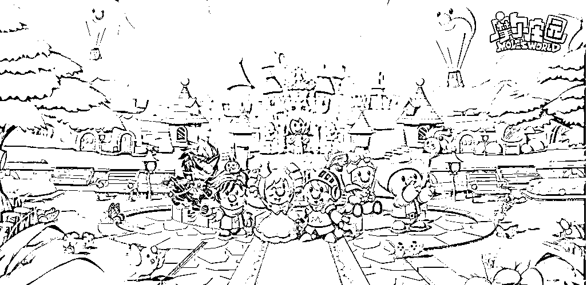
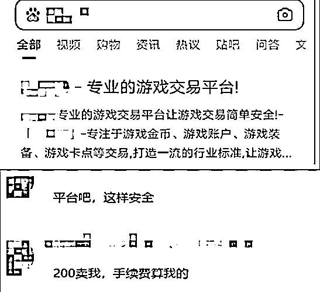
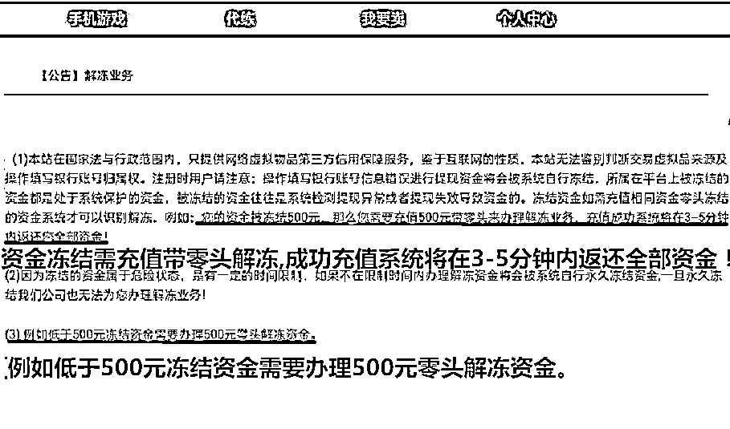
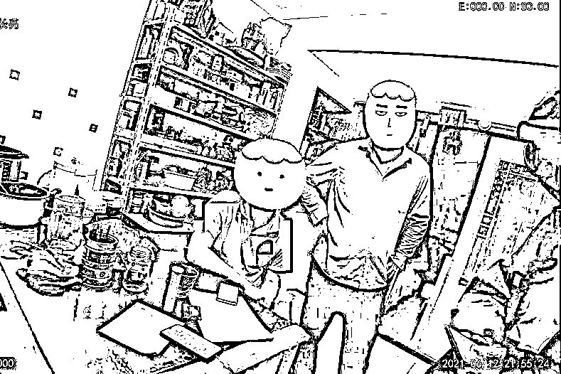

# 警惕！诈骗分子开始出没热门手游摩尔庄园了

> 原文：[`mp.weixin.qq.com/s?__biz=MzIyMDYwMTk0Mw==&mid=2247516332&idx=1&sn=b7bc03a46296bc854a45de7dd399584c&chksm=97cb4b94a0bcc282172e5fc88a7af6026efb07832f86c066bb5f27f4077c2a2a8e568355b1df&scene=27#wechat_redirect`](http://mp.weixin.qq.com/s?__biz=MzIyMDYwMTk0Mw==&mid=2247516332&idx=1&sn=b7bc03a46296bc854a45de7dd399584c&chksm=97cb4b94a0bcc282172e5fc88a7af6026efb07832f86c066bb5f27f4077c2a2a8e568355b1df&scene=27#wechat_redirect)

## **随着摩尔庄园热度的高涨**

**“诈骗分子”也开始蠢蠢欲动**

**最近警方就处置了两起相关诈骗案件**

小张（化名）和所有男孩一样喜欢玩游戏，**摩尔庄园是新出的热门手游，自然不容错过。**

6 月 12 日傍晚，有人在游戏里加小张 QQ 称想买账号，小张想着卖个账号赚点生活费便同意了。

**两人商定以 220 元的价格交易该账号，对方发来了一个百度的搜索截图，说是走平台交易，对大家都有保障。**

**买家要求通过平台交易**

小张按对方的提示进行操作，**输入游戏账号、个人身份信息、银行卡号等信息进行注册，上架出售账号，并将链接发给对方**。对方在购买后发来转账截图，然而在小张点击“提现”后，他收到了该 220 元已被冻结的提示。

平台客服告知，**这是因为小张提现的时候没有加 0.1 元所致，如需再次提现，得先充值 500 元加零头来解冻，并表示成功充值 3-5 分钟后会返还全部资金。**

因为没钱，小张偷偷拿了妈妈的手机进行操作，谁知，又忘了加零头导致 500 元也被冻结，他只能在客服引导下再次充值 1500 元后进行提现操作。

但提现成功后，小张的钱一直未到账，**从客服说的 5-10 分钟等到了近两小时还是没动静，最后才发现客服也点不进去了，买家也没回应**。这时，小张才惊觉可能被骗，支支吾吾地向父母说了实情，父亲赶紧向杭州市公安局拱墅区分局半山派出所报警。

小张告诉民警自己平时有收到防诈骗短信，但一不留神还是被骗了。**“吃一堑，长一智。生活费交了‘学费’了，以后肯定会提高警惕的！”**在受到反诈宣传教育后，小张肯定地向民警保证。

目前，案件正在进一步办理中。

6 月 3 日下午，一小摩尔在庄园内闲逛时，**看见游戏聊天频道内有人发可以充值“金豆”的消息并附带上一网址链接。**小摩尔想要装扮庄园、打扮自己，做庄园内最靓的仔，**点进链接准备充值，网址内跳出一客服对话框，客服指引小摩尔前往“购物商城”进行游戏“金豆”充值。**

**小摩尔在“购物商城”充值完第一笔 100 元后，回到庄园发现“金豆”并没有到账，询问客服，客服称购买 100 元的游戏道具，需再充值 1000 元开通用户账号才能完成“金豆”充值。**

于是，小摩尔又在“购物商城”充值了 1000 元。充值完成后，**客服却告知小摩尔，充值需要客服操作不能自己完成，并提供了一个二维码，让小摩尔再次充值**，小摩尔照做了。

小摩尔本以为充值完成，终于可以安心装修庄园，但游戏内“金豆”不但没有增加，连“购物商城”的账户也被冻结，于是再次找到客服确认，**客服却以信息填写错误为由，要求小摩尔再次充值 3900 元解冻账户，才能提取之前充值的钱。**这下小摩尔才反应过来，对面哪是什么充值客服，分明就是骗子！

**警方提醒：**

****

**游戏装备或游戏账号交易时，一定要提高安全防范意识。不要轻易点击陌生人发来的网址链接，不要随意透露个人隐私信息，不要使用陌生人提供的交易网站和支付链接，更不可相信以银行卡输入错误、资金被冻结为由要求缴纳保证金、手续费、解冻费的诈骗手段。** 

**来源：中国警察网、拱墅公安、昆明市反电信诈骗中心**

****

**← 向右滑动与灰产圈互动交流 →**

****