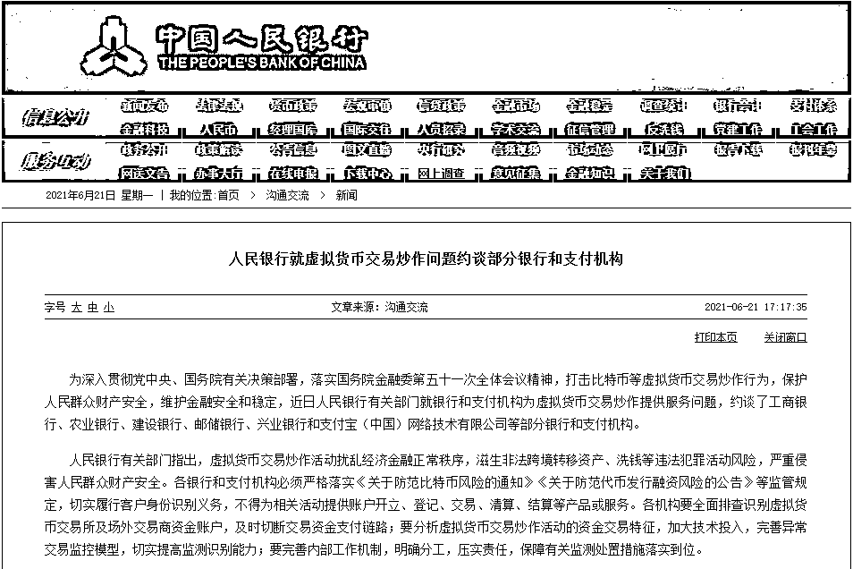

# 央行约谈！打击虚拟货币炒作

> 原文：[`mp.weixin.qq.com/s?__biz=MzIyMDYwMTk0Mw==&mid=2247516332&idx=2&sn=f880acd3d8841c6b45a446d51ae1911d&chksm=97cb4b94a0bcc282543b877b4ef181bb1f2446e13fb9fa667126de93fd07cd106c72453c2ad6&scene=27#wechat_redirect`](http://mp.weixin.qq.com/s?__biz=MzIyMDYwMTk0Mw==&mid=2247516332&idx=2&sn=f880acd3d8841c6b45a446d51ae1911d&chksm=97cb4b94a0bcc282543b877b4ef181bb1f2446e13fb9fa667126de93fd07cd106c72453c2ad6&scene=27#wechat_redirect)

## 

**被央行约谈后，工行、农行、建行、邮储、兴业银行和支付宝纷纷表态：一经发现虚拟货币交易相关行为，将立即采取暂停账户交易、终止客户关系等措施。**

人民银行官网 6 月 21 日发消息，近日人民银行有关部门就银行和支付机构为虚拟货币交易炒作提供服务问题，约谈了工商银行、农业银行、建设银行、邮储银行、兴业银行和支付宝（中国）网络技术有限公司等部分银行和支付机构。 

人民银行有关部门指出，各银行和支付机构必须切实履行客户身份识别义务，**不得为相关活动提供账户开立、登记、交易、清算、结算等产品或服务。**

被约谈的工行、农行、建行、邮储、兴业银行和支付宝纷纷发布声明：禁止使用机构服务开展虚拟货币交易。

**央行就虚拟币炒作约谈部分金融机构**

为深入贯彻党中央、国务院有关决策部署，落实国务院金融委第五十一次全体会议精神，打击比特币等虚拟货币交易炒作行为，保护人民群众财产安全，维护金融安全和稳定，近日人民银行有关部门就银行和支付机构为虚拟货币交易炒作提供服务问题，约谈了部分银行和支付机构。

人民银行有关部门指出，虚拟货币交易炒作活动扰乱经济金融正常秩序，滋生非法跨境转移资产、洗钱等违法犯罪活动风险，严重侵害人民群众财产安全。各银行和支付机构必须严格落实《关于防范比特币风险的通知》《关于防范代币发行融资风险的公告》等监管规定，切实履行客户身份识别义务，不得为相关活动提供账户开立、登记、交易、清算、结算等产品或服务。

**人民银行有关部门指出，**

*   各机构要全面排查识别虚拟货币交易所及场外交易商资金账户，及时切断交易资金支付链路；

*   要分析虚拟货币交易炒作活动的资金交易特征，加大技术投入，完善异常交易监控模型，切实提高监测识别能力；

*   要完善内部工作机制，明确分工，压实责任，保障有关监测处置措施落实到位。

参会机构表示，将高度重视此项工作，按照人民银行有关要求，不开展、不参与虚拟货币相关的业务活动，进一步加大排查和处置力度，采取严格措施，坚决切断虚拟货币交易炒作活动的资金支付链路。

**被约谈机构纷纷表态：发现就禁！**

被约谈后，工商银行、农业银行、建设银行、邮储银行、兴业银行和支付宝于 6 月 21 日纷纷表态：**一经发现相关行为，将立即采取暂停账户交易、终止客户关系等措施。**

**农业银行表示**，坚决不开展、不参与任何与虚拟货币相关的业务活动，禁止涉及虚拟货币交易客户准入，并将对客户及资金交易加大排查和监测力度。一经发现相关行为，将立即采取暂停账户交易、终止客户关系等措施，并及时报告有关部门。

**支付宝在公告中表示，**将从四个方面进一步加大对相关交易的打击力度：

*   继续严密监控排查涉及虚拟货币的交易行为，对重点网站和账户建立巡查制度，一经发现立即封堵；

*   加强支付交易环节风险监测，严禁虚拟货币转账交易，部署风险算法模型，加强异常交易监测，对嫌疑付款方风险提醒、收款方进行限权；

*   加强商户管理，严禁虚拟货币商户准入，并持续对签约商户进行风险监测，一旦发现商户从事虚拟货币交易，将其纳入黑名单，禁止后续合作；

*   加强虚拟货币风险提示，通过风险弹窗、消息推送等方式强化用户宣传和警示教育。

**建设银行称，**将严格落实国家有关监管要求，恪守行业自律承诺，坚决不开展、不参与任何与虚拟货币相关的业务活动，坚决不为虚拟货币提供账户开立、登记、交易、清算、结算等任何金融产品和服务。

**邮政银行声明：**任何机构和个人不得利用我行账户、产品、服务、渠道进行代币发行融资和“虚拟货币”交易。我行将持续加强支付交易环节风险监测，一经发现上述有关行为，我行有权采取暂停账户交易、注销账户等控制措施，并将相关信息报告监管部门。

**工商银行重申：**任何机构和个人不得利用我行账户、产品、服务、渠道进行代币发行融资和“虚拟货币”交易。我行将持续加强监测，一经发现，有权采取暂停相关账户交易、注销账户等控制措施，并将相关信息报告有关部门。

**兴业银行也在声明中表示，**禁止直接或间接为客户提供与虚拟货币相关的服务，将进一步加强业务管理，持续做好客户身份识别与客户风险分类工作，运用大数据等创新技术手段，加强对虚拟货币的交易资金监测，强化对虚拟货币相关交易的打击力度。一旦发现相关交易的违法违规线索，将及时按照相关程序采取限制、暂停或终止相关账户的交易、服务等措施，并向有关部门报告。

来源：中国人民银行，央视新闻

← 向右滑动与灰产圈互动交流 →

