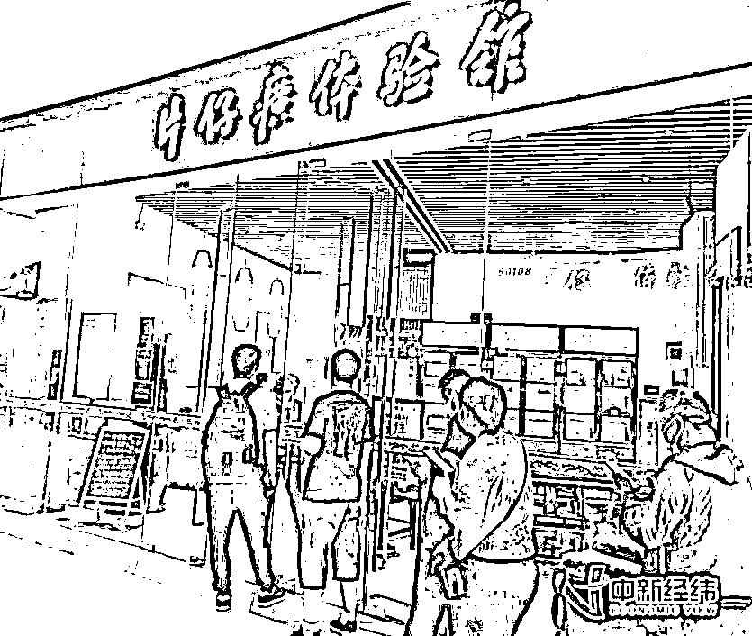
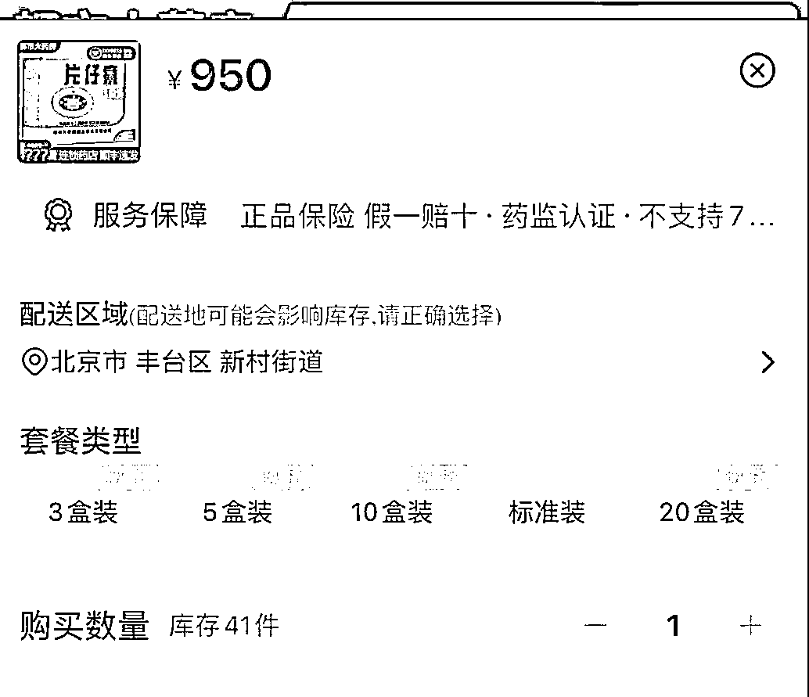
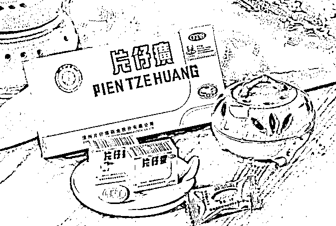

# 590 元一粒的片仔癀，10 分钟就卖光！谁在炒作“药中茅台”？

> 原文：[`mp.weixin.qq.com/s?__biz=MzIyMDYwMTk0Mw==&mid=2247516332&idx=3&sn=d65bc547f21269f4b401161e12809939&chksm=97cb4b94a0bcc282b1da34fa2ff90cbc2fbb7e35b5157776bf81561961fdf533efdc494d46b9&scene=27#wechat_redirect`](http://mp.weixin.qq.com/s?__biz=MzIyMDYwMTk0Mw==&mid=2247516332&idx=3&sn=d65bc547f21269f4b401161e12809939&chksm=97cb4b94a0bcc282b1da34fa2ff90cbc2fbb7e35b5157776bf81561961fdf533efdc494d46b9&scene=27#wechat_redirect)

片仔癀被称为“药中茅台”

近日，有消费者反映

买片仔癀和买茅台一样

在线下买需要提前排队

且每人限购 2 粒

即便线上购买

也需要拼手速看运气

线下门店：每人“限购”2 粒

10 分钟售罄

早上 8 点 45 分，在片仔癀体验馆北京银河 SOHO 门店，距离营业时间还有一刻钟，门口已有数人排队。

此时，店员要求在店外排队的顾客扫码填写身份证、居住地址、手机号码等信息，并表示一次只能一人进店购买。看着队伍越排越长，店员就开始出来“劝退”：**“今儿都是发两粒，只卖到第 10 位左右。”**

记者在现场看到，**开门 10 分钟后，片仔癀便已售罄**，后面的顾客只得空手而返。

据了解，目前片仔癀门店价格为 590 元 1 粒。虽然上述门店不需要预约购买，但**当天购买 2 粒的顾客，5 天后才有机会再次购买，购买 1 粒的人，只能 3 天后再购买**。

有顾客咨询哪里能买到 10 粒礼盒装送人？店员回应，“现在都没货，怎么能买到就看本事了”。还有顾客称，朋友托内部渠道，也只能在两周内拿到 1 粒。

除了门店被“限购”，在电商平台上，590 元一颗的片仔癀也一药难求。不少卖家出售的片仔癀，单粒价格在 900 元~1600 元不等，最高的价格比门店贵出 2 倍有余。此外在微博等社交平台上，有网友反映，当地的片仔癀一粒被炒到 900 元~3000 元不等。

片仔癀天猫旗舰店“片仔癀大药房旗舰店”，此前亦销售片仔癀，但目前该商品网页显示“已经下架”。部分网店的 3 盒装、5 盒装、10 盒装、20 盒装均显示缺货，只能购买标准装，即 1 粒装。网店客服称，最近片仔癀厂家限制出货，他们也没货。

到底谁在炒作片仔癀？

片仔癀体验馆北京银河 SOHO 门店的店员**否认存在限购政策**，并表示门店的货每天都会有，只是由于买的人多，货到的少，所以早早就售罄了。

同样的问题，记者致电片仔癀体验馆福建省福州市茶亭店，对于当前市场中存在的“一药难求”现象，店员表示，“并非我们限购，而是市场上出现炒作现象，导致溢价很高，加上货源相对紧张，所以才会有高价都买不到药的情况。为保障消费者有药可用，才出此下策，在门店设置凭借处方和身份证买一粒的规则，也就变成了大家口中的‘限购’。”

“一粒药应该不够消费者使用吧？”对于这个问题，该店员称，“吃完可以再来买，对于真正的消费者，我们可以保障有药，就怕投机炒作的人把药买走，让用药的人无药可用。”至于被问到近期是否会涨价，该店员回复“不会涨价”。

片仔癀的成分为牛黄、麝香、三七与蛇胆，按照成年人一次 0.6g 的用量，可以服用 5 次，一日服用 2~3 次。据此计算，每次服用的成本在 100 元左右。

尽管片仔癀一直被视作“药中茅台”，可是等量比较其单价，就连连茅台也望尘莫及。

*   **原价 1499 元的 53°飞天茅台 500ML，平均一毫升约 3 元；**

*   **片仔癀一粒 3g，卖 590 元，平均一克约 197 元。**

据了解，片仔癀功能主治清热解毒，凉血化瘀，消肿止痛，用于热毒血瘀所致急慢性病毒性肝炎，痈疽疔疮，无名肿毒，跌打损伤及各种炎症。

有业内人士表示，目前，片仔癀所用的牛黄、麝香等原料供应比较充足，其他的医药企业不一定能保持充足的供应，但片仔癀原料问题不大。

上述市场人士也认为存在炒作，“独家产品容易形成垄断。片仔癀并不是任意哪家企业都可以生产的，存量有限，很容易引发恶意炒作。”

中央财经大学副教授刘春生表示，片仔癀的价格之所以不断上涨，**一方面是因为某些原料成本确实比较贵，另一方面是因为片仔癀有国家级的绝密配方，这在中医药行业是很重要的****。**

**刘春生表示，随着医疗保健行业的消费升级，590 元一粒的片仔癀，其实就充当了医药“奢侈品”的角色，契合了当下消费升级、重视健康的观念。**

**片仔癀股价 18 个月内翻两番**

**片仔癀的“一药难求”，打开了资本市场的想象空间。**

**2020 年初，片仔癀股价为 100 元出头；到 2021 年 6 月 11 日，其股价突破历史最高位达到 419.96 元/股，短短 18 个月，股价翻了两番，市值也从六百多亿一路飙升，和云南白药成为中国仅有的两家千亿级中医药上市公司。**

**截至 6 月 21 日收盘，片仔癀股价报 404.23 元/股，企业市值达 2439 亿元，远超云南白药 1368 亿元的市值，稳坐“中药一哥”位置。**

**值得一提的是，2020 年片仔癀的业绩虽有所上涨，但增速还是有了明显的减缓。**

**资料显示，片仔癀于 1999 年 12 月由原漳州制药厂改制创立，是中华老字号企业，主要业务包括中成药制造、医药流通，2003 年在上海主板上市。其中，核心产品为片仔癀系列，包括片仔癀、片仔癀胶囊、复方片仔癀含片等片仔癀系列产品。**

**来源：看看新闻 Knews、中新经纬、中国新闻社**

****

**← 向右滑动与灰产圈互动交流 →**

****