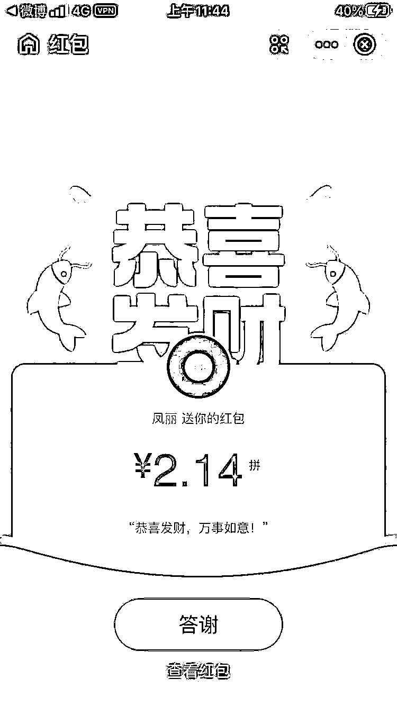
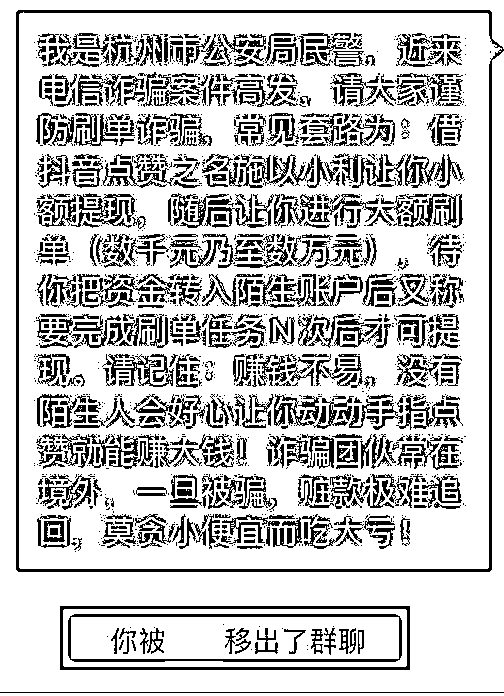

# 民警潜入“刷单”群的初体验

> 原文：[`mp.weixin.qq.com/s?__biz=MzIyMDYwMTk0Mw==&mid=2247516332&idx=4&sn=fb5e2f187bdc94b96fc9a2b0f9a1c24d&chksm=97cb4b94a0bcc2821e250b28a2befd3cc36f2d50bbb79599e3fa2b8f413cd00df5ef3522c031&scene=27#wechat_redirect`](http://mp.weixin.qq.com/s?__biz=MzIyMDYwMTk0Mw==&mid=2247516332&idx=4&sn=fb5e2f187bdc94b96fc9a2b0f9a1c24d&chksm=97cb4b94a0bcc2821e250b28a2befd3cc36f2d50bbb79599e3fa2b8f413cd00df5ef3522c031&scene=27#wechat_redirect)

**一条“特别”的短信**

近日，青山派出所反诈民警冯孙亮突然收到一条**“特别”**的短信：

**冯孙亮仔细阅读发现这不是一条格式极为工整的网络“刷单”诈骗短信吗？**短短几个字就表述清楚了工作内容、工作收入、如何加入我们！

**进群初体验**

他想了想，我们天天在做反诈宣传工作，这不正好给我们一个深入了解的机会，俗话说：“知己知彼，百战百胜”，于是，**冯孙亮加了短信上的微信号，接着进入了“抖音福利群 12”**。

**   进群后  **

**他先潜水观望，“客服”先在群里发了几个小红包，然后开始发布工作任务和操作流程。**

************

**任务一的内容是**关注点赞“抖音”号，可获得 3.8 元**；接下的任务，是**下载一个名为“福鼎”的 APP，注册完成并添加接待员，可获得佣金 15.6 元**，在“福利群”里晒完收益，第一天的任务就结束了，“福利群”即将解散，第二天的任务发布转战“福鼎”群。** 

************

****潜入“福鼎”群****

**为了深入了解刷单诈骗的过程，**冯孙亮根据“客服”的要求进行操作，成功潜入了“福鼎”群**，“客服”强调群里只能发佣金截图，不允许随意发言。**

********

**随后，“客服”在群里发布了两个刷单任务，**分别是连单奖励和抖音竞猜，内容不同、套路相同，投入越多获得收益越高**。群里的群友们纷纷将获得佣金的截图发了上来。** 

****************

****被踢出群****

**于是，**冯孙亮将近期关于刷单诈骗的宣传信息转到群里****，并表明自己的身份提醒群里的好友谨防电信网络诈骗**。反应灵敏的骗子立刻察觉到异常并以迅雷不及掩耳盗铃之势将冯孙亮踢出群聊。**

********************

****警方提醒****

**✫不法分子**通过短信、网站、招聘平台、QQ、微信渠道推广兼职广告**，以开网店需快速刷新交易量、信誉度为由，招募人员进行网络兼职刷单，承诺在交易后返还购物费用并额外提成，后通过话术诱骗受害人刷单。**

****

**✫**刷第一单时不法分子会小额返款**让受害人尝到甜头，小单引诱才是刚刚开始，后面的小任务变成循环任务，一步一步引诱受害人上钩。** 

****

**✫**之后客户会在每个小任务中再添加多个小任务，让受害人有永远做不完的任务**。在刷单过程中，客户也会以**“任务卡顿”“任务未完成”“系统故障”**等理由继续让受害人刷单，以此来激活之前的单子，否则不能返佣金。** 

****

**✫在刷单期间，不法分子会**以各种理由拒不返款**，并将其拉黑。** 

****

**来源：临安公安、杭州防诈骗、杭反诈骗先锋**

****

**← 向右滑动与灰产圈互动交流 →**

****