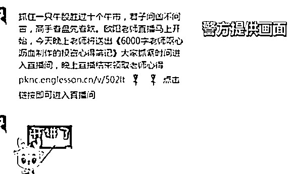
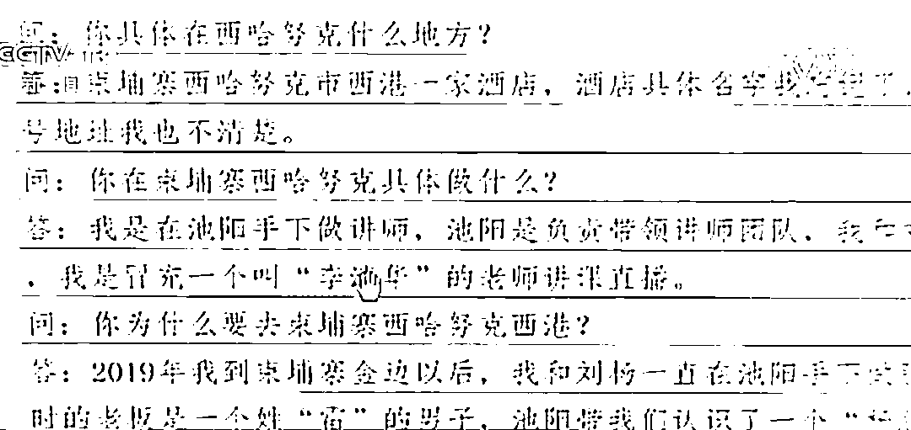

# 团伙长期盘踞柬埔寨实行投资理财诈骗，涉案 1.6 亿

> 原文：[`mp.weixin.qq.com/s?__biz=MzIyMDYwMTk0Mw==&mid=2247516332&idx=6&sn=133d79a73c60d5f6407889305dd27c0a&chksm=97cb4b94a0bcc282cfd8d2a4230d8b843c5a75c383e19f63938a9885e9af8e5601036eb35a59&scene=27#wechat_redirect`](http://mp.weixin.qq.com/s?__biz=MzIyMDYwMTk0Mw==&mid=2247516332&idx=6&sn=133d79a73c60d5f6407889305dd27c0a&chksm=97cb4b94a0bcc282cfd8d2a4230d8b843c5a75c383e19f63938a9885e9af8e5601036eb35a59&scene=27#wechat_redirect)

日前，浙江警方对外公布了今年上半年以来，浙江省电信网络诈骗数据，被骗的受害者中年龄最大的 90 岁，最小的只有 8 岁。

诈骗手段中，“杀猪盘”案件依然高发。

来看一起涉案金额高达 1.6 亿元的“杀猪盘”诈骗案。

[`v.qq.com/iframe/preview.html?width=500&height=375&auto=0&vid=c3254a6lw3r`](https://v.qq.com/iframe/preview.html?width=500&height=375&auto=0&vid=c3254a6lw3r)

在义乌做小商品批发生意的陈女士，一直热衷炒股投资，平时会在手机上浏览各种股票投资和市场动态的讯息。

去年八月的一天，有位陌生男子主动联系到了她。

毫无防备的陈女士被拉进了一个热闹的投资微信群，几十人的聊天群里，其中一位叫“李清华”的讲师备受大家推崇。

按照这位讲师推荐的股票，陈女士试着买入了几支，果然每次都能获得预期的回报。

一来二去，陈女士就把放在股市里的几十万全部转投到了讲师“李清华”推荐的股票投资平台。

**受害人 陈女士：**他截图给我看， 他说你看我投 160 万，一个晚上我就挣了 60 万。后来我想想这个钱这么好挣 ，我就一直投钱。 

到了这个时候，一直往里投钱的陈女士已经被骗子们彻底套牢。

**受害人 陈女士：**四十几万一下就全都被掏空了。

被骗 40 多万，直到陈女士向警方报案时才知道，她所遭遇的这个“杀猪盘”骗局，背后的操盘手是一个运行成熟、规模庞大、藏在境外的特大跨国诈骗集团，受害人几乎遍布全国。

2020 年 12 月，金华警方对一条重要线索展开追踪研判，**发现了一个长期盘踞在柬埔寨，利用虚假投资 App 实施诈骗的窝点**。

**从 2019 年 8 月开始，这个诈骗团伙先后设立 7 个诈骗窝点，运行着 6 个不同名称的虚假投资平台，通过拨打电话以推荐股票投资的名义吸引事主加入微信群**。

**浙江金华市公安局刑侦支队民警 郑晨斌：**首先可能是手续费相对来说比较便宜，另外他这里有讲师的支撑，告诉你在我这个盘里面投资的话，我这里有讲师可以告诉你具体买哪个股票。

在这些虚假股票投资的平台上，“讲师”的地位非同小可，因为他们的“业务水平”直接决定着平台对那些潜在受害者的吸引力。

犯罪嫌疑人邓某就是当初让受害人陈女士无比佩服的讲师“李清华”， 他在平台上对外公开的身份是股票讲师，每天的工作就是给被拉进群里的投资者讲课，聊大盘、聊走势，预测股票涨停。

**讲师“李清华”半年获利八十万左右**

短时间内，看到讲师推荐的股票能涨，股民的信任度也水涨 船高，就在受害者以为自己找到了收益更大的投资平台时，骗子们也终于等来了磨刀霍霍，准备不断收割的“窗口期”。

牢牢抓住了投资人想赚大钱的心理，骗子们却不急于见了钱就跑路，而是确定将受害人吃干榨尽才肯罢手。

**受害人 陈女士：**入金款就一直没到账，开始我问那个助理为什么这个钱提不到了呢？他说你手上股票可能要全部空仓才提得出来 ，他说你再弄 5 万块钱才可以激活。我又弄了 5 万块钱，后来想想不对了，我也不知道怎么过那段时间 ，反正天天都没睡觉，饭也吃不好。

据警方查证，这个团伙的讲师团成员，在组织内部层级不低，非法所得是普通业务员的数倍甚至数十倍。

来源：央视新闻

← 向右滑动与灰产圈互动交流 →

