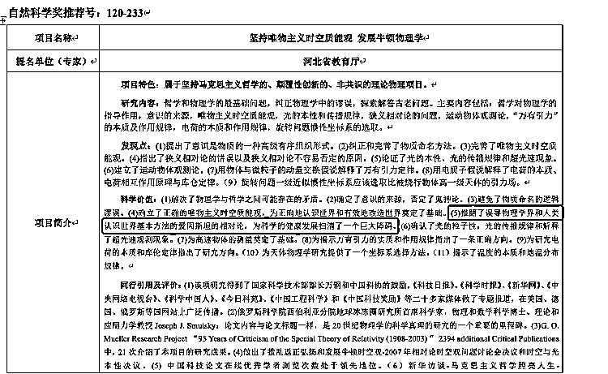
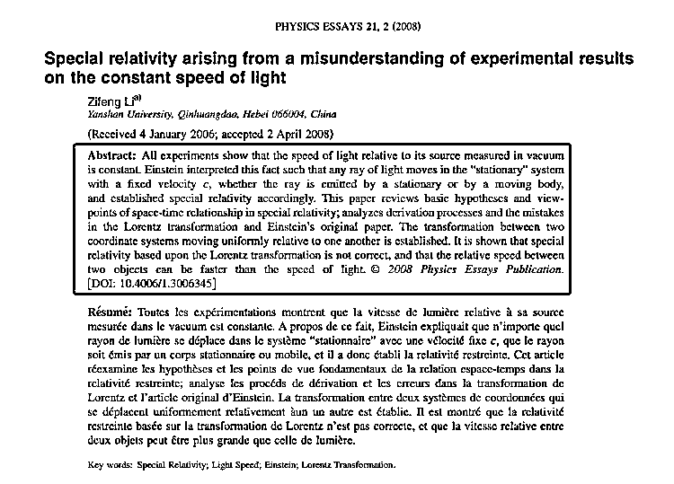
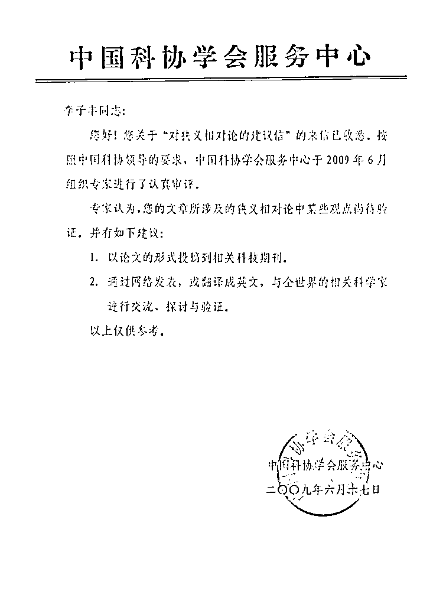

# 大学教授声称已推翻相对论？

> 原文：[`mp.weixin.qq.com/s?__biz=MzIyMDYwMTk0Mw==&mid=2247516332&idx=7&sn=ea9a2ba2a7f774aedf0309a723cce25e&chksm=97cb4b94a0bcc2820936507553173b1ad45287d0315359b30cffd91550e660d081652bd4ea03&scene=27#wechat_redirect`](http://mp.weixin.qq.com/s?__biz=MzIyMDYwMTk0Mw==&mid=2247516332&idx=7&sn=ea9a2ba2a7f774aedf0309a723cce25e&chksm=97cb4b94a0bcc2820936507553173b1ad45287d0315359b30cffd91550e660d081652bd4ea03&scene=27#wechat_redirect)

近日，河北燕山大学教授李子丰研究项目宣称已推翻爱因斯坦相对论，该项目日前被推荐入选 2021 年度河北省科学技术奖，项目公示后受到公众普遍关注和讨论。

记者注意，燕山大学教授李子丰研究项目名称为 “坚持唯物主义时空质能观发展牛顿物理学”，该项目的自然科学奖推荐号为 120-233，推荐单位为河北省教育厅。据悉，该项目中宣称已推翻误导物理学界和人类认识世界基本方法的爱因斯坦的相对论，为科学的健康发展扫清了一个巨大障碍。

李子丰此后在知乎平台回应，该项目还未立项，报奖的主要目的是宣传真理，获奖是小概率事件。河北省教育厅相关人员表示，对此事并不了解，还需要请示领导再做回应。

**燕大教授研究项目否定爱因斯坦相对论******

**记者从官方平台查找了解，李子丰的项目研究内容是，哲学和物理学的最基础问题，纠正物理学中的谬误，探索解答古老问题。项目特色，属于坚持马克思主义哲学的、颠覆性创新的、非共识的理论物理项目。** 

****

**该项目自称，提出了意识是物质的一种高级有序组织形式；纠正和完善了物质命名方法；完善了唯物主义时空质能观；指出了狭义相对论的错误以及狭义相对论不容易否定的原因；论证了光的本性、光的传播规律和超光速现象；建立了运动物体观测论；用物体与微粒子的动量交换假说解释了万有引力定律；用电质子假说解释了电荷的本质、电荷相互作用原理与库仑定律等。**

**该项目简介还介绍，其科学价值是解决了物理学与哲学之间可能存在的矛盾。确定了意识的来源，否定了鬼神论。避免了物质命名的逻辑谬误。确立了正确的唯物主义时空质能观，为正确地认识世界和有效改造世界奠定了基础。**

**该项目明确称，已推翻误导物理学界和人类认识世界基本方法的爱因斯坦的相对论，为科学的健康发展扫清了一个巨大障碍。**

**同时，确认了光的粒子性，光的传播规律和解释了超光速观测现象。为高速物体的测量奠定了基础。为揭示万有引力的实质和作用规律指出了一条正确方向。为研究电荷的本质和库仑定律指出了研究方向。为天体物理学研究提供了一个坐标系选择方法。揭示了温度的本质和地温分布规律等。**

**李子丰的研究项目被官方公示后，受到广泛关注，网友对其论述的研究内容多为质疑。有网友认为，哲学可以批判，但哲学的批判没有能力代替科学本身对自己的批判，还要以实验为基础。**

**李子丰回应：还未立项 目的是宣传真理**

****

**李子丰在知乎平台对此事做了回应，其称该项目还未立项，报奖的主要目的是宣传真理，获奖是小概率事件。**

**记者注意，李子丰除了曾提出“狭义相对论是建立在错误的假设和错误的数学推导基础上是一种荒谬的理论体系”等观点外，其还认为，广义相对论也是错误的，但由于没有发文论述，所以未在材料中写明。**

**记者在燕山大学官方网站查找了解到，李子丰 1962 年出生，为燕山大学博士生导师、硕士生导师，所属学院为车辆与能源学院，目前职称为自然科学方向研究员，研究方向为油气钻采工程和油气井杆管柱力学。**

**针对此事，记者电话联系了燕山大学教授李子丰。李子丰认为，“国家号召颠覆性创新，所谓颠覆性创新就是颠覆台上的理论，才叫颠覆性创新，否则不叫颠覆性创新，**我的理论研究认为现在的理论（爱因斯坦相对论）是错误的。**”**

**针对其是否有严谨、科学的最新研究结果证明爱因斯坦相对论是错误的？李子丰表示，“当然有。”其称现有的研究是以唯物主义作为研究基础，论点就是实事求是。**

****

**李子丰提供了 2008 年发布在物理论文（PHYSICS ESSAYS）期刊上的一篇论文，论文摘要中提到，本文回顾了狭义相对论中时空关系的基本假设和观点；分析了洛伦兹变换和爱因斯坦原著的推导过程和错误。建立了相对运动均匀的两个坐标系之间的变换。结果表明，基于洛伦兹变换的狭义相对论是不正确的，两物体之间的相对速度可能比光速快。**

**网友质疑李子丰研究方向一直为石油专业，其研究物理学是“体育老师证明数学题”，李子丰回应，“大学都学过物理，这是基础科学，另外国家也很支持跨学科研究，提出搞科学不问出身，不能说搞石油的就不能搞物理方向的研究。”**

****河北省教育厅回应：不清楚报送流程 需请示领导 ****

********

****针对此事，记者拨打了河北省教育厅的电话，工作人员表示目前对此事并不清楚，针对评奖标准、报送流程，仍需要请示领导再做回应，随后挂断电话。**** 

****河北省教育考试厅官网介绍，2021 年，河北省教育厅共受理全省高等学校申报省自然科学奖 31 项，技术发明奖 6 项，科技进步奖 59 项。经审核，现拟推荐上报。为保证推荐申报工作公开、公平，现将项目名称、主要完成单位及完成人员的基本情况等予以公示，请社会各界人士给予监督。****

****据悉，公示期为 2021 年 6 月 10 日至 6 月 16 日。在公示期内，任何单位和个人如对公示项目有异议，需要以书面形式将提出异议理由和事实依据等相关材料寄（送）到河北省教育厅科技处。以单位名义提出异议的，应当加盖本单位公章；个人提出异议的，应当签署真实姓名及联系方式。****

****李子丰告诉记者，大学一年级上物理课时，就对相对论有看法。2000 年有网络后，开始与网友讨论这些问题。****

********

****记者了解，2009 年 6 月中国科学技术学会（以下简称中国科协）曾针对李子丰“狭义相对论的建议信”进行回复。****

****中国科协回函表示，针对李子丰的“狭义相对论的建议信”已收悉。按照中国科协领导要求，中国科协学会服务中心于 2009 年 6 月组织专家进行了认真审批。专家认为，李子丰的文章涉及狭义相对论中的某些观点尚待验证，并建议李子丰，以论文的形式投刊到相关科技期刊，或通过网络，或翻译成英文，与相关科学家进行交流、探讨与验证。****

****来源：大众网·海报新闻，观察者网****

********

****← 向右滑动与灰产圈互动交流 →****

********