# 这些大瓜你不得不吃！！！

> 原文：[`mp.weixin.qq.com/s?__biz=MzIyMDYwMTk0Mw==&mid=2247516382&idx=1&sn=8b6d7389d2eaf8ab9169f411b8003e6c&chksm=97cb4be6a0bcc2f0d7b8ebcf4a449f37c26280558b76349c0fa77ff8e3be46498c6bb05b642b&scene=27#wechat_redirect`](http://mp.weixin.qq.com/s?__biz=MzIyMDYwMTk0Mw==&mid=2247516382&idx=1&sn=8b6d7389d2eaf8ab9169f411b8003e6c&chksm=97cb4be6a0bcc2f0d7b8ebcf4a449f37c26280558b76349c0fa77ff8e3be46498c6bb05b642b&scene=27#wechat_redirect)

当前

电信网络诈骗案件仍然多发高发，

作案手段变化快、迷惑性强、

防范难度大、社会危害严重……

打击治理电信网络诈骗犯罪工作依然

**艰巨繁重**

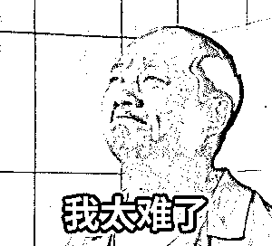

对此

**市工信局**牵头，联合**中山市反诈骗中心**

先后分别走访了

中山移动、中山联通、中山电信

现场督导相关工作措施落实情况

还听取了三大运营商

**汇报了电话用户实名制、规范开卡、**

**加强宣传和培训、加强技术研究等**

**工作开展情况**

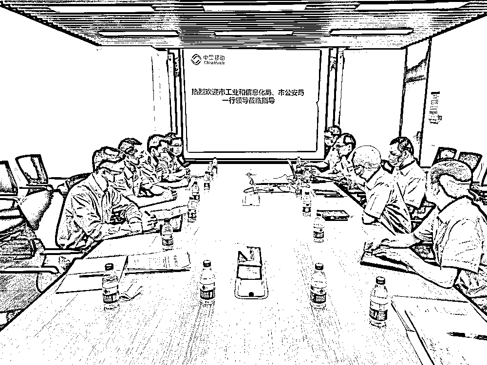

**▲中国移动**

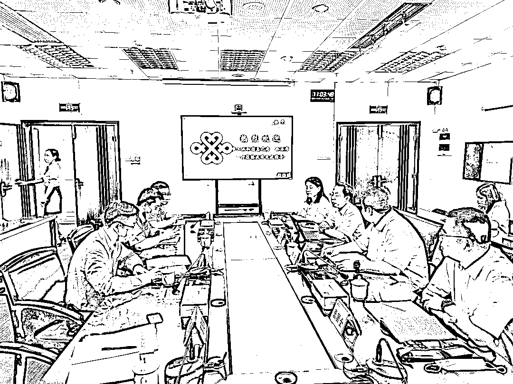

**▲中国联通**

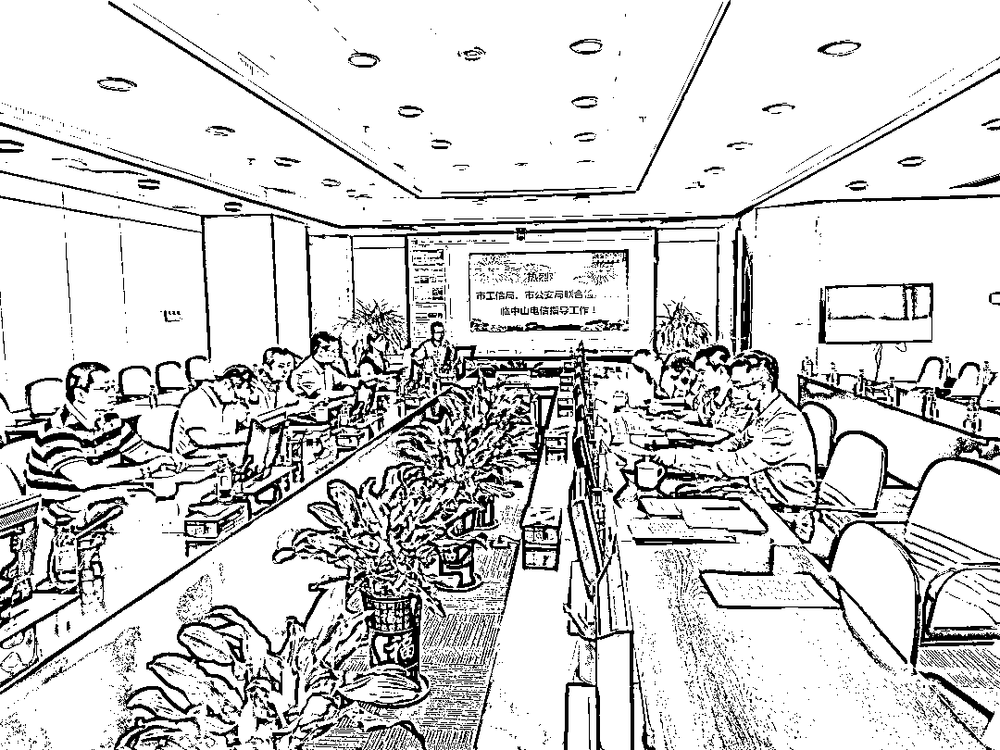

**▲中国电信**

期间

市工信局、市反诈中心还对 

打击治理电信网络诈骗工作情况

进行了通报

最后，市工信局、市反诈中心

对下一步工作提出了意见和建议

这是市联席会议机制

常态化运行的重要体现

今后，将有更多的

联席会议成员单位纷纷出力！

鹏哥要给他们点个**赞**！

全民反诈迫在眉睫 

关于 **电信网络诈骗**

你不得不看！

昨天，

两高一部联合发布了

** 《关于办理电信网络诈骗等刑事案件 **

** 适用法律若干问题的意见（二）》 **

（以下简称《意见（二）》）

这份**司法性解释文件**

**是打击日益猖獗**

**电信网络诈骗的重磅铁拳**

下面我们分享直观的图解

向上滑动阅览

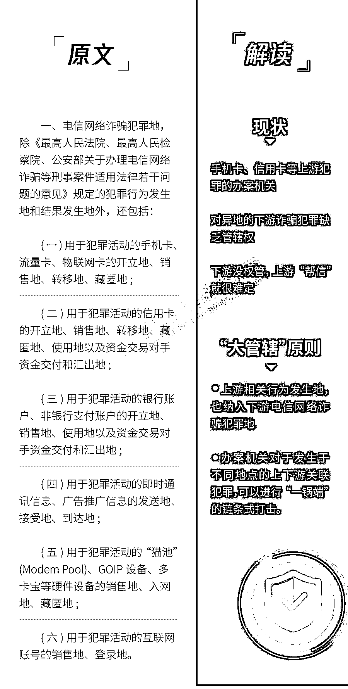

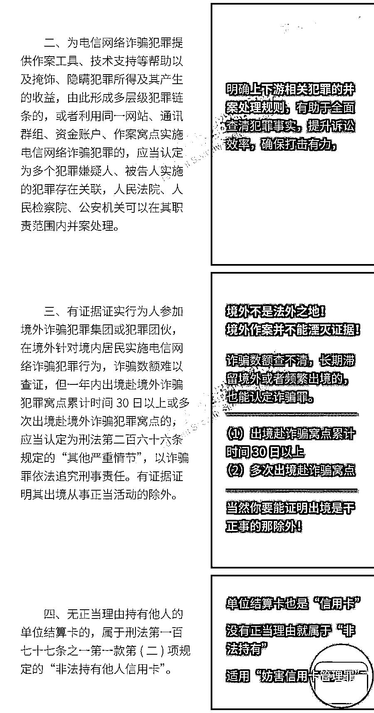

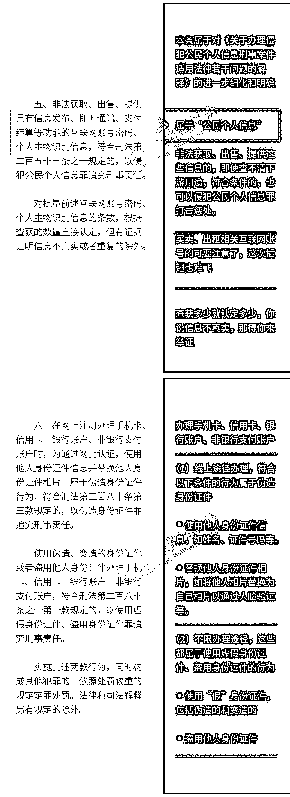

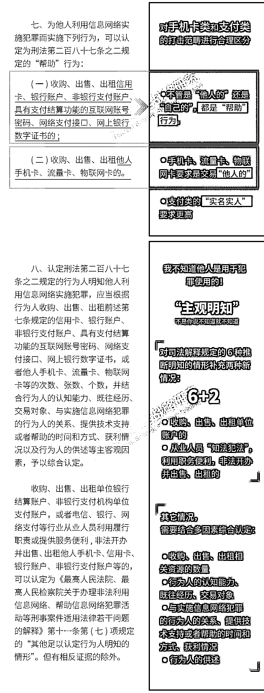

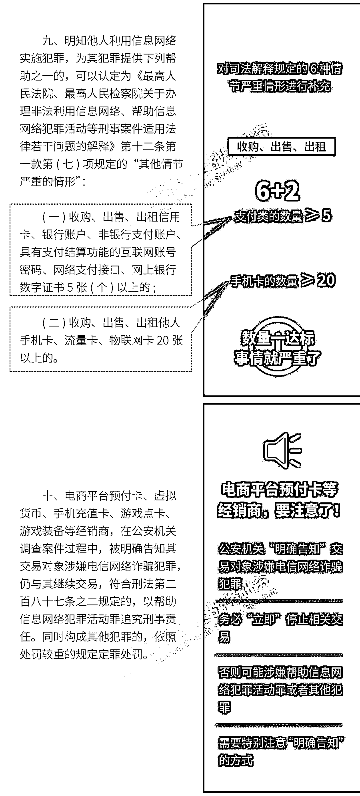

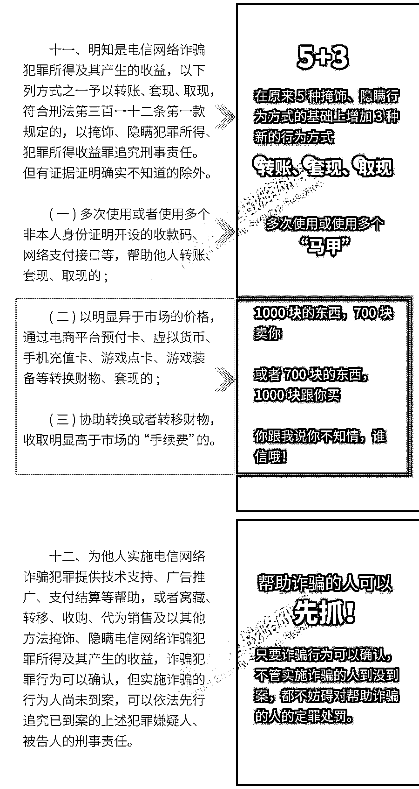

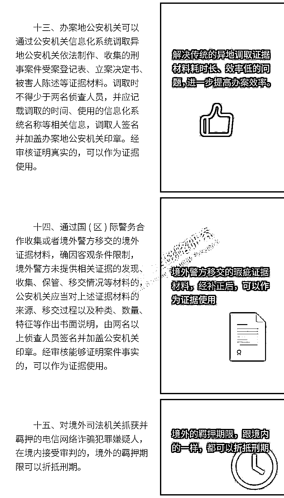

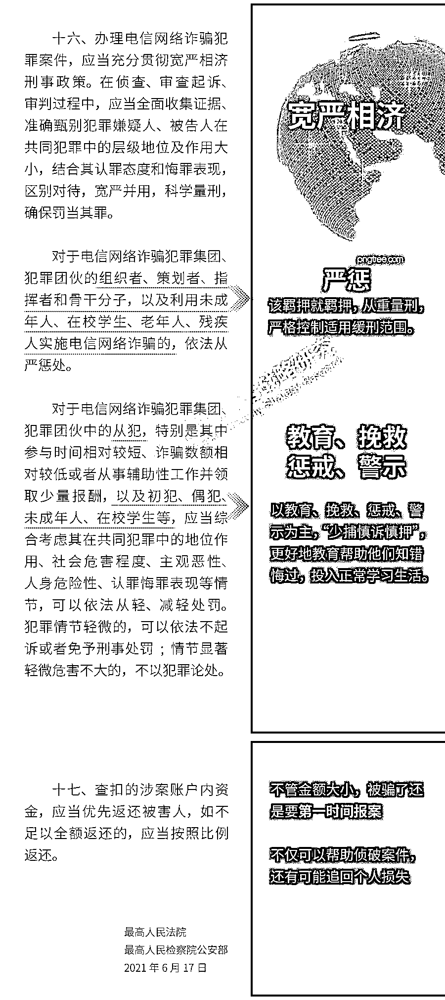

最高人民法院、最高人民检察院、

公安部相关部门负责人

还就《意见二》**解答了相关疑问**。

**1.问：请介绍一下当前打击治理电信网络犯罪的总体情况？**

**公安部答：**电信网络诈骗是近年来高发多发的一类新型网络犯罪，人民群众深恶痛绝。以习近平同志为核心的党中央高度重视打击治理电信网络诈骗违法犯罪工作，习近平总书记多次作出重要指示、提出明确要求。4 月 6 日，习近平总书记再次对打击治理电信网络诈骗犯罪工作作出重要指示。赵克志国务委员和公安部党委认真贯彻落实习近平总书记重要指示精神，部署各地公安机关坚持以人民为中心，把打击治理电信网络诈骗违法犯罪作为深入开展“我为群众办实事”实践活动的一项重要工作，迅速掀起新一轮打击攻势，打击治理工作取得明显成效。今年 1 至 5 月，全国共破获电信网络诈骗案件 11.4 万起，打掉犯罪团伙 1.4 万余个，抓获犯罪嫌疑人 15.4 万名，同比分别上升 60.4%、80.6%和 146.5%。成功劝阻 771 万名群众免于受骗，为群众挽回经济损失 991 亿元。今年 5 月，全国共立电信网络诈骗案件 8.46 万起，与 4 月相比下降 14.3%，案件持续高发的势头得到了一定遏制。

当前，随着社会信息化进程的发展，传统犯罪加快向互联网蔓延变异。电信网络诈骗案件仍然多发高发，作案手段变化快、迷惑性强、防范难度大。诈骗窝点加速向境外转移，有组织犯罪特征明显，社会危害严重。打击治理电信网络诈骗犯罪工作依然艰巨繁重。下一步，全国公安机关将继续深入贯彻落实习近平总书记重要指示精神，忠实践行人民公安为人民的初心使命，扎实开展“我为群众办实事”实践活动，强化责任担当，狠抓打击治理，坚决遏制此类犯罪的高发势头，为建党 100 周年创造安全稳定的社会治安环境。

**一是始终保持严打高压。**全国公安机关将继续出重拳、下狠手、用重典，深入推进“云剑 2021”专项行动，持续开展大案攻坚，组织集群战役，深挖幕后“金主”，严厉打击犯罪分子嚣张气焰。**二是深入推进“断卡”行动。**全国公安机关将继续会同检察、法院、通信、金融等部门，打团伙、摧网络、断通道，严厉打击、整治、惩戒非法开办、贩卖电话卡、银行卡违法犯罪活动。**三是全力开展预警防范。**全国公安机关将把预警防范工作作为重中之重，全力开展事前预警、事中拦截、事后追缴等各项工作，最大限度地减少发案，最大力度地挽回损失。**四是强力推进综合治理。**全国公安机关将继续会同通信、金融、互联网等部门，不断提升行业治理力度，净化网络生态空间。依托国务院部际联席会议，进一步压紧压实地方党委政府主体责任，加强源头治理，清理黑灰产业，铲除犯罪土壤。**五是全力开展反诈宣传。**全国公安机关将继续会同有关部门，充分运用各种媒体平台，组织开展形式多样的反诈宣传活动，提高反诈宣传的覆盖面和精准度，不断提升群众防骗识骗能力。充分发动人民群众，营造全民参与、全社会反诈的浓厚氛围，打一场反诈人民战争。

**2.问：我们注意到，《意见（二）》第十六条用较长篇幅对打击治理电信网络诈骗犯罪的刑事政策作了规定，请问主要是基于什么考虑，检察机关在司法办案中如何把握？**

**最高检答：**您提得这个问题很好。正如您所说，《意见二》十分重视在当前打击治理电信网络诈骗犯罪过程中刑事政策的理解和运用，设置专条即第十六条作了规定。第十六条是《意见二》中篇幅较长的一条，而且从一开始的一款内容扩展到现在的三款。为何要作出这样的设置，主要有这么三个考虑。

**第一，这是落实习近平总书记关于打击治理电信网络诈骗重要指示的积极举措。**前不久，习近平总书记专门作出重要指示，突出强调要坚持以人民为中心，强化系统观念、法治思维，全面落实打防管控措施，坚决遏制电信网络诈骗犯罪多发高发态势。如何把总书记重要指示落实到位，执法司法机关要更加注重刑事政策的运用，坚持惩治、预防和治理的有机统一，综合发挥行政处罚、信用惩戒和刑事打击的效应，努力维护人民群众合法权益和社会和谐稳定。

**第二，这是适应打击治理新形势下电信网络诈骗犯罪的现实需要。**当前，电信网络诈骗犯罪呈现明显的团伙化、链条化的特征。电信网络诈骗团伙往往涉案人员较多，各层级人员皆有，地位作用各不相同。围绕电信网络诈骗犯罪，已经形成一条上中下游紧密分工、密切关联的黑灰产业链。对于不同层级、不同环节的涉案人员，应当在整个犯罪团伙、犯罪链条中全面甄别和评估其层级地位及作用大小，准确定性、科学量刑，确保罪责刑相适应。

**第三，这是提升办理电信网络诈骗犯罪案件质效的具体要求。**从当前办理案件看，涉案人员“三低”（即低龄、低学历、低收入）的现象较为突出，对于这些人员尤其是其中未成年人、在校学生等特殊群体，需要我们综合主客观各方面因素，依法审慎作出司法决定。这有助于更好适用认罪认罚从宽制度，分化瓦解诈骗犯罪团伙，最大程度推动追赃挽损，努力实现司法办案“三个效果”的统一。

第十六条对刑事政策的把握作了三款规定，在司法实践中如何准确理解、全面贯彻，主要要做好以下三个方面工作。

**一是落实宽严相济总体要求，这是第一款规定要旨。**这一要求适用于案件侦查、审查起诉和审判的各个环节。要注意全面收集证据，依法准确认定案件事实。要重视收集审查证明诈骗犯罪集团、犯罪团伙组织架构、内部分工、利益分配等方面的证据，明确各犯罪嫌疑人的层级地位、具体行为和作用大小。要结合犯罪嫌疑人的认罪态度、悔罪表现、退赃退赔等情况，准确认定犯罪嫌疑人、被告人的刑事责任，做到罪责刑相适应。

**二是突出重点从严打击，这是第二款规定要旨，指导我们在政策执行中如何落实好从严的要求。**对于犯罪集团中的组织者、指挥者、策划者和骨干分子，包括出资人、实际控制人等，依法从严惩处。针对当前司法实践中，一些犯罪团伙利用未成年人、在校学生、老年人等特殊群体实施电信网络诈骗犯罪，社会危害更大，应当依法从严惩处。对于上述人员，结合案件具体情况综合认定犯罪嫌疑人的社会危险性，该羁押就要予以羁押，一般应提出从重的量刑建议，并严格控制适用缓刑的范围。

**三是区分对象从宽处理，这是第三款规定要旨，指导我们在政策执行中如何掌握好从宽的标准。**要准确区分电信网络诈骗犯罪集团、犯罪团伙中的主从犯，对于经应聘入职仅领取少量工作报酬、按照工作指令仅从事辅助性、劳务性工作，参与时间较短、诈骗数额较少、发挥作用较小的从犯，以及初犯、偶犯等，依法从宽处理。对于犯罪嫌疑人中的特殊群体，如未成年人、在校学生等，要坚持以教育、挽救、惩戒、警示为主，根据其犯罪情节、认罪认罚、一贯表现等情况，认真落实“少捕慎诉慎押”理念，更好地教育帮助他们知错悔过，投入正常学习生活。

**3.问：针对手机卡、银行卡的“两卡”犯罪，《意见（二）》专门作出三条规定。为什么《意见（二）》要把“两卡”犯罪作为重点内容进行规定？《意见（二）》涉及“两卡”犯罪的规定有什么特点？人民法院打击“两卡”犯罪有什么具体举措？**

**最高法答：**全方位、全链条打击电信网络诈骗犯罪，即全面惩处方针是我们始终坚持的基本方针，就是不仅要严厉打击电信网络诈骗犯罪，还要斩断其犯罪链条，铲除其周边犯罪黑灰色产业链。非法交易的“两卡”，是电信网络诈骗犯罪赖以存在的“土壤”和“水源”，“两卡”非法交易泛滥，已经成为电信网络诈骗犯罪屡打不绝的重要因素。现在，打击“两卡”犯罪，是斩断电信网络诈骗犯罪帮助链条、遏制电信网络诈骗犯罪高发态势、加强源头治理的关键环节，是势在必行的，也是刻不容缓的。因此，《意见二》的第七、八、九条全面规定“两卡”犯罪的法律适用标准，就是要进一步明确打击“两卡”犯罪的法律依据，方便执法办案，确保准确、有力、有效地打击此类犯罪。 

《意见二》对于“两卡”犯罪的规定，主要体现了依法、从严和准确三个方面。首先，《意见二》是在刑法和相关司法解释的基础上制定的，第七、八、九条主要解决对“两卡”犯罪适用“帮助信息网络犯罪活动罪”依法处理的问题，不论是主观“明知”的认定，还是“情节严重”的认定，都是对相关司法解释的进一步细化，没有突破、超越刑法和司法解释的规定。其次，对“两卡”犯罪我们秉持从严惩处的态度，主要还是基于“两卡”犯罪的严重社会危害性，要加强对电信网络诈骗犯罪源头治理，实现釜底抽薪的效果，必须通过从严惩处、有效震慑来达到遏制、预防犯罪的目的。最后，在依法、从严的前提下，我们还要坚持准确认定，《意见二》结合司法实践，不仅对于手机卡、信用卡的打击范畴进行科学合理界定，如手机卡区分是交易“他人”的手机卡等，也对适用“帮助信息网络犯罪活动罪”处理“两卡”犯罪在主客观方面都予以具体而客观的规定，如主观“明知”的综合判断、“情节严重”的具体认定等，确保更加准确全面客观反映犯罪分子的罪行，体现罪责刑相适应的原则。

去年 10 月“断卡”行动开展以后，最高人民法院立即向全国法院下发通知，要求各级人民法院充分发挥好刑事审判职能，打大打击力度，提高审判效率，坚决依法从严从快打击“两卡”犯罪分子。下一步工作中，各级人民法院将继续坚持依法从严惩处方针，用足、用好、用准《意见二》的相关规定，加大对“两卡”犯罪分子特别是团伙的首要分子、骨干分子、累犯惯犯的打击力度，坚决铲除电信网络诈骗犯罪的周边黑灰产，加快审判进程，积极回应社会关切。最高人民法院将进一步加强审判指导，组织专题培训，不断提高各级人民法院的办案能力和水平。同时，我们也会继续配合推进源头治理和综合治理，坚持打击、整治、防范同步进行，深化犯罪预防，落实社会共管共治措施，切实保护人民群众合法权益，维护社会和谐稳定。

来源：中山市反诈骗中心、腾讯安全战略研究、公安部刑侦局

← 向右滑动与灰产圈互动交流 →

