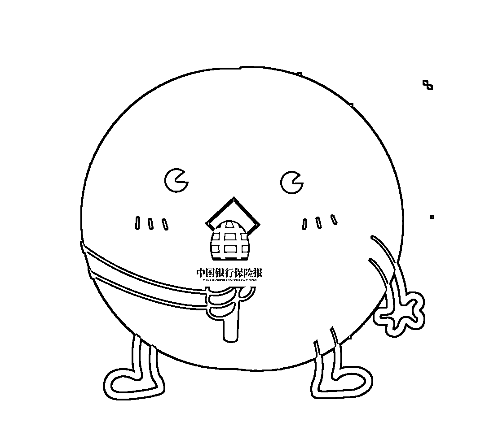

# “我是秦始皇，打钱！”

> 原文：[`mp.weixin.qq.com/s?__biz=MzIyMDYwMTk0Mw==&mid=2247516382&idx=3&sn=11b43ee38a5bf6d17e040a90bb485dc9&chksm=97cb4be6a0bcc2f01da57c2cf3b08720b4eb4b6662e8d0701484fddd13eae3ba54b9ff9d68ee&scene=27#wechat_redirect`](http://mp.weixin.qq.com/s?__biz=MzIyMDYwMTk0Mw==&mid=2247516382&idx=3&sn=11b43ee38a5bf6d17e040a90bb485dc9&chksm=97cb4be6a0bcc2f01da57c2cf3b08720b4eb4b6662e8d0701484fddd13eae3ba54b9ff9d68ee&scene=27#wechat_redirect)

你见过这样的信息吗？↓

招聘线上兼职人员，操作简单，每单收入 50 元，不限地域，当日可赚 300—800 元，宝妈、在职职工、个体老板均可参与……

你听过这样的事情吗？↓

在网上认识的“男友/女友”推荐投资理财产品，声称收益可观。投了一点儿钱进去之后，很快就看到了收益。于是越投越多、越投越多，突然有一天对方卷钱跑路......

你接收过这样的电话或短信吗？↓

××你好，你家里人/朋友/同学/同事出事了，急需用钱，请转账到这个账户......

你有过这样的遭遇吗？↓

接到自称是购物网站客服或快递的电话，说网购的商品有问题，要给你双倍赔偿金，询问你银行卡号和短信验证码。告诉对方后，发现钱被转走，才发现上当受骗了。

这些，很可能都是电信网络诈骗陷阱，背后藏着极大风险！ 

****电信网络诈骗再遭迎头痛击****

****近年来，电信网络诈骗高发，**冒充“公检法”、虚假购物、红包返利、网络交友恋爱、网络赌博、网络贷款、网络投资理财**......各种诈骗手法让人防不胜防。****

****甚至还有一种“**自称历史名人转世/复活/后代等，给受骗者发短信要求转账**”的拙劣诈骗手段，并逐渐演变成网上的段子，表达对诈骗者的嘲讽↓****

********

****我是秦始皇，打钱！****

********

****仅去年，全国电信网络诈骗案件涉及财产损失就达到了**353.7 亿元**。****

****6 月 22 日，最高人民法院、最高人民检察院、公安部召开发布会，发布了《关于办理电信网络诈骗等刑事案件适用法律若干问题的意见（二）》（下称《意见二》）。**咱们来划个重点——******

******01** ****

****今年 1—5 月，全国共破获电信网络诈骗案件**11.4 万起**，打掉犯罪团伙**1.4 万余个**，抓获犯罪嫌疑人**15.4 万名**，成功劝阻**771 万名**群众免于受骗。**** 

****今年 5 月，电信网络诈骗立案 8.46 万起，比 4 月**减少 14.3%**。****

******02******

****我国境内打击电信网络诈骗力度空前加大，大批窝点随之向境外转移，并对境内群众疯狂实施诈骗。**** 

****在发布会上，最高人民法院刑三庭副庭长李睿懿正告电信网络诈骗犯罪分子：****

******不要错以为境外是法外之地、打击盲区**，不要误以为境外作案就可以湮灭证据，能钻法律空子。这都纯属幻想。****

******03** ****

****此外，《意见二》强调，如果有人明知道他人实施电信网络诈骗，还为其**提供帮助**，也**可能会被追究刑事责任**。**** 

******04** ****

****《意见二》还明确，**盗用身份证办手机卡、银行卡等属于犯罪**。**** 

******05** ****

****《意见二》规定，电信网络诈骗查扣资金**优先返还被害人**。**** 

****如不足以全额返还的，应当**按照比例返还**，确保尽最大力量挽回被害群众的经济损失。****

******牢记“八不”******

******远离电信网络诈骗陷阱******

********

****超实用的“天龙八不”，句句干货↓****

****************

******面对电信网络诈骗******

******不怕、不信、不贪、不转账******

****➤➤接到自称“公检法”"银保监会”等机关工作人员的电话，不慌张、不害怕。****

****公安民警、税务局工作人员**绝对不会打电话指导被害人如何转账、设密码**。公安部门也**绝不可能提供所谓的“安全账户”**。**** 

****银保监会及其派出机构**无权直接冻结任何单位或个人的银行账户**，更**不会向消费者收取任何形式的保证金、认证金**等名目的费用。****

****➤➤接到自称**快递客服、电商客服要主动给你退款**的，不相信。通知家属出事要汇款的，**以电话或其他方式当面核实**。****

****来电显示为**“00”“+” **等开头的号码系从境外打来的电话，不要接听、不要回复。****

****➤➤**兼职刷好评刷信誉、通知中奖，领取补贴要你先交钱、投资理财产品收益过高**的，不贪心。****

****➤➤当接收到疑似诈骗电话或短信时，要注意**核实对方身份**，尤其是对方要求向指定账户汇款时，**绝不能轻易汇款，绝不向陌生人透露个人信息**。可以前往银行向柜台人员咨询或第一时间报警。****

********

******警惕洗钱陷阱******

******不借、不替、不代、不参与******

****➤➤不随意**出借自己的****身份证、银行卡**供他人使用，替他人中转资金。****

****➤➤不随意替他人**携带现金、无记名有价证券**出入境；****

****➤➤不为身份不明人员**代办金融业务**；****

****➤➤**不参与或使用非法金融业务**，远离非法集资，选择合法可靠的金融机构办理业务。****

****陌生电话勿轻信，对方身份要核清。
涉钱转账需警惕，遭遇诈骗请报警。
谎称机关不要怕，“00”号码别接听。
不明链接不乱点，投资之前须冷静。****

****账号密码验证码，手机地址身份证。
个人信息勿泄漏，否则肠子要悔青。****

********

****快转给有需要的人吧！****

********

****来源：中国银行保险报文章、自新华网客户端、中国新闻网、承德晚报、利箭在行动****

********

****← 向右滑动与灰产圈互动交流 →****

********