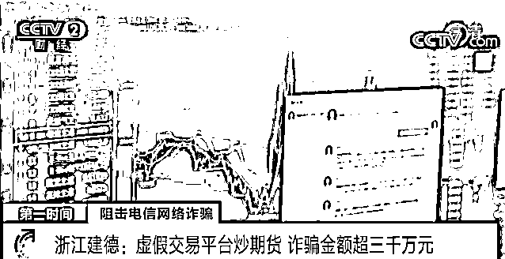
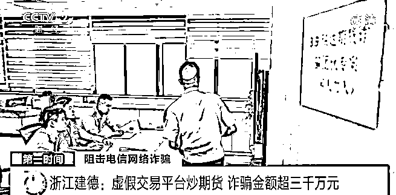
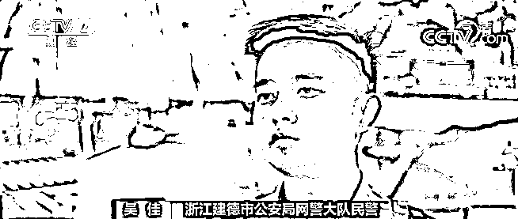
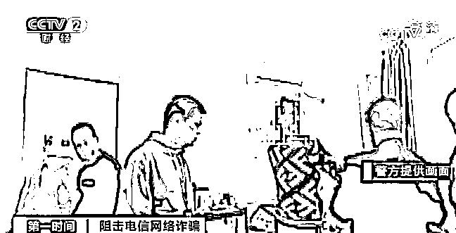
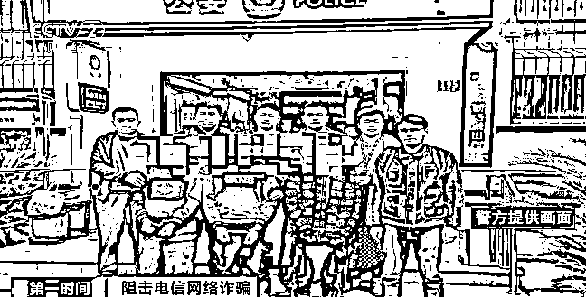
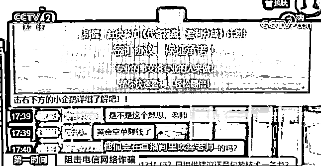
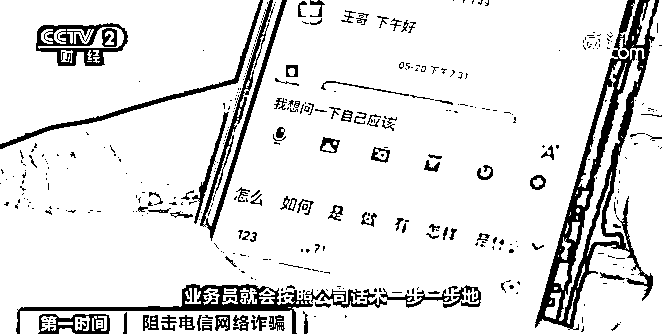
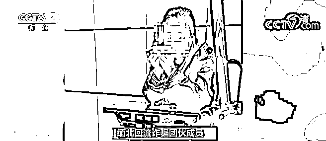
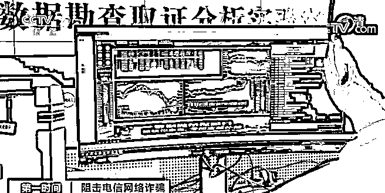

# 央视：导师直播教你炒期货？受骗者自述经历！

> 原文：[`mp.weixin.qq.com/s?__biz=MzIyMDYwMTk0Mw==&mid=2247516382&idx=4&sn=2e43c8e28f81ac6aef3f63b0a64de7f2&chksm=97cb4be6a0bcc2f01d3fd01951071b9731545f7e1b27d9d827b024494b402edc0e40c0466307&scene=27#wechat_redirect`](http://mp.weixin.qq.com/s?__biz=MzIyMDYwMTk0Mw==&mid=2247516382&idx=4&sn=2e43c8e28f81ac6aef3f63b0a64de7f2&chksm=97cb4be6a0bcc2f01d3fd01951071b9731545f7e1b27d9d827b024494b402edc0e40c0466307&scene=27#wechat_redirect)

近日，浙江建德警方打掉了一个**电信诈骗团伙**，串并全国 142 起案件，**涉案超 3000 万元**。

浙江建德：虚假交易平台炒期货

诈骗金额超三千万元

[`mp.weixin.qq.com/mp/readtemplate?t=pages/video_player_tmpl&action=mpvideo&auto=0&vid=wxv_1921059391823216641`](https://mp.weixin.qq.com/mp/readtemplate?t=pages/video_player_tmpl&action=mpvideo&auto=0&vid=wxv_1921059391823216641)

△央视财经《第一时间》栏目视频

2020 年 12 月，建德市民王先生在网上搜索期货相关信息时，弹出的一条理财广告吸引了他的注意，点击后，王先生进入到一个名为瑞达财经的期货平台。

**受害人 王先生**：进去之后，有一个直播室，每天有一个老师在里面讲课，我听了一个星期，觉得那个老师的水平确实不错，因为我自己也做了十来年期货了，觉得这个人很对路，就开户了。

开户后，王先生投入了 15 万元，该平台还赠给王先生 15 万元投资金，根据平台“导师”的指导，王先生加入了所谓的“操盘手计划”，把账户里的 30 万元全部购买了黄金和原油期货，只过了一个多星期，30 万就涨到了 270 万，**王先生想要取现，却发现账户被冻结了。** 

**受害人 王先生**：账户里有钱取不出来，后来老师要分成，第一笔钱我还没有怀疑是诈骗，汇给他了，他告诉我钱打错了，要重新打，再打了一点过去后，他说账户有问题，又被封了。**平台入金的钱，再加上给老师的回报，**总共损失了 70 多万元。****

**意识到自己被骗后，王先生赶紧报警，与此同时，建德警方还接到了另一位市民叶先生的报警，其遭遇和王先生如出一辙，**共被骗了 80 多万元**。接警后，建德市公安局立即成立专案组展开调查，根据作案手法，民警判定两起案件为同一团伙所为。** 

****

****

****浙江建德市公安局网警大队民警 吴佳**：我们立即对网络流、资金流、信息流等多数据进行分析，最终，分析出来一个以刘某、尹某为首，组织中国公民赴缅甸北部实施期货类投资理财诈骗的团伙，该团伙人员众多，分工明确，主要有**讲师团伙、引流团伙、缅北业务员团伙、技术团伙、洗钱团伙、黑灰产业团伙、组织偷越国边境团伙。**** 

**由于涉案人员多，分布广，为避免打草惊蛇，专案组民警在掌握犯罪团伙落脚点及生活规律后，于今年 3 月 9 日至 5 月 28 日，组织 200 多名精干警力，分赴北京、上海、广东、江苏、河南等十余个省市展开收网行动。**

****

****

****浙江建德市公安局刑侦大队副大队长 吴勇**：对犯罪集团中涉及的引流团伙、讲师团伙、缅北回流诈骗团伙以及黑灰产业团伙实施抓捕， 一共抓获犯罪嫌疑人 50 余名，目前采取刑事强制措施 49 人，串并国内案件 142 起，**涉及的诈骗数额 3000 余万元。****

****浙江建德：“导师”直播教投资****

****警方揭秘诈骗套路****

********

 ****[`mp.weixin.qq.com/mp/readtemplate?t=pages/video_player_tmpl&action=mpvideo&auto=0&vid=wxv_1921058078016208898`](https://mp.weixin.qq.com/mp/readtemplate?t=pages/video_player_tmpl&action=mpvideo&auto=0&vid=wxv_1921058078016208898)

△央视财经《第一时间》栏目视频****

****据了解，该案最大不同，就是多了一个直播间功能。****

******浙江建德市公安局新安江派出所民警 王伟卫**：受害人通过期货等关键字搜索，就能搜索到犯罪嫌疑人自己搭建的直播间，直播间里有所谓专业的期货老师在里面讲解期货知识，还会在直播间里喊单，让客户相信自己是非常专业的。****

********

****直播间里还有冒充客户的业务员，他们会在直播间里吹捧老师，说跟着直播间老师操作赚了多少钱，同时也会把虚假的赚钱截图发到直播间里。****

****除了期货投资导师和假冒的客户，直播间里还有一种被称为“巡官”的人，他们一边在直播间里发布开户即送金的优惠广告，一边审核客户留言，**一旦有人写下平台骗人、无法提现等语句，则一律删除，只对外呈现吹捧、夸赞的留言。****** 

******浙江建德市公安局新安江派出所民警 王伟卫**：客户如果相信直播间的老师，就会主动添加业务员，点对点跟业务员联系，业务员会教客户开户入金，有各种各样的广告，让客户不断地往里面投钱，业务员会按照公司话术一步一步对客户进行诈骗。****

********

****据民警介绍，主犯刘某和尹某，都有在上海金融行业的从业经历，而抓获的其他诈骗嫌疑人则大多曾是和主犯尹某在上海的金融业同事，后**在尹某的高薪、工作环境优越等说辞引诱下，被骗往缅甸。******

************

********缅北回流诈骗团伙成员**：特别荒凉，被他们带到一栋房子里面，门口的人都带着枪，后面被拉去各种培训，培训完就要求你开始做电信诈骗之类的。****** 

********浙江建德市公安局刑侦大队副大队长 吴勇**：实际到了那边之后，人身就没有自由，会把通讯工具全部收走，**集中起来进行诈骗培训，完不成业务就要挨打。********

****************

********在案件侦破的同时，专案组民警还在犯罪嫌疑人的电脑中获取到两组企业 QQ 超级管理员账号，梳理出正在被骗的受害人 800 余名，通过上报杭州反制预警专班落地止损，目前已经成功止损 2000 余万元。********

********来源：央视财经，利箭在行动********

****************

********← 向右滑动与灰产圈互动交流 →********

****************