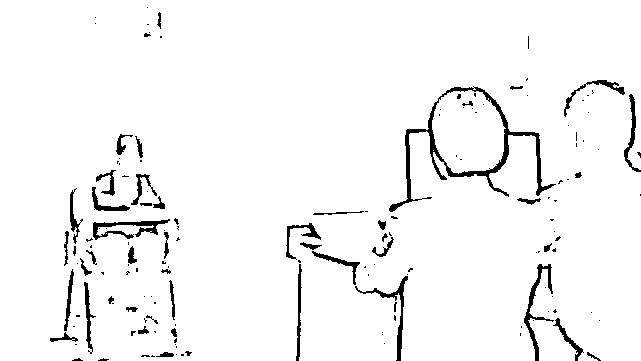
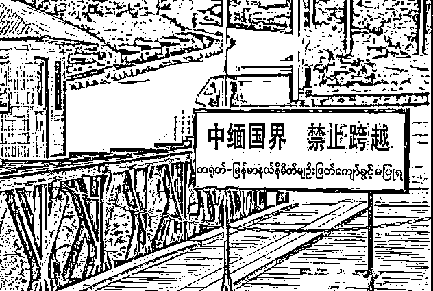
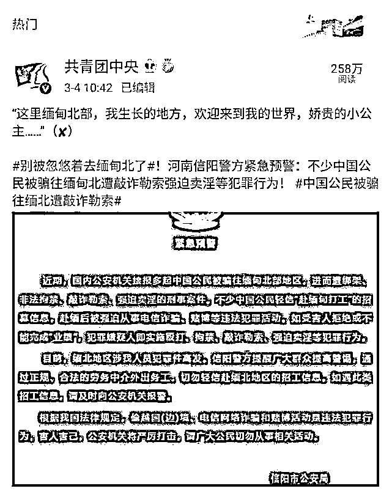
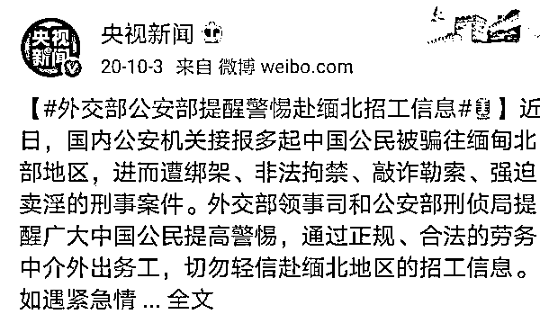

# 钢管电棍殴打、关水牢……广西 18 岁少女亲述 60 天恐怖遭遇

> 原文：[`mp.weixin.qq.com/s?__biz=MzIyMDYwMTk0Mw==&mid=2247516382&idx=5&sn=36d66cb52d4340ea63dfea4314bc1173&chksm=97cb4be6a0bcc2f0ac28bda35d45c500cb9a9538dfd95b3b93604e070325580686a58a3a0ce3&scene=27#wechat_redirect`](http://mp.weixin.qq.com/s?__biz=MzIyMDYwMTk0Mw==&mid=2247516382&idx=5&sn=36d66cb52d4340ea63dfea4314bc1173&chksm=97cb4be6a0bcc2f0ac28bda35d45c500cb9a9538dfd95b3b93604e070325580686a58a3a0ce3&scene=27#wechat_redirect)

前段时间，宣扬“缅北”的视频在某短视频平台异常火爆。一时间不明所以的小伙伴纷纷对缅北充满无限向往，殊不知真实的“缅甸北部”是这样的： 

“有人拿枪指着你的头”

“拿刀架在你的脖子上”

“几十个人围殴你”

“殴打、关水牢、不给吃饭”……

钢管电棍殴打、关水牢……广西 18 岁少女亲述 60 天恐怖遭遇

“地利人和”的缅北，是诈骗者的乐土，有恃无恐之下，很多罪恶在此滋生。这才是最真实的缅甸北部！

视频中的这位缅北亲历者叫小王，年仅 18 岁，被缅北“高薪招工”所诱骗，想着出国捞金结果却入龙潭虎穴。经历了两个月的非人生活后好不容易逃了出来。

缅北亲历者小王：缅北 60 天惊魂记

小王今年 18 岁，她在缅北待了 2 个月。“在那里，没人把你当人看，还好逃出来了，那里真的太恐怖、太可怕了！”提起那段噩梦般地经历，小王仍然心有余悸！初中毕业的小王原本在外地务工，每月能挣几千元，倒也挺稳定。但年少轻狂的她总想着日进斗金，早日发家致富。2020 年底，小王的朋友告诉她：“高薪工作待遇优渥，月薪十几万，包车票，包食宿，坐标缅北”。厌倦了低薪工作的她心动了。于是，抱着发财梦的小王瞒着家人，满怀向往地踏上了去往缅北的征途。

果然，诚如招聘信息上说的那样，小王前往缅北的车票、住宿全都有人搞定，那一刹那，小王觉得自己碰上了最好的工作。事后，小王才明白，这一切不过都是糖衣炮弹，就是为了诱她深入“狼窝虎穴”。

噩梦开始了，到了缅北后，看见拿着枪的保安、封闭式的大铁门，小王才发现，哪是什么好工作，她是被骗来做电信网络诈骗的，专骗中国人。她被逼着交出了手机、银行卡、身份证。“全部都要上交，不交就有人拿枪顶着你的头，拿刀架在你脖子上。”小王此时彻底明白了，自己完完全全被骗了！

据小王回忆，在缅北的时候，她和其他一起工作的伙伴一般，毫无人身自由，永远被关在大铁门里，不听话就要挨打。“我也挨过几次打，但因为我是女的，他们下手较轻，可是那些男的就惨了，几十个人围殴你，能打到失去知觉。”害怕、气愤、不平和逃离的欲望在她脑海时时浮现，在那里的每一天，小王都在谋划如何逃离。终于，在那里待了 60 天的小王看准机会，历经千辛万苦从地狱般的缅北成功逃了出来。

“我们第一次逃跑的时候没跑成功，被抓了回去，抓回去以后就是被拿着钢管电棍一顿殴打，一起逃跑的几个男的被打的鼻青脸肿鲜血直流，比电影中的可怕百倍！后来我们看准机会再次跑了出来……”逃出来后，小王通过寻求帮助，平安回到了中国。

小王想对那些向往“缅北”的人说：“千万不要去缅甸北部，千万不要去缅甸北部，我现在想起来都还害怕，去了你一定会后悔的！

目前，小王已被公安机关采取强制措施，案件还在进一步审理中。

对待赴缅北从事违法犯罪活动，从公安部到各地省厅再到各市区县公安机关，始终保持高压严打态势，对不法分子实施“抓金主、打平台、断资金、打回流”全链条打击。

各地警方也多次发布提醒，别被忽悠去缅北，外出务工请通过正规、合法的劳务中介，切勿轻信赴缅北地区的招工信息。

外交部、公安部也多次发出提醒

但是，总有人抱着侥幸心理前往缅北这个危险的地方“捞金”，最终不仅害了自己，还骗了自己的手足同胞。

**警方再次郑重提醒：**

缅北很危险！千万不要去！也正告滞留缅北人员及其家属，请及时联系劝诫亲人尽快回国投案自首，如实供述自己罪行的，可以依法从轻或者减轻处罚，犯罪情节较轻、有重大立功表现的，可以依法减轻或者免除处罚，拒不入境投案自首的公安机关将依法从严惩处！

来源：戒赌吧

← 向右滑动与灰产圈互动交流 →

