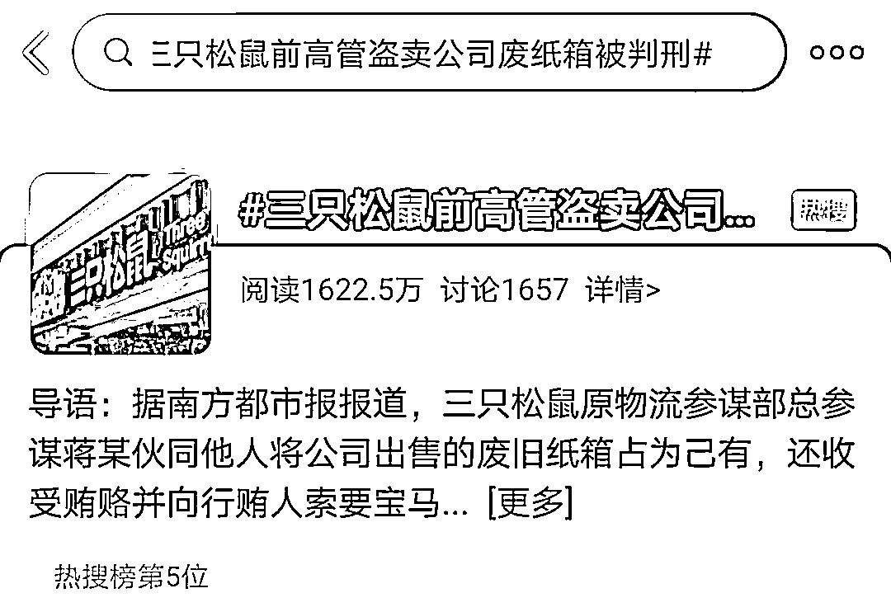
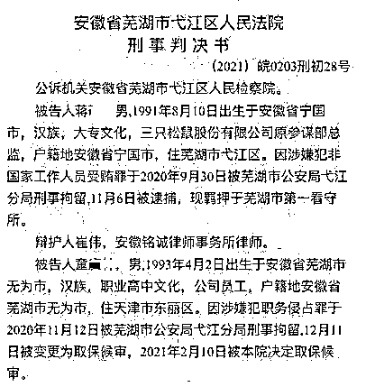
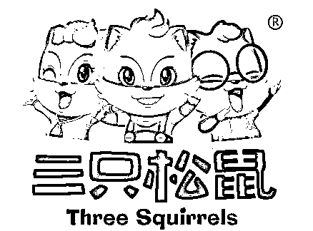
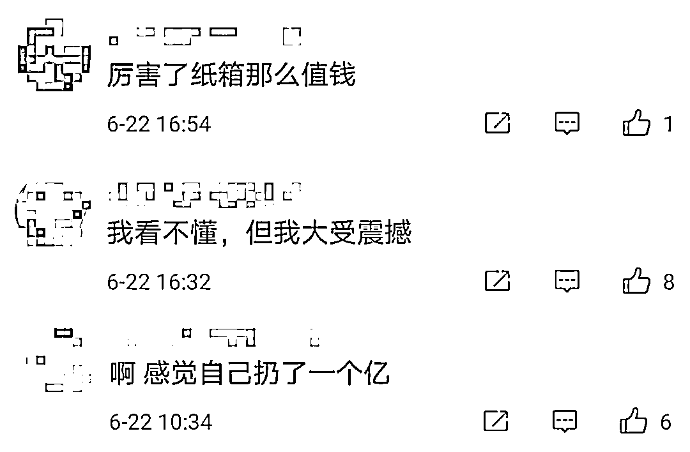
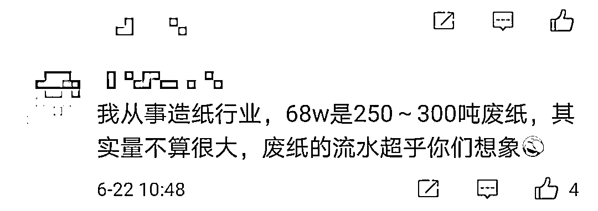
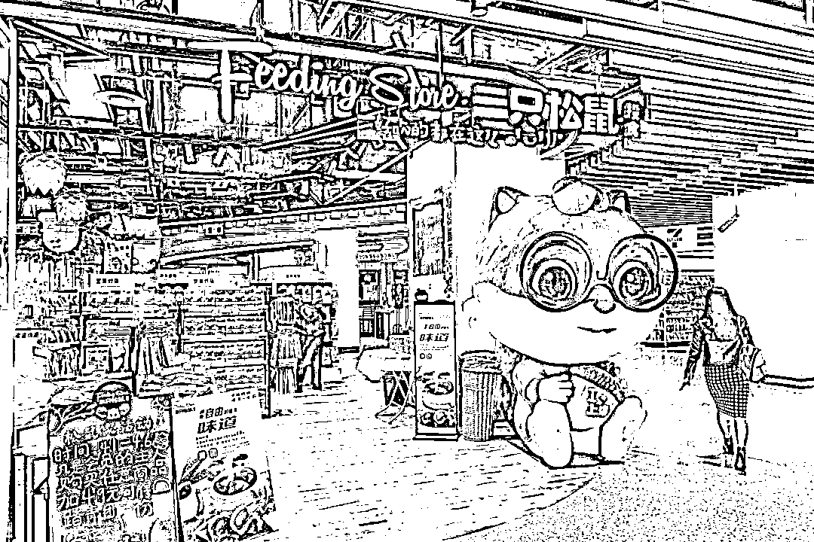
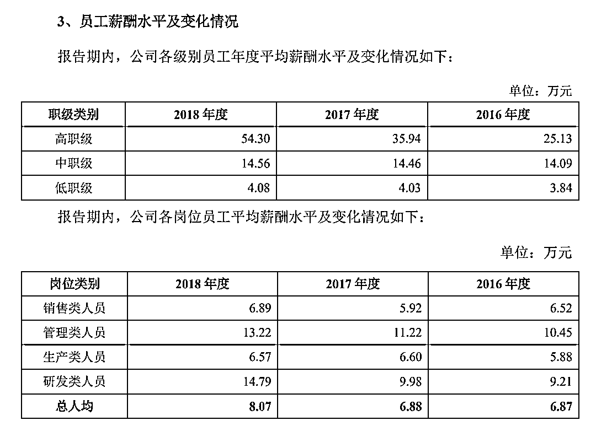
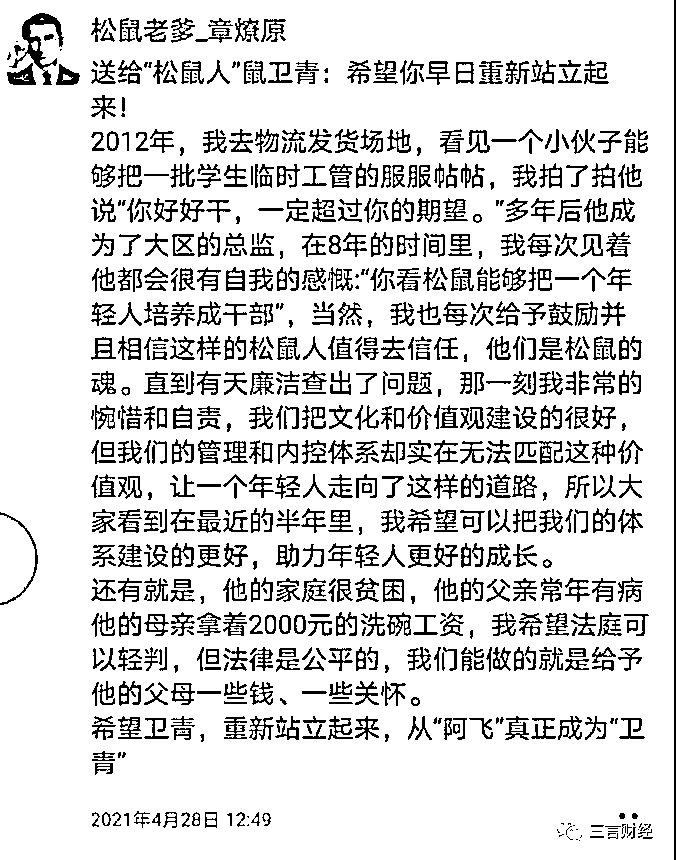

# 三只松鼠 90 后总监被判刑，原因竟是盗卖公司废纸箱获利 34 万

> 原文：[`mp.weixin.qq.com/s?__biz=MzIyMDYwMTk0Mw==&mid=2247516382&idx=6&sn=a4068dc45416be7114751d3bf41389b7&chksm=97cb4be6a0bcc2f0dc259adae2f2f683d5dc8299caac0a85082406db47c10e5ca535d1086a45&scene=27#wechat_redirect`](http://mp.weixin.qq.com/s?__biz=MzIyMDYwMTk0Mw==&mid=2247516382&idx=6&sn=a4068dc45416be7114751d3bf41389b7&chksm=97cb4be6a0bcc2f0dc259adae2f2f683d5dc8299caac0a85082406db47c10e5ca535d1086a45&scene=27#wechat_redirect)

变卖废旧纸箱本是一件好事

为环保做出贡献

但是，身为上市公司的管理人员

盯上了公司本来要出售的废旧纸箱

将变卖来的钱占为己有

只会落得牢狱之灾的结局

6 月 22 日

三只松鼠两名前员工

侵占公司废纸箱获利 68.4 万元一事

登上了微博热搜榜

三只松鼠前管理人员受贿七十多万

近日，裁判文书网公开了一起三只松鼠 2 名员工因收受贿赂，还私自“捡”废纸箱卖钱而被判刑的案子。

据裁判文书显示，被告人蒋某，男，**1991 年 8 月 10 日出生于安徽省宁国市**，汉族，大专文化，三只松鼠股份有限公司原参谋部总监，户籍地安徽省宁国市，住芜湖市弋江区。因涉嫌犯非国家工作人员受贿罪于 2020 年 9 月 30 日被芜湖市公安局弋江分局刑事拘留，11 月 6 日被逮捕，现羁押于芜湖市第一看守所。

蒋某于 2013 年 7 月 22 日入职三只松鼠股份有限公司任物流仓管，**内部花名为鼠阿飞，2019 年 8 月更改为鼠卫青。**2016 年 7 月 1 日任华北 DC 高级经理兼天津配送仓经理，2019 年 9 月 12 日任华北大区总监兼天津 2C 发货仓运营经理，2020 年 3 月 8 日与华北大区新负责人进行工作交接，交接结束后至案发前任物流参谋部总参谋。

2016 年 7 月至 2020 年 3 月，蒋某利用担任三只松鼠股份有限公司华北 DC 高级经理兼天津配送仓经理和华北大区总监兼天津 2C 发货仓运营经理的便利，不断收受北京龙金亿劳务服务有限公司法定代表人王某（另案处理）的贿赂。

1、2017 年 9、10 月份，被告人蒋某收受王某所送**现金 20000 元。**

2、2018 年春节前，被告人蒋某收受王某所送**现金 80000 元。**

3、2019 年 2 月 18 日，被告人蒋某收受王某通**过银行卡账户**向其转账的**110000 元。**

4、2019 年 3 月 25 日至 2020 年 3 月 31 日，被告人蒋某陆续收受王某**微信转账共计 75342 元**，后蒋某还给王某 6300 元。2020 年 9 月，被告人蒋某因害怕被查处，遂将余款 69042 元转账退给王某。

5、2020 年 1 月 18 日，**蒋某向王某索要宝马牌 BWM 7201 em hev 轿车一辆，王某为其支付购车款 429000 元**。同年 9 月 28 日，蒋某因害怕被查处，将该车过户给了王某妻子吕政坤。

总监员工共同犯罪

合伙盗卖废旧纸箱

除此之外，2018 年 10 月至 2020 年 4 月间，蒋某还利用职务上的便利，伙同被告人童某某**采取销售不入账或调整过磅表等方式，将三只松鼠股份有限公司出售的废旧纸箱（价值 684000 元）占为己有**。**其中被告人蒋某分得 344000 元**，童某某分得 340000 元。

三只松鼠相关负责人回应称，上述案件是公司在内部自查时发现了蒋某违法犯罪的线索，在进一步调查取证后向公安机关举报反映。

法院一审判决：

1 年零 10 个月、罚金 10 万

法院认为，被告人蒋某身为公司工作人员，利用职务上的便利，非法收受和索取他人财物价值人民币 708042 元，其行为已触犯刑律，构成非国家工作人员受贿罪。蒋某利用职务上的便利，伙同被告人童某将三只松鼠股份有限公司财物（价值人民币 684000 元）非法占为己有，其行为已触犯刑律，构成职务侵占罪，并属共同犯罪。公诉机关指控的事实及罪名成立。

蒋某到案后如实供述了收受他人财物的犯罪事实，属坦白，可从轻处罚；其主动供述公安机关尚未掌握的职务侵占事实，属自首，可从轻处罚。被告人童某主动投案，如实供述自己的罪行，属自首，可从轻处罚。二被告人均自愿认罪认罚，均可从宽处理。二被告人均退出全部违法所得，亦可酌情从轻处罚。对二辩护人上述相关辩护意见，本院予以采纳。

行贿人王某从蒋某处拿走 110000 元系向蒋某借用，蒋某并无主动归还的意愿，故对辩护人关于蒋某收取的贿赂总额应当减去该 110000 元的意见，法院不予采纳。

法院一审判决蒋某犯非国家工作人员受贿罪，判处有期徒刑一年零二个月，并处罚金人民币 50000 元；犯职务侵占罪，判处有期徒刑十一个月，并处罚金人民币 50000 元。**决定执行有期徒刑一年零十个月，并处罚金人民币 100000 元**。

童某犯职务侵占罪，判处有期徒刑一年，宣告缓刑二年，并处罚金人民币 50000 元。

蒋某所退违法所得 100000 元、公安机关追回的行贿款 179042 元及津 af338**号宝马牌 BMW 7201 em hev 轿车一辆予以追缴。

此事，也引起了网友的热议。不少网友惊讶道：“原来废纸箱这么值钱”；也有网友表示，感觉自己扔了一个亿。

对于不少网友惊讶于废纸原来那么值钱，有从事造纸行业的网友表示，68 万元的废纸大约在 250 吨-300 吨左右，在废纸行业来看，量并不算大。

据中国证券报，相关行业人员表示，三只松鼠前员工侵占公司废纸箱期间，正好是废纸价格比较低迷的阶段，**纸厂收购价每斤（市斤）价格在 5 毛到 8 毛之间。据此计算，上市公司的两只“老鼠”侵占的废纸箱总量或在百万斤以上**。

当时员工年薪或在 14 万上下

变卖纸箱所得钱款是其工资两倍多

根据三只松鼠 2019 年 7 月公布的招股书中数据显示，公司 2018 年高职级员工平均年薪 54.3 万元；**中职级 14.56 万元**；低职级 4.08 万元。

根据岗位类别，2018 年三只松鼠销售类人员年薪 6.89 万元；**管理类人员年薪 13.22 万元**；生产类人员年薪 6.57 万元；研发类人员年薪 14.79 万元。

根据这些信息，**蒋某可能属于中职级管理类人员，其 2018 年盗卖废旧纸箱时的收入或在 14 万元上下**。

值得注意的是，三只松鼠 CEO 章燎原还在蒋某审判完之后发了一条朋友圈。表示这位花名为“鼠卫青”的员工家庭贫困，父亲常年有病，母亲拿着 2000 元的洗碗工资。

**家境贫困可以靠自身努力改变**

**但是，万万不可触碰法律底线！**

来源：看看新闻 Knews、每日经济新闻、裁判文书网、中国证券报、新闻晨报

← 向右滑动与灰产圈互动交流 →

