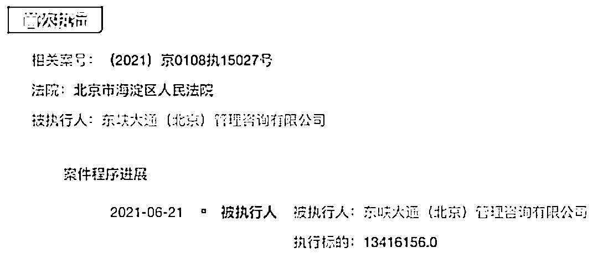

# 突发！ofo 关联公司被列为被执行人，标的近 1342 万元！网友：什么时候退押金？

> 原文：[`mp.weixin.qq.com/s?__biz=MzIyMDYwMTk0Mw==&mid=2247516448&idx=2&sn=51153cc187ebb6c6600b8d0eaa322b11&chksm=97cb4a18a0bcc30e183da85874510571d6164c9f8532e4d42613aceb1425421cbfdab8aa8997&scene=27#wechat_redirect`](http://mp.weixin.qq.com/s?__biz=MzIyMDYwMTk0Mw==&mid=2247516448&idx=2&sn=51153cc187ebb6c6600b8d0eaa322b11&chksm=97cb4a18a0bcc30e183da85874510571d6164c9f8532e4d42613aceb1425421cbfdab8aa8997&scene=27#wechat_redirect)

ofo 被强制执行 1341 万冲上热搜，网友纷纷表示，“什么时候退押金？” 

近日，ofo 小黄车关联公司被法院列为被执行人，执行标的近 1342 万元，不过在法院的审理过程中发现，该公司已无财产可供执行。

当年风光无限的流共享单车平台，如今的现状令人唏嘘。

ofo 关联公司被列为被执行人

执行标的近 1342 万元

天眼查数据显示，近日，ofo 小黄车关联公司东峡大通（北京）管理咨询有限公司被北京市海淀区人民法院列为被执行人，关联案件为东峡大通（北京）管理咨询有限公司与珈伟新能源股份有限公司相关合同纠纷，案号(2021)京 0108 执 15027 号，执行标的 1341.62 万元。

截至目前，该公司已有多条被执行人信息、限制消费令及终本案件，已多次因有履行能力而拒不履行生效法律文书确定义务被列为失信被执行人。 

除此之外，6 月 19 日，广州东峡科技有限公司新增一则严重违法信息，该公司现已被列入严重违法失信企业名单，原因是“被列入经营异常名录届满 3 年仍未履行相关义务”，作出决定机关为广州市海珠区市场监督管理局。

ofo 关联公司已无财产可供执行

法人多次收限消令

据中国裁判文书网，（2021）京 0108 执 381 号执行裁定书显示，今年 5 月份，北京市海淀区人民法院曾通过法院财产调查系统对被执行人东峡大通（北京）管理咨询有限公司的银行存款、车辆、房产、证券等进行调查，未发现可供执行的财产。现申请执行人暂不能向本院提供被执行人东峡大通（北京）管理咨询有限公司的下落及其他可供执行的财产线索。本院已对被执行人东峡大通（北京）管理咨询有限公司采取限制消费措施。

截至目前，该公司已有多条被执行人信息、限制消费令及终本案件，已多次因有履行能力而拒不履行生效法律文书确定义务被列为失信被执行人。 

据悉，东峡大通（北京）管理咨询有限公司成立于 2016 年 10 月，注册资本 15 亿美元，由 OFO (HK) Limitedq 全资持股，旗下有三家全资子公司，分别为绿觅（上海）机械租赁服务有限公司、成都智客出行科技有限公司、东峡大通（北京）管理咨询有限公司深圳分公司（已注销）。其中，智客出行是一家创新科技初创企业，致力于通过“自由 go 智行车”（共享电助力单车）来优化单车用户的骑行体验。 

东峡大通法人为陈正江，作为一家失信公司的执行董事、法人，ofo 中国区业务主要负责人之一,陈正江自然也没逃过相关处罚。仅今年以来，陈正江已经收到 45 则限制消费令，案由多为运输合同纠纷、买卖合同纠纷、劳动争议等。 

1500 多万用户押金未退

创始人戴威被多次限制高消费

ofo 小黄车首创“单车共享”模式是全球第一个无桩共享平台，自其发展起步到辉煌时期，再到黯然落幕，这一共也就是两三年的时间。

截止目前，ofo 的 APP 数据中显示，仍有 1500 多万名用户在等着退押金，而押金的金额从 99 元-199 元不等。就算按照 99 元来计算，待偿的押金高达 14.85 亿元。以现在情况来看，领到押金是遥遥无期，此前的用户也都怨声载道。

很多网友表示：“我的押金像石沉大海一样，钱还没退。”“有生之年还能收到我的 199 押金吗？”更有网友表示，“这几年婚也结了娃都生了，可是交给 ofo 的押金还是没动静，失望至极。”

ofo 成立于 2014 年，为解决最后一公里的出行问题，推出了创新的共享单车模式。由于其“互联网+”概念以及新颖的商业模式，受到了各路资本的大力追捧，4 年间获得了 11 轮融资。其中不乏各种明星机构，例如蚂蚁金服、阿里巴巴、滴滴出行、小米集团等。

不过，ofo 在探索的路上似乎并未找到有效的盈利模式，高密度地单车投放、大量的固定成本投入以及各种不了了之的业务板块，都使得 ofo 逐渐走上末路，跌下神坛。 

与此同时，作为公司的创始人，戴威目前已经累计被法院限制消费已经接 39 次。限消令中对戴威的限制包括：不得乘坐飞机、软卧、轮船二等以上舱位；不得在星级以上宾馆、酒店、夜总会、高尔夫球场等场所进行高消费；不得购买不动产或者新建、扩建、高档装修房屋等。

来源：中国基金报

← 向右滑动与灰产圈互动交流 →

