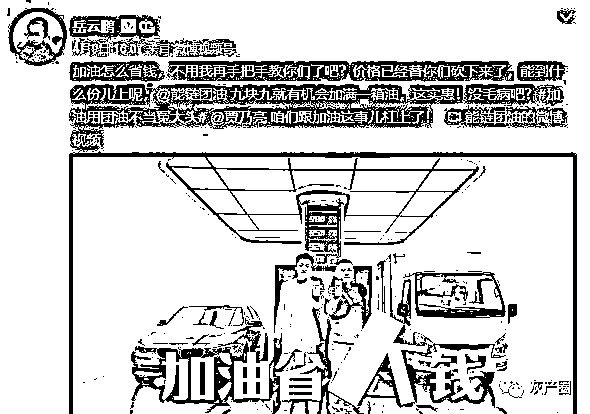
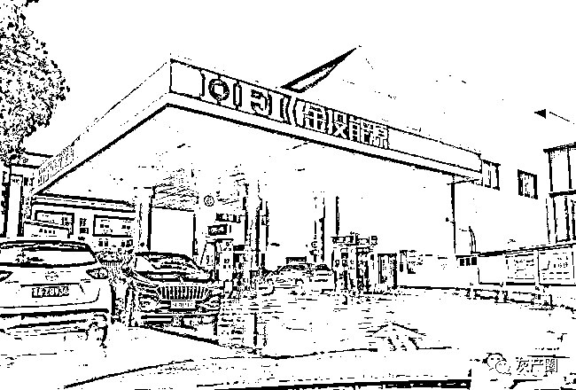
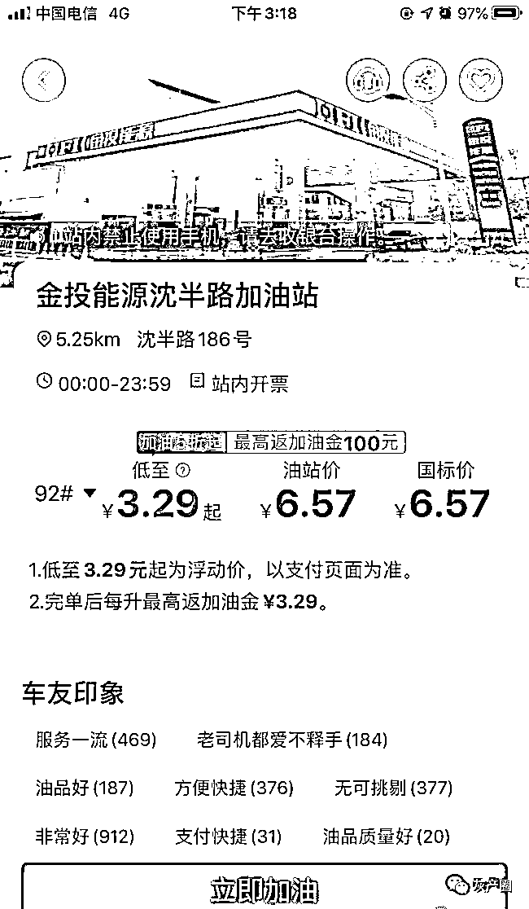
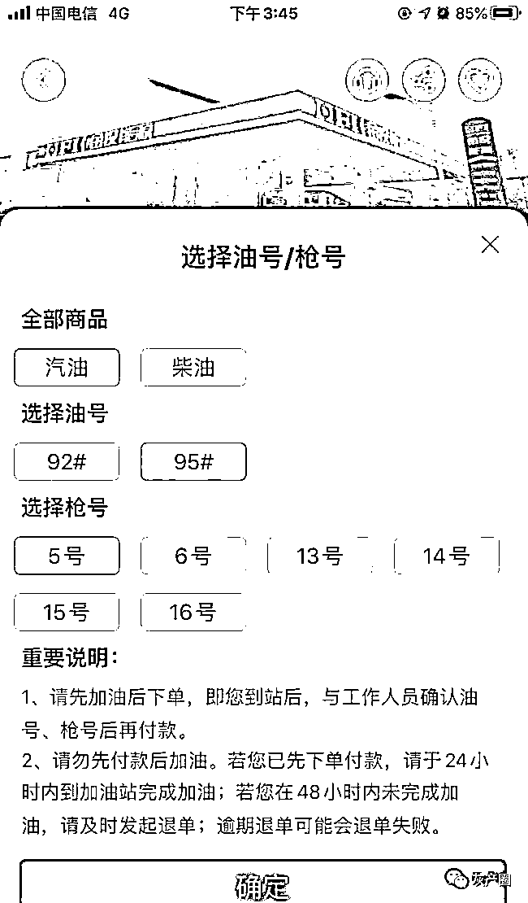
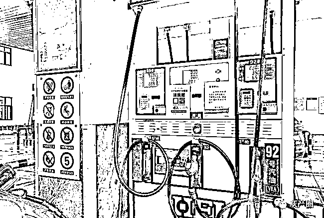
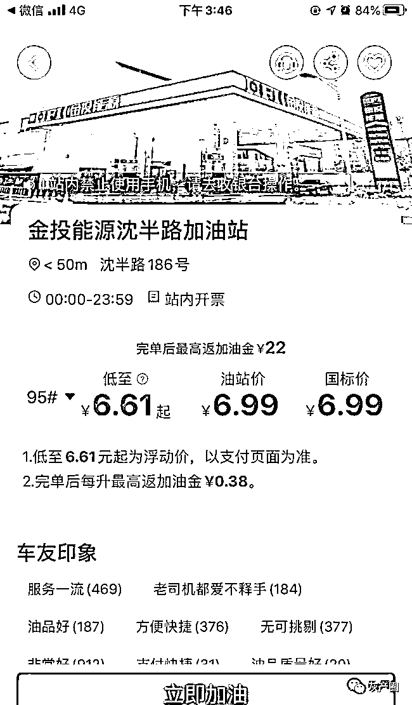
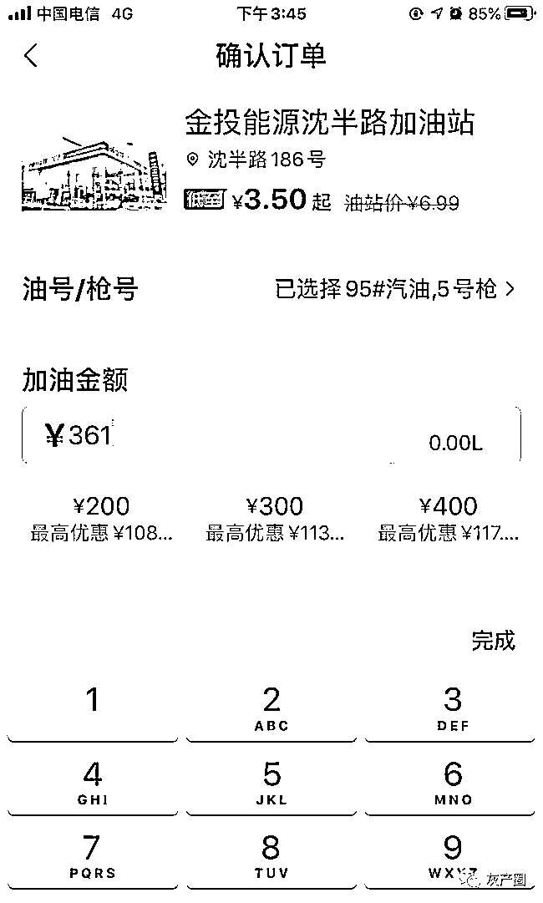

# 加油用团油，争当冤大头！

> 原文：[`mp.weixin.qq.com/s?__biz=MzIyMDYwMTk0Mw==&mid=2247516448&idx=4&sn=3b1bde6011ef19102690eda32a198c1c&chksm=97cb4a18a0bcc30e74ae0d47a3ef7945f3a95c21c0367ee4418f18d4618e63fe21ee29e2b5d5&scene=27#wechat_redirect`](http://mp.weixin.qq.com/s?__biz=MzIyMDYwMTk0Mw==&mid=2247516448&idx=4&sn=3b1bde6011ef19102690eda32a198c1c&chksm=97cb4a18a0bcc30e74ae0d47a3ef7945f3a95c21c0367ee4418f18d4618e63fe21ee29e2b5d5&scene=27#wechat_redirect)

最近，很多消费者在各种渠道看到了“加油用团油不当冤大头”的广告，这个叫“团油”的 App 请来了岳云鹏和贾乃亮做代言，号称可以缓解中国车主 “油贵焦虑”。但在投诉平台上，却能收到不少对团油涉嫌消费欺诈、优惠活动有猫腻的投诉。该平台甚至还曾被工信部点名“通报批评”。

　　

　　这款加油“省钱神器”真的有广告中说的那么优惠吗？记者实地进行了调查。

　App 显示 95 号汽油“3.50 元/升起”

加完油实际结算金额变成 6.68 元/升

**　　打开苹果手机上的 App Store，搜索“团油”，就能搜到这款自称“团油-加油省大钱神器”的 App。下载完后，一打开就能看到“满 200 元返 100 元”和“9.9 元加满一箱油”的活动宣传。**

**　　注册个人信息后，就可以使用团油 App 去加油了。在确认好用户的位置后，App 上会显示最远 50 公里以内的与团油有合作的加油站。距离我所在位置最近的是 5.58 公里外的沈半路 186 号的金投能源沈半路加油站。**

**　　**

**上面显示的油价非常诱人：原价 6.57 元/升的 92 号汽油，显示只需要 3.29 元/升起；原价 6.99 元/升的 95 号汽油，显示只需要 3.50 元/升起。价格下还有说明：低至 3.29 元起、3.50 元起为浮动价，以支付页面为准；完单后每升最高返加油金 3.29 元、3.50 元。** 

**　　**

**随后，按照团油 App 上跳转的导航，我来到了金投能源沈半路加油站。我向工作人员表示了要用团油加油。工作人员熟练地把记者的车引导到一台加油机前，正常给汽车加油，不过要求我记住是“5 号油枪”。加满油箱后，实际升数是 51.65 升，原价为 361 元。** 

**我到收银台付费，打开团油 App 点击“立即加油”，然后再选择“汽油”“95 号油”和“5 号油枪”点击“确认”，再输入原价 361 元后，显示实际需要支付 345.2 元。**实际优惠的价格只有 15.8 元，相当于只优惠了 4%，单价相当于 6.68 元/升。**** 

**　　　　**

**　　摄影 程超**

**　　和来加油之前 App 上显示的“3.50 元/升起”，相差比较明显。此时，App 上该加油站显示的价格也变成了“低至 6.61 元/升起”。**

**　　**

**　加满一箱油省了 15.8 元**

**但需提供身份证和电话等相关信息**

****

****该单业务结束后，App 上显示一共优惠了 115.8 元，除了直接扣减的 15.8 元外，还有 100 元是指“满 200 元返 100 元”的优惠活动。并提示关联银行卡后即可提现。**** 

****　　****

****　　但记者在关联了银行卡后，系统又提示，加油金必须累积满 300 元才能提现，提现也不能全额提，而是按照 1 元提 0.9 元的规则操作，300 元加油金最多可提 270 元。****

****　　该加油站的工作人员表示，用团油 App 的消费者最近有不少，能占到加油车主的 10%左右，操作比较简单，只要记住油枪号码就行。不过实际优惠并不像 App 上显示的那么多，大概每升能便宜 0.5 元，加上一些满减券和加油金，每次能优惠 10-20 元左右。****

****　　不过，享受这些优惠，需要在团油 App 上注册成功，也就意味着消费者要提供电话号码、身份证等相关私人信息，如果要想提现加油金，还要关联一张本人的银行卡。****

****　　是否值得这么做，就见仁见智了。****

****　　我这次加油，来回路上用了 1 小时，实际省了 15.8 元。但来回路程 12 公里，因路上比较堵，百公里油耗跑了 12 升，算下来光路费就要 10 元左右，省下的钱一大半都搭进路费里了。****

****　　合作加油站基本都是民营加油站****

****浙江中石化的自营站都没参与****

********

******　　公开资料显示，团油是能链集团旗下的一款互联网 App 产品。该公司成立于 2016 年，目前业务涵盖 1700 个城镇，合作加油站超过 2.3 万座。******

******　　不过，从显示的合作加油站来看，基本没有中石化和中石油。中石化浙江分公司的工作人员透露，目前与团油 App 合作的加油站，基本都是承包站，自营加油站没有参与合作。******

******　　近期，团油 App 推广动作不断，在湖南、东方、浙江、江苏四大卫视推出视频广告：私家车主每年省千元，货运车主每年省万元。以此来凸显团油“省大钱”理念。最近还请来岳云鹏和贾乃亮做代言，宣传“加油用团油不当冤大头”。******

******　　网上数百条投诉******

******去年曾被工信部曝光******

************

******　　不过，团油一边大张旗鼓地宣传能让用户“省大钱”，一边却被大量用户投诉虚假宣传。截至目前，在黑猫投诉平台上，关于团油的投诉高达 444 条。在 315 消费保平台上，关于团油的投诉也居高不下。******

******　　此外，围绕着团油出现的投诉事件除了相关用户，还包括平台加盟商。2020 年 5 月，《每日经济新闻》曾以题为《加油站商家投诉遭“绑架”，团油 App 被指刷单冲业绩》的报道，曝光团油 App 的刷单冲业绩行为。******

******　　彼时，有媒体曾报道团油 App 会从每笔订单中抽取 1%的服务费，再加上新客不多，老顾客开始用团油之后，服务费仍然要由加油站承担，运营成本反而升高了。据某些民营加油站老板透露，为了吸引消费者，他们会主动让利推出一些优惠活动，但通过团油结算，反而会比加油站给的优惠少，最后仍然按高价结算，“两头吃”。******

******　　去年 10 月 27 日，工业和信息化部发布通报 2020 年第五批侵害用户权益行为的 App，督促存在问题的企业进行整改。其中就有团油 App，涉嫌强制、频繁、过度索取权限。******

******　律师认为“团油”App 涉嫌虚假宣传******

************

********　　关于团油的投诉原因大致可以总结为：虚假宣传、团油加油金额与标价不符、诱导消费、售后工作不及时、优惠券在其指定加油站不能使用、大数据杀熟等。比如今年 3 月 17 日，有消费者投诉团油上显示 3.87 元，日常价显示 4.17 元。但加油时却是按照 6 元以上的价格结算的，没有任何优惠。********

********　　浙江浙元律师事务所副主任、合伙人张轶群律师认为，团油这样的做法，涉嫌虚假宣传。********

********　　张律师说，尽管在 App 上显示价格的同时，还有一个相对小很多号字体的“起”，还做了一个浮动价的说明，但大多数消费者不会注意到这个故意做小的字体，而是被几乎半价的巨大优惠所吸引。********

********　　而且，在消费者被价格所吸引，驱车赶到相应的加油站后，实际上已经产生时间成本和油费成本，到那时再咨询加油站工作人员后，还不能明确得知优惠的油价，一直要等到加完油结账时，才能得知具体的优惠金额，这明显有不合理的设计。********

********　　同时，团油 App 还没有提供明确的条款，让消费者能提前获知游戏规则，比如具体什么情况，才能享受多大的折扣，按照《广告法》共和《消费者权益保护法》的相关条款规定，这些做法都存在不合理的地方。********

********来源：都市快报********

****************

********← 向右滑动与灰产圈互动交流 →********

****************