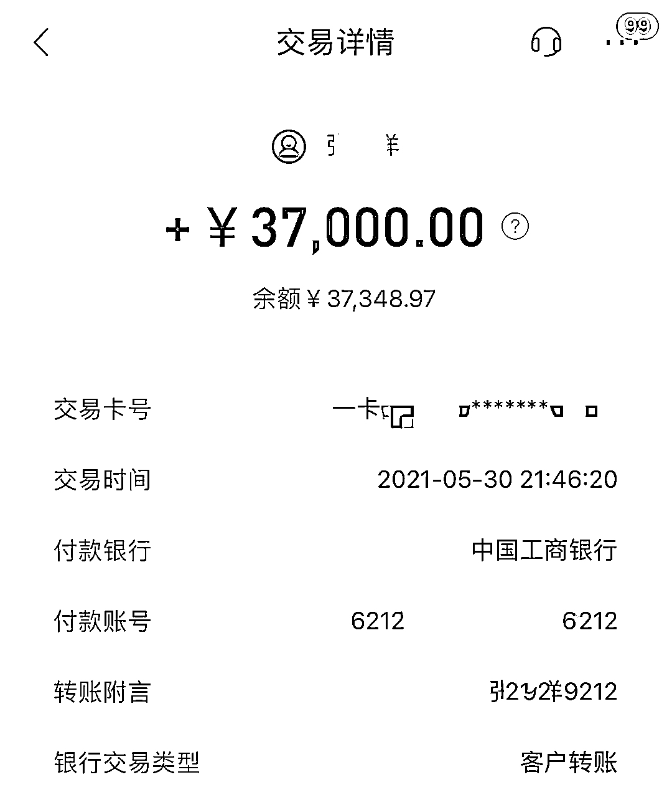
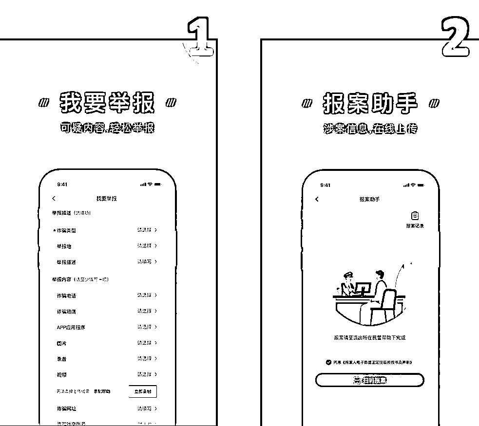
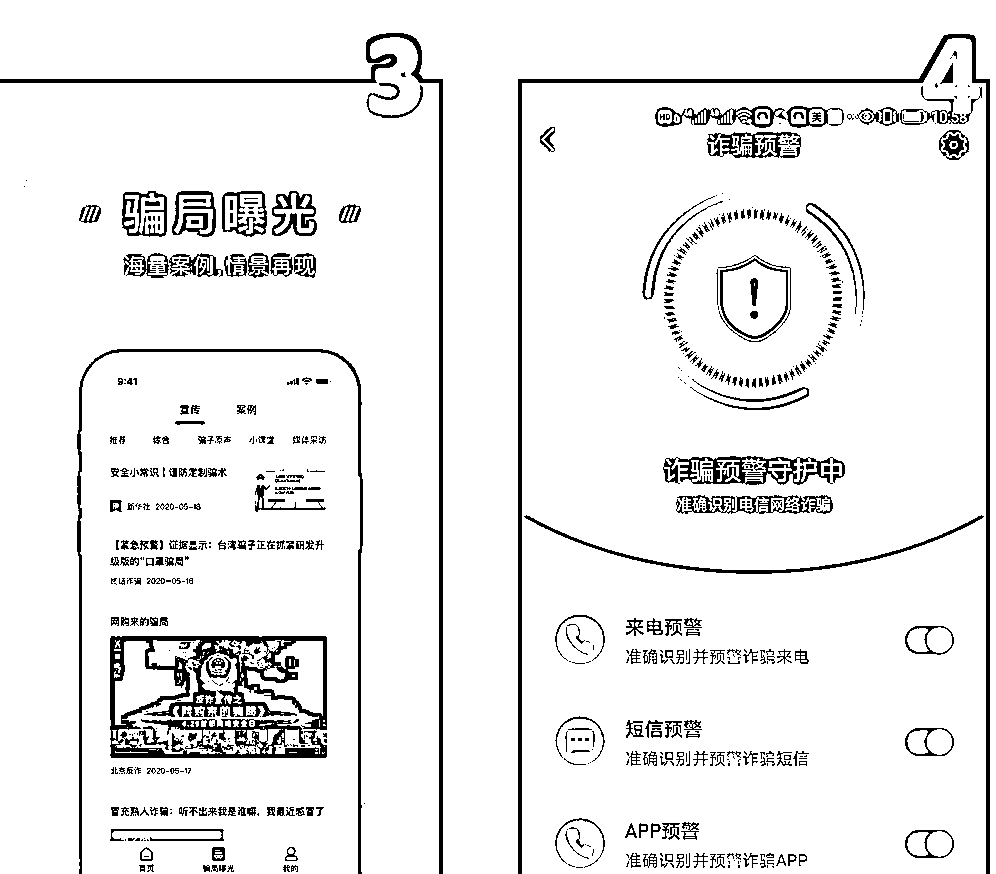

# “不退款我一定去抓你”，刑警霸气一吼追回被骗资金 3.7 万！

> 原文：[`mp.weixin.qq.com/s?__biz=MzIyMDYwMTk0Mw==&mid=2247516448&idx=5&sn=76963d53b5f9b94006c185f6217db554&chksm=97cb4a18a0bcc30e7f74303a42e7e4bab50518fca134bdca8315c3efd54992878ca758335144&scene=27#wechat_redirect`](http://mp.weixin.qq.com/s?__biz=MzIyMDYwMTk0Mw==&mid=2247516448&idx=5&sn=76963d53b5f9b94006c185f6217db554&chksm=97cb4a18a0bcc30e7f74303a42e7e4bab50518fca134bdca8315c3efd54992878ca758335144&scene=27#wechat_redirect)

近期，市民张女士遭遇了电信网络诈骗，被骗 3 万多，而这些钱竟然还是做手术急需的治病钱，眼看钱就要离自己而去，张女士果断选择了拨打 110 报警，于是就有了以下的对话... 

[`mp.weixin.qq.com/mp/readtemplate?t=pages/video_player_tmpl&action=mpvideo&auto=0&vid=wxv_1926566732974866438`](https://mp.weixin.qq.com/mp/readtemplate?t=pages/video_player_tmpl&action=mpvideo&auto=0&vid=wxv_1926566732974866438)

张女士在挂掉电话后立刻准备出门去派出所报案，没想到刚从电梯间出来，就收到了转款到账的通知：她的钱，追回来了。

回想起被骗经过，张女士也是心有余悸。原来张女士遭遇的是冒充客服诈骗，骗子声称自己误操作给张女士开通了 VIP 会员，如果不取消会自动扣费，并且会导致自己的银行卡被冻结。因为卡里存的是自己第二天准备做手术的钱，所以张女士在对方的忽悠下就照做了。骗子提出了“验证”的要求，让张女士将每张银行卡里的钱都转到指定“单号”（其实是银行卡号，骗子故意说成是“单号”避免受害人警觉），前几笔千元左右的转款对方都在第一时间返给了张女士，这让她警惕心逐步降低，最终将 3.7 万元全部转给了对方。然而这一次她并没有等来对方的回款，在不到一分钟的时间里，张女士拨通了 110 报警电话。

当然

作为差一点被骗当事人

张女士也有一番格外深刻感悟想和大家说说

**蜀黍提醒：**

**第一条：**千万不要再觉得自己不会上当受骗了，多少血和泪的教训证明：导致自己上当受骗绝对不是因为骗子的骗术有多高明，而是自己就是不认为自己会上当受骗！

**第二条：**如果第一条对你没啥作用，那就记得一旦被骗要第一时间拨打 110 电话报警，报警速度越快止付冻结的成功率就越高，你被骗的钱追回来的概率就越高。

**第三条：**如果第二条对你还是没啥作用，那就赶紧到各大应用市场搜索下载“国家反诈中心 APP”，这款反诈神器可以自动帮你拦截诈骗电话和短信，你值得拥有！

**—  END  —**

来源：刑事警察支队，济南公安 

← 向右滑动与灰产圈互动交流 →

