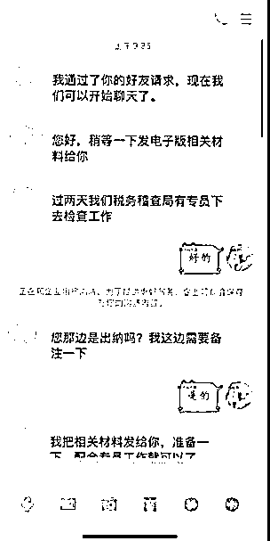
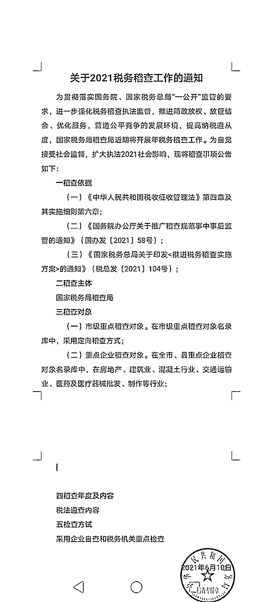
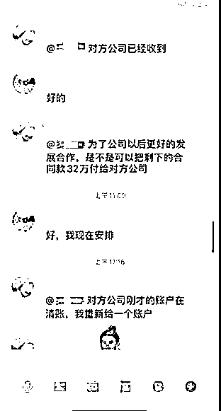
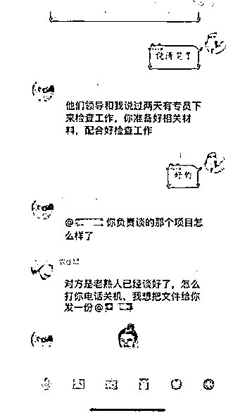
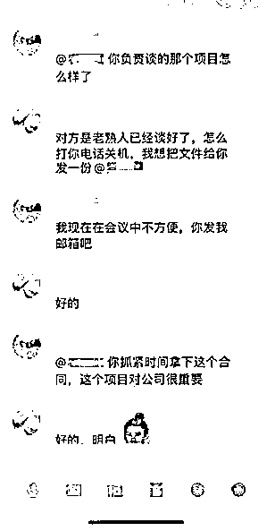

# 骗术升级！“董事长”“总经理”“税务人员”联合作案！

> 原文：[`mp.weixin.qq.com/s?__biz=MzIyMDYwMTk0Mw==&mid=2247516448&idx=7&sn=845910d8da4f260b025b3ee5cc6f3e5c&chksm=97cb4a18a0bcc30e82315f4ab3ad2aaaaa7d57347eb5a0cef9e65d63c7eba258237db3abf3da&scene=27#wechat_redirect`](http://mp.weixin.qq.com/s?__biz=MzIyMDYwMTk0Mw==&mid=2247516448&idx=7&sn=845910d8da4f260b025b3ee5cc6f3e5c&chksm=97cb4a18a0bcc30e82315f4ab3ad2aaaaa7d57347eb5a0cef9e65d63c7eba258237db3abf3da&scene=27#wechat_redirect)

近期昆明发生了

多起冒充公司领导诈骗财务人员的案件

但让你万万没想到的是

骗术有了升级版

**骗子冒充公司领导和“税务人员”联合进行诈骗**

骗子先是冒充“税务人员”

以随机税务稽查为手段

获取财务人员信任

建立 QQ 群

再联合“董事长”“总经理”

骗走公司大量钱财

“

**“我是 XX 税务局的工作人员，现需要对你公司相关账目进行税务核查**”

”

如果你接到类似的电话

你就需要提高警惕了

因为

真正的税务人员

是不可能打电话来核查公司项目的

对方一定是骗子

典型案例

“你好，我是税务局的工作人员，现在需要对你公司相关账目进行税务核查，请你通知公司财务加一个 QQ。”6 月 18 日上午，昆明市某公司职工张某在公司财务办公室接到一名冒充税务局工作人员的电话。

张某信以为真，于是将“税务人员”QQ 号发送给公司财务王某。

王某加了对方 QQ 后，对方发送了《关于 2021 税务稽查随机抽查工作的通知》、《税务稽查相关材料》。

对方随后将王某拉进一个 QQ 群。该 QQ 群中有该公司的董事长、总经理、“税务人员”及王某四人。

在群中，董事长和总经理聊起了这次税务稽查行动和其他投资工作，并在群内安排王某查询公司账户余额并截图发在 QQ 群。

当日下午，董事长在群里叫总经理尽快将某个项目做好，并说这个项目要先打款才能签合同。

随后，董事长在群中安排王某一定要在下午 17：00 以前将预付款转账至合作公司账户，在王某询问到公司转账的审批手续时，群内的“董事长”表示审批申报手续可以随后再补。

由于公司不时会有紧急转账后补手续的情形，公司财务王某就按“领导”要求，将巨额款项从公司账上转至“董事长”提供的银行账户上。

直到下一个工作日，公司出纳当面找到总经理补签转账相关手续时，发现董事长和总经理对转账事宜并不知情，才发现被骗。

**冒充领导类诈骗常用手段**

诈骗分子通过非法途径获取相关工厂、公司、企业及其法人代表、股东、财务人员等信息，非法盗取高层领导 QQ 账号或注册新账号冒充、伪装成高层领导。

先千方百计将财务人员拉入工作群，并通过在工作群“互相呼应”，以“处理事务”等获得财务人员信任。

最后以出差在外、开会不方便接电话但又因洽谈项目急需转账为由，诱导财务人员汇款至指定账户。

该案中，骗子是如何进行诈骗的？ 

1、冒充税务稽查工作人员通过拨打电话、邮件、QQ 等方式与公司员工联系，对点联系公司财务，以虚假税务稽查文件让公司财务人员相信稽查事宜，骗取公司财务人员信任；

2、将公司财务人员拉进以公司实际名称命名的 QQ 群聊中，在 QQ 群聊中事先安排好以公司主要领导真实名字命名的 QQ 用户，降低财务人员戒备；

3、财务进群后公司领导刻意在群内交谈目前某项目的进展情况，由“总经理”提出支付预付款就可以鉴定合同的情况，营造急需付款的紧迫性；

4、“董事长”顺势安排被拉进群的财物人员立即支付预付款，不得耽误“总经理”的项目签约，向财务人员施加压力，让财务人员感觉到不付款会耽误“总经理”合同的签订，没有机会去实际核付款的真实性；

5、催促财务人员在暂不需要审批的情况下用公司账户内资金付款，再次造成时间紧迫的假象，并提出是用公司账户内资金付款，降低被害人防骗心里，骗取公司钱财。

此类诈骗中

骗子往往是抓住了

**受害人对税务稽查流程不熟悉**

**的漏洞来进行诈骗**

所以

请记牢以下知识点

避免落入骗子冒充税务稽查类诈骗的坑

↓↓↓

税务稽查部门正常开展随机抽查工作时，如需组织企业开展自查的，会书面送达《税务事项通知书》明确自查要求等事项。

税务稽查部门开展税务稽查（含随机抽查）工作，须由两名以上检查人员共同实施，并当面出示《税务检查证》（可扫二维码验证真伪），同时，根据具体稽查事项向被查对象送达加盖税务稽查局公章的《税务检查通知书》或《税务事项通知书》等正规纸质税收执法文书，并由受送达人签收。

如未当面出示上述相关证件和税收执法文书，仅电话、短信、微信、QQ 等途径通知要求纳税人提供通知要求纳税人提供相关资料，纳税人有权拒绝提供。

**反诈民警提醒：**

1、税务稽查部门不会通过电话或者 QQ、微信等社交工具发出检查通知，也不会在电话中要求企业通过 QQ、微信等渠道传递资料或进行转账；

2、遇到老板、领导名义通过 QQ、微信等社交工具联系要求转账汇款的，务必当面或通过电话、视频等形式与本人再三核实，确认真假；

3、各企业要排查整改财务管理漏洞，加强财务指出审批管理；

4、如发现可以情况或被诈骗，请立即拨打 110 或全国反诈专线 96110 报警、咨询。

5、如接到类似通知，可以拨打 12366 向本地税务局沟通确认。

来源：文山州反诈中心

← 向右滑动与灰产圈互动交流 →

