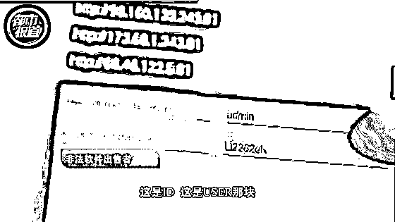
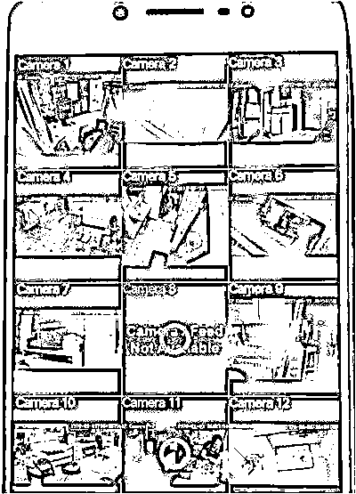
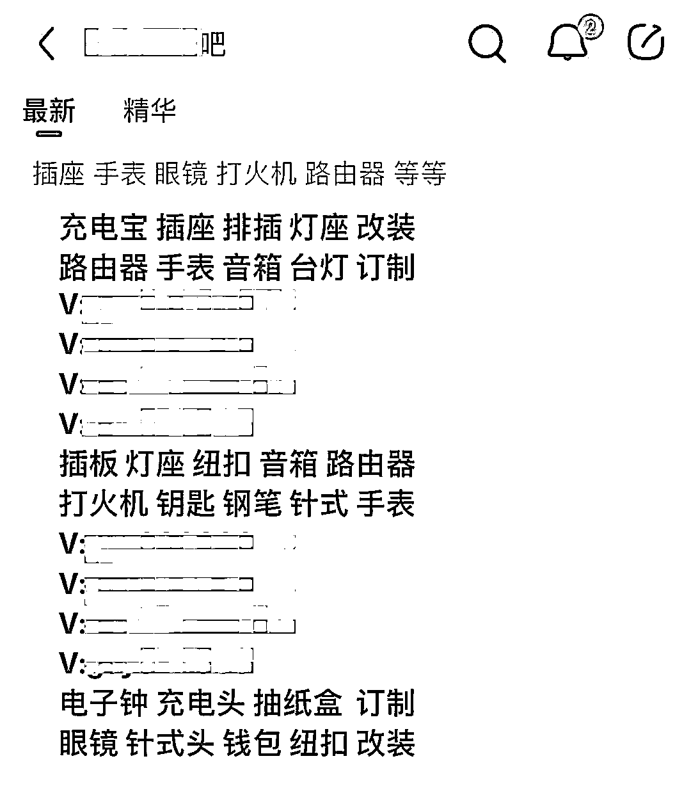
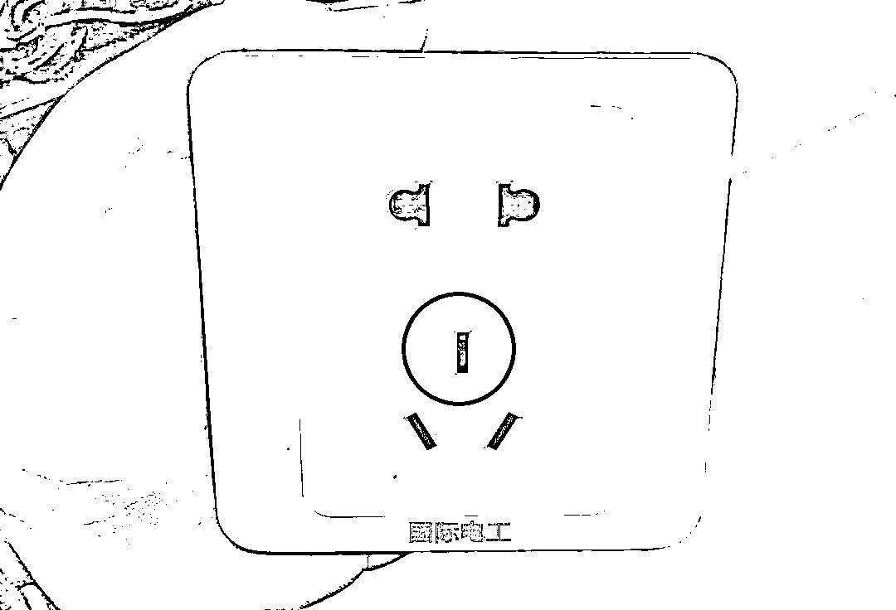
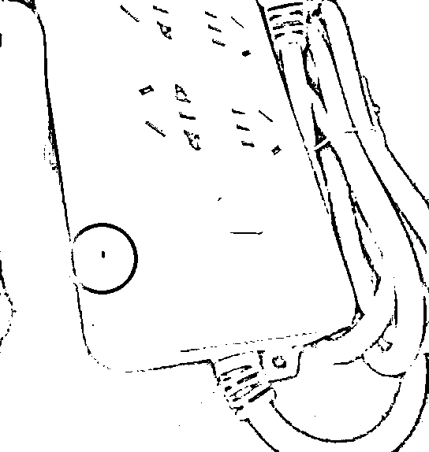
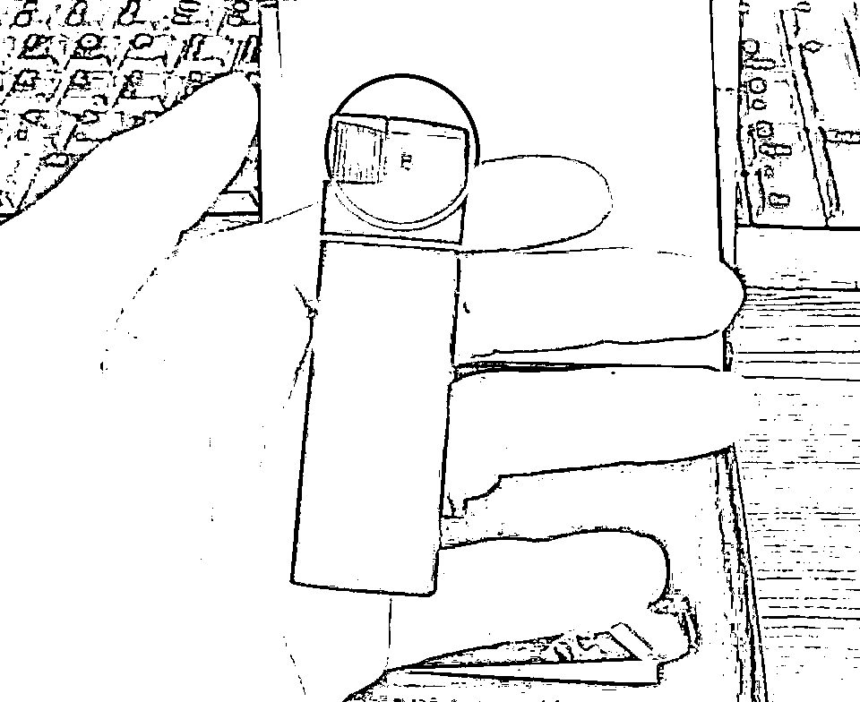
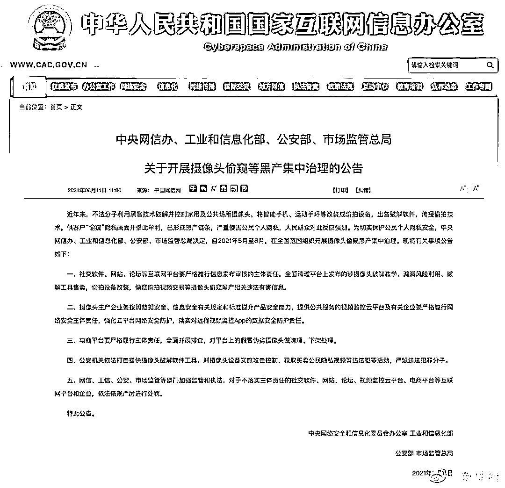

# 只需 188 元，可购买“30 酒店 30 家庭”套餐？

> 原文：[`mp.weixin.qq.com/s?__biz=MzIyMDYwMTk0Mw==&mid=2247516487&idx=2&sn=76c5f186e91a15df8457fda74ef6f876&chksm=97cb4a7fa0bcc369b71b6e3d12199ec9c96d06903d0518f70d178abd9dc01942db0fc02cda63&scene=27#wechat_redirect`](http://mp.weixin.qq.com/s?__biz=MzIyMDYwMTk0Mw==&mid=2247516487&idx=2&sn=76c5f186e91a15df8457fda74ef6f876&chksm=97cb4a7fa0bcc369b71b6e3d12199ec9c96d06903d0518f70d178abd9dc01942db0fc02cda63&scene=27#wechat_redirect)

3 月，一对夫妻住民宿时被偷拍了近 8 小时，甚至两人的悄悄话都能听的一清二楚； 4 月，一男子利用鞋尖上的针孔摄像头伸到女生裙底进行偷拍；5 月，一医院女浴室惊现针孔摄像头，多人被偷拍……各大社交媒体上，被偷拍的新闻事件屡见不鲜，即使多家媒体早已起底偷拍产业链，但是偷拍现象还是屡禁不止。酒店、厕所、出租房、公交地铁、扶手电梯……仿佛现实版《**楚门的世界**》，可能某一瞬间，你的隐私正在被别人肆意窥探。

# 

01

# **屡禁不止的偷窥事件**

造成隐私被偷窥的原因有很多，一部分是更衣室、酒店房间等私密空间，**被安装了隐藏摄像头**；另一部分是因为**家用及公共场所摄像头，被黑客恶意破解**，导致摄像头拍摄到的画面，泄露在互联网上。这种摄像头偷窥，甚至还发展出**黑产链条**。不法分子利用黑客技术破解公共场所的摄像头，同时将智能手机或者手环等电子设备改装成头牌设备，出售一些破解设备和传授偷拍技术也就成了一个产业，那些买了设备和学到技术的人就会利用一些“偷拍”的隐私画面进行牟利，成为了一个黑色的产业链，严重侵犯了公民的个人隐私，引起了社会的强烈反应。 

△ 图片来源于网络

188 元的套餐可获得“30 酒店 30 家庭”

288 元的套餐可获得“50 酒店 50 家庭”

500 元可获得“扫台软件和 50 酒店 60 家庭”

这是黑产的“黑话”，其中的数量即为卖家提供的摄像头的 ID 数，内容都是全天可看；“扫台软件”就是被破解过的软件，内容每天更新，摄像头的数量则是不限定的。

商家为了取得客户的信任，还特地发来一张时长仅有 3 秒的“闪照”，画面从顶部正对着床，一对赤身裸体的男女在床上，他们对自己已经被偷拍浑然不知。

△ 图片来源于网络在某些**App 和社区**，黑产内置了「直播间」的功能，让用户直接通过手机，就能查看别人的摄像头画面。用户付费之后，还能解锁所谓的「**会员专属内容**」。△ 图片来源于网络这些偷窥偷拍视频交易的违法行为，已经被查处过很多次。但在某些平台还是很活跃，因为不法分子售卖偷拍摄像头的小广告常常“戴着面具”出现。△ 图片来源于网络光看文字，是不是觉得就是些普通的家用电器？但这些电器，可都没有那么简单。插座上内置了非常不起眼的偷拍装置，如果不仔细观察，根本就很难发现摄像头的位置。 △ 图片来源于网络还有看似非常普通的排插，其实也是为了偷拍而定制，内置了专用的摄像头。△ 图片来源于网络更不可思议的是，就连体积非常小的打火机，也能成为偷拍设备。 △ 图片来源于网络这些设备，经常被用于恶意偷拍，出现在各种酒店和旅馆里，用于搜集客人的隐私画面。 和其他摄像头黑产一样，被拍摄到的画面通常都会被打包出售，或者上传到各种社区和平台供人观看。 

02

**网信办四部门重拳出击** 

## **严打黑色产业链**

## 针对互联网上的摄像头偷窥等黑产，有关部门已经开始在全国范围内，进行集中治理。

这种黑客入侵摄像头的乱象，终于要得到根治。6 月 15 日，中央网信办、工业和信息化部、公安部、市场监管总局决定，自 2021 年 5 月至 8 月，在**全国范围组织开展摄像头偷窥黑产集中治理**。公告称，近年来，不法分子利用黑客技术破解并控制家用及公共场所摄像头，将智能手机、运动手环等改装成偷拍设备，出售破解软件，传授偷拍技术，供客户“偷窥”隐私画面并借此牟利，已形成黑产链条，严重侵害公民个人隐私。根据公告，**社交软件、网站、论坛等互联网平台要严格履行信息发布审核的主体责任，全面清理平台上发布的涉摄像头破解教学、漏洞风险利用、破解工具售卖，偷拍设备改装，偷窥偷拍视频交易等摄像头偷窥黑产相关违法有害信息**。一、社交软件、网站、论坛等互联网平台要严格履行信息发布审核的主体责任，**全面清理平台上发布的涉摄像头破解教学、漏洞风险利用、破解工具售卖，偷拍设备改装，偷窥偷拍视频交易等摄像头偷窥黑产相关违法有害信息**。二、摄像头生产企业要按照数据安全、信息安全有关规定和标准提升产品安全能力，提供公共服务的视频监控云平台及有关企业要严格履行网络安全主体责任，强化云平台网络安全防护，**落实对远程视频监控 App 的数据安全防护责任**。三、**电商平台要严格履行主体责任，全面开展排查**，对平台上的假冒伪劣摄像头做清理、下架处理。四、公安机关依法打击提供摄像头破解软件工具、对摄像头设备实施攻击控制、获取买卖公民隐私视频等违法犯罪活动，**严惩违法犯罪分子**。五、网信、工信、公安、市场监管等部门加强监管和执法，对于不落实主体责任的社交软件、网站、论坛、视频监控云平台、电商平台等互联网平台和企业，**依法依规严厉进行处罚**。

* * *

对此，网友们直呼“**坚决支持，大快人心**”！小珊相信，在四部门的重拳出击下，偷窥事件将得到有效遏制，公民的隐私安全更加有保障。

来源：微信珊瑚安全

← 向右滑动与灰产圈互动交流 →

