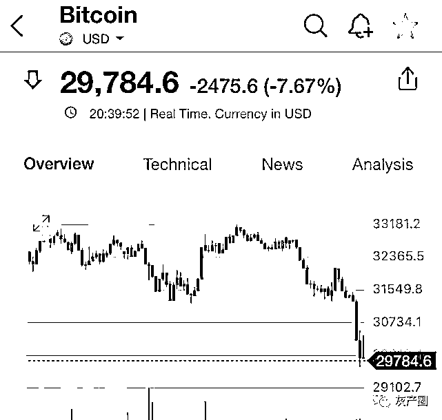

# 中国最后的比特币矿工！

> 原文：[`mp.weixin.qq.com/s?__biz=MzIyMDYwMTk0Mw==&mid=2247516579&idx=1&sn=481e6af26cca435997180a24abe4f38b&chksm=97cb4a9ba0bcc38ddbed6d9ea44eda8954ecd16f387754d71ff73ebbff2b0fff000857b5d138&scene=27#wechat_redirect`](http://mp.weixin.qq.com/s?__biz=MzIyMDYwMTk0Mw==&mid=2247516579&idx=1&sn=481e6af26cca435997180a24abe4f38b&chksm=97cb4a9ba0bcc38ddbed6d9ea44eda8954ecd16f387754d71ff73ebbff2b0fff000857b5d138&scene=27#wechat_redirect)

互联网金融投资的，如果不关注金融，你将会永远是亏钱的命，因为你赚钱的速度很难赶上资本游戏的速度。大家好我是老树，从事互联网投资十年左右时间，对各种互联网金融投资项目略有研究，希望我的分享能对你投资起到点帮助。

比特币跌破 3 万美元了！不开玩笑：这一次，比特币直接跌到了 2 开头，直接把这一年攒出来的梦幻涨势都跌掉了。

该公众号已被封禁

这是自 2021 年 1 月 2 日以来，首次下探 3 万。

要知道，比特币在 4 月中旬，还是所有投资者的宠儿。当时特斯拉官网显示，正式接受比特币付款——而后比特币价格扶摇直上，冲到了 6.5 万美元一枚的价格。

连带着其他加密货币，包括马斯克的宝贝狗狗币，也鸡犬升天，翻了好几倍。

5 月，中国宣布布禁止虚拟币交易和用作支付手段。

而后，几个省份先后发布规定禁令，封禁了虚拟币挖矿活动。

也正是因为这次严厉打击挖矿、关闭矿场，我们才知道……原来“比特币矿场”，竟然真的如此规模庞大……

在说比特币矿场之前，先来解释一下，挖矿是什么。

首先，虚拟货币不拥有纸钞和硬币，而是基于特定算法的大量计算产生，通过矿机提供算力进行工作量证明，来确保参与记账的节点的可信度。

如果简单点来打个比方，就是一场数学竞赛：虚拟货币系统规定找出一个质数就能获得一个币，所以所有人都铆足劲开始算数解题。（当然，找质数是有数学意义的，计算加密货币题没有，但同样是越到后面越难挖）

解题的这个过程，就被称为挖矿。

谁拥有更强大计算力的计算机，谁就更有可能获得更高的收益。

最早在 2009 年，这个数学题还不算太难，是台电脑就能挖。

但随着入场人数越来越多，解题难度也越来越大，于是矿机出现了—— 去掉一切不必要的硬件，使用多块显卡一起烧的方式工作，耗电量极大。

和普通计算机相比，这就是计算器和口算的区别：在矿机出现后，普通电脑挖币，就几乎被淘汰了。

矿机越多，算力越大，如果组成矿场，数千、数万架高性能矿机日夜不停地运转和计算，就可以成为源源不断的赚币机器。

但矿机功耗极大——所以电费开支也十分恐怖。

这些被消耗的电，都意味着被无端消耗的能源。

为什么说以比特币为首的虚拟货币不环保，也是在于此：

如果把比特币挖矿的耗电量算为一个国家，那它的耗电量在世界排名第 27，超过瑞典，超过绝大多数非洲国家。

这耗电量用于民生，能让不少非洲人民都过上小康生活；这计算力用于实业，特斯拉火箭早就上天了。

Digiconomist 称：一次比特币交易所使用的能耗，相当于美国普通家庭一个月的用电量。

一次比特币交易产生的碳排放量，是一次银行卡交易的 100 万倍。

它消耗大量电力、消耗海量算力，却只是用于对世界人民生活毫无意义的比特币。

中国，本来是世界上最大的挖矿国，占全球比特币开采量的 75％以上。

因为挖矿除了硬件购入，最大的成本就是电费，很多矿场都会选择自己承包一座小型水电站，建立矿场。

四川大约有 800 万的负荷用于加密货币挖矿，而这些耗电量却几乎没有创造就业岗位、带动当地经济效益提升。

**在宣布关闭矿场的时候，平时不挖币的朋友们都震惊了……**

**依山而建，数千万台矿机放在一起，规模庞大……**

**有矿老板自己公开了关闭矿机的照片……**

**矿老板悲痛欲绝：**

**「我已经连续喝了 17 天酒了。」**

在刚刚装修好，崭新明亮，还微微萦绕着油漆味道的成都高档写字楼里，专注于矿机中介业务的币芯科技涂先生坐在宽大的办公桌后对律动说。

现在不喝酒能做什么？每天下班后员工都回家了，很多矿场已经停电，机器也卖不出去，币价还在下跌，太苦闷了，不如出去听听别人更苦的故事。

6 月 20 日零点，四川所有比特币矿场在文件指令下被迫断电。此前，从内蒙古、青海，再到新疆、云南，国内的比特币矿工在政策文件的驱赶下不停地将机器转移阵地，四川成为最后的聚集地。然而，四川关停文件的下发，让矿工们的希望彻底破灭，也标志着中国境内理论上不再会有矿场，曾占比特币全网 75% 的中国算力，将彻底在地图上消失。

那刻骨铭心的一夜后，国内加密矿业之都——成都，最不缺的就是苦闷而迷茫的矿工。

6 月 22 日，成都某五星级酒店最高层的爵士酒吧，面色凝重的青壮年男士们三三两两坐在一起，边抽烟边交谈，身上的 T 恤零星印有「Bitcoin」、「To Da Moon」等币圈标语，谈话中充斥着「矿机」、「出海」、「海外资源对接」等关键词，酒吧门口的走廊里总是分散着零星几人，一边打电话销售矿机，一边来回踱步，烟一根接着一根。

同一天，成都另一五星级酒店的会场中，「全球矿业资源对接大会」低调召开，四川各地已经断电的矿工们来到这里，从各个出海公司的介绍中系统性了解出海流程，企图从抱团取暖和群众智慧中打捞出奔赴大洋彼岸的「诺亚方舟」。

从矿工的状态不难看出，停摆的中国比特币矿业，陷入了茫然和慌乱。

**停止运转的矿机**

在距离成都 50 公里的都江堰，磅礴的岷江汹涌而下，战国的李冰父子从滔滔流水中看到了世界闻名的水利工程，当代的比特币矿工则从中看到了矿机赖以生存的电力资源。

矿工老吴的矿场就坐落在都江堰的大山里，占地约 1000 平方米，依靠着水流的冲击维持着上万台矿机的日夜轰鸣。

深山中的比特币矿场，图片来自矿工

「5 月份内蒙古和新疆关停矿场的政策出台时，我并不慌。」老吴说在这个行业久了，从 2013 年开始，基本每隔一两年都会来一次挖矿政策严打，尤其是依靠火力发电的内蒙古，「我们都习惯了。」

因此当内蒙古的矿场纷纷关停时，老吴仍在线上收购二手矿机，并吸引更多机器到他的矿场托管。当时，他跟朋友聊天时淡定地说，「不要慌。」

时间进入到 6 月份，连老吴都有些坐不住。矿场在地方一线，已经从各个渠道收到了风声，但是老吴仍然心存期望。「四川和内蒙古、新疆不一样，这里有大量的弃水弃电，完全都是清洁资源，这些资源我们不用，就只能白白浪费掉。」

令人不安的消息最初从雅安开始。6 月 17 日，有市场消息称，四川雅安对矿场执行「一刀切」政策，25 日前需全部关停，且包括消纳电与弃水电。6 月 18 日，社群中开始流传一份由四川省发展和改革委员会、四川省能源局发布《关于清理关停虚拟货币「挖矿」项目的通知》，要求 26 个疑似虚拟货币「挖矿」项目重点对象于 6 月 20 日前关停。

跟矿工老龙相比，老吴算是幸运儿，毕竟老吴的矿场已经运行了几年，前几年的收益仍是可观的。

「今年 3 月份我开始在甘孜州建托管矿场，5 月完工，规模有 5 万千瓦负荷，可以容纳 3 万多台矿机，却在开工前夕被政策给堵死了。」老龙告诉律动，这个矿场总投资接近 2000 多万人民币，可以说血本无归。「毕竟托管矿场的利润就是来自于电费差价和托管管理费。」

这一次政府政策之迅速有力，国家态度之坚决，让老龙有点绝望。「这一行我已经做了 5 年了，每隔一两年都会有一次政策打击，但是这一次实在太严重，矿场、矿工、矿池，所有的挖矿群体都被影响到。」

在矿圈，老龙的遭遇仍不算最苦。「我有个朋友是也是托管矿场，之前已经投入使用。他的矿场投资 1.6 亿，矿机总价值达到 4 亿，但是政策出台后不但矿场停电，矿机停机，进出矿场的路也被封了，机器都运不出去，简直焦头烂额。」

**矿机五折大甩卖**

矿难面前，卖矿机成为很多矿工的被迫选择。

与深圳的著名矿机售卖点「赛格大厦」不同，尽管成都是矿工们集散的重要城市，被誉为成都「中关村」的电脑城并没有出现热火朝天卖矿机的景象。

与冷清的线下市场截然不同，线上比特币矿机正在经历 5 折甩卖。

国外矿企和矿场虽然在趁着国内「矿难」低价收购矿机，但是却把矿机价格压到更低。国外有需求方表示，「希望收到 40 美元/ T 的 S19j Pro」，折合人民币只有 252 元/T，100T 的机器总售价只有 25200 元，可谓是近几个月的「地板价」了。

如此低价，说明二手矿机市场已经趋于饱和，此前比特大陆也宣布，暂停现货矿机销售。然而，也有矿工认为价格太低，选择观望。

国内生存空间不断压缩，不甘心卖矿机离开这个行业的矿工，想要出海寻得一线生机。

目前四川大概有一千多万负荷的矿机要出海，阿豪告诉律动，停滞在国内的话，这些买矿机的老板和资金方会顶着非常大的资金成本。如同使用杠杆炒房，矿圈也不乏矿工使用借贷资金来买机器、建矿场，身上背负着成百上千万元的压力。「他们每天都要补充资金，慌得很。」阿豪说。

**近期就有行业人士表示，在哈萨克斯坦的一个矿场，矿机刚刚运到当地，就被抢劫一空，矿工欲哭无泪。**

「出海坑太多了，不是那么容易的。」阿豪也这样认为，「最初吉尔吉斯谈招商引资，曾经吸引了矿场过去，但最后军队直接把中国的矿场抢走，血本无归。」

在美国、加拿大等法制国家，出海建厂则面临着超高成本。阿豪告诉律动，在国内建设一万负荷的矿场，差不多需要 350-500 万元。同等规模下，国外则需要 1800-4000 万，目前比特大陆报价是 1800 万，比特小鹿报价是 4000 万。

**矿工要卖币了？**

在矿业众生相中，涂先生是坚守国内的一位。

他始终认为，不可能所有的矿工都出海，这不现实。「挖矿是需要资源和经验的行业，仅仅有钱是不够的。国外的矿场很容易收钱不办事，设置层层关卡来刁难你，最终让中国人出局。我觉得这都非常有可能。」

目前，四川确实有矿工正在出海或者已经出海，「但是绝大多数的矿工还在等待，等待的这部分矿工都相信政策一定会明朗。」涂先生告诉律动。

但这一轮监管，四川和成都要死掉一批矿企了。涂先生叹息道，眼神转向窗外数不清的漫漫楼宇中。 

来源：互联网行业前沿资讯整理自区块律动 BlockBeats

← 向右滑动与灰产圈互动交流 →

