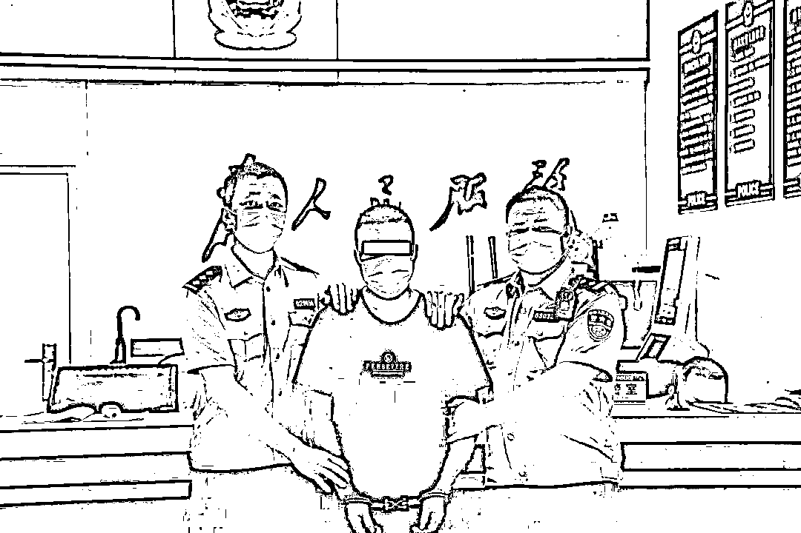
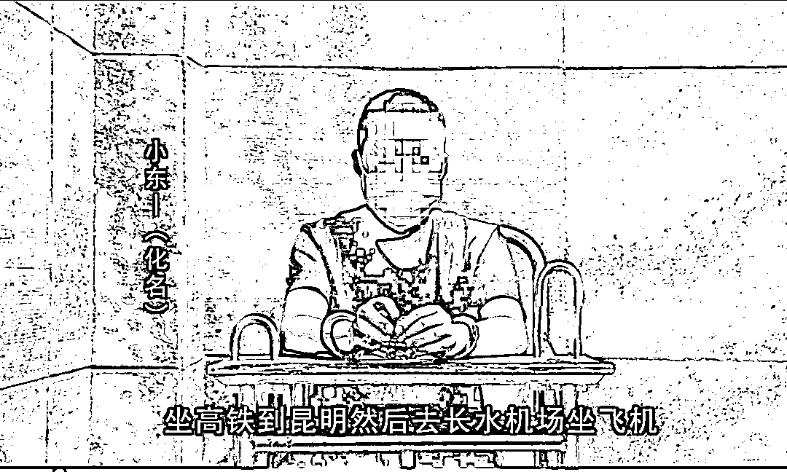
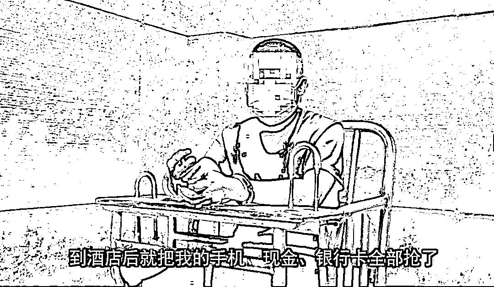
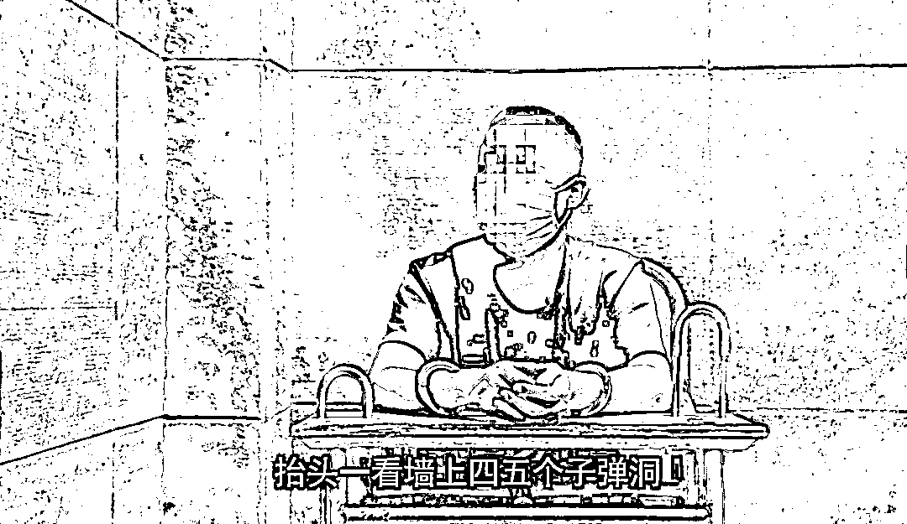
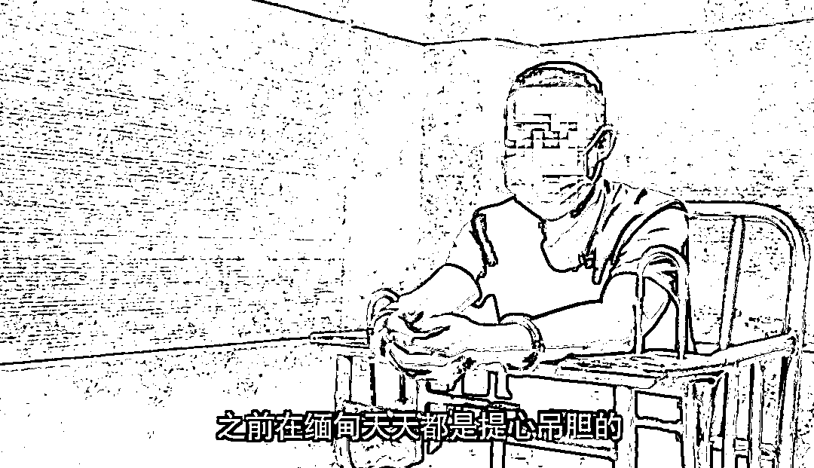
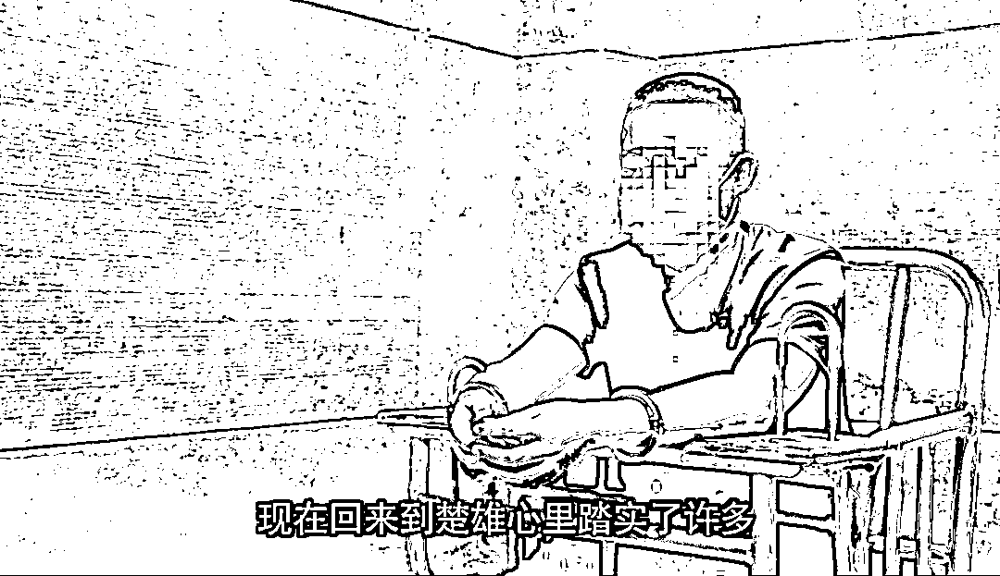

# 缅北木姐“惊魂记”：小伙三楼跳下逃回国，自述人生“深渊”经历！

> 原文：[`mp.weixin.qq.com/s?__biz=MzIyMDYwMTk0Mw==&mid=2247516579&idx=3&sn=901018f3019354ba5063ed181ae1f605&chksm=97cb4a9ba0bcc38dc1c38925f71ad02c0e03d5805b531b76a2bd90f6c4a045b63f530825b0c6&scene=27#wechat_redirect`](http://mp.weixin.qq.com/s?__biz=MzIyMDYwMTk0Mw==&mid=2247516579&idx=3&sn=901018f3019354ba5063ed181ae1f605&chksm=97cb4a9ba0bcc38dc1c38925f71ad02c0e03d5805b531b76a2bd90f6c4a045b63f530825b0c6&scene=27#wechat_redirect)

“

近日，在警方规劝下，涉嫌在缅北从事电信网络诈骗活动的楚雄籍男子小东（化名），到楚雄市公安局开发区派出所自首。

坐在审讯室里的小东告诉民警，即使现在他戴着冰冷的手铐，也觉得比在缅北温暖。回顾在缅北的日子，他觉得像做了一个噩梦...

**陷入高薪骗局，在货车夹层中偷入缅北**

2021 年 4 月初，小东在楚雄市的一家娱乐场所结识了一名张姓朋友，在谈起自己因家里建房而资金短缺时，对方称有朋友在云南瑞丽有份月薪近万元的果园管理工作，诚心邀请小东过去一起参与，甚至前往工作地点的机票也全部由该公司承担。面对高薪诱惑也为了帮助家里解决资金难题，小东立马同意了，对方也很快为其买好机票、车票。

4 月 21 日，小东乘机抵达芒市，可朋友口中的果园老板并未现身，转了 700 元钱给小东后，让小东先在芒市玩几天。想着老板的这些“恩惠”，小东逐渐放下了最后的戒心。

事后小东才明白，**这一切不过是犯罪分子的糖衣炮弹，就是为了诱他深入“狼窝虎穴”。**

4 月 27 日下午，两名自称在果园工作的男子驾车找到小东，声称要接小东前往果园，并谎称货厢坐人不舒服，让小东在货车的夹层间休息，等到了目的地喊他。当晚 11 点多，小东被带到了一个酒店，看到全是缅文和周围带枪的护卫，**他意识到自己来到了缅甸。**

**因为不听招呼，小东经常被人用枪托打**

这家酒店共有六层，一楼是赌场，二楼是卖淫场所，三、四楼全是搞网络诈骗的，五楼是洗钱区，六楼是老板和一些头目的活动区。小东被径直带到三楼，他怎么也没想到，迎接小东的不是美丽的前台小姐姐，而是三个持枪的彪形大汉。

“前两天还好，好吃好喝招待我，但第三天，他们就露出了真面目。因为张某在我离开楚雄之前以各种理由让我办了五张银行卡，领头的就问我要银行卡和微信支付密码。**我不愿意给，他们三个人就用枪托一起打我。过程大约持续了几分钟，当时血流不止的我很疼很害怕，但再一次被打后我妥协了，只想着先活下来，银行卡就交给了他们。”**

****

****

**小东此时彻底明白，自己完完全全被骗了。**

银行卡和微信支付密码交出两天后，对方让小东用微信“邀约”自己的亲朋好友来缅北一起工作。小东知道这是电信网络诈骗犯罪，再次强烈拒绝，但面对他的是更惨烈的毒打以及不让上厕所大小便拉到裤子里等一系列的折磨手段。熬了两天后，小东再次妥协了，开始尝试着用手机联系亲朋好友。

**窗外枪声不断，子弹飞进屋内是常事**

小东还是有良知的，他知道缅北的情况，如果为了自己骗了亲戚朋友，那就算自己回去了，内心也不会安宁。一个“人头”也没拉过来的小东，随后的日子过得更加凄惨。

诈骗团伙老大有时会当着他的面吸毒，兴奋之余甚至将枪顶在他的头上，对其训话、殴打。这样的情形小东以前从未见过，觉得死神就在身边，那些人随时可以结束他的生命。他暗自发誓，一定要找机会逃回国并自首，就算坐牢，也比在这强。

**有一天酒店外面打仗，枪声持续了很长一段时间，甚至有子弹从窗外飞进来。小东只能静静地躲在床底下，一趴就是几个小时。他哭过，也有过放弃的念头，但想到远在云南的父母和女朋友，他还是坚持了下来。**

**踏上家乡热土，是小东最安心的时候**

**“原本是做梦发财，结果差点有去无回，真是后悔又后怕！我现在是真的轻松了，宁愿回来接受警方处罚，也绝不想继续待在缅北！”**

****

在审讯室，小东说得最多的就是这句话。

回到祖国的怀抱，手铐对小东来说并不冰冷，反而觉得十分温暖。他知道在这里有的是希望，会有法律保护自己。而在充斥着色情、暴力、犯罪、毒品、战争的缅北，只有绝望。小东最后说，回到祖国他像是又重活了一次，而这一次他要好好地活着。

目前，小东因涉嫌帮助信息网络犯罪活动罪，已被楚雄市公安机关依法刑事拘留，案件正在进一步侦办中。

**反诈民警提醒：**

根据我国法律规定，偷越国（边）境、电信网络诈骗和赌博活动是违法犯罪行为，害人害己，公安机关将严厉打击，请广大公民切勿从事相关活动。《中华人民共和国刑法》第三百二十二条规定：违反国（边）境管理法规，偷越国（边）境，情节严重的，处一年以下有期徒刑、拘役或者管制，并处罚金。广大群众要提高警惕，通过正规、合法的劳务中介外出务工，切勿轻信赴缅北地区的招工信息。如遇此类招工信息，请及时向公安机关报警。

最后，警方正告滞留缅北人员及其家属，请及时联系劝导亲人尽快回国入境投案自首。如实供述自己罪行的，可以依法从轻或者减轻处罚；犯罪情节较轻、有重大立功表现的，可以依法减轻或者免除处罚；拒不入境投案自首的，公安机关将依法从严惩处。

来源：平安楚雄，昆明反电信网络诈骗中心

← 向右滑动与灰产圈互动交流 →

