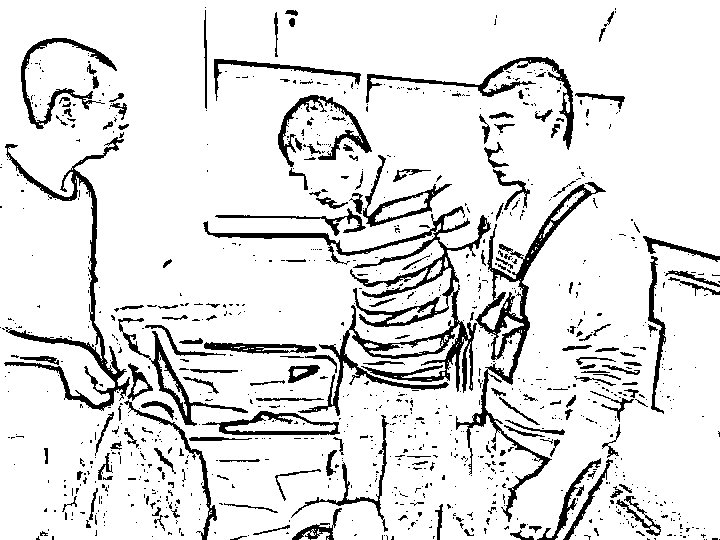

# 骗 骗 子 的 钱 违 法 吗？

> 原文：[`mp.weixin.qq.com/s?__biz=MzIyMDYwMTk0Mw==&mid=2247516579&idx=5&sn=707899841a8258ce74e839546fdf96b1&chksm=97cb4a9ba0bcc38db53bea4067b81ae21d6cd5419b77ab5db5c209455012ed0901c9df99ae41&scene=27#wechat_redirect`](http://mp.weixin.qq.com/s?__biz=MzIyMDYwMTk0Mw==&mid=2247516579&idx=5&sn=707899841a8258ce74e839546fdf96b1&chksm=97cb4a9ba0bcc38db53bea4067b81ae21d6cd5419b77ab5db5c209455012ed0901c9df99ae41&scene=27#wechat_redirect)

# 如果说骗子盯着受害人的钱

那谁会盯着骗子的钱呢？

没想到还真有

他们精心设局

抓住骗子不敢声张的心理

在骗子得手后“截胡”诈骗款

但如此做法

依旧是将群众的血汗钱

装入了自己的口袋

好在民警出击抓获嫌疑人

** 事情是这样的 **

6 月 13 日 

武昌区公安分局中华路派出所

接到市民吴先生报案

称有人通过 QQ 冒充自己的外甥

以借钱为由骗走了 3 万元

吴先生的钱转至骗子指定账户后，当天就被人在珠海市香洲区翠微街的银行 ATM 机上取走了。

中华路派出所民警在市局、分局相关部门的支持下，先后两次前往珠海，在当地警方的配合下，明确了取款人员身份，并于今年 10 月中旬联合武昌分局刑侦大队，在珠海将犯罪嫌疑人**阳某华、庞某远、许某华**抓获。

▲办案民警在珠海将犯罪嫌疑人阳某华（打码者）抓获。

“你们取走的钱是违法犯罪所得，已涉嫌诈骗！”面对民警的询问，阳某华及庞某远均辩称，他们只是将银行卡卖出，并未参与网络诈骗。

原来，两人将办理的银行卡卖给许某华，又由许某华转手，最终流到网络诈骗分子手中。**卖卡时，两人知道卖出的银行卡很可能用于不法活动，想着卡里的钱即使被他们“截胡”，买卡人也不会报警。**

于是，他们用自己的手机与卖出的银行卡绑定，一旦收到卡里有进账的通知，就立即将卡冻结，重新补办后将卡里的钱取出。

目前，三名犯罪嫌疑人已被武昌警方依法刑事拘留。

这三名犯罪嫌疑人的套路过程

你看懂了吗？

办理银行卡并绑定手机号——卖给诈骗子分手——骗子诈骗受害人得手——收到进账通知——将已进账的银行卡办理冻结——重新补办——将卡里的钱取出。 

好在这套路被民警揭穿

追查到了受害人被骗的钱财

办案民警介绍，诈骗罪是指以非法占有为目的，用虚构事实或者隐瞒真相的方法，骗取数额较大的公私财物的行为。此案中三人设局，虽然是“骗骗子的钱”，但其行为已经涉嫌诈骗罪

来源：天天防诈骗

← 向右滑动与灰产圈互动交流 →

