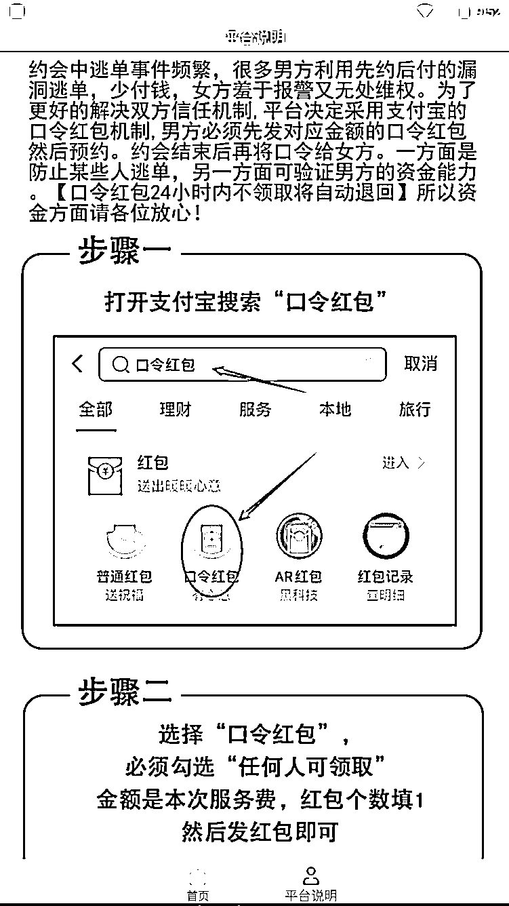
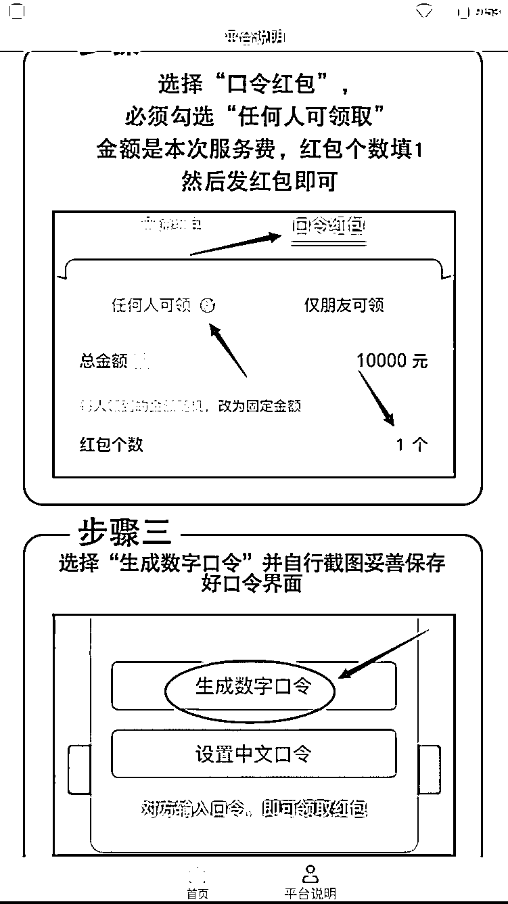
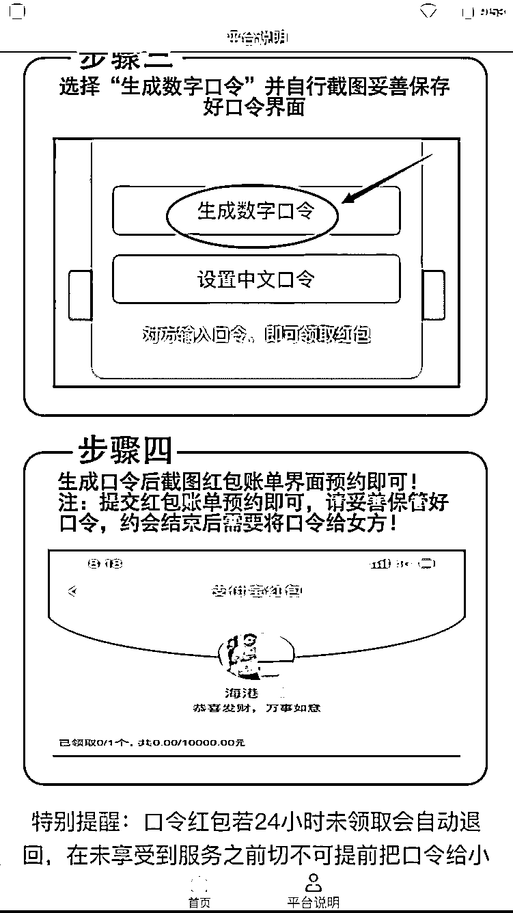
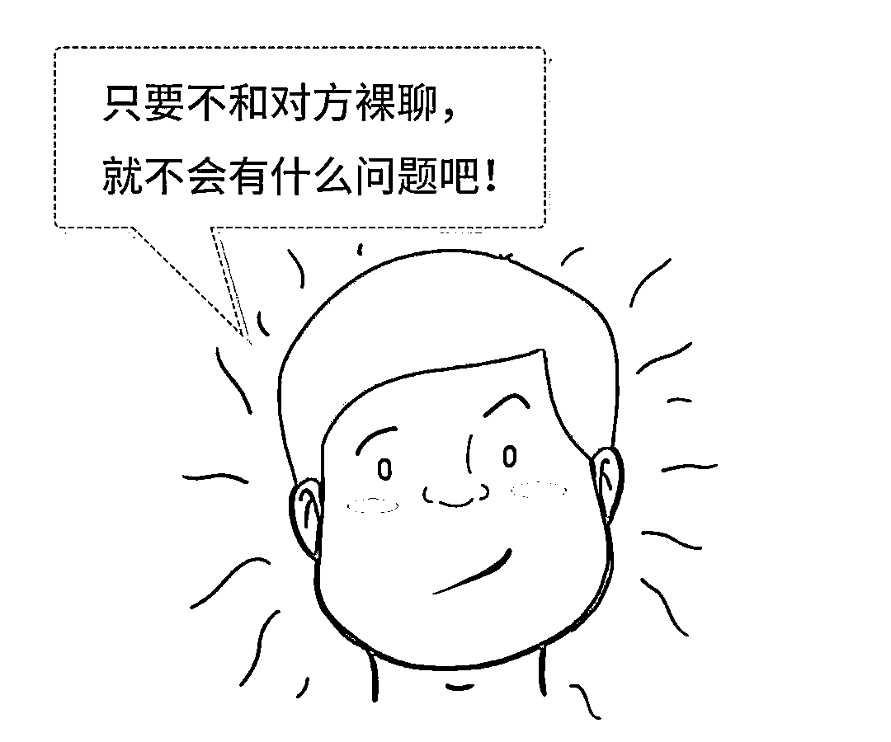
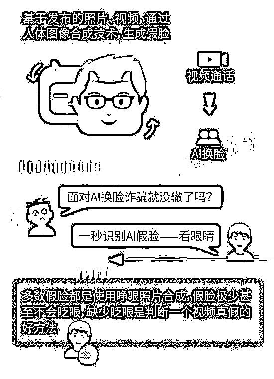

# “暗雷”？警方首次破获“暗雷”诈骗团伙！

> 原文：[`mp.weixin.qq.com/s?__biz=MzIyMDYwMTk0Mw==&mid=2247516579&idx=6&sn=32aee49094d636a2f4ef08eab92a9f4b&chksm=97cb4a9ba0bcc38d7fc502c88549d3c6b373a99ff02106d0115b910ac73b4e5b75f46a4f96b5&scene=27#wechat_redirect`](http://mp.weixin.qq.com/s?__biz=MzIyMDYwMTk0Mw==&mid=2247516579&idx=6&sn=32aee49094d636a2f4ef08eab92a9f4b&chksm=97cb4a9ba0bcc38d7fc502c88549d3c6b373a99ff02106d0115b910ac73b4e5b75f46a4f96b5&scene=27#wechat_redirect)

“暗雷”诈骗 

AI 换脸诈骗

这些“花式诈骗”你可得小心

Part.01

**“暗雷”诈骗**

近日，上海警方经过缜密侦查，连续成功破获 2 个利用“暗雷”手段实施诈骗的犯罪团伙，抓获犯罪嫌疑人 12 名。 

**什么是“暗雷”？**

“暗雷”是网络黑产技术不断变种升级的又一衍生物，不法分子以色情交友、色情视频、虚假购物、网络刷单等为诱饵，诱骗被害人下载含有木马病毒的 APP，通过“超限采集”“虚假链接”“虚假平台”等手段骗取被害人钱财。

2021 年 3 月，上海市公安局网安总队在工作中发现，有人在网上利用内嵌“暗雷”的手机应用软件实施诈骗犯罪，即会同奉贤分局成立专案组展开案件侦查，并很快锁定了犯罪嫌疑人王某益和苏某。 

经查，王某益、苏某从非法渠道获得“暗雷”源码及技术后，开发制作了 10 余个隐藏“超限采集暗雷”的手机 APP，又招揽张某才、历某哲等人在微信、QQ 群中传播这些手机 APP。团伙成员在诱骗被害人下载 APP 时，往往会打着线下交友、色情交易的幌子，以显示诚意为由，让被害人先准备好支付口令红包并提供截图。被害人本以为只要口令在自己手中，红包就不会支付成功，所以轻易就提供了截图。

殊不知，犯罪团伙开发的手机 APP，在被害人下载安装时就已经在不知不觉中进行了各种授权，比如授权该 APP 可以访问手机相册、通讯录等内容，而口令红包在生成时，支付平台会在相册里自动保存含有支付口令的截图。此时，即使被害人未将口令给予对方，但犯罪团伙可以利用已经授权的超限采集将口令截图窃取，最终达到获得红包内钱款的目的。 

4 月 15 日，专案组在上海市奉贤区及黑龙江、广东、福建、江苏等地同步收网，抓获王某益、苏某等 9 名犯罪嫌疑人，初步查证涉案金额 40 余万元。

**目前高发的“暗雷”手法：**1

使用最多的一种为**“虚假链接雷”**，这种“雷”以网络色情、网络刷单等内容为诱饵，诱导被害人下载不法 APP，待被害人欲获取相关物品或者内容，点击支付页面为 1 至 2 元不等的支付链接时，实则支出了百元至千元不等的交易金额。

2

其次，叫**“口令红包雷”**，不法分子以色情图片、低价游戏充值等为诱饵，诱导被害人下载不法 APP，悄悄获取被害人手机的相册权限，引诱被害人生成支付宝口令时，同时窃取了口令截图，没等被害人反应过来，已经输入口令拿走红包。

3

还有一种叫**“购物平台雷”**，不法分子通过搭建仿真知名购物网站，让受害人下载后误以为自己在使用真实网站，在购物付款过程中，钱财实际却支付进不法分子提前搭建的支付通道中。

**警方提示：**

“暗雷”类 APP 表面上与一般 APP 无异，但被害人在下载安装 APP 后，由于犯罪团伙的事先设置，被害人往往会掉入“超限采集”“虚假链接”等陷阱，且犯罪分子在后台操作时，无论是盗取红包、修改金额等，手机界面上都不会有跳转页面等反应，毫无痕迹，极具迷惑性。被害人发现时，往往只有一条扣款短信。

Part.02

**AI 换脸诈骗**

近日，江苏常州小伙王某在游戏中认识一名“女网友”，在她的请求下，王某下载了一个聊天软件，之后“女网友”发来视频邀请。

听说过裸聊陷阱的王某，很快意识到，这可能是个骗局…… 

然而，意识到是骗局的王某想和“骗子”过几招，于是他打开摄像头后只露出了自己的脸，其他身体部位都遮蔽完好。

没想到不久之后，“骗子”给王某发来一段有他自己头像的不雅视频，原来犯罪分子使用“AI 换脸合成技术”迅速移花接木。

更令王某懊恼的是，在此之前，“骗子”已经通过木马程序取得自己的手机通讯录，在威胁下，王某共计转账 11 万余元。

AI 换脸诈骗的手法

1.“骗子”使用“AI 换脸合成技术”进行移花接木，伪造事主的不雅视频，进行威胁事主转账等。

2.“骗子”首先分析公众发布在网上的各类信息，根据所要实施的骗术，通过 AI 技术筛选目标人群。人脸效果更易取得对方信任，在视频通话中“骗子”用 AI 技术换脸，可以伪装成任何人，再通过视频方式进行信息确认。

**警方提醒：**

遇到这种诈骗，切断和“骗子”的一切联系，立刻报警！

随着信息技术的进步，犯罪分子的诈骗手段也在不断升级。裸聊诈骗花样百出的今天，有受害人是真裸聊被敲诈，也有受害人没有裸聊，仅仅点开视频聊天就被敲诈。在网上交友时，要保持清醒，提高自己抵抗诱惑的能力（也克制一下我们的好奇心）。一旦遭遇敲诈，不要奢望“骗子”会真正删除视频，在“骗子”诈骗的每一个关键环节，受害人都应该立即切断和“骗子”的联系，立即报警！

来源：广东刑警、深圳 CID、反诈骗先锋

← 向右滑动与灰产圈互动交流 →

