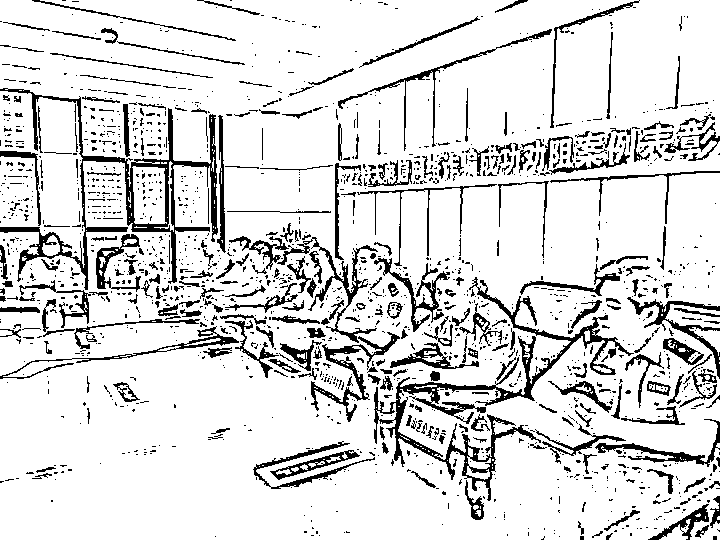
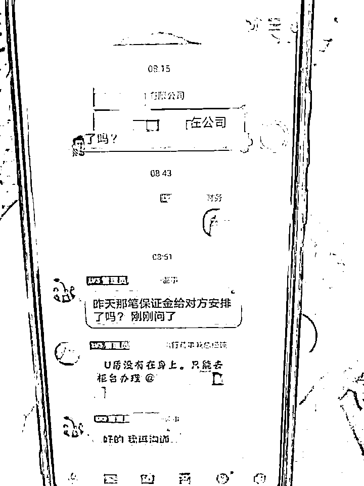
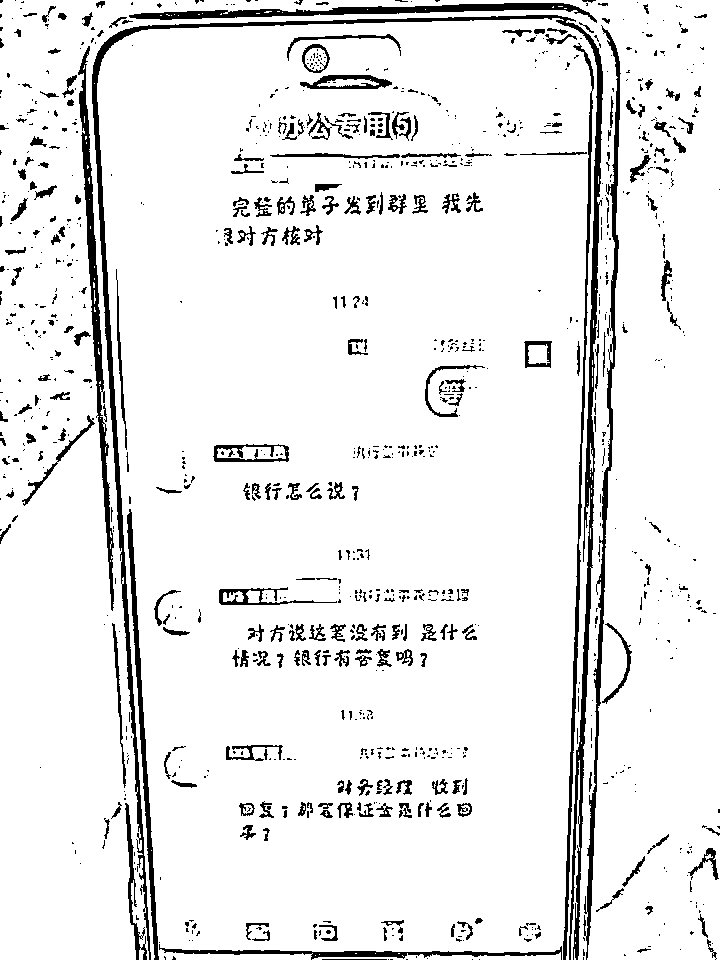
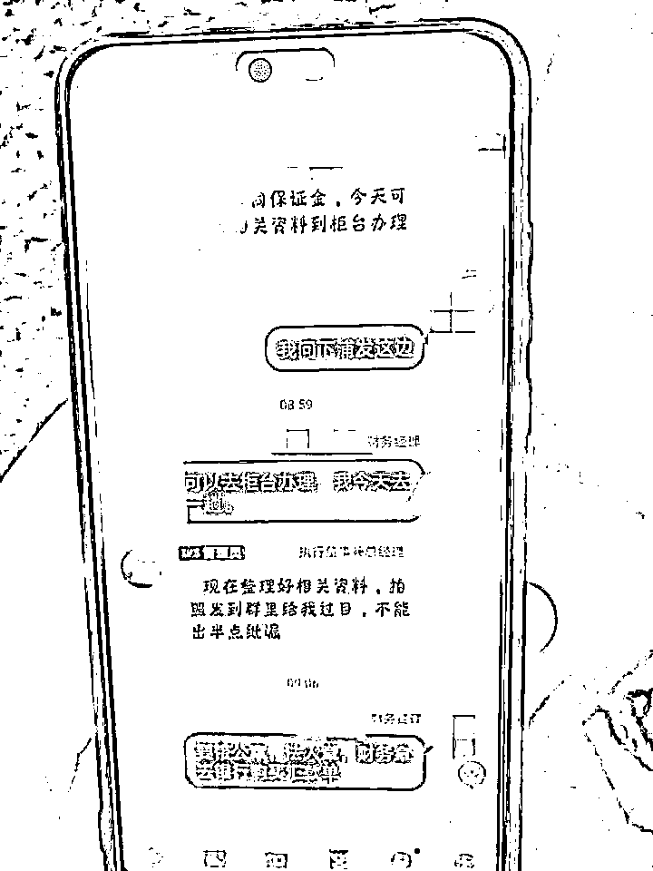

# 董事长反复催促，女财务立马转账 238 万，结果……

> 原文：[`mp.weixin.qq.com/s?__biz=MzIyMDYwMTk0Mw==&mid=2247516579&idx=7&sn=a97f3064d86322e6077242827fb6e680&chksm=97cb4a9ba0bcc38d77c967d1d671908e173f6e5ba9d7d796b94e69ce5621c5583c85674a97de&scene=27#wechat_redirect`](http://mp.weixin.qq.com/s?__biz=MzIyMDYwMTk0Mw==&mid=2247516579&idx=7&sn=a97f3064d86322e6077242827fb6e680&chksm=97cb4a9ba0bcc38d77c967d1d671908e173f6e5ba9d7d796b94e69ce5621c5583c85674a97de&scene=27#wechat_redirect)

账面资金 587 万，差一点中招！ 

钱江晚报小时新闻记者了解到，这是今年以来全省银行电信网络诈骗现场止损最大金额！ 

6 月 25 日上午，杭州市公安局、人民银行杭州中心支行、浦发银行杭州分行领导前往浦发银行萧山支行，对两位浦发银行萧山支行员工进行表彰奖励。

他们分别是浦发银行萧山支行的运营主管姚世恩和柜台工作人员倪琳。

6 月 22 日 10 时 50 分许，一名女子在浦发银行萧山支行进行 238.96 万元大额汇款时，引起银行工作人员的注意，通过观察询问，细心的工作人员怀疑女子很可能遭遇了电信网络诈骗，于是按照反诈机制要求，第一时间拨打 96110 向杭州市公安局反诈中心汇报。 

骗子冒充公司领导发出转账指令，谎称需要打保证金

反诈中心立即联动人民银行杭州中心支行对接浦发银行启动对该银行账户的临时性保护，指令萧山区公安分局派警力赶赴现场，保持紧密联动。 

与此同时，浦发银行萧山支行工作人员则按照反诈新机制要求，在积极开展止损工作的同时，安排人员在民警赶到前安抚受害人，同时通过工作群提醒同行以防万一，一旦受害人坚持离开，避免其在别的银行继续汇款。 

萧山区公安分局北干派出所反诈组接到预警后，第一时间安排警力赶赴现场开展先期处置，联系公司负责人核实情况，迅速明确这是一起典型的冒充老板电信网络诈骗。此时，受害人方才恍然大悟。 

警方赶到现场找到受害人

经核查，当事人李女士（化姓，31 岁，萧山人）是滨江某公司财务人员。6 月 21 日傍晚，李女士收到以公司老总名义发来的 QQ 邮件，未经核实便相信对方，并按要求加入一个项目群。群里“董事长”让她向指定账户缴纳 238 万元保证金，作为公司环保项目开发所需。 

当晚，李女士在公司尝试用 U 盾转账 238.96 万元，万幸的是，当时因复核未通过而转账失败。她将情况汇报“董事长”，对方让其第二天上午去开户银行转账。

骗子反复催促刘女士打款

当天上午，在“董事长”多次催促下，李女士来到浦发银行萧山支行柜台汇款，在填写资料时被工作人员瞧出端倪，提醒对方大额转账需要法人确认。然而李女士称已得到“董事长”首肯，在被劝阻后又到自助柜台进行操作，工作人员再次进行干预，并将情况上报。 

刘女士在银行汇款时 工作人员及时阻拦

市局反诈中心立即启动紧急止付程序，通过受害人资金临时性保护，寻求浦发银行总行支撑，对已经提交交易的 238.96 万元通过总行系统进行止付。 

鉴于李女士已将相关账户信息透露给骗子，考虑到账户安全，反诈中心同时通过浦发银行杭州分行对该公司账户内剩余的 348 万元资金进行止付保护，使企业免遭 587 万元的巨额经济损失。

因处置及时，已提交交易的 238 万元被快速拦截，目前已全部退回该公司账户。 

**警方提醒**

类似财务人员上当受骗的案例，真的有点多。 

这次钱虽然保住了，却也暴露出企业管理上的漏洞！ 

公司未严格执行财务制度，重要 U 盾由李女士保管，没有审核程序就可单独汇款。

李女士作为企业财务人员，未当面向领导核实，就进行大额转账。还是民警和银行工作人员联系上企业负责人，对方才知道情况。 

“当时真不知是怎么想的，也许是这些天太忙了，脑袋有点浑……”李女士后悔不已。 

而滨江警方和当地政府都曾对该公司开展过反诈宣传，显然该公司及员工并未予以重视。 

北干派出所民警再次对李女士及公司领导进行了反诈宣传，相信经过这次教训，他们不会再轻易着了骗子的道。 

萧山警方再次提醒，遇到自称“领导”、“老板”的，一定要再三核实！即使是他本人的账号，甚至老板亲自在工作群里“网络答复”，也一定要得到本人亲口有声确认。同时，所有转账汇款务必严格遵守财务规章制度。

来源：钱江晚报

← 向右滑动与灰产圈互动交流 →

