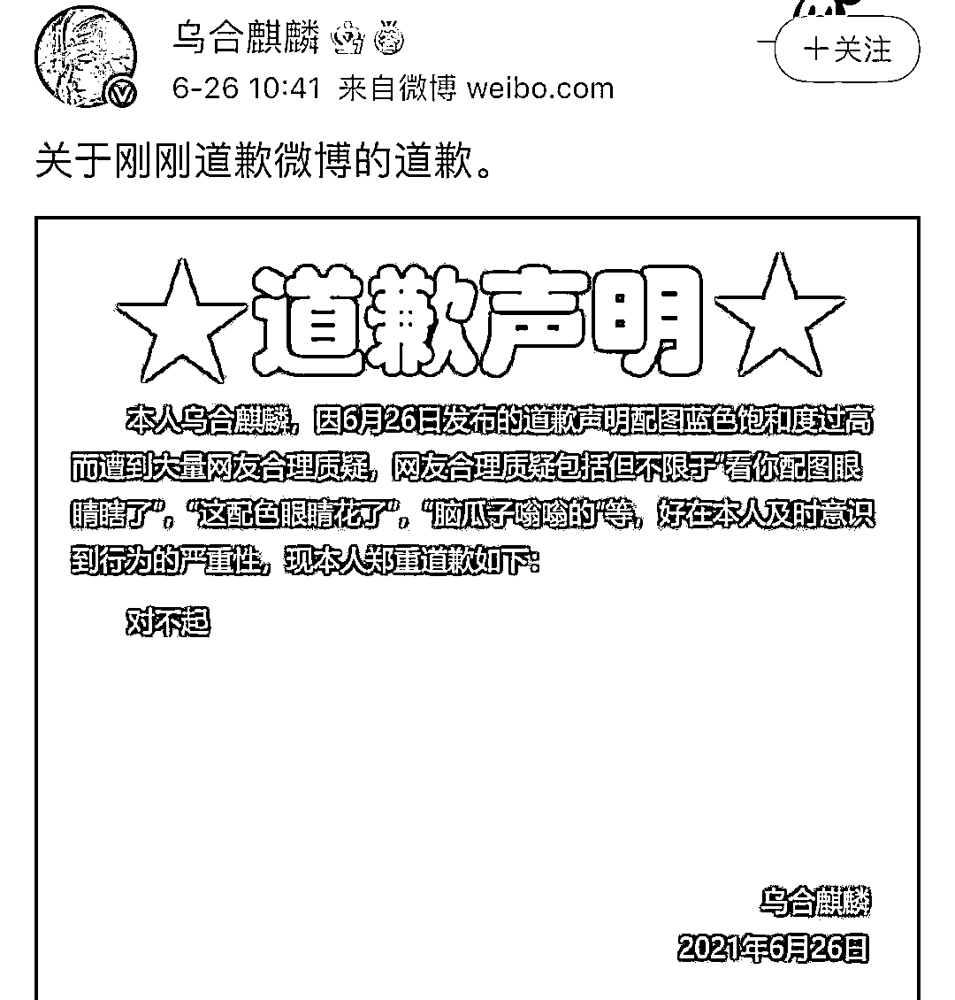

# 笑死在@乌合麒麟 的道歉声明里…

> 原文：[`mp.weixin.qq.com/s?__biz=MzIyMDYwMTk0Mw==&mid=2247516664&idx=1&sn=e05d6ab69fefde34782e3a8500f06511&chksm=97cb4ac0a0bcc3d63f5574d2345081b0e6f09c854a768f52cdf96dc0cd06921f517f0b3890e7&scene=27#wechat_redirect`](http://mp.weixin.qq.com/s?__biz=MzIyMDYwMTk0Mw==&mid=2247516664&idx=1&sn=e05d6ab69fefde34782e3a8500f06511&chksm=97cb4ac0a0bcc3d63f5574d2345081b0e6f09c854a768f52cdf96dc0cd06921f517f0b3890e7&scene=27#wechat_redirect)

26 日上午，知名爱国画手@乌合麒麟 为自己几天前转发的一篇新闻接连“道歉”两次。被转发的这篇新闻中提及我国国产芯片的最新研究进展，专家受访时称“国产 14nm 芯片明年底可以实现量产”，@乌合麒麟 转发时配文“封锁着封锁着我们什么都有了”，以表对文中提及的技术突破感到欣喜的心情。 

但这条博文随即被大量数码博主质疑，指@乌合麒麟 转发的内容“不严谨”“过于乐观”，甚至有人称其“造谣”，还上升到了@乌合麒麟 “以一己之力毁了国产芯片”的程度。

唇枪舌战持续了至少 2 天，@乌合麒麟 今天发表长文“道歉”，但全篇阴阳值飙高。

节选

事情最早起因是，24 日@乌合麒麟 转载了一名数码博主的博文并配文“封锁着封锁着我们就什么都有了”，原贴为"专家谈国产 14nm 芯片量产"的报道。但原 po 主关于国产芯片的一些看法似乎缺乏严谨，经过@乌合麒麟 的转发，让更多人看见了，也引发了众多争议和批评。

目前这条博文已经被@乌合麒麟 删除，同时他又重新发布了一个“严谨版本”。

转发的报道仍是环球网对中国电子信息产业发展研究院电子信息研究所所长温晓君的采访内容，只是这篇报道删去了原有的“国产 14nm 芯片明年底可以实现量产”的部分。

文中，温晓君详细介绍了国产 14nm 芯片的发展以及现状，看好国产芯片的未来，同时也坦言在芯片的技术追赶上，我国和世界第一流的代工企业存在着代差，想要后发赶超则需要投入更多的人力、财力与时间成本。

这回@乌合麒麟 依旧表明自己对于国产芯片技术突破保持乐观期待的态度，“（国产芯片）实现量产那天我得好好吹一波。”

而对于那些数码博主们指其“不严谨”“过于乐观”的批评，@乌合麒麟 在评论区里也再次强调，国产芯片近些年的进步就是值得夸赞的，真的实现量产时必定举国欢腾，以回应博主对其“小粉红意淫”的指责。

同时他还认为这些一拥而上“教育”自己的数码博主们“并不友好”。后者对报道内容有不同见解时，不是给普通路人解释相关专业知识，却是对其进行人身攻击。

不过对于@乌合麒麟 的看法，还是有很多数码博主认为他不了解国产芯片的现状，低估了行业难度。有批评还称他“对国产芯片的盲目吹捧会阻碍行业进步”“以一己之力毁了国产芯片发展”。

26 日上午，@乌合麒麟 突然对此事发表长文道歉，随即登上微博热搜第一。细看后，被这通篇的“阴阳”味直冲天灵盖。

介于这文的阴阳气质独特，转述概括容易变味，强烈建议大家看原文感受“原汁原味”：

> （一）本人无法确证环球网所说"14nm 芯片今明两年能实现品产"一事是否属实，也同样无法确证某数码博主“堆叠优化提升功率"这样的技术存在或者不存在，也同样无法理解某数码博主“芯片堆整技术等于两杯水倒在一起”的类比逻辑。
> 
> 所以本人就转载数码博主转载环球网报道一事对广大网友和芯片研发科技人员道歉，同时为我对中国芯片事业造成的伤害和阻滞道款。
> 
> 同时因为本人无法确证任何与芯片及手机相关讯息，本人承诺今后不会转载或者提及任何和芯片技术有关的咨询和博文（但是前文所提及实现量产我将画图庆祝的承诺依旧） ，尊重网友“画画的就好好画别乱沸腾”的合理质疑和友善建议。
> 
> （二）本人数码圈路人，从未看过任何数码杂志数码论坛和也没了解过任何数码博主 up 主，本人根本不认为华为小米魅族 oppo 这些手机使用起来有什么不同，也不能理解你们对于不同品牌手机之间的争论，在我的认知里谁能突破美国对中国芯片的卡脖子我就支持谁，所以不要在我评论下方讨论不同手机品牌的正义性与非正义性（？），本人晕猴。另本人对某些数码与非数码博主发布檄文自发组织粉丝来我微博团建一事持保留态度。
> 
> （三）本人沸腾博主，喜欢沸腾，这点不好改，但好在中国现如今值得沸腾的领域非常多，我将在其他领域继续沸腾，如果我的沸腾阻碍了其他领域人员的发展和埋头苦干，我将继续道歉。

更绝绝子的是，在第一条“道歉”博文被吐槽背景底色晃眼后，@乌合麒麟 又马上对此发文“道歉”，但底色依旧没改，“我道歉了，但我不改。”

用行动践行每造成一个困扰就立刻道歉的承诺，道歉业务能力逐渐娴熟，这波是“阴阳嘲讽力 max”了。

来源：观察者网

← 向右滑动与灰产圈互动交流 →

