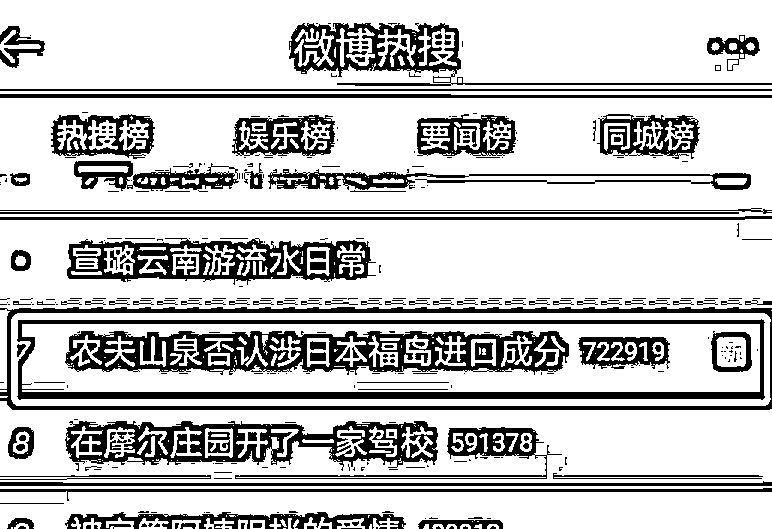

# 突发！4000 亿“水茅”营销大翻车？疑用福岛白桃做原料，刚刚紧急回应！

> 原文：[`mp.weixin.qq.com/s?__biz=MzIyMDYwMTk0Mw==&mid=2247516664&idx=2&sn=cfccfc1777c5b97a5cfa1908d89981a1&chksm=97cb4ac0a0bcc3d60b9736c419c6f48297437d056067b499581f852f83b1ec312741a6e2ff29&scene=27#wechat_redirect`](http://mp.weixin.qq.com/s?__biz=MzIyMDYwMTk0Mw==&mid=2247516664&idx=2&sn=cfccfc1777c5b97a5cfa1908d89981a1&chksm=97cb4ac0a0bcc3d60b9736c419c6f48297437d056067b499581f852f83b1ec312741a6e2ff29&scene=27#wechat_redirect)

“大自然的搬运工”、“水中茅台”农夫山泉，最近被网友质疑为“福岛核废水的搬运工”。

事情是这样的，近日，农夫山泉旗下一款气泡水产品，在外包装与商场宣传中主打“福岛县产”的宣传，遭到网友广泛的质疑。

而刚刚，农夫山泉回应了！称没有从日本福岛进口的成分。还表示自己的标签标示符合相关法规要求，并无任何错误或误导。要求相关账号立即删除对农夫山泉名誉造成伤害的文章和评论。

这下网友可炸了，认为农夫山泉倒打一耙，自己宣传的福岛，如今却不认了？还怪群众眼睛雪亮？相关内容迅速冲上微博热搜。

到底咋回事？

农夫山泉产品宣传“福岛县产”引质疑

近日，有网友发现农夫山泉拂晓白桃味苏打气泡水，无论外包装还是商场宣传都在主打“福岛县产”的宣传。

产品简介上写得很明确：拂晓白桃风味，拂晓白桃产自日本福岛县。 因而，网友纷纷质疑，农夫山泉这是从日本福岛进口拂晓白桃？

据悉，拂晓白桃本是日本福岛县有名特产，但自 2011 年日本福岛发生严重核泄漏后，周边水土遭受大量污染。鉴于核泄漏事故对食品、农产品质量安全的影响，我国国家质检总局明令禁止从日本福岛县、群马县、栃木县、茨城县等 12 个县城采购进口食品、食用农产品及饲料。

 农夫山泉回应：没有关联

要求相关账号立即删除

该质疑声越来越大，今天中午，农夫山泉就农夫山泉拂晓白桃味苏打气泡水产品原料来源事宜，紧急做出回应：

一、农夫山泉拂晓白桃味苏打气泡水产品是一款风味饮料，农夫山泉在产品标签配料表中按照食品安全国家标准的规范要求标明了产品配料。该产品的配料中没有从日本福岛进口的成分。农夫山泉产品的标签标示符合相关法规要求，并无任何错误或误导。

二、拂晓白桃原产于福岛，风味独特，上世纪在我国已有引种。我们研发人员依据拂晓桃的独特风味，创制了类似拂晓桃风味的产品，与拂晓桃产地没有关联。

三、农夫山泉要求今日头条等媒体平台和各社交媒体账号立即删除对农夫山泉名誉造成伤害的文章和评论，以避免进一步造成对农夫山泉名誉的传播性伤害。 

网友彻底怒了：自己写的福岛

还怪群众眼睛雪亮？

这下网友可彻底怒了。网友纷纷讨伐：农夫山泉自己写的福岛，如今却不认了?还怪群众眼睛雪亮？！

网友认为，农夫山泉自己将福岛作为广告宣传，如果好好道歉也就算了，如今自己营销出问题摆出一幅被人搞的样子。

曾是”大自然的印钞机“

如今年内高点暴跌 2800 亿

而从二级市场的表现来看，2020 年 9 月 8 日，农夫山泉在港交所上市，首日高开 85.12%，总市值超 4400 亿港元成港股食品饮料第一。

随后股价继续飙涨，在年初创出 68.75 港元的高点。钟睒睒也随着农夫山泉的市值飙涨，登上亚洲首富之位，农夫山泉由此被成为“大自然印钞机”。 

然而，在年初创出 68.75 港元的高点后，农夫山泉的股价跌跌不休。今年一度跌破 40 港元的关口，跌幅超 40%。

最新股价为 41.05 港元每股，市值已蒸发超 2800 亿港元至 4617 亿港元。 

毛利率近 60%

农夫山泉上市之际，还因毛利率超 50%颇受市场关注。而最新数据显示，其毛利率已经近 60%了。

2021 年 3 月 25 日公司披露 2020 年业绩公告，其中实现主营业务收入 228.77 亿元，较 2020 年中期 6.2%跌幅有所收窄；实现归母净利润 52.77 亿元，同增 6.6%。

其中，2020 年，公司毛利率 59%，同比提升 3.6pcts，主要系 pet 原材料价格大幅下滑所致。

来源：中国基金报

← 向右滑动与灰产圈互动交流 →

