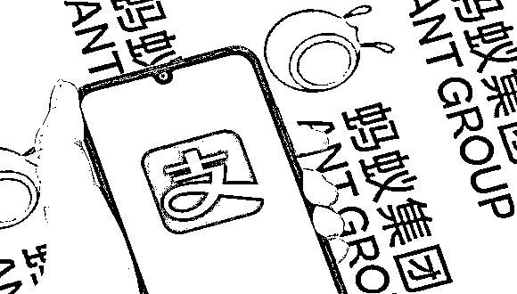
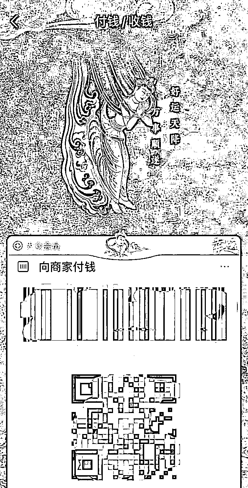

# 支付宝也开始卖皮肤了？

> 原文：[`mp.weixin.qq.com/s?__biz=MzIyMDYwMTk0Mw==&mid=2247516664&idx=3&sn=ea747ddaa48fa534b2582bd541e73405&chksm=97cb4ac0a0bcc3d62631a7f929858191dce509fa8d2bbe4c56f5b1d71f7f0b0575a1a565f1e5&scene=27#wechat_redirect`](http://mp.weixin.qq.com/s?__biz=MzIyMDYwMTk0Mw==&mid=2247516664&idx=3&sn=ea747ddaa48fa534b2582bd541e73405&chksm=97cb4ac0a0bcc3d62631a7f929858191dce509fa8d2bbe4c56f5b1d71f7f0b0575a1a565f1e5&scene=27#wechat_redirect)

支付宝也来做“NFT”了。

6 月 23 日起，支付宝与敦煌美术研究所及动画《刺客伍六七》共同推出基于蚂蚁链发行的“NFT”版付款码皮肤，每款 NFT 限量 8000 份，售价为 10 支付宝积分+9.9 元，每日分两批抢购。随着该活动热度的增加，发售的 NFT 被一抢而空。

6 月 24 日，一位 NFT 资深爱好者胡先生告诉界面新闻记者：“昨天 12 点我参与抢购，点了一下，说什么系统繁忙，瞬间就没了。”

而另一位已抢到敦煌款 NFT 付款码的支付宝用户廖先生迅速在朋友圈中进行了展示，并向界面新闻记者表示：“刚开始其实很好抢，活动零点刚开始，早上六点多才抢光。但最近两次就抢不到了。”

敦煌合作款“NFT”版付款码

火热的社交传播度不禁让人想起支付宝曾经的“集五福”活动。和当年有黄牛专门收集“敬业福”进行套利外，限量版的支付宝“NFT”也滋生出一定的炒作空间。

支付宝“NFT”抢购活动进行时，闲鱼 APP 上开始出现同款 “NFT”的回收和售卖，廖先生提供的截图显示，有黄牛在闲鱼发帖：“高价回收支付宝 NFT 敦煌美术研究所 NFT 编号 0001 或者 6666 的，十万一张，其他编号 500 一张。”网传截图显示，闲鱼同款 NFT 最高标价已到 150 万元。

但还没等投机者蜂拥入场，闲鱼就迅速采取措施熄灭了炒作之势。

6 月 24 日，闲鱼官方突然下架了所有 NFT 相关商品。界面新闻记者登录 APP 对“NFT”做关键词索引，显示“未找到相关商品”。

2021 年以来，加密艺术和“NFT”在全球爆火，艺术界早就刮起了一股制作“NFT”的旋风，从原生的加密艺术家 Beeble 的作品拍卖出 6900 万美元天价，到村上隆试图拍卖“NFT”作品，借助区块链技术的“NFT”天生就带着交易和收藏的诱惑。

而支付宝作为最大的互联网平台之一，其庞大的流量直接让本次活动出了圈，此前春节时支付宝的“集五福”活动已经让人们体会到收集和分红包的乐趣，本次每款付款码皮肤 8000 份的限量加上 9.9 元的亲民价格，再结合稀缺的“NFT”概念，很容易让人产生抢购一个转手天价卖出的冲动。

而关于炒作“NFT”，抢购活动的技术提供方蚂蚁链早已表达明确的态度。

路透社报道，蚂蚁链负责人表示“NFT 不是加密货币。NFT 是对数字资产权利内容和历史交易流转信息进行记载的电子化凭证，是所对应的数字资产在区块链上的唯一映射，具有唯一性和不可拆分性，不可做数学意义上的加总，不具有等价交换物特征。平台不会给艺术品炒作价格提供场所和机会。”

据支付宝活动的官方介绍，蚂蚁链对“NFT”的定义为“非同质化通证”，强调“NFT 与虚拟货币等同质化代币存在本质不同，有数字商品的实际价值做支撑，也不具备支付功能等任何货币属性。”

同时，支付宝还提示艺术品交易都有潜在投资风险，郑重呼吁艺术品购买者谨慎投资，反对非理性炒作。

当支付宝提供的“NFT”不能进行交易，仅有展示和收藏、赠送功能，而且在使用规则上限定：“NFT 数字作品的发行方为杭州鲜活万物品牌管理有限公司，版权由发行方或原作创作者拥有，除另行取得版权拥有者书面同意外，您不得将 NFT 数字作品用于任何商业用途。”

只能看不能交易，而且没有所有权。因此有人质疑支付宝的 NFT“名为 NFT，实为 JPG”。这其实是因为买卖双方对 NFT 存在不同的理解和认识，即对所交易的“财产”的概念和性质有不同的定义，因此带来了争议。

而这一点涉及到了知识产权保护领域的专业知识。

在我国知识产权保护领域中，知识产权分为著作权、商标权、专利权三大类。一般艺术作品就属于著作权范围，也就是我们通常所说的版权。

2021 年 6 月 1 日，第三次修订的《中华人民共和国著作权法》开始实施，而著作权中关于作品的定义包括音乐、美术、建筑、摄影等，还新纳入了“视听作品”来保护视频类的原创作品，而大部分 NFT 作品格式上恰恰都是图片与短视频。

加密艺术家 Sleepy 撰文称：“即使是在我们熟知的公链 NFT 领域，对于版权和所有权问题，NFT 交易平台的做法也与传统艺术领域无异。”

“当你买下一幅 NFT 艺术品你拥有的是这幅画，这幅处于 NFT 这个新兴艺术媒介上的画，媒介与图案共同构成了这一幅“画”。这并不代表你可以把这个图案印在其他媒介上用作商业用途，就算你买下了 FEWOCiOUS（一位 18 岁的美国加密艺术家，作品多有超现实主义波普艺术风格） 的一幅极具张力的作品，在没有他授权的情况下，你也不能把它印在衣服上并拿出去卖，因为这侵犯了艺术家的版权。”Sleepy 表示。

北京社会科学院法学所副研究员刘劭君表示：“事实上数字环境下，掌握 NFT 的所有权的意义并不大，因为实现收益的不是基于对原作 NFT 的物权所有权，而是通过复制、发行或制作周边产品而产生的经济利益，而这一项权利应当与作者另行协商也是没有问题的。目前争议的焦点可能是因为大众将对 NFT 的所有权视为版权，所以才愿意支付对价，但事实上不具有著作权意义上对作品的使用权。”

6 月 26 日，原中国银行副行长王永利撰文称：“在国家严厉控制比特币等虚拟货币的挖矿和交易炒作之时，NFT 的快速升温和大规模投资，特别是参与海外 NFT 投资，同样存在很大的风险隐患，需要加强对 NFT 的准确解释，加强对民众的投资者教育，强化交易平台的职责。”

来源：界面新闻

← 向右滑动与灰产圈互动交流 →

