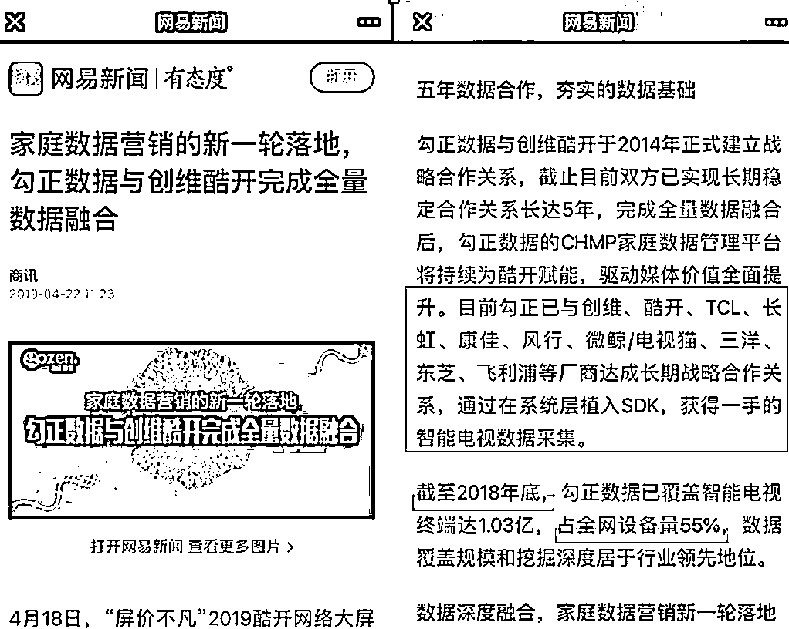

# 细思极恐！你家电视有可能正在扫描家庭所有联网设备……

> 原文：[`mp.weixin.qq.com/s?__biz=MzIyMDYwMTk0Mw==&mid=2247516664&idx=4&sn=9281956821647c0ba9e004bbcb4f0544&chksm=97cb4ac0a0bcc3d616a73d71736253b9b6f5b0f9893aefdad09628df271da613248afa47220b&scene=27#wechat_redirect`](http://mp.weixin.qq.com/s?__biz=MzIyMDYwMTk0Mw==&mid=2247516664&idx=4&sn=9281956821647c0ba9e004bbcb4f0544&chksm=97cb4ac0a0bcc3d616a73d71736253b9b6f5b0f9893aefdad09628df271da613248afa47220b&scene=27#wechat_redirect)

近日有网友反映，在使用创维电视时，发现电视每 10 分钟就扫描一遍所有的联网设备，用户的主机名、MAC 地址和 IP 地址甚至周边邻居的 wifi 名称等隐私信息都被打包发送到了一家名为“勾正数据”的企业。

用户发帖

这家勾正数据，为何能进入创维电视内置的应用程序？拿到的数据又被用作什么？

**超限收集用户信息**

**隐私安全如何保护？**

****

****资料显示，勾正数据是一家智能营销第三方大数据公司。**勾正拿到的数据，大多用来做开机广告和贴片广告的优化。**该公司的服务涵盖了大量视频门户网站与电视厂商。其数据覆盖了 1.03 亿的智能电视终端，占全网设备量的 55%。****

********

****勾正数据公司的自我介绍****

********

****勾正数据公司业务介绍****

****事后，创维公司发布声明称，勾正公司与创维旗下的酷开公司有业务合作，但**合作内容仅限于以抽样调查国内收视情况为目的的必要数据采集。其他任何超出此范围的行为，均未得到许可及授权。**目前已经解除合作关系，并责令其删除非法获取的创维用户相关数据。****

********

****创维公司声明****

****数码评论员黄浩称，提取用户画像卖钱，已经成为很多数据公司的主要业务，广告商甚至不少视频平台都需要他们提供数据，电视机开屏广告、视频 APP 的推送，能做到不同用户看到不同内容，都是根据用户画像来进行的定义，但勾正**如此频繁、深入的用户画像收集，已经超过了本该有的限度**。****

****数码评论员黄浩：其实每个人看到的电视机推送的内容是不一样的，电视机厂商或者是数据服务商，通过后台在收集用户的数据。工信部有明文规定，可以收集用户数据，因为如果消费者想享受这种自动推送，肯定要给予这些智能设备一定的权限，但是有一个度。****

****为了制定用户画像，真的还要做到扫描家中互联网连接设备甚至周边 wifi 信息吗？黄浩解释，通过扫描不同的设备，数据服务商能够对用户进行更精准的分析。****

****事后，勾正公司也回应称，该公司所采集用户数据的相关信息用于收视研究相关业务：家庭和个人收视率、收视效果分析、广告收视分析和优化。“勾正数据服务”因涉及到用户设备信息的采集，由于用户隐私政策提示不够清晰，引起部分用户隐私安全的担忧，向广大用户诚恳致歉；本着对用户数据隐私至上的理念，公司将改进和完善用户隐私政策，确保在合法合规的范围内按照用户的授权依法收集信息。****

********

****勾正数据公司发布的声明****

****对此，黄浩认为，如此解释难以让人信服，因为消费者对于收集了哪些信息并不知情：****

****数码评论员黄浩：收集信息要有度，扫描家里路由器全网连接的所有内容已经过度了。在收集数据的时候是要给予消费者明确的公示跟告知，让消费者来做数据收集的决策者，而不能说在消费者不知情的情况下就把数据收集了。****

****大数据收集难以举证****

****用户如何维权？****

********

****那么这种行为是否涉嫌违法？北京岳成律师事务所律师岳屾山介绍，我国《民法典》、《网络安全法》和《消费者权益保护法》中，对于个人信息的收集有明确的要求，既遵循合法、正当、必要性原则，**商家取得信息前，必须要经过用户同意。******

****北京岳成律师事务所律师岳屾山：商家在取得这些信息之前，必须是要经过用户的同意才可以，要有明确的授权，而且**这些授权不应该是捆绑取得**。很多商家明知法律有这样的要求，但却故意掠夺用户的信息，因为这些信息能给他们带来相应的收益，按照法律的规定，这种侵权应当停止侵害，赔偿损失，之前违法获取信息的行为，或者说所获取的信息，应当进行清理和删除。****

****岳屾山也承认，在司法实践中，**由于大数据收集有一定专业性，用户很难证明损失，更别提对商家提起诉讼**，这就更需要相关行业主管部门主动出击。****

****北京岳成律师事务所律师岳屾山：在实际的司法实践过程当中，用户很难证明自己有什么样的损失，这也是导致很多商家肆无忌惮的使用这种侵权手段获取信息的原因之一。对他们来讲，是没有违法成本或者说侵权成本的，这其实也需要相关主管部门，不管是市场监管部门还是网络主管部门，对这类行为要及时的进行清理，对相应的行为进行处罚和处理，形成有效的威慑。****

****超限收集用户信息，不光没有用户明确的授权，绝大多数人甚至无法察觉，收集的信息又真的如数据公司所说用于收视率分析、广告优化等吗？大数据作为新兴事物，又有多少人能像专业人员一样留存证据？****

****看电视本是工作和生活的调剂品，却还要和电视厂商、数据服务商勾心斗角，匹夫无罪，怀璧其罪，电视厂商、数据服务商关心的恐怕不仅是用户的家里网速多少，每天看什么样的节目，更多的还是据此分析来推送广告获取利益，这里面又是否涉及用户数据买卖我们不得而知。少点套路，多点真诚，莫让智能电视成为直播用户生活的工具。****

******来源：黑白之道，反诈骗先锋******

************

******← 向右滑动与灰产圈互动交流 →******

************