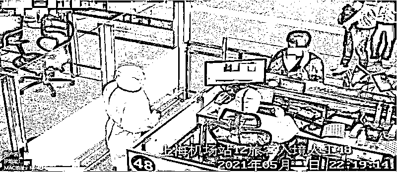

# 偷渡东南亚赚“高薪”，被当奴隶一样贩卖！

> 原文：[`mp.weixin.qq.com/s?__biz=MzIyMDYwMTk0Mw==&mid=2247516664&idx=6&sn=a9ca1a4930edd5bda00c0c2100b97ed8&chksm=97cb4ac0a0bcc3d6d7bad1e206cf518cea4ce0593e83beb0590d3e68f7332fe3609fa815eaa0&scene=27#wechat_redirect`](http://mp.weixin.qq.com/s?__biz=MzIyMDYwMTk0Mw==&mid=2247516664&idx=6&sn=a9ca1a4930edd5bda00c0c2100b97ed8&chksm=97cb4ac0a0bcc3d6d7bad1e206cf518cea4ce0593e83beb0590d3e68f7332fe3609fa815eaa0&scene=27#wechat_redirect)

当飞机降落在上海浦东国际机场，重回祖国怀抱的王某某如释重负。

前段时间，在东南亚某国狱中，每当回想起自己的经历，他时常心惊胆战，夜半时分还经常从噩梦中惊醒。

同机被遣返的还有一对“难兄难弟”彭某和谢某某。

与王某某一样，因为受到网友蛊惑，怀着“暴富梦”的两人，偷渡前往东南亚“打工”，历经千险，美梦却化为泡影，最终被遣回国。

面对上海机场移民管理警察的询问审查，三人将此次境外噩梦般的“淘金”经历和盘托出。

**中介“安利”赚快钱**

**难抵诱惑落陷阱**

****

****2019 年，在外务工的王某某，经过工友介绍，与一个微信名叫“XX 联大”的中介成为网友。****

****“**此人经常发布介绍境外高薪工作的招聘广告，月薪保底 2 万，缴纳五险一金，食宿全包，还报销路费**。”****

****起初，王某某尚能分辨出这些招聘广告的虚假。****

****“**自己做货车司机，虽辛苦，但收入可观，对这类消息也就视而不见。**”王某某说，不过，禁不住“XX 联大”的长期吹嘘，幻想着轻松“赚快钱”的自己渐渐财迷心窍，掉进了跨境赌博集团精心编织的诈骗陷阱。****

****去年 12 月中旬的一天，在“XX 联大”的安排下，王某某简单收拾行李，告别 8 岁的儿子，在中介的指挥下，偷渡出境。****

****当天，他数次更换交通工具，辗转数家酒店，历经千辛万苦，来到一条边境小河前。****

****“快跟我蹚过河！”话音未落，引带者便已下水，王某某来不及卷起裤管，稀里糊涂也就跟了过去。****

****河对岸，等待着的接头人像极了训练有素的“保安”，手持武器，身材健硕。****

****到了边境那一端，见到全副武装的接头人，王某某如梦初醒。****

****相似的情节，不同的主角。****

****去年 7 月，谢某某接到网友“陈信”的“高薪邀约”，便与老家发小彭某商议去境外闯一闯。也是到了边境那一端，见到全副武装的“保安”后，俩人才意识到自身已被诱骗掉入陷阱，难以脱身。****

******网络赌博花样多******

******看清套路有多深******

************

******在“保安”的呵斥下，上了一辆车后的王某某，被运送至边境线附近的某处所。******

******随后，他的身份证、手机、银行卡和随身衣物等都被强行收走。******

******12 人间的宿舍犹如小黑屋，门从外面反锁，所有窗户被木板封堵，一日三餐定点送来。******

******“门被关上那一刻，我恐惧极了。隐约听到中国军人嘹亮的口号，能感受与祖国的距离如此近，却又那么远！”王某某向上海机场移民管理警察讲起刚进“小黑屋”时的情景。******

******在暗无天日的“小黑屋”等待了几天，他与其他人又被集中带至一辆卡车，**像被贩卖的“奴隶”，经过多次“转手”，分散到各处从事诈骗活动或者苦力活**。******

****遭遇了同样经历的谢某某与彭某，最终被“转手”到一家名为“XX 集团”的公司。****

****一到公司，老板便逼迫他们签署若离职需赔偿十几万元的合同。****

****这十几万里即包含了协助他们偷渡所产生的交通、食宿等各项所谓“免费”的费用。****

****随后，彭某和谢某某被安排从事微信号运营工作，主要负责通过微信推广赌博相关 APP。****

****连续“推广”数月，摸清些许门路的谢某某坦言，网络赌博是个无底洞，远超正常人想象。****

****据两人介绍，为逃避法律监管，犯罪集团通常把服务器设于境外，组织人员利用虚假微信群、QQ 群等手段向境内宣传推广，引诱网友关注并参与。****

****一旦有境内网友产生兴趣，集团便以充值返奖金、高胜率、资金秒到等噱头引诱人加入，甚至还通过免路费、住宿费招赌吸金。****

****网友一旦上钩，他们就通过操控后台修改胜率，让网友小赢几回吊其胃口。引诱他们把钱充值到赌博平台后，平台便限制提现额度，增加赌客参赌时间和频次，最终被平台通过“抽水返点”等方式吸走全部资金。“其实无论输赢，平台都会以‘无法提现’为由让充值资金有去无回。”彭某说。****

****“**每天要维护近百个微信号，一个号被封，便被处罚 3000 元。因完不成业务被责骂体罚是家常便饭，当提出离职时，我已经要赔 20 多万了！**”谢某某向民警讲述。****

******目睹断肢惨状******

******伺机绝命逃亡******

************

******迫于“道德”压力，再加上也做不出业绩，谢某某与彭某便计划逃跑，可看到逃跑被抓回的人常常是断手断脚，逐渐丧失勇气。******

******直到有一天，见“保安”把一人打到奄奄一息后，随手扔进山沟，两人暗自思忖“再不逃，早晚也会死”，最终鼓足勇气。******

******今年 3 月，彭某和谢某某决定与具有逃跑意向的另外 3 人一起“搏”一把。******

******一天，趁着月黑风高，他们沿着“集团”园区围墙，躲开“保安”视线，瞅准机会，相继翻墙，最终幸运地逃离“魔窟”。******

******逃跑第二天，他们便被东南亚某国警方逮捕，关押两个月，缴纳 2 万余元罚款后，两人最终得以遣返回国。******

******据彭某交代，**一起逃出来的另外 3 人因未缴纳足额罚款，如今还关押在该国监狱**。******

****几乎相同的日期，从另一个园区逃跑的王某某有着更曲折离奇的经历。****

****据其交代，因拒绝签署所谓的劳务合同，他被分配到工地做工，每天工作十五六个小时是常态，稍有不从，侮辱谩骂，电棍殴打更是常有的事。****

****一个多月后，他又被安排做“区块链”相关工作，实际上是从事“杀猪盘”勾当。****

****“不想犯罪，便撒谎说自己没文化，做不来。”王某某说。****

****为保命，他白天在工地上谨小慎微，对带班“领导”言听计从，晚上则计划着逃跑路线。****

****3 月上旬的一个深夜，趁看守不备，他从宿舍逃了出来。****

****黑暗中，他翻越“公司”周围铁丝网，沿着蜿蜒的小路穿越边境森林，慌不择路地跳入冰冷的河水中。****

****为躲避追捕，他在河中芦苇丛躲了近 3 小时。****

****临近天亮，他独自一人沿河而下，泅渡过河。****

****刚一上岸，便被东南亚某国警察逮捕，之后的经历同彭某和谢某某一样，辗转于数个监狱，接受罚款，购买昂贵机票，被遣返回国……****

****日前，上海机场边检站依法对上述三人进行处罚，并将相关情况通报给三人户籍所在地的公安机关。****

****来源：上观新闻 ****

********

****← 向右滑动与灰产圈互动交流 →****

********