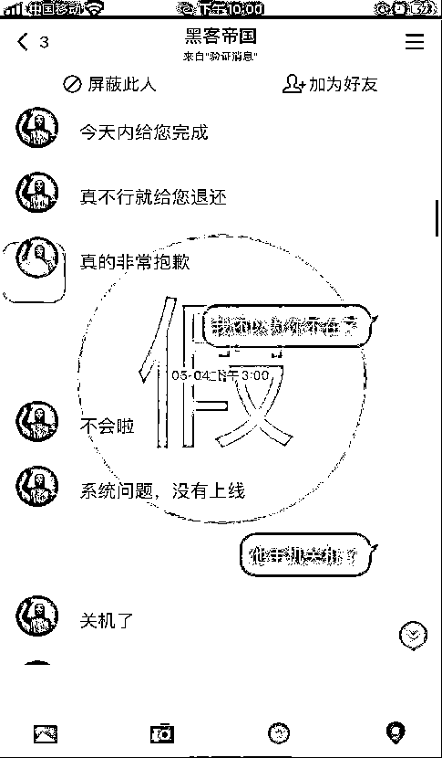

# 男友玩失联，她竟找“黑客”定位！结局让人伤心

> 原文：[`mp.weixin.qq.com/s?__biz=MzIyMDYwMTk0Mw==&mid=2247516664&idx=7&sn=75a4cf9343fc6d62406bb14ba9b18129&chksm=97cb4ac0a0bcc3d6d6feab00f3adefec7f00d5426393133ad9671faefc6dd66cd26e5bc00174&scene=27#wechat_redirect`](http://mp.weixin.qq.com/s?__biz=MzIyMDYwMTk0Mw==&mid=2247516664&idx=7&sn=75a4cf9343fc6d62406bb14ba9b18129&chksm=97cb4ac0a0bcc3d6d6feab00f3adefec7f00d5426393133ad9671faefc6dd66cd26e5bc00174&scene=27#wechat_redirect)

男（女）友玩失联

你会怎么做？

默默地伤心难过？

不，“我的感情我做主”

中山女子小温就立即出击

**寻求“黑客”帮助**

希望可以追击定位男友

5 月 3 日，小温联系不上男友

于是决定找“黑客”

来查找男友的具体位置

通过网络广告链接

她添加了一名“黑客”为 QQ 好友

添加好友之后

“黑客”要求小温

发送男友的相关信息以便定位

此外，“黑客”还“贴心”地

要求小温扫码加入

某支付平台的两个群聊

并让她在群内通过发红包来支付报酬

声称“这样支付不会留下双方信息”

于是，小温按照对方的要求

**先后****发出 3440 元红包**

直到 5 月 20 日

“黑客”以“系统被查封”、

“授权码故障”等理由

表示无法完成任务

小温这才意识到被骗了

于是报警求助

这场“黑客”追击大戏

以小温报警处理暂告一段落

目前，警方正在进一步调查中

**除了“黑客”骗局**

**还有“私家侦探”陷阱**

不久前，珠海的王女士

因发现丈夫行踪诡异

在网上找了“私家侦探”调查丈夫

然而，调查结果没拿到

她还被骗了不少钱

最近，结婚 5 年的王女士

发现丈夫对自己的事情不太上心

有时接电话偷偷摸摸的

回到家更是捧着手机

和别人发微信到深夜

两人为此多次吵架

王女士的丈夫甚至提出要离婚

一次争吵后

王女士趁丈夫熟睡之际

偷偷打开他的手机

发现微信里的聊天内容被删得一干二净

越发觉得丈夫不对劲的王女士

经过一番思量后

**决定模仿电视剧中**

**雇佣私家侦探调查的桥段**

通过网络搜索

王女士找到一家私家侦探公司

并和该公司取得联系 

提出想调查丈夫的微信聊天记录和行踪

随后，该公司客服表示

开展调查需预付 8000 元“调查费”

并保证在 2 周后给王女士调查结果

在和客服协商后

王女士将丈夫的姓名、手机号码、

社交账号等资料告诉了对方

**并通过网银预付了 8000 元的**

**首期“调查费”**

就在这时，王女士在网上认识了

一个名叫“李洋”的男子

他因前妻的背叛而选择了离婚

也许是有类似的经历

王女士与李洋聊了很多

还告诉了对方

自己私下找了私家侦探的事

一个星期后，王女士突然接到

上海市公安局的来电

对方称她涉嫌侵犯公民个人信息

并让她立即到就近派出所说明情况

惊慌失措下

王女士赶紧联系了私家侦探公司

然而，该公司电话已拨不通

其微信也被“客服”“拉黑”了

王女士意识到被骗

随后找到李洋倾诉

李洋听后告诉王女士

此事若处理不好则可能要坐牢

并表示他有关系

可以帮王女士“摆平” 

 次日，李洋告诉王女士

若想不被判刑

则需要花 20 万元疏通关系

为免受牢狱之灾

王女士立即给李洋转账 20 万元

请其帮忙疏通关系

然而一个月后

李洋没有给回任何信息

还一直以各种理由推脱

最后还将王女士的微信“拉黑”了

意识到自己可能又被骗了

王女士立马到派出所报警

因法律意识和防骗意识淡薄

王女士被人一骗再骗

厅哥提醒各位

通过不正当手段获取他人隐私信息

属于违法行为

网上所谓的“黑客”“私家侦探”

通常是骗子扮演的

今年“全民国家安全教育日”

广东网警专门制作发布

网络安全主题动漫

提醒大家谨防“黑客”

以及“私家侦探”诈骗

《“黑客”定位查信息，骗财骗情悔莫及！》

[`mp.weixin.qq.com/mp/readtemplate?t=pages/video_player_tmpl&action=mpvideo&auto=0&vid=wxv_1817596223034294274`](https://mp.weixin.qq.com/mp/readtemplate?t=pages/video_player_tmpl&action=mpvideo&auto=0&vid=wxv_1817596223034294274) 

另外

我国法律对侵犯公民个人信息行为 

进行了相关规定

公安机关对侵犯公民隐私的行为

也一直在严厉打击处理

**法律链接**

**《最高人民法院、最高人民检察院关于办理侵犯公民个人信息刑事案件适用法律若干问题的解释》规定**：违规查询个人信息、查询开房记录、查询家庭住址，查询他人家庭情况等行为，都将涉嫌违法甚至犯罪。公民个人信息受法律保护，包括警方在内任何单位和个人都无权私自查询。

**《中华人民共和国网络安全法》第四十四条规定**：任何个人和组织不得窃取或者以其他非法方式获取个人信息，不得非法出售或者非法向他人提供个人信息。违反本条规定，窃取或者以其他非法方式获取、非法出售或者非法向他人提供个人信息，尚不构成犯罪的，由公安机关没收违法所得，并处违法所得一倍以上十倍以下罚款，没有违法所得的，处一百万元以下罚款。

**防骗提醒**

1

通过不正当手段获取他人隐私信息属于违法行为，切不可尝试。

2

不要轻易相信陌生人所说的个人信息调查等内容，发现类似钓鱼网站，要及时反馈给相关部门。

3

不要轻易透露身份证、银行账户、家庭住址等个人信息，以防被不法分子盯上。

4

如有疑问可拨打反诈专线 96110 咨询，如被骗请及时拨打 110 或到就近派出所报警。

再次提醒大家

伴侣之间贵在信任

遇到矛盾要互相理解和包容

有效沟通才是解决之道

倘若真的遇人不淑

一定要及时止损

切勿采用非法手段解决

**所谓的“黑客”“私家侦探”等**

**十有八九是骗子**

**千万不要上当！**

来源：广东公安、喀什网警巡查执法，利箭在出击

← 向右滑动与灰产圈互动交流 →

