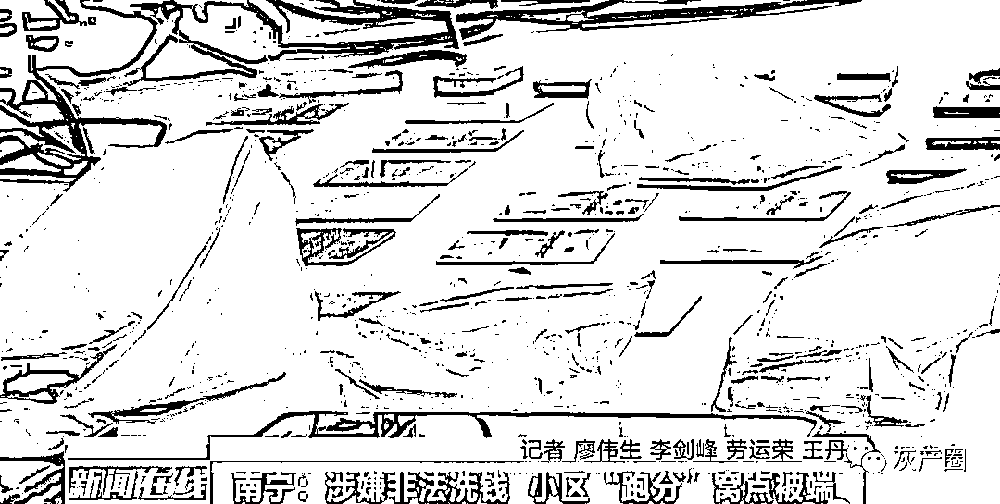
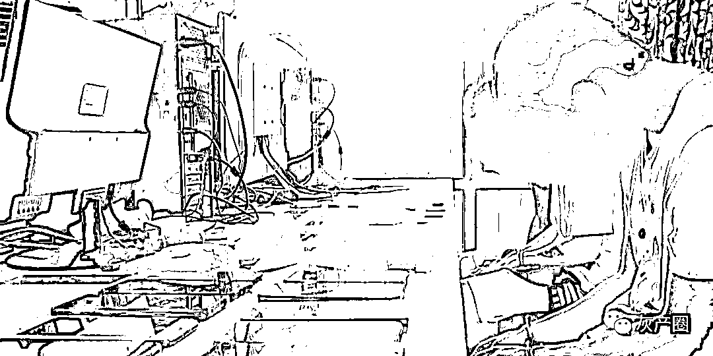
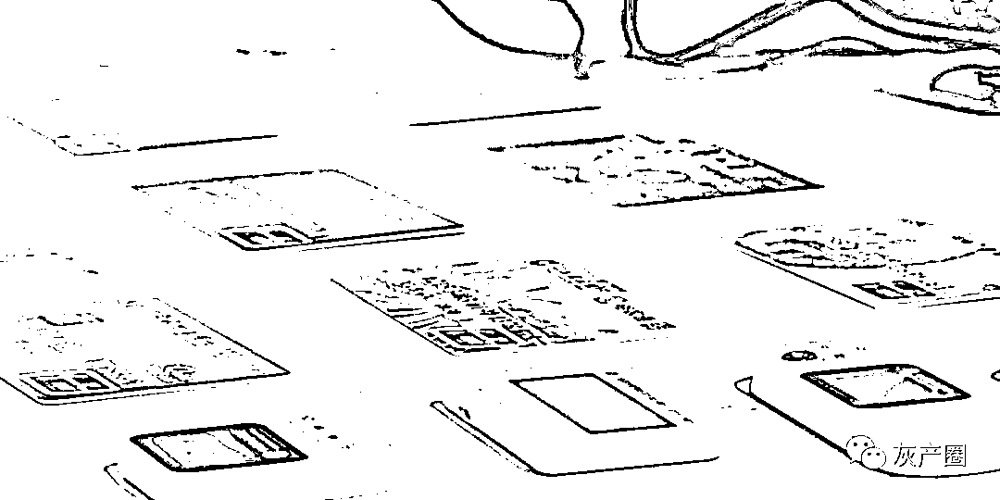

# 非法洗钱，“跑分”窝点被端！

> 原文：[`mp.weixin.qq.com/s?__biz=MzIyMDYwMTk0Mw==&mid=2247516664&idx=8&sn=73fef00579794d23f97ef0bb351f7c3a&chksm=97cb4ac0a0bcc3d631ea1c582cef55c45aa8d244845c4e20867776c2e1cf6ab508105d816083&scene=27#wechat_redirect`](http://mp.weixin.qq.com/s?__biz=MzIyMDYwMTk0Mw==&mid=2247516664&idx=8&sn=73fef00579794d23f97ef0bb351f7c3a&chksm=97cb4ac0a0bcc3d631ea1c582cef55c45aa8d244845c4e20867776c2e1cf6ab508105d816083&scene=27#wechat_redirect)

日薪 300 元，工作就是利用自己的银行账户进行各种转账，这看似十分轻松的工作引来好几个年轻小伙。殊不知，这高薪的背后，却是不法分子的“跑分”洗钱。近日，南宁市组织开展“绿城反诈·断卡 2 号”专项行动，打掉了一个“跑分”窝点。

[`v.qq.com/iframe/preview.html?width=500&height=375&auto=0&vid=j3254yl7pxv`](https://v.qq.com/iframe/preview.html?width=500&height=375&auto=0&vid=j3254yl7pxv)

所谓“跑分”，就是通过银行账户或第三方支付账户，有偿帮助不法分子转移涉赌、涉诈等“黑金”。在经过前期侦查后，民警突击位于南宁市佛子岭路某小区一间涉嫌“跑分”的出租屋。经过搜查，民警在这窝点查出涉案的十多部手机，以及一批银行卡。民警介绍，这“跑分”窝点里四名嫌疑人 24 小时轮流值班，时刻关注上游犯罪团伙发来的转账信息。

 **现场** 

（你们每天一般转多少笔钱？）通常一天的话差不多在 100 多笔左右，单笔最多可能也就两三万左右，然后最少的也有几十块钱这样。

 **南宁市公安局青秀分局刑侦三大队中队长   李警官** 

只要有钱进账到他们手上持有的银行卡里面，他们就要立即按照上游犯罪人员的指示，再转到指定的银行帐户里面，目前初步了解每天转账金额达到 150 笔左右，然后总金额大概是在 40 万左右。

民警介绍，这些转账来的钱可能与网络赌博、诈骗“洗黑钱”有关，而幕后老板通过电商退款等名目，以来钱快为利诱，将一些没有什么社会阅历，法律意识淡薄年轻人招聘进来，并使用他们名下的账户，进行洗钱行为。

 **嫌疑人  黄某** 

（老板承诺给你的工资是多少？） 一天 300 块，刚开始来的时候都是说，做电商退款之类的，但是后来就感觉情况不太对，我感觉这些钱都是一些不正当的钱。

虽然意识到不对，但面对高薪诱惑，这些年轻人还继续进行违法的勾当。记者了解到，在“绿城反诈·断卡 2 号”专项行动中，1700 多名警力分头赶赴抓捕点开展抓捕行动，重点对涉诈“两卡”、洗钱“跑分”、前端引流等窝点进行打击。行动中，共抓获电信网络诈骗违法犯罪嫌疑人 83 人，捣毁犯罪窝点 2 处，查缴涉案电脑、手机等一大批涉案物品。民警提醒，要重视利用自己身份开办的各种账户。

 **南宁市公安局刑侦支队副支队长   陈宏** 

由于你出租出借，或者出卖自己银行卡，那么涉及犯罪违法的，我们将会对你本人进行这个惩戒，同时的话，对你的征信、你的贷款，找工作上也会有影响。

**警方提醒**01

所谓“跑分”就是专门为电信网络诈骗、赌博等犯罪搭建平台，使用微信、支付宝、银行卡等支付途径将赃款分流洗白的犯罪行为。

02

“跑分”过程中帮助洗钱最后涉案的第三方账户将被公安机关依法冻结，将直接影响个人征信，并将受到法律惩处。

03

警惕“跑分”陷阱，注意保护个人隐私信息，不要轻易被网络上不切实际的高额利润所诱惑，更不要随意出租出借自己的身份信息、支付账号等，以免沦为犯罪分子实施违法犯罪的帮凶。

来源：新闻在线，利箭在行动

← 向右滑动与灰产圈互动交流 →

