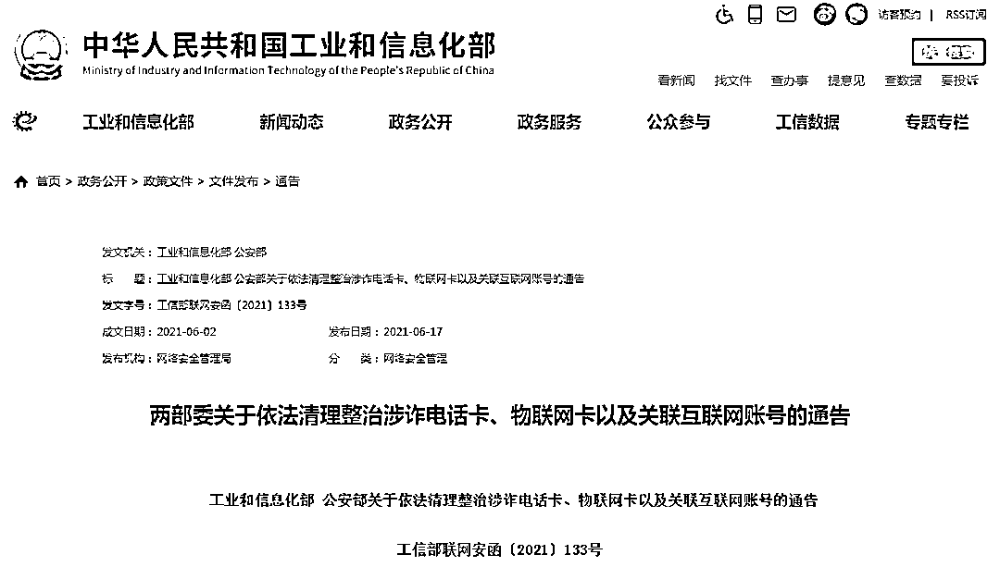

# 警方提醒！手里有这类卡的，月底前一定要注销…

> 原文：[`mp.weixin.qq.com/s?__biz=MzIyMDYwMTk0Mw==&mid=2247516713&idx=1&sn=1373e3c4350957a309f41e2c58dd403c&chksm=97cb4911a0bcc00755ed553a2e4f5b93a6e50aa570c47943553e6127e9d9be314b592850e197&scene=27#wechat_redirect`](http://mp.weixin.qq.com/s?__biz=MzIyMDYwMTk0Mw==&mid=2247516713&idx=1&sn=1373e3c4350957a309f41e2c58dd403c&chksm=97cb4911a0bcc00755ed553a2e4f5b93a6e50aa570c47943553e6127e9d9be314b592850e197&scene=27#wechat_redirect)

近日
工业和信息化部、公安部联合发布关于依法清理整治**涉诈电话卡、****物联网卡****以及关联互联网账号**的通告

通告指出电信主管部门、公安机关将持续深入推进“断卡行动”以零容忍态度**依法严厉打击非法办理、出租、出售、购买****和囤积电话卡、物联网卡****以及关联互联网账号的行为**全力清理涉诈号卡资源

[`mp.weixin.qq.com/mp/readtemplate?t=pages/video_player_tmpl&action=mpvideo&auto=0&vid=wxv_1919425739473338375`](https://mp.weixin.qq.com/mp/readtemplate?t=pages/video_player_tmpl&action=mpvideo&auto=0&vid=wxv_1919425739473338375)

通告中明确，**凡是实施****非法****办理、出租、出售、购买和囤积电话卡、物联网卡以及关联互联网账号****的相关人员，自本通告发布之日起，应停止相关行为，****并于****2021 年 6 月底前主动注销****相关电话卡、物联网卡以及关联互联网账号。**对通告发布后仍然进行上述非法行为的人员，将依法依规予以惩处。通告要求，电信企业、互联网企业应按照“谁开卡、谁负责，谁接入、谁负责，谁运营、谁负责”的原则，严格落实网络信息安全主体责任，加强电话卡、物联网卡、互联网账号的**实名制管理。**通告还指出，电信企业应建立电话卡“二次实人认证”工作机制，针对涉诈电话卡、“一证(身份证)多卡”、“睡眠卡”、“静默卡”、境外诈骗高发地卡、频繁触发预警模型等高风险电话卡，**提醒用户在 24 小时内通过电信企业营业厅或线上方式进行实名核验。**互联网企业应根据公安机关、电信主管部门有关要求，对涉案电话卡、涉诈高风险电话卡所关联注册的微信、QQ、支付宝、淘宝等互联网账号依法依规进行实名核验，对违法违规账号及时采取关停等处置措施。

同时提醒大家

公安机关统一负责

用户投诉受理

涉卡违法犯罪线索举报等事项

如发现相关线索

**可拨打全国统一受理电话**

**96110**

## 信息来源：人民网、工信部网站

← 向右滑动与灰产圈互动交流 →

