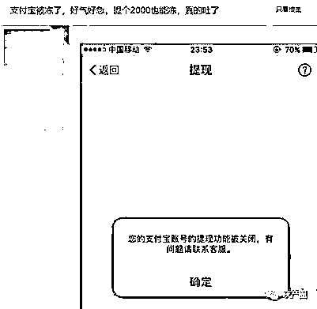
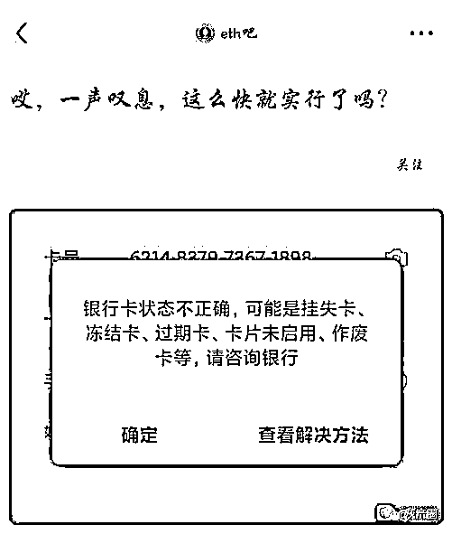

# 支付宝关闭交易渠道，彻底压垮虚拟货币？

> 原文：[`mp.weixin.qq.com/s?__biz=MzIyMDYwMTk0Mw==&mid=2247516713&idx=2&sn=65afec87eda727df48d4d393406b99b1&chksm=97cb4911a0bcc0070cc8b482c0c00b6b6d9d375ac562aaea8f5c18d20c7b867041830a9359fc&scene=27#wechat_redirect`](http://mp.weixin.qq.com/s?__biz=MzIyMDYwMTk0Mw==&mid=2247516713&idx=2&sn=65afec87eda727df48d4d393406b99b1&chksm=97cb4911a0bcc0070cc8b482c0c00b6b6d9d375ac562aaea8f5c18d20c7b867041830a9359fc&scene=27#wechat_redirect)

随着国家管控的下场，虚拟货币最近的日子可不好过，不管是各主力挖矿省份开始清退矿场，还是各大银行及支付宝、微信宣布严管虚拟货币交易，都对国内的虚拟货币市场造成了严重的打击。

芯研所消息在国家加大力度打击并全面封禁虚拟货币后，从比特币到 ETH，全部都迎来了新一轮的暴跌，截至小雷截稿的时候，比特币价格已经下挫到了 31500 美元附近，对比 4 月 13 日的最高点已经跌去了接近一半的价值，而且从趋势来看，大有冲击 3 万美元底线的可能。

因为已经有不少虚拟货币交易者在网上晒出了自己账号及银行卡被封禁的截图，有的仅仅因为提现两千元就被封禁。基本上可以确定并非人工筛查，而是支付宝的自动监测系统运作出来的结果，这也让部分虚拟货币投资者所谓的“只要不是大额提现就没问题”的说法不攻自破。

图源网络（芯研所采编）

在大数据的帮助下，金融机构可以定位到一部分可疑的 ID 及账号，随后只要确定该账号参与了虚拟货币交易，那么就可以对与其进行交易的用户进行封禁。

毕竟对于大多数国内的虚拟货币交易者来说，脱离国内的金融体系进行交易有着不少的麻烦，一个是不熟悉，另一个则是不安全，还有就是大额资金的提现困难。国内银行对于进出中国市场的资金都有严厉的监管，达到一定数额就会触发银行的监管体系，结果就是收款账号被暂时封禁，直到用户提供合法的收入途径证明才会解封。

图源网络（芯研所采编）

所以，如果真的想要进行大额交易，估计只有现金交易或者境外转账等灰色方式才能进行，而这些操作都有着不低的门槛，足以杜绝大部分个人用户的参与。看到这里，如果你还对虚拟货币投资心存侥幸，那么等着你的可能就是一笔数额不小的“学费”了。

对于一般人来说，如今的虚拟货币市场已经是一个深不见底的大坑，特别是在监管体系越发严苛后，参与虚拟货币交易的损失可能不仅仅是本金亏损这么简单，而在失去了大量的“韭菜”后，虚拟货币市场还能迎来第二春吗？

来源：中关村在线，利箭在出击

← 向右滑动与灰产圈互动交流 →

# 原文：[`mp.weixin.qq.com/s?__biz=MzIyMDYwMTk0Mw==&mid=2247516713&idx=3&sn=9f28235e0eb11c34e00b189090a63801&chksm=97cb4911a0bcc007bf8be93d291c95078fa9ec7135d54e38a2bd2a864032f56b09a7bd676984&scene=27#wechat_redirect`](http://mp.weixin.qq.com/s?__biz=MzIyMDYwMTk0Mw==&mid=2247516713&idx=3&sn=9f28235e0eb11c34e00b189090a63801&chksm=97cb4911a0bcc007bf8be93d291c95078fa9ec7135d54e38a2bd2a864032f56b09a7bd676984&scene=27#wechat_redirect)