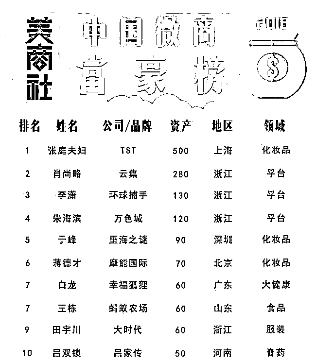

# 从「第一上市微商」到「查无此人」，幸福狐狸走错了哪一步？

> 原文：[`mp.weixin.qq.com/s?__biz=MzIyMDYwMTk0Mw==&mid=2247516713&idx=4&sn=4b79c880d37246b388a99a5ce7cb05e6&chksm=97cb4911a0bcc0074ec8c21e890e95c5ed3f6b84e7db5b7fb7ad4e525db57f20b95360957f0c&scene=27#wechat_redirect`](http://mp.weixin.qq.com/s?__biz=MzIyMDYwMTk0Mw==&mid=2247516713&idx=4&sn=4b79c880d37246b388a99a5ce7cb05e6&chksm=97cb4911a0bcc0074ec8c21e890e95c5ed3f6b84e7db5b7fb7ad4e525db57f20b95360957f0c&scene=27#wechat_redirect)

#### 

> 2018 年底，美商社发布了一份微商行业富豪榜，掀起了业内外的广泛关注。令不少人意外的是，微商这个新兴行业竟然在短时间内悄悄崛起，并发展出体量如此庞大的企业。
> 
> 如今，这份榜单已两年有余，蓦然回首，彼时榜上的微商企业，有的风光依旧，有的后来居上，而有的却因种种原因悄然退场，淡出行业视线，而曾经他们都是站在行业金字塔尖的领军者。
> 
> 唐太宗曾言，以铜为鉴，可以正衣冠；以人为鉴，可以明得失；以史为鉴，可以知兴替。
> 
> 于是，我们决定为这些曾经红极一时的微商品牌写点什么，无论是为了纪念他们来时的路，还是为后来者贡献一份沉重的教训书。我们为这个系列起名为「消失的微商」，希望能通过这些故事给从业者们带来一些启示。

“打江山易，守江山难。” 

回看美商社 2018 年中国微商富豪榜，幸福狐狸当时位列第七，无疑是微商中的头部品牌。在看似前景一片明朗之下，幸福狐狸为何在洪流中急转直下，陡然没落？

公开信息显示，幸福狐狸的主体是广东幸福狐狸内衣设计有限公司，成立于 2015 年 04 月 20 日，2018 年 9 月更名为广东幸福狐狸贸易有限公司，法定代表人韩雪，注册资本 5000 万元。

据了解，幸福狐狸旗下拥有幸福狐狸（幸福花、07 和 08 款内衣、幸福狐狸神裤、幸福狐狸神童裤）、XFHL（营养代餐饼干、瘦身顾问）、0.18 智能袜、LA、幸福美人鱼、果工厂、道明珠宝、幸福狐狸植物精油等多个自主品牌及产品。

辉煌时期的幸福狐狸，曾与多位明星的签约代言、在北京人民大会堂办年会、在美国纽约时代广场投放广告，风光无两。

这些属于幸福狐狸的高光时刻都是代理们宣传的活招牌，但最让幸福狐狸代理们骄傲的，无疑是“第一家上市的微商集团”的名头。

但这也为幸福狐狸日后的衰落埋下了伏笔。

公开资料显示，幸福狐狸于 2016 年 8 月 15 日，在深圳前海股权挂牌，挂牌号为 667836。

在企业眼里，挂牌，尤其是在新四股挂牌其实是一件很小的事情。因为在深圳前海股权挂牌难度并不高，而且挂牌这件事本身没有太多价值。其中最没用却常常被人拿去用的作用就是可以用挂牌宣传为上市，稍有相关知识的人就会知道上市一定会挂牌，但是挂牌不一定是上市。

而这次挂牌对幸福狐狸最大的意义似乎就在于混淆视听，以挂牌之实，宣上市之名。此举一出，自然吸引了无数代理加入。

当时的幸福狐狸号称“第一家上市的微商集团”，并对代理们讲出“成为上市公司合伙人”的这种极具吸引力的话。一时间，幸福狐狸风头无两。

但是，不可否认，这确实是建立在一场骗局之上。

2017 年 5 月，幸福狐狸集团副总裁白龙宣布：“大地教育（08417）并购幸福集团同步上市，市值 1000 亿目标正式启动。”

如果挂牌一事还有人会深究挂牌与上市的区别，那么此事一出便是一剂猛药。不仅让那些对此前的挂牌宣传有疑虑的人安心，更让发展代理扩大市场的“幸福狐狸家人们”多了一个重量级的法宝。

然而真相似乎并非如此，大地教育并未并购幸福集团。大地集团在当时的市值约在 5000 万港币左右，让人不禁怀疑市值 1000 亿这个庞大的数字是点错了小数点还是随手画出的一串 0。

当然，这场骗局也早已被人揭穿。

早在 2017 年 6 月 21 日，公众号逐梦人点滴曾发表过一篇曾被认证为幸福狐狸代理的爆料，就是为了揭露所谓的上市只是一场骗局。

爆料者称，其老公提醒她注意是不是传销时在同花顺 APP 上搜索了在群里宣传的上市股票代码 08417，搜索显示为大地教育。而当在她像群里提出质疑时，不出意外的被管理员移出了群聊。

在代理们为成为上市公司合伙人普天同庆之时，一位 title 为经理的代理还在群内回答称，“大地教育就对了，股票名称不用幸福狐狸的”。幸福狐狸哭晕在葡萄架下，是我站的不够高吗？不配拥有自己的姓名？

最后，幸福狐狸的代理还是私聊了爆料者，可能交流不算愉快。这位主动与爆料者私聊的幸福狐狸代理人员最后留下了一句引人深思的话“不相信可以不做，为啥一直给自己找烦恼”

如果我们因探求真相会产生的烦恼，那么我们应该做的是让自己“相信”，还是继续走在“烦恼”的路上，寻求真相？

这场爆料警醒到多少人，无从得知。唯一能肯定的是幸福狐狸又借假上市的东风更上一层楼，这也让幸福狐狸萌生出了扩充品类，把公司做大的想法。

幸福狐狸是靠做内衣起家，男、女、幼三类人群的针对性产品均有涉猎。在微商内衣品牌中幸福狐狸一度做到了行业顶尖。但随着风口来到了代餐、减肥上，幸福狐狸开始转型。

由于幸福狐狸的受众本来就是较为关注身材的女性群体，与减肥、代餐品类重合度很高，本以为可以顺利转型的幸福狐狸，没成想这成为了她衰落的开始。

2018 年 8 月 5 日，北京同仁堂一纸声明将幸福狐狸送上了风口浪尖。

 

在声明中，北京同仁堂健康药业股份有限公司北京分公司（文中简称北京同仁堂）称幸福集团存在，擅自使用保健食品批件、发明专利以及健康研究院获得国家 CNAS 实验室认可资质等信息的侵权行为。

声明中提到的侵权产品自然是幸福狐狸踏上转型路上的第一步——燕麦营养代餐饼干。在代理的宣传图中，这款代餐饼干被大大方方的印上了北京同仁堂以及同仁堂的 logo，任谁第一眼看都会觉得这是一款北京同仁堂出品的饼干，由百年老字号带来的可信度和认可度嗖嗖嗖的上升。

可一纸声明不禁打碎了幸福狐狸的美好寄托，更是让幸福狐狸的品牌形象有了污点。蹭热度惨遭正主打脸，在当时绝对是微商界新闻的头条。

时隔一个月后，幸福狐狸的回应姗姗来迟，并且回应避重就轻，简短无用。除了表达出想与北京同仁堂合作的强烈欲望和拉到满分的友好之外，对北京同仁堂提到的侵权一事避而不谈，把锅全都甩给代理们。

不料，8 月 10 日，同仁堂健康官网再次发文反击，称幸福狐狸在宣传过程中以北京同仁堂为名进行商业推广，滥用同仁堂其他子公司资源，将一款简单的代餐饼干说成保健产品，有误导、欺骗消费者之嫌。

被同仁堂直戳要害后，幸福狐狸未再作回应，这次风波也渐渐平息了。

值得注意的是，在侵权事件发生的一周前，幸福狐狸收到了来自广州市白云区的行政处罚。

企查查信息显示，2018 年 8 月 1 日，幸福狐狸因公平交易违法行为、广告违法行为被广州市白云区工商行政管理局处以行政处罚 20 万。

这件事在当时并无波澜，对于家大业大的幸福狐狸来说，20 万的罚款无关痛痒。

处罚内容显示，幸福狐狸的当家王牌产品——幸福狐狸内衣宣称“采用德国呼吸肉硅胶、金玉蚕丝面料”，却没有提供相关部门审批需要的材料。

虽然这 20 万的罚款给幸福狐狸带来的伤害远远低于代餐饼干侵权对品牌形象的影响，但网络上有关幸福狐狸内衣是否能够抗癌等涉嫌虚假宣传的质疑声越来越大，幸福狐狸的下坡路就此开始。

2019 年 1 月份，幸福狐狸又发布了新产品——幸福狐狸植物精油。可惜的是，这款精油并未发挥出它“一瓶解决多种疾病”的神奇功效，为幸福狐狸带来转机，反而因为虚假夸张的广告让幸福狐狸的口碑再次跌落。

2019 年 3 月 28 日，广东幸福狐狸贸易有限公司再次被广州市工商行政管理局白云分局因无法通过登记的住所或者经营场所联系，将其列入经营异常。

此时的幸福狐狸还在挣扎，随后在同年 4 月签约了影视明星印小天为幸福狐狸植物精油产品代言人。同时签约田亮、叶一茜等多位明星代言。

但在明星光环的助力之下也难改幸福狐狸在微商界渐渐式微的趋势。2020 年 6 月 2 日，广东幸福狐狸贸易有限公司向广州市天河区市场监督管理局登记了注销备案；8 月 7 日，广东幸福狐狸贸易有限公司正式注销。

幸福狐狸的衰落看似一场盛宴戛然而止，实则只是一场用谎言撑起的表面繁荣，当遇上外来的打击时，自然经不起推敲轰然倒塌。

但不可忽视的是已注销的广东幸福狐狸贸易有限公司的法定代表人韩雪名下有 11 家关联公司，除去三家已注销的仍有 8 家公司。

有消息称，日前幸福狐狸与吉九集团联姻，成立了幸福吉九集团，后又更名中谷集团，并借助减肥代餐食品和精油产品卷土重来。

来源：美商社

← 向右滑动与灰产圈互动交流 →

