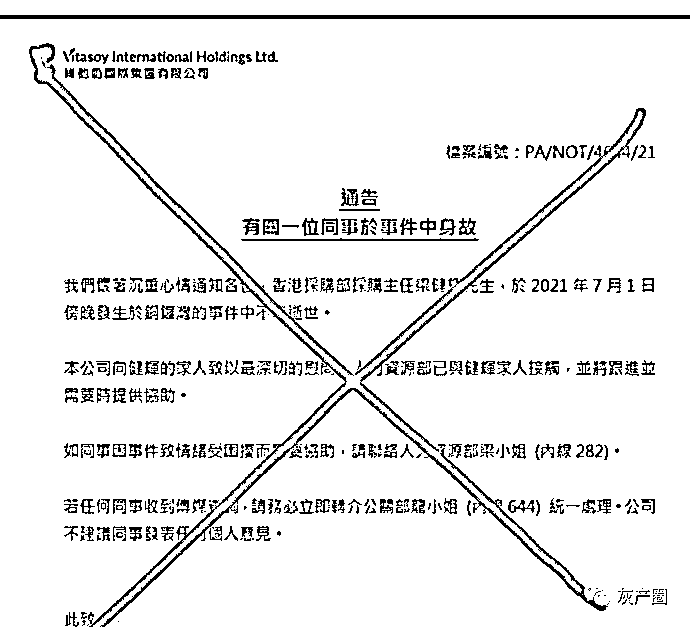

# 维他奶同情恐袭警员工，引发内地商超抵制，掌舵人回应慰问袭警职工风波

> 原文：[`mp.weixin.qq.com/s?__biz=MzIyMDYwMTk0Mw==&mid=2247516806&idx=1&sn=a5e5b72d5e3a0585e6123f40ef9dcbe1&chksm=97cb49bea0bcc0a8e55f05344d3ef7bf8b1549a275a0f7004d1cb8eff438dc76d16eaeb6b394&scene=27#wechat_redirect`](http://mp.weixin.qq.com/s?__biz=MzIyMDYwMTk0Mw==&mid=2247516806&idx=1&sn=a5e5b72d5e3a0585e6123f40ef9dcbe1&chksm=97cb49bea0bcc0a8e55f05344d3ef7bf8b1549a275a0f7004d1cb8eff438dc76d16eaeb6b394&scene=27#wechat_redirect)

7 月 1 日晚，香港铜锣湾发生一起持刀袭警事件，一男子持刀捅伤警察后自己又捅了一刀，随后警员和行凶者被送往医院，而行凶者因抢救无效已经死亡，警员状态为“严重”。
随后经调查，该男子为香港维他奶采购部主任，香港警方也表示，此事为“孤狼式本土恐怖袭击”。都已经这样定性了，脑子正常的企业这时候应该立马站出来维护社会责任，反对恐怖主义，这是全球的共识。但是维他奶来了个骚操作，立马发了个公告，内容竟然是“沉痛心情、最深切的慰问”，这让大众直接炸了锅。此后维他奶集团两次通报该事件并表达歉意然而此举未能获得多数网友原谅。全国各地部分超市选择下架维他奶，维他奶一日蒸发约 10 亿港元7 月 6 日下午，维他奶国际集团有限公司执行主席罗友礼发文称，已辞退私自撰写内部通告的员工。但部分网友质疑，慰问袭警员工的文件上写有“档案编号”，由此认为撰写并非员工个人违规行为这么简单。对此，公司客服表示，该文件不可能是公司授意。维他奶辞退员工的新闻底下网友留言人均语言大师，“鼻涕流嘴里知道甩了” 

* * *

子期不在伯牙为谁弹:没人不承认老子，我们现在骂的是儿子

晴挺队长:呵呵避重就轻，这是员工的问题？

想做一颗树的墨墨：有本事告那个女的再说，资本家这么善良，股价跌了十亿，内地市场损失，居然只是开除和保留追究权利

来源：微博那些事儿

← 向右滑动与灰产圈互动交流 →

