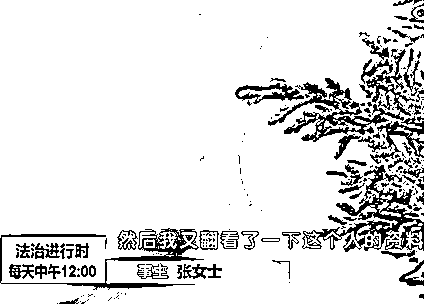

# 女子知名网站找男友被骗 800 多万！网友：有八百万还需要网恋？

> 原文：[`mp.weixin.qq.com/s?__biz=MzIyMDYwMTk0Mw==&mid=2247516806&idx=4&sn=9a7181e919ef140a83859603f4392dc5&chksm=97cb49bea0bcc0a8a6d710f764664053ca1c976b34c7253bf64a34ca88ef6775f1ad56041981&scene=27#wechat_redirect`](http://mp.weixin.qq.com/s?__biz=MzIyMDYwMTk0Mw==&mid=2247516806&idx=4&sn=9a7181e919ef140a83859603f4392dc5&chksm=97cb49bea0bcc0a8a6d710f764664053ca1c976b34c7253bf64a34ca88ef6775f1ad56041981&scene=27#wechat_redirect)

被爱情冲昏了头脑 

究竟会发生什么？

近日，微博上的一则热搜

给出了一个答案

↓

事主张女士被在婚恋网站认识的“男友”

**诈骗了 824 万**后对方消失

其中还有 200 多万是借来的

家中的父母为此都病倒了

这笔巨额财产还包括了

张女士想给孩子读书换学区房

然后卖掉手上所有房子得来的钱款

而现在这些

都成为了张女士

为这段网络情缘付出的代价

[`mp.weixin.qq.com/mp/readtemplate?t=pages/video_player_tmpl&action=mpvideo&auto=0&vid=wxv_1942507482132611076`](https://mp.weixin.qq.com/mp/readtemplate?t=pages/video_player_tmpl&action=mpvideo&auto=0&vid=wxv_1942507482132611076)

（视频来源：法治进行时） 

北京女子网恋被骗 800 万

据北京电视台《法治进行时》栏目报道，北京的张女士在世纪佳缘网站邂逅了自称在银行上班的杨先生。通过翻看个人资料，张女士信以为真，认为对方工作体面，发来的照片也很精神，字里行间更是对其非常关爱。

两人刚结识不久，对方就订了一大束玫瑰花，这令张女士心动不已。

张女士说，**这位杨先生对其称因为工作比较忙，所以暂时不能和张女士见面，两人只能通过微信联系。**聊天过程中，张女士说准备给孩子买套学区房，没想到杨先生不仅非常支持，甚至表示愿意卖掉自己的房子，和张女士一起换套别墅。

在聊天过程中，杨先生说自己看上了一套价值七千万的房子，把自己的房子卖了值两千万，剩下的钱还差好几千万。不过，杨先生称自己可以利用工作的便利进行投资，很快就能让钱翻倍。

杨先生让张女士打开一个名为新加披金融数字货币交易中心的链接，说这是他长期对接的一个投资项目，只要跟着他买，保证稳赚不赔。

出于信任，张女士卖掉房子，拿出全部积蓄开始投资，在不到一个月的时间里，**张女士给杨先生的 15 个账号里打了 25 次钱，总计 824 万元。**

然而，等到可以提取收益的那天，张女士突然发现账面上数千万的钱根本取不出来。此时，杨先生也失去了联系，当时充值的链接也无法打开。

意识到不对劲的张女士，马上找到了杨先生的工作单位，可得到的答复却是根本没有这个人。

婚恋网站是否有责任？

事发后，所谓的“杨先生”**在网站上注销了账户**。两人在网站的互动也无法查到。随后，张女士赶紧联系世纪佳缘网站。

网站的客服人员告诉张女士，**两人的聊天记录已经无法恢复**。对此，世纪佳缘相关负责人表示，只要是其在该网站进行任何操作都能留痕，但是由于监管法规，网站只能将相关后台信息提供给警方或职能部门。

张女士认为，自己被骗，婚恋网站也有责任，但网站客服人员表示，**他们已经起到审核义务，实名注册**。

**图片来源：世纪佳缘注册页面**

《每日经济新闻》记者也体验了世纪佳缘的注册过程，首先在该婚恋网站首页填写性别、生日、所在地和婚姻状况，然后进入注册页面填写身高、学历、月薪等信息，随后输入手机号并进行验证，最后取一个昵称，此外并不需要提供其他信息。

对身高、学历、婚姻、月薪等内容，新用户注册后 7 天内可以修改一次，以后则不可更改。

**图片来源：世纪佳缘网站** 

在注册过程中该网站会要求承诺“**不借钱给任何会员，也不与对方发生任何形式的经济关系。**”

据北青报报道，对于如何鉴别用户填写的信息是否属实，世纪佳缘相关负责人表示，该网站是**采取手机实名制认证**，也就是说必须用手机号注册。没有采取身份证认证实名制是为了避免因过度收集用户信息而违规。因为**根据国家要求，App 不得强制收集非手机号码外的公民个人信息**。

此外，该人士表示，为了避免用户被骗，世纪佳缘聊天对话框都是实时弹出警示信息的，但是如果交友行为脱离了该网站，其无法尽到提示义务。

对于此事，北京市盈科律师事务所高级合伙人房玉洲律师表示，单就女子被骗 824 万一事，已经属于刑事案件，刑事责任及赃款返还的主体是诈骗犯罪行为实施者，**婚介平台在未参与犯罪，不构成共犯的前提下，不会对犯罪行为承担责任**。

他同时表示，**合理审查的注意义务是所有网络平台的基本义务**，具体到本事件中，就是网络平台审核用户的真实身份信息义务，特别是在消费者以会员费等方式支付相应服务费用的情形下。

目前，张女士已经报警，同时也正在整理证据材料，准备通过诉讼维护自己的权益。

网友：想不通

有八百万需要网恋？

这件事给我们上了生动的一课

在恋爱中尤其是刚恋爱的阶段

一定要守护好自己的原则和底线

警方提醒

“杀猪盘”诈骗是当下

最常见的一种爱情骗局

在网络交友中

大家要提高防骗意识

**采取**

**“不轻信、不透露、不转账”的**

**三“不”原则**

有效防范各种电信网络诈骗

保障财产安全

一旦发现被骗，要留存好证据

第一时间拨打 110 报警

来源：看看新闻 Knews、法治进行时、北青报、每日经济新闻、网友评论

← 向右滑动与灰产圈互动交流 →

