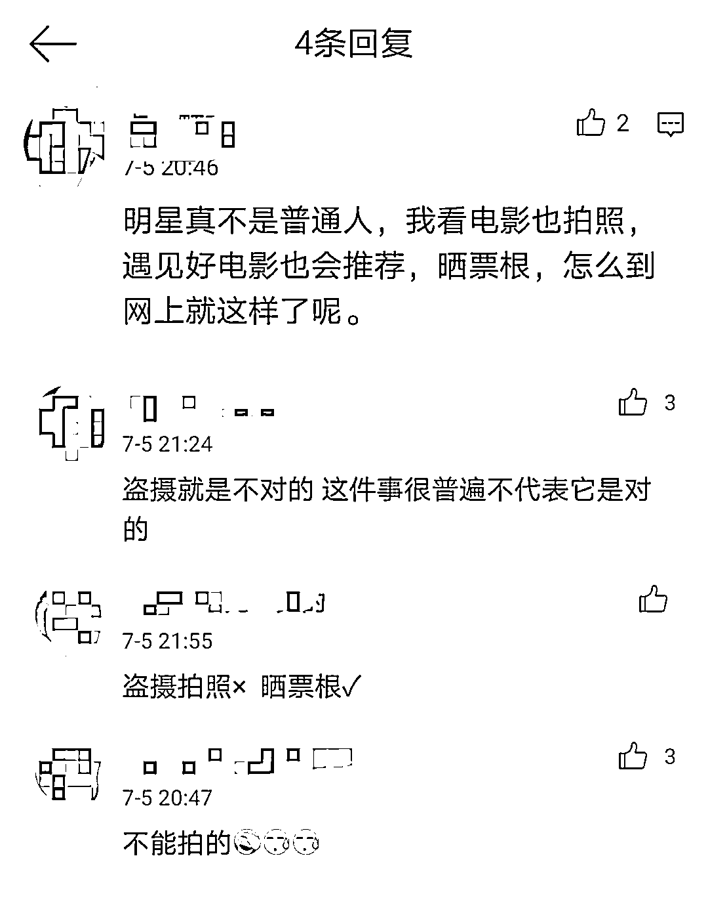

# 乃万道歉！这么晒电影可不对

> 原文：[`mp.weixin.qq.com/s?__biz=MzIyMDYwMTk0Mw==&mid=2247516806&idx=5&sn=fd2a79194dcaeec567fdf303378687ce&chksm=97cb49bea0bcc0a81c9e2139afd0713e9a9969dbbae870ed46ee5aad9c5b22815c4d28c62f61&scene=27#wechat_redirect`](http://mp.weixin.qq.com/s?__biz=MzIyMDYwMTk0Mw==&mid=2247516806&idx=5&sn=fd2a79194dcaeec567fdf303378687ce&chksm=97cb49bea0bcc0a81c9e2139afd0713e9a9969dbbae870ed46ee5aad9c5b22815c4d28c62f61&scene=27#wechat_redirect)

## 

**周末去哪**

**涮个火锅**

**看场电影**

**美哉妙哉**

**据说有人看电影是三件套**

**大可乐、爆米花、拍张照**

**先晒朋友圈接着发微博**

**齐活！**

**别，可别……**

**您先瞅瞅这个热搜↓**

7 月 5 日晚，

音乐人乃万道歉冲上热搜！

原因是她在微博晒出自己在

电影院拍摄的屏幕 LIVE 图，

还配发了自己的照片，

**动图被网友指出是盗摄后**

**她将微博删除。**

当晚，乃万在道歉中表示，自己看电影拍照并发微博的行为是错误的，被粉丝提醒后已经迅速删除，也非常对不起电影制作者们……

**网友：原来这是“盗摄”……**

所谓影院盗摄，一般是指对正在放映的电影进行屏摄、盗录的行为。

有人说，很多人都看电影拍照，为什么明星这样做会引发这么大的关注？下面网友回应道，这件事很普通但不代表是对的：

在乃万的行为被网友批评后，不少人表示，刚好做个普及：

**律师：拍照无论传播与否都侵权**

据电影频道《今日影评》栏目报道称，盗录电影的灰色产业链，曾一度影响着很多影片的正常市场发行。

事件发生后，电影频道今日影评官方微博再次转发相关报道。

律师指出，**在电影院内拍摄电影正片、彩蛋均属盗摄！拍照后无论传播与否，也是侵权！**购买电影票，并不等于拥有盗摄影片的权利，观影仍需恪守底线。

[`v.qq.com/iframe/preview.html?width=500&height=375&auto=0&vid=y32277v0xie`](https://v.qq.com/iframe/preview.html?width=500&height=375&auto=0&vid=y32277v0xie)

**看完律师解读**

**有没有一身冷汗**

**别人拍的电影**

**咱就别拍了**

来源：中国青年报、今日影评 Mtalk、央视网

← 向右滑动与灰产圈互动交流 →

