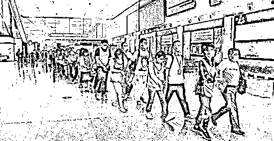
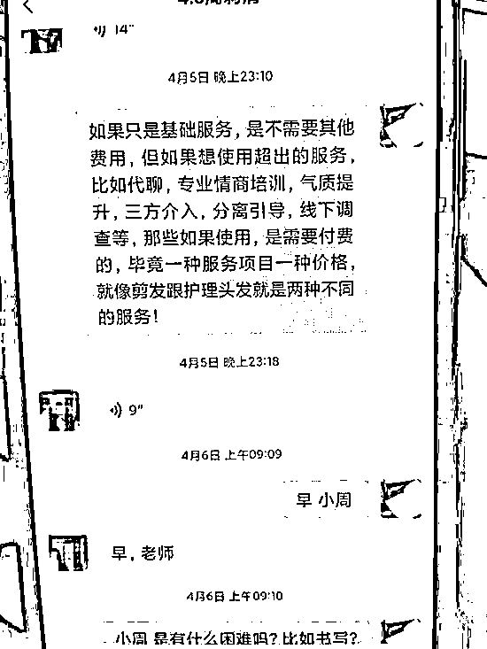
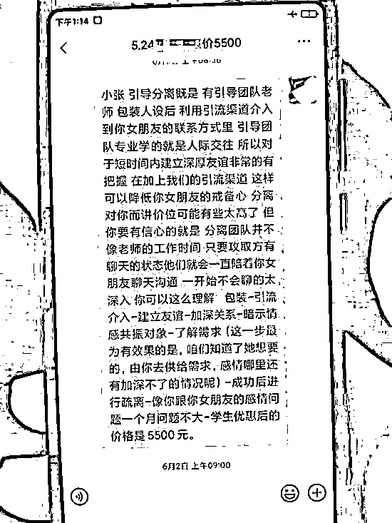
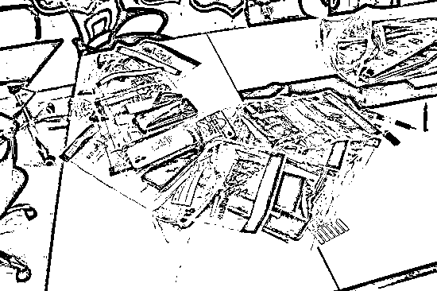
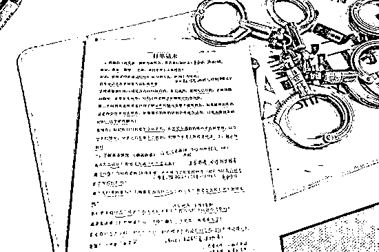
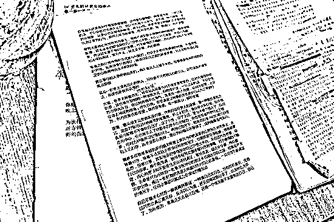

# 69 名情感挽回大师被抓！

> 原文：[`mp.weixin.qq.com/s?__biz=MzIyMDYwMTk0Mw==&mid=2247516806&idx=6&sn=7c742926a4043c4ccdf227086c969b55&chksm=97cb49bea0bcc0a8eff4417c3e6c6589bf4de8c331f9e3a2d33b42487997ee81cd68d986e36e&scene=27#wechat_redirect`](http://mp.weixin.qq.com/s?__biz=MzIyMDYwMTk0Mw==&mid=2247516806&idx=6&sn=7c742926a4043c4ccdf227086c969b55&chksm=97cb49bea0bcc0a8eff4417c3e6c6589bf4de8c331f9e3a2d33b42487997ee81cd68d986e36e&scene=27#wechat_redirect)

“情感挽回大师”

真能拯救失恋吗？

近期

上海警方**抓获**69 名“情感挽回大师”****

**该犯罪团伙**

**打着**专业情感咨询机构**的旗号**

**利用**话术**诱骗受害者**

**购买**“情感挽回服务”**骗取大量钱财**

**涉及全国各地的案件**500 余起**** 

**涉案金额**700 余万元****

**▼**

****

**“情感挽回大师”被抓获。** 

**2021 年 5 月 2 日，牛牛（化名）**

**向上海市公安局金山分局报案：**

****自己为了挽回与女友的感情，****

****被一家名为“实花教育咨询”的****

****情感咨询机构诈骗 3.4 万余元。****

**牛牛称，2020 年 7 月其与女友的感情出现问题，分手后微信、电话均被对方拉黑，无法联系上女友。**

 **为了挽回这段感情，牛牛上网搜寻情感挽回技巧。很快，他就被一条“一对一私人定制，百分百挽回爱情”的广告语所吸引，并添加了该机构的微信进行咨询。** ******“情感挽回大师”们的聊天记录**************0****1****

**承诺“劝导”前女友**

**对方详细了解了牛牛的基本情况后，承诺：**

**只需提供前女友相关个人信息，便会安排专属“情感专家”对前女友进行交流劝导，帮助牛牛修复感情。**

**同时，机构要求：**

**牛牛不得主动与前女友联系，也不能介入情感挽回工作。**

****牛牛立即交纳了 3280 元的咨询费，并与对方签订了电子合同。****

**该机构遂安排“情感专家”对牛牛开展情感辅导，并称与其前女友已经取得了联系。**

****0****2****

**“制造”各种困难，加钱！** 

**随后，该机构“专家”先后以“发现其前女友已有新男友，需要进一步工作引导”、“其前女友已动摇，需联系现男友结束感情”等理由，要求牛牛转账支付 3 万余元。** 

****直至 2021 年 4 月，牛牛也未与其前女友成功复合**，联系该机构没有明确答复后，牛牛意识到被骗后报警。**

****0****3****

**受害者，被骗惨了！** 

****警方调查发现**：**

*   **与牛牛联系的“心理咨询师”并未取得国家相关从业资质。**

*   **该机构也从未与牛牛前女友取得联系。**

*   **并且，**牛牛尝试情感挽回期间，其前女友已经结婚。****

****

**诈骗团伙使用的手机**

**6 月 2 日，专案组前往山东实施抓捕行动，在当地警方的配合下，一举捣毁 5 处犯罪窝点，抓获肖某等 69 名犯罪嫌疑人。** 

****0****4****

**务必警惕这些网络广告！** 

**经查，自 2019 年起，以肖某等人为首的犯罪团伙，在山东地区注册成立大量教育咨询类公司，通过网络发布广告，吸引感情受挫人群主动联系。**

**利用当事人的迫切心理，精心设计话术获得信任，捏造事实层层递进骗取受害人钱款。感情挽回项目收费从 2880 元至 12800 元不等。**

**为了逃避打击，该犯罪团伙定期注销旧公司，解散公司聊天群，同时注册新的公司进行诈骗。**

****

****

**诈骗话术**

****0****5****

**你是不是骗子的目标?** 

**从警方初步查实的案件来看**

**受害人遍布全国各地**

**平均年龄为**29.4 岁****

**其中**20 至 30 岁男性**受骗者居多**

**最小被害人年仅 17 岁**

****被骗金额最多为 12 万元****

**目前，肖某等 55 名犯罪嫌疑人涉嫌诈骗罪已被公安机关依法刑事拘留，另外 14 名犯罪嫌疑人被依法采取刑事强制措施，案件正在进一步侦查中。**

**来源：红网、辽沈晚报、澎湃新闻、上海市公安局**

****

**← 向右滑动与灰产圈互动交流 →**

****