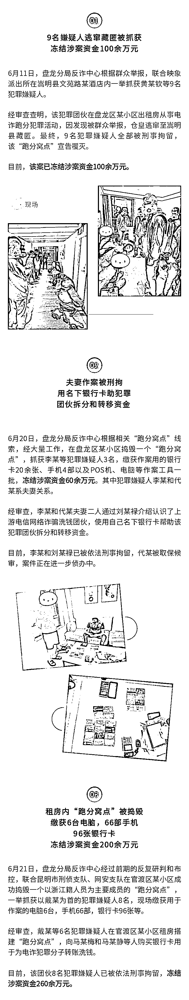
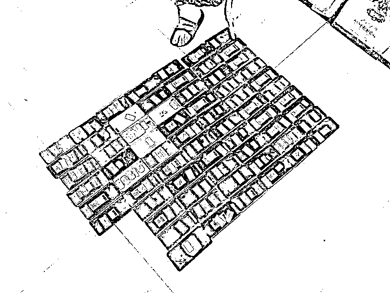

# 抓获 20 余人，冻结 400 余万元！警方连续捣毁 3 个电诈跑分窝点

> 原文：[`mp.weixin.qq.com/s?__biz=MzIyMDYwMTk0Mw==&mid=2247516806&idx=8&sn=55c547bc25f8212f3655230084cd0146&chksm=97cb49bea0bcc0a8aa921689aad88312a95fabb81bcb7689fc688d17b04ae9f57d70c68ce243&scene=27#wechat_redirect`](http://mp.weixin.qq.com/s?__biz=MzIyMDYwMTk0Mw==&mid=2247516806&idx=8&sn=55c547bc25f8212f3655230084cd0146&chksm=97cb49bea0bcc0a8aa921689aad88312a95fabb81bcb7689fc688d17b04ae9f57d70c68ce243&scene=27#wechat_redirect)

今年 6 月以来，昆明市公安局盘龙分局全体反诈民警主动出击，连续捣毁 3 个电诈“跑分”窝点，抓获 20 余名电信诈骗犯罪嫌疑人，缴获了一批用于作案的银行卡、手机、电脑、POS 机等，冻结涉案资金**400 余万元**。 <mpvideosnap class="js_uneditable custom_select_card channels_iframe" data-pluginname="videosnap" data-id="export/UzFfAgtgekIEAQAAAAAAew4UU0zZ9QAAAAstQy6ubaLX4KHWvLEZgBPEoIMoeAM0Ifv-zNPgMIsjWoNmmMjwXCJb2dtGbOjU" data-url="https://findermp.video.qq.com/251/20350/stodownload?encfilekey=XGocBFxVWK5dcyOOqpEU4yZ0ia4qlCRBBtbBgr4PNZ9Rpat5E5Tib7NjT5DW0osg1hWGeH3nClKDdnH2M82hsT99XTmlqto85oCbafYaS1ptSCqXBlJibww0Vlicg93d8YPFI1nP626y3c6bbyaIeKRXaBXnqFX7icVOtquOIWbCSJjcjCRyExHeCGg&amp;adaptivelytrans=0&amp;bizid=1023&amp;dotrans=0&amp;hy=SZ&amp;idx=1&amp;m=0ec2e7f12d7971723c8332ef579cf0fb&amp;token=cztXnd9GyrFAja2VYvGJOtmMDM0ertbGnjGynBVLE5ooyvdJQR7MFRMU0X2vriawj" data-headimgurl="http://wx.qlogo.cn/finderhead/04LrpEqAf4uwdAQV0VAibiaibIhTTibibd1f9nRDgHb8YfO62s9bT1OUH4A/0" data-username="v2_060000231003b20faec8c6e58c10c7d6c905eb35b077d7944bfb5d108bee76b70915a1d46ec6@finder" data-nickname="昆明反诈中心" data-desc="抓获 20 余人，冻结 400 余万元资金，昆明盘龙警方连续捣毁 3 个电诈跑分窝点 #本地新闻#昆明#反诈#防骗" data-nonceid="2120302076216705167" data-type="video"></mpvideosnap>

****************反诈民警提醒：****

**“跑分”就是利用银行账户或支付账户帮助不法分子转移资金，从中赚取佣金，致使大量涉诈资金流向境外的一种违法犯罪活动。 **

**对于“跑分”等洗钱、诈骗犯罪活动，警方始终保持严打高压状态，全面落实各项防控措施，全力压控发案，严格落实涉诈重点人员管控措施，严厉打击电信网络诈骗等违法犯罪行为。 **

**广大群众切勿因眼前小利而出售、出借个人银行账户，一旦被不法分子用于诈骗、网络赌博或其他违法犯罪，你就成为犯罪“帮凶”，将被依法追究法律责任，得不偿失！**

**来源：昆明反电信网络诈骗中心**

****

**← 向右滑动与灰产圈互动交流 →**

****